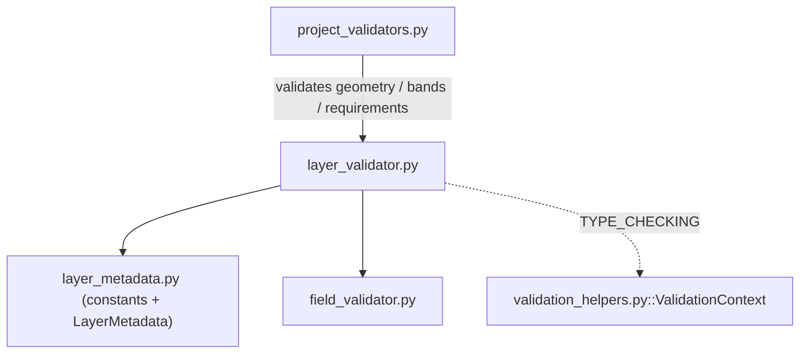

---
tags:
  - secinterp
  - code-walkthrough
  - core
  - validation
aliases:
  - layer_validator.py
  - validate_layer_has_features
  - validate_layer_geometry
  - validate_raster_band
  - validate_structural_requirements
  - validate_geology_requirements
  - validate_crs_compatibility
cssclass: secinterp-note
---

# `core/validation/layer_validator.py`

> [!abstract] One-line summary
> QGIS-agnostic level-1/2 **spatial** validators: they check that a vector layer has features and the expected geometry, that a raster has the requested band, and validate geology/structure requirements and CRS compatibility against `LayerMetadata`.

**Path**: `core/validation/layer_validator.py` (200 lines)
**Main functions**: `validate_layer_has_features`, `validate_layer_geometry`, `validate_raster_band`, `validate_structural_requirements`, `validate_geology_requirements`, `validate_crs_compatibility`
**Layer**: Core (QGIS-agnostic)
**Tags**: #secinterp #core #validation

---

## 🎯 Why does this file exist?

`field_validator.py` validates fields; this module validates **the layer as a spatial
entity**: whether it has features, whether its geometry is the expected one, whether
the raster has the requested band, and whether several layers share a CRS. All against
the `LayerMetadata` DTO.

| Problem | Solution |
|---------|----------|
| An empty section line is useless for interpolation | `validate_layer_has_features` |
| The user picks a point layer where a line is expected | `validate_layer_geometry` |
| The DEM band must exist before sampling | `validate_raster_band` |
| Geology/structure requirements combine geometry + fields | `validate_geology_requirements` / `validate_structural_requirements` |
| Layers with divergent CRS degrade accuracy | `validate_crs_compatibility` (returns a *warning*) |

> [!important] Architectural note
> **Fully QGIS-agnostic.** Geometry is represented with string constants
> (`GEOMETRY_POINT="point"`, `GEOMETRY_LINE="line"`, `GEOMETRY_POLYGON="polygon"`) and
> the CRS with `crs_authid` (`"EPSG:4326"`). It never imports `qgis.core`; the GUI
> translates `QgsWkbTypes` → string in the `ValidationExtractor`.

---

## 🧬 Relationship diagram



> [!tip] How to read
> Solid = imports; dashed = TYPE_CHECKING only. `layer_validator` relies on
> `field_validator` for field checks and exposes functions that `project_validators.py`
> consumes inside each `IValidator`.

---

## 📦 Imports — architectural reading

```python
# core/validation/layer_validator.py
from __future__ import annotations

from typing import TYPE_CHECKING

from sec_interp.core.domain import FieldType
from sec_interp.core.validation.layer_metadata import (
    GEOMETRY_LINE,
    GEOMETRY_POINT,
    GEOMETRY_POLYGON,
    KIND_RASTER,
    KIND_VECTOR,
    LayerMetadata,
)

from .field_validator import validate_field_exists, validate_field_type

if TYPE_CHECKING:
    from sec_interp.core.validation.validation_helpers import ValidationContext
```

| # | Observation |
|---|-------------|
| ① | `TYPE_CHECKING` — `ValidationContext` is imported only for annotations, avoiding a runtime import cycle. |
| ② | Imports `layer_metadata` constants (geometry and kind) instead of QGIS enums. |
| ③ | Reuses `validate_field_exists` / `validate_field_type` from `field_validator`. |
| ④ | `FieldType` is used in `_validate_struct_field` to allow numeric/string types. |

---

## 🏗️ Structure inventory

**Constants:**

- `_TYPE_NAMES` — dict `{GEOMETRY_POINT: "Point", GEOMETRY_LINE: "Line", GEOMETRY_POLYGON: "Polygon"}` for readable messages.

**Public functions (6):**

- `validate_layer_has_features(metadata) -> (bool, str)`
- `validate_layer_geometry(metadata, expected_type) -> (bool, str)`
- `validate_raster_band(metadata, band_number) -> (bool, str)`
- `validate_structural_requirements(metadata, dip_field, strike_field, context=None) -> (bool, str)`
- `validate_geology_requirements(metadata, field_name, context=None) -> (bool, str)`
- `validate_crs_compatibility(metadata_list) -> (bool, str)`

**Private functions (3):**

- `_check_struct_layer_validity(metadata)` — structural layer valid and point-typed.
- `_check_geology_layer_validity(metadata)` — geology layer valid, polygon and with features.
- `_validate_struct_field(metadata, field_name, label)` — existence + type of a structural field.

---

## 📁 Files in the package

`layer_validator.py` is the spatial piece of the `core/validation/` package:

| File | Role |
|------|------|
| `layer_validator.py` | Spatial validation (geometry, bands, CRS) — this file |
| `field_validator.py` | Atomic field validation (reused here) |
| `layer_metadata.py` | `LayerMetadata` + `GEOMETRY_*` / `KIND_*` constants |
| `path_validator.py` | Output path validation |
| `validation_helpers.py` | `ValidationContext` (accumulates errors) |
| `project_validator.py` | `ProjectValidator` + `ValidationParams` |
| `project_validators.py` | Specialized validators that consume this module |
| `validators.py` | Dataclass field validator factories |
| `base_validator.py` | `IValidator` (ABC) |
| `pipeline.py` | `ValidationPipeline` |

---

## 📖 Method-by-method walkthrough

### `validate_layer_has_features`

```python
def validate_layer_has_features(metadata: LayerMetadata) -> tuple[bool, str]:
    if not metadata or not metadata.is_valid:
        return False, "Layer is not valid"
    if metadata.kind != KIND_VECTOR:
        return False, "Layer is not a vector layer"
    if metadata.feature_count == 0:
        return False, f"Layer '{metadata.name}' has no features"
    return True, ""
```

Rejects vector layers without features (`feature_count == 0`). This is the check that
prevents interpolation from running over an empty line or an empty outcrop set.

### `validate_layer_geometry`

```python
def validate_layer_geometry(metadata: LayerMetadata, expected_type: str) -> tuple[bool, str]:
    if not metadata or not metadata.is_valid:
        return False, "Layer is not valid"
    if metadata.kind != KIND_VECTOR:
        return False, "Layer is not a vector layer"
    if metadata.geometry_type != expected_type:
        expected_name = _TYPE_NAMES.get(expected_type, f"Type {expected_type}")
        actual_name = _TYPE_NAMES.get(metadata.geometry_type, metadata.geometry_type)
        return False, (
            f"Geometry type mismatch for layer '{metadata.name}': "
            f"Found {actual_name}, but expected {expected_name}. "
            f"Please select a valid {expected_name.lower()} layer."
        )
    return True, ""
```

Compares the actual geometry against the expected one. On mismatch it translates both
to readable names ("Point", "Line", "Polygon") via `_TYPE_NAMES`, with fallback to
`Type {x}` or the raw string.

### `validate_raster_band`

```python
def validate_raster_band(metadata: LayerMetadata, band_number: int) -> tuple[bool, str]:
    if not metadata or not metadata.is_valid:
        return False, "Layer is not valid"
    if metadata.kind != KIND_RASTER:
        return False, "Layer is not a raster layer"
    band_count = metadata.band_count
    if band_number < 1 or band_number > band_count:
        return False, (
            f"Band number {band_number} is invalid. Layer '{metadata.name}' "
            f"has {band_count} band(s)"
        )
    return True, ""
```

Validates that `band_number` is in `[1, band_count]`. Note bands are 1-based (the first
band is `1`, not `0`), and `band_count` comes from the `LayerMetadata` extracted by the GUI.

### `validate_structural_requirements`

```python
def validate_structural_requirements(
    metadata: LayerMetadata,
    dip_field: str | None,
    strike_field: str | None,
    context: ValidationContext | None = None,
) -> tuple[bool, str]:
    is_valid, msg = _check_struct_layer_validity(metadata)
    if not is_valid:
        if context:
            context.add_error(msg)
        return False, msg

    for field, label in [(dip_field, "Dip"), (strike_field, "Strike")]:
        if field:
            is_valid, msg = _validate_struct_field(metadata, field, label)
            if not is_valid:
                if context:
                    context.add_error(msg)
                return False, msg
    return True, ""
```

Orchestrates structural validation: first the layer (points), then each configured
field (dip and strike) with its label. If a `context` is provided, it **accumulates**
the error in it as well as returning it, integrating with the `ValidationContext` pattern.

### `validate_geology_requirements`

```python
def validate_geology_requirements(
    metadata: LayerMetadata,
    field_name: str | None,
    context: ValidationContext | None = None,
) -> tuple[bool, str]:
    is_valid, error = _check_geology_layer_validity(metadata)
    if not is_valid:
        if context:
            context.add_error(error, "geology_layer")
        return False, error

    if not field_name:
        msg = "Geology unit field is required when geology layer is selected"
        if context:
            context.add_error(msg, "geology_field")
        return False, msg

    is_valid, error = validate_field_exists(metadata, field_name)
    if not is_valid:
        if context:
            context.add_error(error, "geology_field")
        return False, error
    return True, ""
```

Validates the geology layer (polygon + features) and that the unit field is selected
and exists. It uses `context.add_error(msg, field)` with a **field key**
(`"geology_layer"`, `"geology_field"`) so the GUI can highlight the exact control that failed.

### `_check_struct_layer_validity` / `_check_geology_layer_validity`

```python
def _check_struct_layer_validity(metadata: LayerMetadata) -> tuple[bool, str]:
    if not metadata.is_valid:
        return False, f"Structural layer '{metadata.name}' is not valid."
    if metadata.geometry_type != GEOMETRY_POINT:
        return False, "Structural layer must be a point layer."
    return True, ""


def _check_geology_layer_validity(metadata: LayerMetadata) -> tuple[bool, str]:
    if not metadata.is_valid:
        return False, f"Geology layer '{metadata.name}' is not valid."
    is_valid, error = validate_layer_geometry(metadata, GEOMETRY_POLYGON)
    if not is_valid:
        return False, error
    is_valid, error = validate_layer_has_features(metadata)
    if not is_valid:
        return False, error
    return True, ""
```

Private. The structural layer must be **point**-typed (dip/strike measurements); the
geology layer must be **polygon** with features (outcropping units). They reuse the
public validators rather than duplicating logic.

### `_validate_struct_field`

```python
def _validate_struct_field(
    metadata: LayerMetadata, field_name: str, label: str
) -> tuple[bool, str]:
    is_valid, msg = validate_field_exists(metadata, field_name)
    if not is_valid:
        return False, msg
    is_valid, msg = validate_field_type(
        metadata,
        field_name,
        [FieldType.INT, FieldType.DOUBLE, FieldType.LONG_LONG, FieldType.STRING],
    )
    if not is_valid:
        return False, f"{label} field error: {msg}"
    return True, ""
```

Validates that a structural field exists and is numeric or string (`INT`, `DOUBLE`,
`LONG_LONG`, `STRING`). `STRING` is accepted because dip/strike values are often stored
as text and parsed later.

### `validate_crs_compatibility`

```python
def validate_crs_compatibility(metadata_list: list[LayerMetadata]) -> tuple[bool, str]:
    valid = [m for m in metadata_list if m and m.is_valid]
    if not valid:
        return True, ""
    ref = valid[0]
    incompatible = [
        f"  - {m.name}: {m.crs_authid}" for m in valid if m.crs_authid != ref.crs_authid
    ]
    if incompatible:
        warning = (
            f"⚠ CRS mismatch detected!\n\n"
            f"Reference CRS: {ref.crs_authid} ({ref.name})\n"
            f"Incompatible layers:\n" + "\n".join(incompatible) + "\n\n"
            "QGIS will reproject on-the-fly, but this may affect accuracy.\n"
        )
        return False, warning
    return True, ""
```

Compares the `crs_authid` of all layers against the first valid one. On divergence it
returns `False` with a **warning** message (not a fatal error: QGIS reprojects
on-the-fly, but warns about possible precision loss). It filters invalid layers first
and, if none remain, returns `(True, "")`.

> [!note] `False` + warning = advisory semantics
> Although it returns `False`, the consumer must treat it as a *warning* (the message
> already starts with `⚠`). This is a design choice that reuses the `(bool, str)`
> channel for two levels: hard error vs advisory.

---

## 🔄 Data flow

| Phase | Input | Transformation | Output |
|-------|-------|----------------|--------|
| Features | vector `LayerMetadata` | compare `feature_count == 0` | `(bool, str)` |
| Geometry | `LayerMetadata` + `expected_type` | compare `geometry_type` | `(bool, str)` |
| Band | raster `LayerMetadata` + `band_number` | range `1..band_count` | `(bool, str)` |
| Structure | `LayerMetadata` + dip/strike fields | validate points + fields | `(bool, str)` + error in `context` |
| Geology | `LayerMetadata` + unit field | validate polygon + field | `(bool, str)` + error in `context` |
| CRS | `list[LayerMetadata]` | compare `crs_authid` | `(bool, warning)` |

---

## 🏛️ Design patterns present

| Pattern | Where | Purpose |
|---------|-------|---------|
| **Pure function** | almost all | Stateless; operate over `LayerMetadata` |
| **Result tuple** | all returns | `(bool, str)` without exceptions |
| **Optional accumulator** | `context: ValidationContext \| None` | Integrate with the error-accumulation pattern |
| **Facade / composition** | `validate_*_requirements` | Orchestrate several smaller validators |
| **DTO boundary** | `LayerMetadata` | Never touch QGIS in core |
| **Warning via error channel** | `validate_crs_compatibility` | Reuse the `(False, str)` return as a warning |

---

## 🧾 API summary

| Symbol | Signature / Inherits | Typical use |
|--------|----------------------|-------------|
| `validate_layer_has_features` | `(metadata) -> (bool, str)` | Non-empty vector layer |
| `validate_layer_geometry` | `(metadata, expected_type) -> (bool, str)` | Correct geometry type |
| `validate_raster_band` | `(metadata, band_number) -> (bool, str)` | DEM band exists |
| `validate_structural_requirements` | `(metadata, dip_field, strike_field, context=None) -> (bool, str)` | Structural requirements |
| `validate_geology_requirements` | `(metadata, field_name, context=None) -> (bool, str)` | Geology requirements |
| `validate_crs_compatibility` | `(metadata_list) -> (bool, str)` | Consistent CRS (warning) |

---

## 🛡️ Error handling

No exceptions; everything via the `(bool, str)` tuple:

| Situation | Behaviour |
|-----------|-----------|
| `metadata` `None` or invalid | `(False, "Layer is not valid")` |
| Wrong kind (raster vs vector) | `(False, "Layer is not a ... layer")` |
| `feature_count == 0` | `(False, "Layer 'X' has no features")` |
| Geometry mismatch | `(False, "Geometry type mismatch...")` |
| Band out of range | `(False, "Band number N is invalid...")` |
| Divergent CRS | `(False, "⚠ CRS mismatch detected!...")` — warning |
| With `context` | the error is **accumulated** via `context.add_error(...)` |

> [!important] Dual channel
> The `validate_*_requirements` functions receive an optional `context`: if present they
> **accumulate** the error and return the same `(False, msg)`. If not, they only return.
> This makes them usable both in the pipeline (with context) and in isolated calls.

---

## 🧪 Associated tests

Pure cases mapped to `tests/core/test_layer_validator.py`:

- `test_validate_layer_has_features` — with features vs empty (`"has no features"`).
- `test_validate_layer_geometry` — point vs line (`"Found Point, but expected Line"`).
- `test_validate_raster_band` — band 1 valid, band 2 invalid (`"invalid"`).
- `test_validate_structural_requirements` — with `patch` of the field validators.
- `test_validate_crs_compatibility` — same CRS → `True`; different → `"CRS mismatch detected"`.

---

## 👀 Observations and notes

> [!success] Strengths
> - Clean translation of QGIS types to strings (`GEOMETRY_*`, `KIND_*`) with no dependencies.
> - Reuses `field_validator` instead of duplicating field checks.
> - Optional `context` integrates with the error accumulator without coupling to it.

> [!warning] Points of attention
> - `validate_crs_compatibility` returns `False` for a *warning*, which can confuse readers expecting `False == error`.
> - Warning messages embed a `⚠` emoji in the text (an i18n boundary, no `TranslatableMixin`).
> - `_validate_struct_field` accepts `STRING` for dip/strike: it depends on a correct later parse.

> [!question] Open questions
> - Separate warning and error into two channels (e.g. `(ok, error, warning)`)?
> - Unify the geometry constants with a `StrEnum` in `layer_metadata`?

---

## 🔗 Related notes

- [[Index]] — vault index
- [[core_validation]] — package note for the `validation/` directory
- [[core_validation]] — package that includes `layer_metadata.py` (constants and DTO)
- [[field_validator]] — reused `validate_field_exists`/`validate_field_type`
- [[project_validators]] — per-component consumer of these validators
- [[project_validator]] — orchestrator that triggers the full chain
- [[domain]] — `FieldType` used in `_validate_struct_field`

---

*Note of the SecInterp Code Walkthrough v2 vault — v3.9.1*
