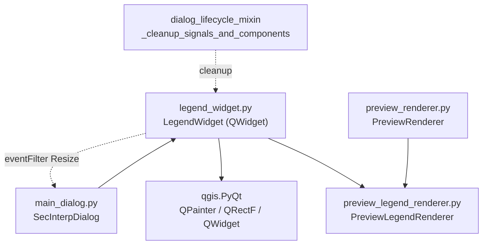

---
tags:
  - secinterp
  - code-walkthrough
  - gui
  - managers
aliases:
  - legend_widget.py
  - LegendWidget
cssclass: secinterp-note
---

# `gui/legend_widget.py`

> [!abstract] One-line summary
> Transparent overlay on the preview canvas painting the geological legend by delegating to `PreviewLegendRenderer.draw_legend()`, tracking dialog resizes and never intercepting the mouse.

**Path**: `gui/legend_widget.py` (81 lines)
**Main class**: `LegendWidget(QWidget)`
**Layer**: GUI · Present (passive overlay; real drawing lives in `PreviewLegendRenderer`)
**Tags**: #secinterp #gui #managers

---

## 🎯 Why does this file exist?

The legend must float over the map without blocking interaction or duplicating the legend-drawing logic that already exists.

| Problem | Solution |
|---------|----------|
| Show the legend above the canvas without breaking pan/zoom/clicks | `QWidget` with `WA_TransparentForMouseEvents`: events pass through to the canvas |
| The overlay must follow the dialog on resize | `eventFilter` on the dialog replicating every `Resize` |
| Do not duplicate legend drawing | `paintEvent()` delegates to `renderer.draw_legend(painter, rect)` |
| A repaint mid-update must not take the dialog down | `try/except (AttributeError, RuntimeError, TypeError)` failing silently |

> [!important] Architectural note
> A **passive, delegating** widget: it computes no `active_units` and paints no swatches; it only lends the surface (`QPainter` + `rect()`) to the renderer received in `update_legend()`. Created by `SecInterpDialog` (`LegendWidget(self.preview_widget.canvas)`) and cleaned by `dialog_lifecycle_mixin._cleanup_signals_and_components()`. See [[main_dialog]] and [[preview_legend_renderer]].

---

## 🧬 Relationship diagram



> [!tip] How to read
> Solid arrow = creates/delegates; dashed = observes or cleans up. `PreviewRenderer` and `LegendWidget` share the same drawing engine (`PreviewLegendRenderer`) through two different paths.

---

## 📦 Imports — architectural reading

```python
# gui/legend_widget.py
from __future__ import annotations

from typing import TYPE_CHECKING

from qgis.PyQt.QtCore import QEvent, QObject, QRectF, Qt
from qgis.PyQt.QtGui import QPainter
from qgis.PyQt.QtWidgets import QWidget

if TYPE_CHECKING:
    from sec_interp.gui.main_dialog import SecInterpDialog

    from .preview_legend_renderer import PreviewLegendRenderer as Renderer
```

| # | Observation |
|---|-------------|
| ① | Raw `QWidget` inheritance (no `QDockWidget`, no layouts): a hand-positioned overlay over the canvas. |
| ② | All strong typing (`SecInterpDialog`, `Renderer`) under `TYPE_CHECKING`: at runtime the widget accepts any renderer with `active_units` + `draw_legend` (defensive duck typing in `paintEvent`). |
| ③ | `QEvent` + `QObject` only for the resize filter; `QRectF` to hand its own `rect()` to the renderer. |
| ④ | Imports via `qgis.PyQt` (Qt5/Qt6 compat, QGIS 4.x), never `PyQt5` directly. |
| ⑤ | No `core/`, `qgis.core`, or `qgis.gui` imports: the widget knows no layers or DTOs, only a renderer with two members. |

---

## 🏗️ Structure inventory

**Classes (1):** `LegendWidget(QWidget)` — 4 methods.

| Method | Signature | Role |
|--------|-------|------|
| `__init__` | `(dialog: SecInterpDialog) -> None` | Parent = dialog, transparency, resize filter, hidden |
| `cleanup` | `() -> None` | Removes the `eventFilter` and drops the dialog |
| `eventFilter` | `(obj: QObject, event: QEvent) -> bool` | Replicates dialog `Resize` |
| `update_legend` | `(renderer: Renderer, visible: bool = True) -> None` | Installs renderer, repaints, shows/hides |
| `paintEvent` | `(event: QEvent) -> None` | Delegates drawing with a safety net |

---

## 📁 Files in the package

| File | Lines | Role |
|---|--:|---|
| `legend_widget.py` | 81 | This note: legend overlay |
| `preview_legend_renderer.py` | — | `draw_legend(painter, rect, active_units, ...)` engine |
| `preview_renderer.py` | — | Preview layer orchestration exposing `active_units` |
| `preview_layer_factory.py` | 471 | `active_units` lives in `color_manager._active_units` |
| `main_dialog.py` | — | Creates the widget over `preview_widget.canvas` |
| `dialog_lifecycle_mixin.py` | — | Deterministic `cleanup()` on close |

---

## 📖 Method-by-method walkthrough

### `__init__`

```python
def __init__(self, dialog: SecInterpDialog) -> None:
    super().__init__(dialog)  # Use dialog as the parent
    self.dialog = dialog
    self.renderer: Renderer | None = None  # Apply UP037
    for attr_name in ["WA_TranslucentBackground", "WA_TransparentForMouseEvents"]:
        attr = getattr(Qt, attr_name, None)
        if attr is None and hasattr(Qt, "WidgetAttribute"):
            attr = getattr(Qt.WidgetAttribute, attr_name, None)
        if attr is not None:
            self.setAttribute(attr)
    self.setAutoFillBackground(False)  # Don't fill background
    self.hide()

    # Install event filter on parent to track resize
    self.dialog.installEventFilter(self)
```

Three decisions in one: (1) parent = dialog to inherit the Qt lifecycle; (2) translucent background + mouse-event transparency, with a **Qt6 fallback** (`Qt.WidgetAttribute`) because those flags moved between Qt5 and Qt6; (3) starts hidden and installs the resize filter. The `UP037` comment documents the modern `X | None` annotation syntax.

> [!note] Mouse-transparent by design
> `WA_TransparentForMouseEvents` lets clicks, pans, and wheels "fall through" to the canvas below. Without this flag, the rectangular overlay would swallow all map interaction.

### `cleanup`

```python
def cleanup(self) -> None:
    """Remove event filter from dialog."""
    if self.dialog:
        self.dialog.removeEventFilter(self)
        self.dialog = None
```

Removes the filter and drops the dialog reference to avoid retaining it. Invoked by the lifecycle mixin's `_cleanup_signals_and_components()` on close. Without this, the widget would filter events on a destroyed dialog (dead C++ object → Qt crash).

### `eventFilter`

```python
def eventFilter(self, obj: QObject, event: QEvent) -> bool:
    """Handle parent resize events."""
    if obj == self.dialog and event.type() == QEvent.Type.Resize:
        self.resize(event.size())
    return super().eventFilter(obj, event)
```

Only reacts to the dialog's `Resize`, replicating its size: the overlay always covers the same area. Returns `super()`'s result to avoid consuming the event (the dialog must keep processing it). Other objects/events pass through.

### `update_legend`

```python
def update_legend(self, renderer: Renderer, visible: bool = True) -> None:
    """Update legend with data from renderer."""
    self.renderer = renderer
    self.update()
    if visible:
        self.show()
    else:
        self.hide()
```

Installs the renderer, requests a repaint (`update()` is asynchronous, coalesced with the event loop), and shows or hides depending on content. The caller decides `visible`: typically visible only with `active_units`, topography, or structures.

| Typical caller | Installed renderer | `visible` |
|---|---|---|
| Regenerated preview with units | `PreviewRenderer` (via `active_units`) | `True` |
| Preview without legendable content | same renderer, empty `active_units` | `False` |
| Dialog close | — (`cleanup()` runs, not `update_legend`) | — |

### `paintEvent`

```python
def paintEvent(self, event: QEvent) -> None:
    try:
        if not self.renderer or not hasattr(self.renderer, "active_units"):
            return
        if not self.renderer.active_units:
            return
        painter = QPainter(self)
        painter.setRenderHint(QPainter.RenderHint.Antialiasing)
        self.renderer.draw_legend(painter, QRectF(self.rect()))
    except (AttributeError, RuntimeError, TypeError):
        # Silent fail to avoid crashing during rapid updates
        pass
```

Double guard (no renderer or no `active_units` → nothing; empty dict → nothing) plus antialiased delegation. The silent `except` covers the race window: renderer destroyed mid-repaint (Qt `RuntimeError`), unexpected `draw_legend` signature (`TypeError`), or half-initialized attributes (`AttributeError`). In an overlay repainted on every refresh, failing loud here would mean crash-on-resize.

---

## 🔄 Data flow

| Phase | Input | Transformation | Output |
|-------|-------|----------------|--------|
| Creation | `SecInterpDialog` | `LegendWidget(preview_widget.canvas)` + filter | hidden overlay |
| Update | renderer + `visible` | `update_legend()` → `update()` | scheduled `paintEvent` |
| Painting | renderer `active_units` | `draw_legend(painter, rect)` antialiased | legend over the canvas |
| Resize | dialog `QEvent.Resize` | `eventFilter` → `resize(size)` | synchronized overlay |
| Close | dialog close | `cleanup()` removes the filter | no dangling observers |

---

## 🏛️ Design patterns present

| Pattern | Where | Purpose |
|---------|-------|---------|
| **Passive overlay** | Event-transparent `QWidget` | Decorate without intercepting interaction |
| **Delegation** | `paintEvent` → `renderer.draw_legend()` | One legend engine for widget and renderer |
| **Observer (event filter)** | `eventFilter` on the dialog | Track resizes without inheriting the dialog |
| **Deterministic cleanup** | `cleanup()` | Remove the filter before C++ dies |
| **Fail-silent painting** | `except ...: pass` | No repaint ever breaks the app |

---

## 🧾 API summary

| Symbol | Signature / Inherits | Typical use |
|--------|----------------------|-------------|
| `LegendWidget` | `QWidget` | `LegendWidget(self.preview_widget.canvas)` |
| `update_legend` | `(renderer, visible=True) -> None` | After regenerating the preview |
| `cleanup` | `() -> None` | On dialog close |
| `eventFilter` | `(obj, event) -> bool` | Internal Qt; synchronizes size |
| `paintEvent` | `(event) -> None` | Internal Qt; delegates with a safety net |

---

## 🛡️ Error handling

| Situation | Behavior |
|-----------|----------|
| No renderer or no `active_units` | Early return, nothing painted |
| Empty `active_units` | Early return (content-free legend) |
| Renderer destroyed mid-paint | Swallowed `RuntimeError`, no crash |
| Incompatible `draw_legend` signature | Swallowed `TypeError` |
| `cleanup()` with `None` dialog | `if self.dialog` guard, no-op |

The silence is intentional but costs debuggability: a miswired renderer (no `active_units`) looks identical to "no data" — a missing legend with no log.

---

## 🧪 Associated tests

No dedicated test (neither `tests/gui/` nor `tests/core/`): the widget is exercised **indirectly** through dialog mocks:

- `tests/gui/test_main_dialog_signals_wiring.py` — patches `sec_interp.gui.main_dialog.LegendWidget` to isolate signal wiring.
- `tests/gui/test_multi_session_persistence.py` — patches `LegendWidget` in the multi-session persistence cycle.
- `tests/gui/test_preview_legend_renderer.py` — covers the `draw_legend()` engine the widget delegates to (the real visual logic).
- `tests/gui/test_preview_renderer_custom.py` — preview rendering including `active_units`.

Honest gap: `eventFilter`/`update_legend`/`cleanup`/`paintEvent` have no direct coverage; the silent `paintEvent` failure is unverified either.

---

## 👀 Observations and notes

> [!success] Strengths
> - Event transparency: the legend never blocks the map.
> - Single drawing engine shared with `PreviewRenderer`.
> - Qt5/Qt6 flag fallback: robust to the 4.x migration.
> - Explicit filter cleanup: no observers over dead C++.

> [!warning] Points of attention
> - Silent `paintEvent`: a miswired renderer is indistinguishable from "no data".
> - `resize(event.size())` copies the **dialog** size, not the canvas: if the canvas does not fill the dialog, the overlay overshoots (harmless via transparency, but imprecise).
> - Zero logging in `cleanup()` or empty branches: debugging "legend not showing" is blind.

> [!question] Open questions
> - A `logger.debug` on `paintEvent` early exits to diagnose missing legends?
> - Anchor sizing to the canvas (`preview_widget.canvas.size()`) instead of the dialog?

---

## 🔗 Related notes

- [[Index]] — vault index
- [[main_dialog]] — creates the widget and cleans it via the lifecycle mixin
- [[preview_legend_renderer]] — `draw_legend()` engine + `active_units`
- [[preview_renderer]] — shares the engine and exposes `active_units`
- [[preview_layer_factory]] — `active_units` origin (`color_manager._active_units`)
- [[dialog_preview_manager]] — regenerates the preview feeding the legend

---

*Note of the SecInterp Code Walkthrough v2 vault — v3.9.0*
