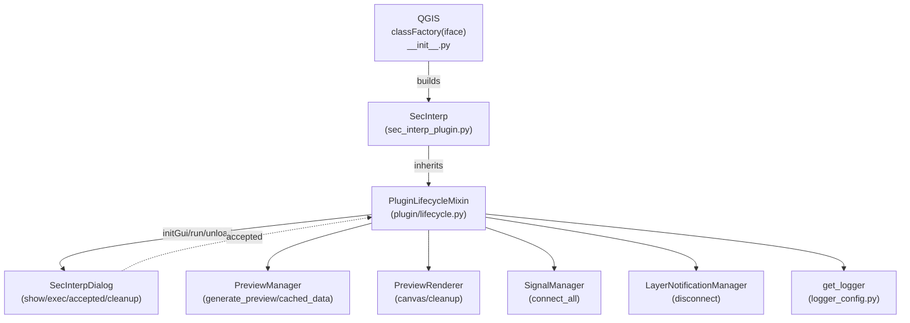
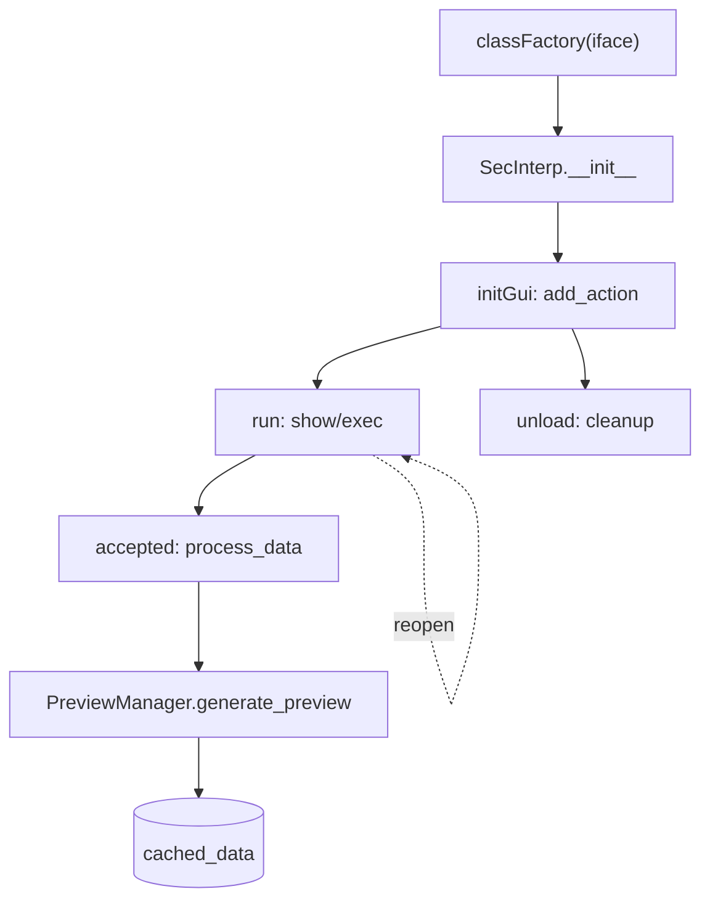

---
tags:
  - secinterp
  - code-walkthrough
  - plugin
aliases:
  - lifecycle.py
  - PluginLifecycleMixin
cssclass: secinterp-note
---

# `plugin/lifecycle.py`

> [!abstract] One-line summary
> Mixin wiring the plugin into the QGIS entry mechanics (`classFactory` → `initGui`/`unload`), opening the main dialog and guaranteeing deterministic release of actions, signals and the renderer.

**Path**: `plugin/lifecycle.py` (167 lines)
**Main class**: `PluginLifecycleMixin`
**Layer**: Plugin / GUI (depends on `qgis.PyQt` and `iface`)
**Tags**: #secinterp #plugin

---

## 🎯 Why does this file exist?

QGIS discovers the plugin by convention (`classFactory`, `initGui`, `unload`) and
for the rest of the time the plugin only needs to open its dialog and clean up on
exit. Without this mixin, that wiring would sit mixed with business logic:

| Problem | Solution |
|---------|----------|
| QGIS requires `initGui`/`unload` with exact names and signatures | `initGui` creates the action; `unload` removes it together with toolbar and signals |
| The dialog is heavy: it must not be rebuilt on every click | `run` reuses it and distinguishes first launch (`first_start`) from the rest |
| Connected signals and in-memory layers leak if never released | `disconnect_signals` + `preview_renderer.cleanup()` + toolbar removal in fixed order |
| An `unload` that raises leaves a zombie plugin in QGIS | All teardown uses `contextlib.suppress`; disconnecting never raises |

> [!important] Architectural note
> It is the **composition root of the QGIS GUI**: it registers the action QGIS will
> show and orchestrates init → dialog → cleanup. It computes no geology; it
> delegates computation to the dialog (`preview_manager`) and validation to the
> [[input_validator]] mixin.

---

## 🧬 Relationship diagram



> [!tip] How to read
> Solid arrow = imports/delegates or inherits; dashed = signal connection
> (`accepted → process_data`) created in `run` and released in `unload`.

---

## 📦 Imports — architectural reading

```python
# plugin/lifecycle.py
from __future__ import annotations

import contextlib
from typing import Any

from qgis.PyQt.QtGui import QIcon
from qgis.PyQt.QtWidgets import QAction

from sec_interp.logger_config import get_logger
```

| # | Observation |
|---|-------------|
| ① | `contextlib` is the teardown insurance: `suppress(Exception)` in `unload` and `suppress(TypeError, RuntimeError)` when disconnecting signals. |
| ② | `Any` types `add_action`'s `callback` and `parent`: the mixin accepts any callable without coupling to its signature. |
| ③ | `QIcon` + `QAction` come from `qgis.PyQt` (not `PyQt5` directly): compatibility with the QGIS shim and 4.x migration. |
| ④ | `QMessageBox` is imported **inside `run`**, only on the error branch: zero cost on the happy path and no widget loading at module import. |
| ⑤ | Single internal import: `get_logger`. Zero core or GUI dependencies: the mixin talks to the dialog via `self.dlg` (duck typing). |
| ⑥ | `initGui` carries `# noqa: N802`: the camelCase name is imposed by the QGIS API and the linter must forgive it. |

---

## 🏗️ Structure inventory

**Classes:** `class PluginLifecycleMixin` — 8 methods, no `__init__`, no own state.

**Functions/Methods:**

- `add_action(icon_path, text, callback, enabled_flag=True, add_to_menu=True, add_to_toolbar=True, status_tip=None, whats_this=None, parent=None) -> QAction` — menu + toolbar action factory.
- `initGui(self) -> None` — QGIS entry point: registers the main action.
- `run(self) -> None` — opens (or reuses) the main dialog.
- `process_data(self, inputs=None) -> tuple | None` — delegates computation to the `preview_manager`.
- `unload(self) -> None` — removes menu, icons, toolbar and frees resources.
- `disconnect_signals(self) -> None` — aggregated disconnection (actions + dialog + layers).
- `_disconnect_actions(self) -> None` — releases `triggered` on every action.
- `_disconnect_dialog(self) -> None` — releases `accepted` and calls `dlg.cleanup()`.

---

## 📁 Files in the package

This module is one of the three mixins documented in the [[plugin]] group note.
See the package file table there; here only this file's walkthrough.

---

## 📖 Method-by-method walkthrough

### `add_action` — action factory

```python
def add_action(
    self,
    icon_path: str,
    text: str,
    callback: Any,
    enabled_flag: bool = True,
    add_to_menu: bool = True,
    add_to_toolbar: bool = True,
    status_tip: str | None = None,
    whats_this: str | None = None,
    parent: Any = None,
) -> QAction:
```

Builds a `QAction` and registers it in three places:

```python
    icon = QIcon(icon_path)
    action = QAction(icon, text, parent)
    action.triggered.connect(callback)
    action.setEnabled(enabled_flag)

    if status_tip is not None:
        action.setStatusTip(status_tip)

    if whats_this is not None:
        action.setWhatsThis(whats_this)

    if add_to_toolbar:
        self.toolbar.addAction(action)
        self.iface.addToolBarIcon(action)

    if add_to_menu:
        self.iface.addPluginToMenu(self.menu, action)

    self.actions.append(action)

    return action
```

| Detail | Reason |
|--------|--------|
| Double toolbar registration (`self.toolbar.addAction` + `iface.addToolBarIcon`) | The owned toolbar groups the icons; `addToolBarIcon` exposes them to the QGIS toolbar system |
| `iface.addPluginToMenu(self.menu, action)` | Places the entry under the plugin menu (`self.menu = tr("&Sec Interp")`, created in `SecInterp.__init__`) |
| `self.actions.append(action)` | Inventory for removing them one by one in `unload`; without this list menus would leak |
| Optional `status_tip` / `whats_this` | Only set when not `None`: help texts at no cost when unused |
| Returns the `QAction` | Lets the caller keep or further connect it (factory extensibility) |

### `initGui` — QGIS entry point

```python
def initGui(self) -> None:  # noqa: N802
    """Create the menu entries and toolbar icons inside the QGIS GUI."""
    icon_path = str(self.plugin_dir / "icon.png")
    self.add_action(
        icon_path,
        text=self.tr("Geological data extraction"),
        callback=self.run,
        parent=self.iface.mainWindow(),
    )
    self.first_start = True
```

QGIS calls `initGui` right after `classFactory(iface)` (see root `__init__.py` and
[[sec_interp_plugin]]). It registers **a single action** whose `triggered` fires
`run`, parented to `mainWindow()` so Qt manages its lifetime.
`first_start = True` marks the dialog as never shown.

### `run` — open the dialog (reusable)

```python
def run(self) -> None:
    """Run method that performs all the real work."""
    if not self.dlg:
        from qgis.PyQt.QtWidgets import QMessageBox

        QMessageBox.critical(
            self.iface.mainWindow(),
            self.tr("Initialization Error"),
            self.tr("The plugin dialog failed to initialize. Please check the logs."),
        )
        return
```

Total-failure guard: if `SafeLoader` could not build the dialog in
`SecInterp.__init__`, report it with a modal critical message and abort. Without
this guard, clicking the action would raise `AttributeError` on a cold start.

```python
    if self.first_start:
        self.first_start = False
        if self.preview_renderer:
            self.preview_renderer.canvas = self.dlg.preview_widget.canvas
        self.dlg.accepted.connect(self.process_data)
```

First launch only: the dialog's live canvas is injected into the
`preview_renderer` (the renderer is born canvas-less because the dialog does not
exist yet in `__init__`; see [[preview_renderer]]) and `accepted → process_data`
is connected **exactly once**. Connecting on every `run` would stack duplicate
calls on accept.

```python
    if hasattr(self.dlg, "signal_manager"):
        self.dlg.signal_manager.connect_all()

    self.dlg._load_interpretations()
    self.dlg._load_user_settings()
    self.dlg.show()
    self.dlg.exec()
```

Every opening (including the first): reconnect the dialog signals (they may have
been released), reload interpretations and user settings to reflect external
changes, and show the dialog modally (`show()` + `exec()`).

### `process_data` — computation delegation

```python
def process_data(self, inputs: dict[str, Any] | None = None) -> tuple[Any, Any, Any] | None:
    if hasattr(self, "dlg") and self.dlg:
        success, message = self.dlg.preview_manager.generate_preview()
        if not success:
            logger.warning(f"Data processing failed: {message}")
            return None

        cache = self.dlg.preview_manager.cached_data
        return cache["topo"], cache["geol"], cache["struct"]

    return None
```

It is both the `accepted` slot and a programmatic API (it accepts pre-validated
`inputs` it does not use today: a parameter reserved for external callers). It
computes nothing: `PreviewManager.generate_preview()` (see
[[preview_task_orchestrator]] and [[dialog_preview_manager]]) orchestrates
validation, tasks and cache, and here only `topo/geol/struct` are unpacked from
the cache. Note the drillhole data is left out of the tuple: the signature is
historical (topo, geol, struct) and drillhole rendering travels through the
preview pipeline, see [[render_pipeline]].

### `unload` — deterministic exit

```python
def unload(self) -> None:
    """Remove the plugin menu item and icon from QGIS GUI."""
    self.disconnect_signals()

    if self.preview_renderer:
        with contextlib.suppress(Exception):
            self.preview_renderer.cleanup()

    for action in self.actions:
        self.iface.removePluginMenu(self.tr("&Sec Interp"), action)
        self.iface.removeToolBarIcon(action)

    if self.toolbar:
        with contextlib.suppress(Exception):
            self.iface.mainWindow().removeToolBar(self.toolbar)
        del self.toolbar
        self.toolbar = None
```

Shutdown order (inside out):

1. `disconnect_signals()` — release slots before destroying objects.
2. `preview_renderer.cleanup()` — free temporary layers and rubber bands.
3. Remove every action from the QGIS menu and toolbar.
4. Remove the owned toolbar from `mainWindow` and set it to `None`.

Every destructive step is wrapped in `suppress` or tolerant disconnections:
`unload` is invoked by QGIS when the plugin is deactivated and **must not raise**.

### `disconnect_signals` / `_disconnect_actions` / `_disconnect_dialog`

```python
def disconnect_signals(self) -> None:
    """Disconnect all signals to prevent memory leaks."""
    self._disconnect_actions()
    self._disconnect_dialog()
    self.disconnect_layer_notifications()
```

Three fronts, each tolerant:

```python
def _disconnect_actions(self) -> None:
    for action in self.actions:
        if action:
            with contextlib.suppress(TypeError, RuntimeError):
                action.triggered.disconnect()
```

```python
def _disconnect_dialog(self) -> None:
    if hasattr(self, "dlg") and self.dlg:
        with contextlib.suppress(TypeError, RuntimeError):
            self.dlg.accepted.disconnect(self.process_data)

        if hasattr(self.dlg, "cleanup"):
            with contextlib.suppress(Exception):
                self.dlg.cleanup()
```

| Detail | Reason |
|--------|--------|
| `suppress(TypeError, RuntimeError)` | `disconnect()` with no connection raises `TypeError`; an already-deleted C++ object raises `RuntimeError`. Both are normal at shutdown. |
| `hasattr(self.dlg, "cleanup")` | The dialog may be a test mock or a build without cleanup: defensive duck typing. |
| `disconnect_layer_notifications()` | Closes the third front: layer `dataChanged` signals (see [[input_validator]] and [[layer_notification_manager]]). |

---

## 🔄 Data flow

| Phase | QGIS actor | Mixin action | Result |
|-------|-----------|--------------|--------|
| Discovery | `classFactory(iface)` in `__init__.py` | builds `SecInterp(iface)` | live instance |
| Registration | QGIS calls `initGui()` | `add_action(icon.png, tr, run)` | menu + icon + toolbar |
| First use | click → `triggered` → `run()` | injects canvas, connects `accepted`, shows dialog | `first_start = False` |
| Accept | `accepted` → `process_data()` | `generate_preview()` + unpacks cache | `(topo, geol, struct)` or `None` |
| Reopen | click → `run()` | reconnects signals, reloads settings, `show/exec` | fresh dialog with prior state |
| Exit | QGIS calls `unload()` | disconnects, cleans renderer, removes UI | no leaks, no zombies |



---

## 🧭 CRS and transform context

This mixin **does not touch CRS or coordinate transforms**: it deals with actions,
dialog and cache, never with geometries. The transform context
(`QgsCoordinateTransformContext`) is obtained downstream in
`PreviewManager._get_transform_context()` and consumed by rendering and
extractors. The decision is sound: the lifecycle should not know which projection
is drawn; it only guarantees the renderer has its canvas before the first
`render()`.

---

## 🏛️ Design patterns present

| Pattern | Where | Purpose |
|---------|-------|---------|
| **Plugin entry (QGIS convention)** | `classFactory` + `initGui`/`unload` | Host-imposed lifecycle |
| **Mixin** | stateless class over `SecInterp` | Separate lifecycle from validation and rendering |
| **Lazy wiring** | canvas and `accepted` only on `first_start` | No wiring cost until first use |
| **Defensive teardown** | `suppress` across `unload` | Shutdown that never raises |
| **Facade delegation** | `process_data` → `preview_manager` | The mixin computes nothing; it delegates |

---

## 🧾 API summary

| Symbol | Signature | Typical use |
|--------|-----------|-------------|
| `PluginLifecycleMixin` | mixin without `__init__` | inherited by `SecInterp` |
| `add_action` | `(icon_path, text, callback, ...) -> QAction` | register menu + toolbar actions |
| `initGui` | `() -> None` | called by QGIS on load |
| `run` | `() -> None` | slot of the main action |
| `process_data` | `(inputs=None) -> tuple \| None` | `accepted` slot / programmatic API |
| `unload` | `() -> None` | called by QGIS on deactivate |
| `disconnect_signals` | `() -> None` | aggregated signal cleanup |
| `_disconnect_actions` / `_disconnect_dialog` | `() -> None` | per-front cleanup |

---

## 🛡️ Error handling

| Situation | Behaviour |
|-----------|-----------|
| `self.dlg` is `None` in `run` | `QMessageBox.critical` + `return` (visible failure, no exception) |
| `preview_renderer` is `None` | canvas injection and cleanup skipped (`if` guards) |
| `generate_preview` fails | `logger.warning` + `return None` |
| Disconnecting released signals | `suppress(TypeError, RuntimeError)` |
| Deleted C++ layer objects | `suppress(Exception)` in `cleanup` and toolbar |
| `dlg` without `signal_manager`/`cleanup` | `hasattr` before touching |

---

## 🧪 Associated tests

There is no dedicated `tests/plugin/test_lifecycle.py`; the chain is covered piece
by piece:

- `tests/gui/test_dialog_preview_manager.py` — `generate_preview()` and `cached_data`, the heart of `process_data`.
- `tests/gui/test_main_dialog_signals_wiring.py` — dialog signal connections.
- `tests/gui/test_main_dialog_core.py` — dialog construction that `run` reuses.
- `tests/integration/test_preview_pipeline.py` — full preview → cache pipeline.
- `tests/integration/test_qgis_smoke.py` — plugin load smoke test in real QGIS.

> [!note] Honest coverage gap
> `initGui`/`unload` only run with live QGIS (`iface` mocks via `tests/mocks/` or
> the smoke test). `add_action` would be testable with a mocked `iface`: register,
> assert on `actions`, remove.

---

## 👀 Observations and notes

> [!success] Strengths
> - Deterministic, tolerant `unload`: four cleanup fronts in the right order.
> - `first_start` prevents duplicate `accepted` connections (a classic plugin bug).
> - Late canvas injection: the renderer needs no dialog in `__init__`.
> - `process_data` reusable as an API as well as a slot.

> [!warning] Points of attention
> - The `process_data` tuple omits the drillhole (`topo/geol/struct`): a historical signature that misdescribes the real cache.
> - The `inputs` parameter of `process_data` is unused today: a reserved API without documentation.
> - `unload` removes the menu with `self.tr("&Sec Interp")` while registration used `self.menu`: same text today, but two sources of truth.
> - `run` calls the dialog's private methods (`_load_interpretations`, `_load_user_settings`): coupling to its internals.

> [!question] Open questions
> - Include `drill` in the `process_data` tuple or document why it is excluded?
> - Truly expose `process_data`'s `inputs` or remove it from the signature?

---

## 🔗 Related notes

- [[Index]] — vault index
- [[plugin]] — `plugin/` group note
- [[sec_interp_plugin]] — `SecInterp.__init__`: builds dialog, renderer and managers
- [[input_validator]] — boundary validation before computation
- [[render_pipeline]] — preview drawing after `generate_preview`
- [[main_dialog]] — dialog reused by `run`
- [[dialog_preview_manager]] — `generate_preview()` and `cached_data`
- [[preview_renderer]] — `canvas` and `cleanup()`
- [[preview_task_orchestrator]] — async preview orchestration
- [[layer_notification_manager]] — `dataChanged` disconnection
- [[controller]] — `ProfileController`, final destination of the parameters
- [[logger_config]] — `get_logger`

---

*Note of the SecInterp Code Walkthrough v2 vault — v3.9.0*
