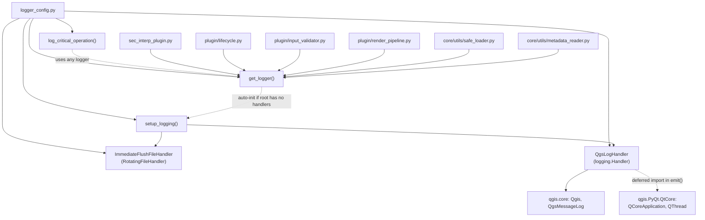

---
tags:
  - secinterp
  - code-walkthrough
  - root
  - logging
aliases:
  - logger_config.py
  - get_logger
  - setup_logging
cssclass: secinterp-note
---

# `logger_config.py`

> [!abstract] One-line summary
> Centralized plugin logging setup: a `SecInterp.*` hierarchy with three sinks (QGIS message panel, rotating file with `fsync`, and `stderr`) plus a background-thread-safe handler.

**Path**: `logger_config.py` (220 lines)
**Main class/function**: `get_logger`, `setup_logging`
**Layer**: Root / bootstrap (uses `qgis.core` only as a message sink)
**Tags**: #secinterp #root #logging

---

## 🎯 Why does this file exist?

Without a central place, every module would create its own logger with different formats
and destinations, and messages from background threads (`QgsTask`) would hang or crash
QGIS by touching the GUI. This module solves both problems:

| Problem | Solution |
|---------|----------|
| Scattered loggers with no common format or destination | Single `SecInterp.*` hierarchy configured once in `setup_logging()` |
| `QgsMessageLog` called from background threads causes hangs | `QgsLogHandler` checks the thread and diverts to `stderr` tagged `(BG)` |
| A QGIS crash loses buffered logs | `ImmediateFlushFileHandler` does `flush` + `os.fsync` after each record |
| Modules and tests need loggers without booting the whole plugin | `get_logger()` auto-initializes the root if it has no handlers yet |

> [!important] Architectural note
> This is cross-cutting infrastructure, not business logic: the whole project (plugin,
> `plugin/`, `core/utils/`) gets its logger via `get_logger(__name__)`. Log messages
> are **not translated** (fixed tags `SecInterp`, `CRITICAL_OP`).

---

## 🧬 Relationship diagram



> [!tip] How to read
> Solid arrow = imports/instantiates; dashed = deferred or conditional use. Every
> consumer enters through `get_logger`, never instantiating handlers directly.

---

## 📦 Imports — architectural reading

```python
# logger_config.py
from __future__ import annotations

import logging
import os
import sys
from logging.handlers import RotatingFileHandler
from pathlib import Path
from typing import Any

from qgis.core import Qgis, QgsMessageLog
```

| # | Observation |
|---|-------------|
| ① | `from __future__ import annotations` + `str \| None` syntax: project standard. |
| ② | Stdlib only (`logging`, `os`, `sys`, `pathlib`, `typing`): the logging core is portable. |
| ③ | `from qgis.core import Qgis, QgsMessageLog` is the **only** QGIS dependency, used purely as an output sink, never to read layers or the project. |
| ④ | `QCoreApplication`/`QThread` are imported **inside** `QgsLogHandler.emit()`: a deferred import so the module stays importable with no live Qt app (tests, early startup). |
| ⑤ | `datetime` is imported inside `log_critical_operation()`: same criterion, lazy loading for accessory needs. |

---

## 🏗️ Structure inventory

**Constants:**

- `ROOT_LOGGER_NAME = "SecInterp"` — hierarchy root name and QGIS panel tag.

**Classes (2):**

- `class ImmediateFlushFileHandler(RotatingFileHandler)` — file handler with immediate flush.
- `class QgsLogHandler(logging.Handler)` — thread-safe bridge to `QgsMessageLog`.

**Functions (3):**

- `setup_logging(level: int = logging.DEBUG) -> logging.Logger` — one-time idempotent setup.
- `get_logger(name: str | None = None) -> logging.Logger` — factory with hierarchy and auto-init.
- `log_critical_operation(logger, operation_name, **context) -> None` — maximum-persistence trace before operations that could hang QGIS.

---

## 📁 Files in the package

`logger_config.py` lives at the **project root**, next to the plugin entry point:

| File | Lines | Role |
|---|--:|---|
| [[logger_config]] | 220 | Central logging setup (this note) |
| [[sec_interp_plugin]] | 129 | `SecInterp` class: calls `setup_logging()` at startup |
| `__init__.py` | 49 | `classFactory(iface)`: lazily imports `SecInterp` |
| `run_qgis_manage.py` | 11 | Dev script for the `qgis-manage` CLI |

> [!note] The logger comes before everything
> `SecInterp.__init__` calls `setup_logging()` **before** loading services, extractors
> and the dialog, so any later failure is already recorded on all three sinks. See
> [[sec_interp_plugin]] and [[root]].

---

## 📖 Symbol-by-symbol walkthrough

### `ImmediateFlushFileHandler` — crash-proof file

```python
class ImmediateFlushFileHandler(RotatingFileHandler):
    def emit(self, record: logging.LogRecord) -> None:
        super().emit(record)
        self.flush()
        # Force OS-level write to disk (slower but safer for crash analysis)
        try:
            if hasattr(self.stream, "fileno"):
                os.fsync(self.stream.fileno())
        except (OSError, AttributeError):
            # If fsync fails, continue anyway
            pass
```

It inherits rotation from `RotatingFileHandler` (10 MB × 5 files, see `setup_logging`) and
adds aggressive persistence: after `super().emit(record)` it forces `flush()` and then
`os.fsync()` so the OS physically writes to disk. The `try/except (OSError,
AttributeError)` with `pass` is deliberate: if `fsync` fails (descriptor-less stream,
full disk), logging must never break the main flow.

| Aspect | Detail |
|--------|--------|
| Inherits from | `logging.handlers.RotatingFileHandler` |
| Guarantee | Every record reaches disk before a possible crash |
| Cost | Slower (one OS call per record); accepted for diagnostics |
| `fsync` failure | Silent by design (`pass`), never interrupts |

> [!warning] Per-record `fsync`: a forensic choice, not a performance one; do not reuse this class inside hot loops.

### `QgsLogHandler` — safe bridge to the QGIS panel

```python
def __init__(self, tag: str = "SecInterp") -> None:
    super().__init__()
    self.tag = tag

def emit(self, record: logging.LogRecord) -> None:
    try:
        from qgis.PyQt.QtCore import QCoreApplication, QThread

        msg = self.format(record)

        # Map Python logging levels to QGIS levels
        if record.levelno >= logging.ERROR:
            level = Qgis.MessageLevel.Critical
        elif record.levelno >= logging.WARNING:
            level = Qgis.MessageLevel.Warning
        elif record.levelno >= logging.INFO:
            level = Qgis.MessageLevel.Info
        else:
            level = Qgis.MessageLevel.Info

        # Critical: UI updates from background threads cause segfaults in QGIS
        instance = QCoreApplication.instance()
        if instance and QThread.currentThread() == instance.thread():
            QgsMessageLog.logMessage(msg, self.tag, level)
        else:
            # Fallback to standard error for background threads
            sys.stderr.write(f"[{self.tag}] (BG) {msg}\n")
    except Exception:
        self.handleError(record)
```

Three ideas in a single `emit()`:

1. **Level mapping**: `ERROR+` → `Critical`, `WARNING` → `Warning`, rest → `Info`. Note `DEBUG` also falls into QGIS `Info`, but the handler registers at `INFO`, so `DEBUG` never reaches the panel (file only).
2. **Thread guard**: compares `QThread.currentThread()` with the application thread. Only the main thread may touch `QgsMessageLog`; from a `QgsTask` the message goes to `stderr` marked `(BG)`, avoiding segfaults.
3. **Never breaks**: any internal exception ends in `self.handleError(record)`, the standard `logging` mechanism for handler failures.

> [!important] No i18n on tags
> The `tag` (`"SecInterp"`) and the `(BG)` marker are **fixed literals**, never passed
> through `tr()`. Logs are diagnostic artifacts, not UI text, and must stay greppable in
> any language. See [[lifecycle]] for the contrast with menu strings.

### `setup_logging` — idempotent setup

```python
def setup_logging(level: int = logging.DEBUG) -> logging.Logger:
    root_logger = logging.getLogger(ROOT_LOGGER_NAME)

    # Only configure if not already configured
    if not root_logger.handlers:
        root_logger.setLevel(level)

        # 1. Create QGIS message log handler (for UI)
        qgis_handler = QgsLogHandler(tag=ROOT_LOGGER_NAME)
        qgis_handler.setLevel(logging.INFO)
        qgis_formatter = logging.Formatter("%(levelname)s - %(message)s")
        qgis_handler.setFormatter(qgis_formatter)
        root_logger.addHandler(qgis_handler)

        # 2. Create file handler for detailed crash analysis
        try:
            root_dir = Path(__file__).parent
            log_dir = root_dir / "logs"
            log_dir.mkdir(exist_ok=True)
            log_file = log_dir / "sec_interp_debug.log"

            file_handler = ImmediateFlushFileHandler(
                log_file,
                maxBytes=10 * 1024 * 1024,  # 10MB
                backupCount=5,
                encoding="utf-8",
            )
            file_handler.setLevel(logging.DEBUG)
            file_formatter = logging.Formatter(
                "%(asctime)s | %(levelname)-8s | %(name)s | "
                "%(funcName)s:%(lineno)d | Thread-%(thread)d | %(message)s",
                datefmt="%Y-%m-%d %H:%M:%S",
            )
            file_handler.setFormatter(file_formatter)
            root_logger.addHandler(file_handler)

            # 3. Add stderr handler as backup for crash scenarios
            stderr_handler = logging.StreamHandler(sys.stderr)
            stderr_handler.setLevel(logging.WARNING)
            stderr_handler.setFormatter(file_formatter)
            root_logger.addHandler(stderr_handler)

            root_logger.debug(f"Logging system initialized. Root Level: {level}")
            root_logger.debug(f"File logging path: {log_file}")

        except Exception as e:
            QgsMessageLog.logMessage(
                f"Warning: Could not initialize file logging: {e}",
                ROOT_LOGGER_NAME,
                Qgis.MessageLevel.Warning,
            )

        root_logger.propagate = True

    return root_logger
```

The `if not root_logger.handlers` guard makes the function **idempotent**: calling it twice
(plugin reloads via *Plugin Reloader*, tests) never duplicates handlers or messages.

| Sink | Level | Format | Purpose |
|------|-------|--------|---------|
| `QgsLogHandler` (QGIS panel) | `INFO` | `%(levelname)s - %(message)s` | What the user sees |
| `ImmediateFlushFileHandler` (`logs/sec_interp_debug.log`) | `DEBUG` | timestamp, level, `name`, `funcName:lineno`, `Thread-id`, message | Forensic diagnostics |
| `StreamHandler(sys.stderr)` | `WARNING` | same detailed format | Backup if QGIS dies |

Fine details:

- `log_dir.mkdir(exist_ok=True)`: creates `logs/` next to `logger_config.py` (installed plugin root) without failing if it exists.
- Rotation `maxBytes=10MB, backupCount=5`: caps disk usage at ~60 MB.
- If file setup fails (permissions, disk), a `Warning` is posted to the QGIS panel and the plugin keeps the UI sink only: **logging never blocks startup**.
- `root_logger.propagate = True`: `SecInterp.*` children propagate to the root (`logging` default, made explicit here as documentation).

### `get_logger` — hierarchy factory

```python
def get_logger(name: str | None = None) -> logging.Logger:
    if name is None or name == ROOT_LOGGER_NAME:
        return logging.getLogger(ROOT_LOGGER_NAME)

    full_name = name if name.startswith(ROOT_LOGGER_NAME + ".") else f"{ROOT_LOGGER_NAME}.{name}"
    logger = logging.getLogger(full_name)

    # Auto-initialize if root has no handlers (for tests or standalone usage)
    root = logging.getLogger(ROOT_LOGGER_NAME)
    if not root.handlers and name != ROOT_LOGGER_NAME:
        setup_logging()

    return logger
```

It normalizes any `__name__` (e.g. `sec_interp.core.controller`) into the `SecInterp.<name>`
hierarchy, unless it already carries the prefix. Auto-init covers tests and modules
imported before `SecInterp.__init__`: if the root has no handlers, everything is set up on
the fly. Canonical per-module usage:

```python
from sec_interp.logger_config import get_logger

logger = get_logger(__name__)
```

### `log_critical_operation` — pre-crash trace

```python
def log_critical_operation(logger: logging.Logger, operation_name: str, **context: Any) -> None:
    import datetime

    msg = f"CRITICAL_OP: {operation_name}"
    if context:
        ctx_str = ", ".join(f"{k}={v}" for k, v in context.items())
        msg += f" | {ctx_str}"

    logger.debug(msg)

    timestamp = datetime.datetime.now().strftime("%Y-%m-%d %H:%M:%S.%f")[:-3]
    sys.stderr.write(f"[{timestamp}] {msg}\n")
    sys.stderr.flush()

    try:
        if hasattr(sys.stderr, "fileno"):
            os.fsync(sys.stderr.fileno())
    except (OSError, AttributeError):
        pass
```

Dual write: through normal channels (`logger.debug`) **and** straight to `stderr` with a
millisecond timestamp, bypassing every buffer. Meant to be called **before** operations
that could hang QGIS (canvas, rubber bands, tool activation), so the forensic log always
holds the last attempted operation.

---

## 🔄 Data flow

| Phase | Input | Transformation | Output |
|-------|-------|----------------|--------|
| Startup | `SecInterp.__init__` | idempotent `setup_logging()` | `SecInterp` root with 3 handlers |
| Lookup | `get_logger(__name__)` | `SecInterp.` prefix + auto-init | hierarchical logger |
| UI emission | `LogRecord` on main thread | level mapping + short format | `QgsMessageLog` tagged `SecInterp` |
| BG emission | `LogRecord` in `QgsTask` | short format | `stderr` marked `(BG)` |
| File emission | any `LogRecord` ≥ `DEBUG` | detailed format + `flush`/`fsync` | `logs/sec_interp_debug.log` (+ rotation) |
| Pre-crash | `operation_name` + context | `CRITICAL_OP:` + timestamp | `debug` + unbuffered `stderr` |

---

## 🧵 Threading model

| Thread | Allowed sink | Mechanism |
|--------|--------------|-----------|
| Main (GUI) | `QgsMessageLog` | `QThread.currentThread() == instance.thread()` |
| Background (`QgsTask`) | `stderr` with `(BG)` | `else` branch of `QgsLogHandler.emit` |
| Any | file + `stderr` | `logging` handlers, thread-safe by design |

> [!tip] `logging` already serializes `emit()` with a per-handler lock; this module's guard avoids **touching Qt from the wrong thread**, which is what actually breaks QGIS.

---

## 🏛️ Design patterns present

| Pattern | Where | Purpose |
|---------|-------|---------|
| **Factory** | `get_logger()` | Single creation point with name normalization |
| **Idempotent init** | `if not root_logger.handlers` guard | Reloads and tests without duplicated handlers |
| **Adapter** | `QgsLogHandler` | Adapts `logging.Handler` to `QgsMessageLog` |
| **Decorator (handler)** | `ImmediateFlushFileHandler` | Extends rotation with immediate persistence |
| **Fail-safe** | `except ...: pass` / `handleError` | Logging never breaks the main flow |
| **Lazy import** | `QCoreApplication` in `emit()` | Module importable with no live Qt app |

---

## 🧾 API summary

| Symbol | Signature / Inherits | Typical use |
|--------|----------------------|-------------|
| `ROOT_LOGGER_NAME` | `= "SecInterp"` | Root name and QGIS tag |
| `ImmediateFlushFileHandler` | `(RotatingFileHandler)` | Forensic file handler |
| `QgsLogHandler` | `(logging.Handler)` | Message-panel bridge |
| `setup_logging` | `(level=DEBUG) -> Logger` | Once, in `SecInterp.__init__` |
| `get_logger` | `(name=None) -> Logger` | `logger = get_logger(__name__)` per module |
| `log_critical_operation` | `(logger, operation_name, **context) -> None` | Before operations that could hang QGIS |

---

## 🛡️ Error handling

| Case | Behaviour |
|------|-----------|
| `fsync` fails on file | `except (OSError, AttributeError): pass` — carries on |
| `QgsMessageLog` fails in `emit` | `self.handleError(record)` — stdlib `logging` channel |
| `logs/` cannot be created | `Warning` on the QGIS panel; UI sink only remains |
| Repeated `setup_logging` | No-op via the handlers guard |
| Logger requested before init | Auto-init via `get_logger` |

```python
# Logging must never raise: the module's pattern
try:
    if hasattr(self.stream, "fileno"):
        os.fsync(self.stream.fileno())
except (OSError, AttributeError):
    pass
```

---

## 🧪 Associated tests

There is no dedicated `tests/**/test_logger_config.py`; coverage is indirect but real:

- Every suite importing a module with `logger = get_logger(__name__)` exercises the `get_logger` auto-init (the QGIS mocks in `tests/base_test.py` and `tests/mocks/` allow importing `qgis.core` outside QGIS).
- `tests/core/utils/test_metadata_reader.py` — exercises `logger.error/exception/debug` paths of a direct consumer.
- `tests/core/utils/test_safe_loader_di.py` — exercises `logger.exception` in `SafeLoader.safe_import`.
- `tests/test_translation_loading.py` — instantiates `SecInterp`, hence `setup_logging()` in `__init__` (idempotent across tests).

> [!note] Honest gaps
> No tests verify the level-to-`Qgis.MessageLevel` mapping, the `(BG)` background-thread
> branch, or file rotation. Those would be pure unit tests with `logging` + mocks, no
> real QGIS needed.

---

## 👀 Observations and notes

> [!success] Strengths
> - Three complementary sinks: UI (panel), forensic (file with `fsync`), backup (`stderr`).
> - `QgsTask`-safe by construction: the thread guard prevents Qt segfaults.
> - Idempotent and self-initializing: robust against plugin reloads and tests.
> - Logging never breaks the flow: every internal failure degrades gracefully.

> [!warning] Points of attention
> - The `DEBUG` file grows up to ~60 MB (10 MB × 5 + active) with no age-based cleanup.
> - `logs/` is created next to the installed plugin; on write-protected profiles only the UI sink remains.
> - `DEBUG` maps to QGIS `Info` but the UI handler filters at `INFO`: consistent, though the `else → Info` mapping hides the distinction.
> - `propagate = True` is the `logging` default; the line documents rather than changes.

> [!question] Open questions
> - Time-based rotation on top of size-based to bound log age?
> - Expose the log path in the dialog (help page) to ease bug reports?
> - Add a pure `test_logger_config.py` (levels, BG branch, idempotence)?

---

## 🔗 Related notes

- [[Index]] — vault index
- [[sec_interp_plugin]] — calls `setup_logging()` at plugin startup
- [[root]] — root group where this module lives
- [[safe_loader]] — consumer logging import failures with `logger.exception`
- [[metadata_reader]] — consumer with `error`/`exception`/`debug` paths
- [[lifecycle]] — uses `logger.warning` in `process_data`; contrasts with its translatable strings
- [[controller]] — orchestrator whose services log through this hierarchy

---

*Note of the SecInterp Code Walkthrough v2 vault — v3.9.0*
