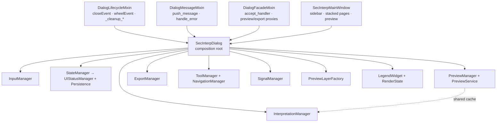

---
tags:
  - secinterp
  - code-walkthrough
  - gui
  - dialog
aliases:
  - main_dialog.py
  - SecInterpDialog
cssclass: secinterp-note
note_lines: 700
---

# `gui/main_dialog.py`

> [!abstract] One-line summary
> Composition root of the main dialog: `SecInterpDialog` combines three mixins (`Lifecycle`, `Message`, `Facade`) with `SecInterpMainWindow` and wires nine specialized managers in `_init_managers`.

**Path**: `gui/main_dialog.py` (193 lines)
**Main class**: `SecInterpDialog(DialogLifecycleMixin, DialogMessageMixin, DialogFacadeMixin, SecInterpMainWindow)`
**Layer**: GUI (QDialog · Composition Root)
**Tags**: #secinterp #gui #dialog

---

## 🎯 Why does this file exist?

The dialog grew to cover validation, preview, export, interpretation, map tools and persistence. Without a composition root, `__init__` would mix UI construction, signal wiring, i18n and cleanup. This module fixes that by delegating each responsibility:

| Problem | Solution |
|---------|----------|
| A monolithic `QDialog` with dozens of responsibilities | Mixin composition + nine specialized managers |
| Cleanup logic scattered across `accept`, `reject` and window close | `DialogLifecycleMixin.closeEvent` centralizes teardown |
| Duplicated messages between the QGIS message bar and the plugin panel | `DialogMessageMixin.push_message` with a dual target |
| The dialog must not know each manager's internals | `DialogFacadeMixin` exposes thin proxies (`preview_profile_handler`, `accept_handler`) |
| Tests and startup without QGIS (`iface=None`) | `_NoOpMessageBar` avoids `AttributeError` on `pushMessage` |

> [!important] Architectural note
> This file is the GUI **composition root**: it holds no business logic and no geological computation. It builds, connects and destroys. Everything "Compute" lives in `core/`; everything "Extract/Present" lives in managers, extractors and pages.

---

## 🧬 MRO and composition root



> [!tip] How to read
> Solid arrow = inheritance or construction; dashed = runtime collaboration (`PreviewCache` shared between preview and interpretation).

The inheritance order is intentional and defines method resolution:

| MRO position | Mixin / base | What it contributes to resolution |
|---|---|---|
| 1 | `DialogLifecycleMixin` | `closeEvent` and `wheelEvent` win over `QDialog` |
| 2 | `DialogMessageMixin` | `push_message`, `handle_error` |
| 3 | `DialogFacadeMixin` | Proxies (`update_button_state`, `accept_handler`, `getThemeIcon`) |
| 4 | `SecInterpMainWindow` | Programmatic UI (`QDialog` + sidebar + pages + preview) |

> [!note] `super().__init__(iface, parent)` and the constructor chain
> `SecInterpDialog.__init__` calls `super().__init__(iface, parent)`. The mixins define no `__init__`, so the call travels the MRO down to `SecInterpMainWindow.__init__(iface, parent)`, which in turn calls `QDialog.__init__(parent)`.

---

## 📦 Imports — architectural reading

```python
# gui/main_dialog.py
from __future__ import annotations

from pathlib import Path
from typing import Any

from qgis.core import Qgis, QgsProject
from qgis.PyQt.QtCore import QSettings, QUrl
from qgis.PyQt.QtGui import QDesktopServices
from qgis.PyQt.QtWidgets import QDialogButtonBox, QPushButton

from sec_interp.gui.dialog_facade_mixin import DialogFacadeMixin        # ①
from sec_interp.gui.dialog_lifecycle_mixin import DialogLifecycleMixin
from sec_interp.gui.dialog_message_mixin import DialogMessageMixin
from sec_interp.gui.utils import show_user_message
from sec_interp.logger_config import get_logger

from .dialog_export_manager import ExportManager                        # ②
from .dialog_input_manager import InputManager
from .dialog_interpretation_manager import InterpretationManager
from .dialog_preview_manager import PreviewManager
from .dialog_signal_manager import SignalManager
from .dialog_state_manager import StateManager
from .dialog_tool_manager import NavigationManager, ToolManager
from .legend_widget import LegendWidget
from .preview_layer_factory import PreviewLayerFactory
from .preview_state import PreviewCache, RenderState
from .ui.main_window import SecInterpMainWindow
```

| # | Observation |
|---|-------------|
| ① | Mixins use absolute imports (`sec_interp.gui.*`); managers use relative ones (`.dialog_*`). Package convention: reusable pieces absolute, dialog-internal pieces relative. |
| ② | Nine managers + `LegendWidget` + `PreviewLayerFactory` + `PreviewCache/RenderState`: the whole collaboration graph is declared here. It is the visual signature of a composition root. |
| ③ | Minimal, justified QGIS imports: `Qgis` (message levels), `QgsProject` (project instance), `QSettings`/`QUrl`/`QDesktopServices` (only for `open_help`). |
| ④ | `PreviewService` and `Pages` are imported **inside** `_init_managers` (deferred imports) to avoid load-time cycles between `gui` and `core.services`. |

---

## 🏗️ Structure inventory

**Classes:** `_NoOpMessageBar` (fallback), `SecInterpDialog` (main)

**`SecInterpDialog` methods:**

- `__init__(iface=None, plugin_instance=None, parent=None)` — construction and wiring
- `_init_managers()` — instantiation of the nine managers + cross-wiring
- `show_dialog(title, message, level="info")` — modal message box via `show_user_message`
- `open_help()` — locale-aware HTML help with a fallback chain
- `validate_inputs()` — delegates to `InputManager`, shows the error on failure

---

## 📁 The `dialog_*` family in package `gui/`

`main_dialog.py` does not stand alone: each suffix is a responsibility extracted from the former monolithic dialog.

| Module | Role | Note |
|---|---|---|
| `dialog_dependencies.py` | `Pages` container (dataclass) | `dialog_dependencies` |
| `dialog_lifecycle_mixin.py` | `closeEvent`, `wheelEvent`, `_cleanup_*` | [[dialog_lifecycle_mixin]] |
| `dialog_message_mixin.py` | `push_message`, `handle_error` | [[dialog_message_mixin]] |
| `dialog_facade_mixin.py` | Proxies to managers | [[dialog_facade_mixin]] |
| `dialog_input_manager.py` | Input reading and validation | [[dialog_input_manager]] |
| `dialog_state_manager.py` | Visual state + persistence | [[dialog_state_manager]] |
| `dialog_preview_manager.py` | Preview generation | [[dialog_preview_manager]] |
| `dialog_export_manager.py` | Export | [[dialog_export_manager]] |
| `dialog_interpretation_manager.py` | Interpreted polygons | [[dialog_interpretation_manager]] |
| `dialog_signal_manager.py` | Centralized signal wiring | [[dialog_signal_manager]] |
| `dialog_tool_manager.py` | `ToolManager` + `NavigationManager` | [[dialog_tool_manager]] |
| `main_dialog_config.py` | Defaults, constants and i18n messages | [[main_dialog_config]] |
| `main_dialog_utils.py` | `DialogEntityManager` (layers, fields, icons) | [[main_dialog_utils]] |

---

## 📖 Method-by-method walkthrough

### `_NoOpMessageBar` — fallback without QGIS

```python
class _NoOpMessageBar:
    """Safe no-op messagebar when iface is not available."""

    def pushMessage(self, *_args, **_kwargs) -> None:
        """No-op implementation of pushMessage."""
        return None
```

A Null Object replicating the only surface used (`pushMessage`). It lets callers build the dialog with `iface=None` in tests and degraded mode without branching every call with `if self.messagebar:`.

### Class declaration and docstring

```python
class SecInterpDialog(
    DialogLifecycleMixin,
    DialogMessageMixin,
    DialogFacadeMixin,
    SecInterpMainWindow,
):
```

The docstring documents the dialog's three public attributes: `iface`, `plugin_instance` and `messagebar`. Everything else (managers, widgets, state) is composition detail living in `_init_managers` or the base window.

### `__init__` — construction in five phases

```python
def __init__(self, iface=None, plugin_instance=None, parent=None) -> None:
    super().__init__(iface, parent)

    self.iface = iface
    self.plugin_instance = plugin_instance
    self.project = QgsProject.instance()

    if self.iface is None:
        self.messagebar = _NoOpMessageBar()
    else:
        self.messagebar = self.iface.messageBar()

    self._init_managers()

    self.legend_widget = LegendWidget(self.preview_widget.canvas)
    self.render_state = RenderState()

    self.clear_cache_btn = QPushButton(self.tr("Clear Cache"))
    self.clear_cache_btn.setToolTip(self.tr("Clear cached data to force re-processing."))
    self.button_box.addButton(self.clear_cache_btn, QDialogButtonBox.ButtonRole.ActionRole)

    self.reset_defaults_btn = QPushButton(self.tr("Reset Defaults"))
    self.reset_defaults_btn.setToolTip(self.tr("Reset all inputs to their default values."))
    self.button_box.addButton(self.reset_defaults_btn, QDialogButtonBox.ButtonRole.ActionRole)

    self.tool_manager.initialize_tools()

    self.signal_manager = SignalManager(
        self,
        self.preview_manager,
        self.export_manager,
        self.tool_manager,
        self.state_manager,
    )
    self.signal_manager.connect_all()

    self.state_manager.update_all()
    self.state_manager.load_settings()

    self._save_on_close = True
```

| Phase | What happens | Why in this order |
|---|---|---|
| 1. Base + identity | `super().__init__`, `iface`, `plugin_instance`, `project`, `messagebar` | Managers receive `self`; the dialog must exist first |
| 2. Managers | `_init_managers()` | Creates input/state/preview/export/interpretation/tools |
| 3. Visual components | `LegendWidget(canvas)`, `RenderState()`, extra buttons | Require `preview_widget` and `button_box` from the base window |
| 4. Signals | `ToolManager.initialize_tools()`, `SignalManager(...).connect_all()` | Everything must exist before wiring |
| 5. Initial state | `update_all()`, `load_settings()`, `_save_on_close = True` | The UI reflects persisted state on open |

> [!note] Buttons with `ActionRole`
> `Clear Cache` and `Reset Defaults` are added with `QDialogButtonBox.ButtonRole.ActionRole` so they do **not** close the dialog (unlike `Ok`/`Cancel`). Their handlers live in the facade: `clear_cache_handler` and `reset_defaults_handler`.

### `_init_managers` — the wiring

```python
def _init_managers(self) -> None:
    from sec_interp.core.services.preview_service import PreviewService

    from .dialog_dependencies import Pages

    preview_cache = PreviewCache()
    pages = Pages(
        dem=self.page_dem,
        section=self.page_section,
        geology=self.page_geology,
        structure=self.page_struct,
        drillhole=self.page_drillhole,
        settings=self.page_settings,
    )

    self.input_manager = InputManager(pages, self.output_widget, self.tr)
    self.state_manager = StateManager(self)
    self.preview_manager = PreviewManager(
        self, PreviewService(self.plugin_instance.controller), cache=preview_cache
    )
    self.export_manager = ExportManager(self)
    self.state_manager.setup_indicators()
    self.interpretation_manager = InterpretationManager(self, cache=preview_cache)
    self.interpretation_manager.load_interpretations()
    self.tool_manager = ToolManager(
        self.preview_widget.canvas,
        self.preview_widget,
        self.tr,
        self.on_interpretation_finished,
        self.update_measurement_display,
    )
    self.navigation_manager = NavigationManager(self.preview_widget.canvas)
    self.layer_factory = PreviewLayerFactory()

    self.preview_manager.set_interpretations_cleared_handler(
        self.interpretation_manager.clear_interpretations
    )
    self.interpretation_manager.set_preview_update_handler(
        self.preview_manager.update_from_checkboxes
    )
```

Three decisions stand out:

- **`Pages` narrows the surface**: `InputManager` never receives the whole dialog, only the `Pages` dataclass + `output_widget` + `self.tr` as an injected translate function. See `dialog_dependencies`.
- **Shared `PreviewCache`**: the same `preview_cache` object is injected into `PreviewManager` and `InterpretationManager`, so clearing interpretations invalidates the preview without coupling them directly.
- **Cross handlers**: `set_interpretations_cleared_handler` / `set_preview_update_handler` break the preview ↔ interpretation circular dependency with callbacks, not direct references.

> [!warning] Unguarded `self.plugin_instance.controller`
> `PreviewService(self.plugin_instance.controller)` assumes a non-null `plugin_instance`. With `iface=None` in tests, the caller must inject a `plugin_instance` carrying a valid (or mocked) `controller`, otherwise the constructor fails before the message-bar fallback can help.

### `show_dialog` — modal message box

```python
def show_dialog(self, title: str, message: str, level: str = "info") -> Any:
    return show_user_message(self, title, message, level=level)
```

A thin facade over [[gui_utils_py]] (`show_user_message`). Do not confuse with `push_message` (non-modal, dual target: message bar + panel). The default level here is `"info"`; in `show_user_message` it is `"warning"`.

### `open_help` — localized help with fallback

```python
def open_help(self) -> None:
    user_locale = QSettings().value("locale/userLocale", "en")
    if not isinstance(user_locale, str):
        user_locale = "en"

    plugin_dir = Path(__file__).parent.parent
    help_dir = plugin_dir / "help" / "html"
    help_file = help_dir / user_locale / "index.html"

    if not help_file.exists() and len(user_locale) > 2:  # noqa: PLR2004
        help_file = help_dir / user_locale[0:2] / "index.html"

    if not help_file.exists():
        help_file = help_dir / "en" / "index.html"

    if help_file.exists():
        QDesktopServices.openUrl(QUrl.fromLocalFile(str(help_file)))
    else:
        self.push_message(
            self.tr("Error"),
            self.tr("Help file not found. Please run 'make docs' to generate it."),
            level=Qgis.MessageLevel.Warning,
        )
```

Resolution chain: full locale (`es_ES`) → two letters (`es`) → English → warning message. `Path(__file__).parent.parent` climbs from `gui/` to the plugin root. Every user-visible literal goes through `self.tr()`.

### `validate_inputs` — delegated validation

```python
def validate_inputs(self) -> bool:
    """Validate the inputs from the dialog via DialogInputManager."""
    is_valid, error_message = self.input_manager.validate_inputs()
    if not is_valid:
        show_user_message(self, self.tr("Validation Error"), error_message)
    return is_valid
```

It honors Extract-then-Compute at dialog level: it validates nothing itself, delegates to `InputManager`, and only presents the error. It is called by `accept_handler` (facade) before accepting the dialog.

---

## 🔄 Manager-wiring data flow

| Phase | Input | Transformation | Output |
|---|---|---|---|
| Base construction | `iface`, `plugin_instance` | `SecInterpMainWindow.__init__` builds sidebar, pages, preview | Widgets ready on `self` |
| Packing | `page_dem…page_settings` | `Pages` dataclass | Narrow surface for `InputManager` |
| Core service | `plugin_instance.controller` | `PreviewService(controller)` | Service injected into `PreviewManager` |
| Translation | `self.tr` (bound method) | Injection into `InputManager` and `ToolManager` | Managers translate without inheriting `QDialog` |
| Cross-wiring | Bound methods of both managers | Mutual `set_*_handler` | Preview ↔ interpretation without circular imports |
| State boot | Persisted settings | `update_all()` + `load_settings()` | UI synchronized on open |

---

## 🪟 QDialog lifecycle: `accept` vs `closeEvent`

The dialog distinguishes three exits, each with its own semantics (detail lives in [[dialog_facade_mixin]] and [[dialog_lifecycle_mixin]]):

| Exit | Who handles it | Semantics |
|---|---|---|
| OK button | `accept_handler` (facade) | Saves settings → validates → saves interpretations → cleans preview renderer → `accept()` |
| Cancel / `reject` | `reject_handler` (facade) | Sets `_save_on_close = False` → `close()` (no persistence) |
| Window close (×) | `closeEvent` (lifecycle) | If `_save_on_close`, saves settings → full `_cleanup_resources()` |

> [!important] Scratch-layer fix (2026-09-21)
> The renderer registers transient memory layers in `QgsProject` for stable rendering. Left behind, they trigger QGIS's "temporary scratch layers" warning on exit. That is why both `accept_handler` and `_cleanup_preview_renderer` call `renderer.cleanup()`: the dialog never leaves transient layers in the project, whether accepted or window-closed.

---

## 🏛️ Design patterns present

| Pattern | Where | Purpose |
|---|---|---|
| **Composition Root** | `__init__` + `_init_managers` | A single place builds the object graph |
| **Mixin (composition via inheritance)** | Class declaration, MRO order | Separate lifecycle / messages / facade without deep hierarchies |
| **Facade** | `DialogFacadeMixin`, `show_dialog`, `validate_inputs` | Thin API over managers |
| **Null Object** | `_NoOpMessageBar` | Operate without `iface`, no conditionals |
| **Dependency Injection** | Manager constructors, `Pages`, `self.tr` | Managers testable with doubles |
| **Observer (via callbacks)** | `set_interpretations_cleared_handler` | Break the preview ↔ interpretation cycle |

---

## 🧾 API summary

| Symbol | Signature / Inherits | Typical use |
|---|---|---|
| `SecInterpDialog` | mixins + `SecInterpMainWindow` | `dlg = SecInterpDialog(iface, plugin)` |
| `_NoOpMessageBar` | `pushMessage(*args, **kwargs)` | Fallback when `iface is None` |
| `__init__` | `(iface=None, plugin_instance=None, parent=None)` | Full dialog construction |
| `_init_managers` | `() -> None` | Creates and wires the nine managers |
| `show_dialog` | `(title, message, level="info") -> Any` | Modal message box |
| `open_help` | `() -> None` | Open localized HTML help |
| `validate_inputs` | `() -> bool` | Validate via `InputManager` |

---

## 🛡️ Error handling

The module barely catches exceptions: it delegates to `DialogMessageMixin.handle_error` (which separates `SecInterpError` from unexpected errors with tracebacks) and to up-front validation (`validate_inputs` before `accept`). Two local defenses:

- `_NoOpMessageBar` prevents `AttributeError` without `iface`.
- `open_help` checks `isinstance(user_locale, str)` because `QSettings.value` may return `None` or non-text types, and falls back to `push_message` when no generated HTML exists.

---

## 🧪 Associated tests

There is no single `test_main_dialog.py`; coverage is split by responsibility (mock-first, no real QGIS):

- `tests/gui/test_main_dialog_core.py` — construction, `_init_managers`, basic surface.
- `tests/gui/test_main_dialog_validation_manager.py` — `validate_inputs` and `InputManager` delegation.
- `tests/gui/test_main_dialog_signals_wiring.py` — `SignalManager.connect_all` after wiring.
- `tests/gui/test_main_dialog_tools.py` — `ToolManager.initialize_tools` and tools.
- `tests/gui/test_main_dialog_interpretation.py` — interpretation and the shared cache.
- `tests/gui/test_main_dialog_settings.py` — `load_settings` / persistence on boot.
- `tests/gui/test_message_manager.py` — messaging (`push_message`, `show_dialog`).

---

## 👀 Observations and notes

> [!success] Strengths
> - Exemplary composition root: 193 lines orchestrate nine managers with zero business logic.
> - MRO documented by declaration order; each mixin has a single reason to change.
> - `_save_on_close` tells Cancel apart from the × close, avoiding persisting discarded input.
> - Systematic i18n: every visible literal goes through `self.tr()` or `QCoreApplication.translate`.

> [!warning] Points of attention
> - Unguarded `PreviewService(self.plugin_instance.controller)`: requires a valid `plugin_instance` even with `iface=None`.
> - `__init__` does a lot (build + wire + load settings); a failure in `load_settings` leaves a half-wired dialog.
> - The class is past the 300-line guideline for GUI dialogs on wiring alone; any new method belongs in a manager or mixin.

> [!question] Open questions
> - Guard `_init_managers` against a null `plugin_instance` for pure UI tests?
> - Move the `Clear Cache` / `Reset Defaults` buttons into `SecInterpMainWindow` next to the rest of the `button_box`?

---

## 🔗 Related notes

- [[Index]] — vault index
- [[main_window]] — base window with sidebar, pages and preview
- [[dialog_lifecycle_mixin]] — `closeEvent` and cleanup (scratch-layer fix)
- [[dialog_facade_mixin]] — `accept_handler`, `reject_handler`, proxies
- [[dialog_message_mixin]] — `push_message` and `handle_error`
- `dialog_dependencies` — `Pages` dataclass for `InputManager`
- [[dialog_preview_manager]] — preview with `PreviewService` and shared cache
- [[dialog_state_manager]] — `update_all`, `load_settings`, `setup_indicators`
- [[preview_page]] — preview widget and `results_text`
- [[settings_page]] — persisted settings page
- [[controller]] — `plugin_instance.controller`, source of the `PreviewService`
- [[gui_utils_py]] — `show_user_message` used by `show_dialog`

---

*Note of the SecInterp Code Walkthrough v2 vault — v3.8.0*
