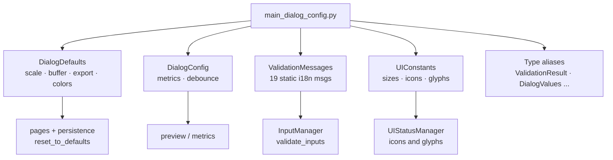

---
tags:
  - secinterp
  - code-walkthrough
  - gui
  - dialog
aliases:
  - main_dialog_config.py
  - DialogDefaults
  - DialogConfig
  - ValidationMessages
  - UIConstants
cssclass: secinterp-note
---

# `gui/main_dialog_config.py`

> [!abstract] One-line summary
> Constants module for the dialog: `DialogDefaults` (initial values), `DialogConfig` (behavior), `ValidationMessages` (19 i18n messages) and `UIConstants` (sizes, icons, glyphs), plus GUI-domain type aliases.

**Path**: `gui/main_dialog_config.py` (195 lines)
**Main classes**: `DialogDefaults`, `DialogConfig`, `ValidationMessages`, `UIConstants`
**Layer**: GUI (pure constants · no widgets · nearly QGIS-agnostic)
**Tags**: #secinterp #gui #dialog

---

## 🎯 Why does this file exist?

Defaults, validation messages and visual constants tend to scatter across pages, managers and tests as magic literals. Centralizing them gives a single point of change:

| Problem | Solution |
|---------|----------|
| Magic literals (`100`, `300`, `"50000"`) repeated in pages and managers | `DialogDefaults` with one name per value |
| Behavior flags buried in code | `DialogConfig` with documented metrics and debounce |
| Duplicated, untranslated error messages | `ValidationMessages`: 19 static methods with `QCoreApplication.translate` |
| Inconsistent icon names and status glyphs | `UIConstants` with QGIS theme icons and ✓/✗/⚠ symbols |
| Signatures with opaque `dict`/`tuple` | Aliases (`ValidationResult`, `DialogValues`, `ExportSettings`) documenting intent |

> [!important] Architectural note
> This is the closest thing to "pure configuration" in the GUI: no class creates widgets or touches layers. Only `QColor` and `QCoreApplication.translate` tie it to Qt; the rest is `str`, `int`, `bool` and lists. Managers consume it, never the other way round.

---

## 🧬 Relationship diagram



> [!tip] How to read
> Solid arrow = defines; arrow to a consumer = used by. No arrow returns: consumers import, the config imports nobody in the plugin.

---

## 📦 Imports — architectural reading

```python
# gui/main_dialog_config.py
from __future__ import annotations

from typing import Any, ClassVar

from qgis.PyQt.QtCore import QCoreApplication
from qgis.PyQt.QtGui import QColor
```

| # | Observation |
|---|-------------|
| ① | Only two Qt imports in 195 lines: `QCoreApplication` (widget-free translation) and `QColor` (default colors). No `qgis.core`, no widgets. |
| ② | `ClassVar` marks the format lists as class attributes (not instance state): `SUPPORTED_IMAGE_FORMATS` and family belong to the class. |
| ③ | `Any` backs the `LayerSelection` / `RasterSelection` aliases: they document intent without importing QGIS classes that would break tests outside QGIS. |

---

## 🏗️ Structure inventory

**Classes (4, all stateless, no `__init__`):**

- `class DialogDefaults` — ~15 constants grouped by domain
- `class DialogConfig` — 4 behavior flags
- `class ValidationMessages` — 19 static methods, all translated
- `class UIConstants` — sizes, icons, glyphs, required-field marker

**Type aliases (5):** `LayerSelection`, `RasterSelection`, `ValidationResult`, `DialogValues`, `ExportSettings`

---

## 📁 Where it lives inside `gui/`

| Neighbor | Relationship with this module |
|---|---|
| [[main_dialog]] | Its managers consume defaults and messages; never imports it directly |
| [[main_dialog_utils]] | Entity utilities (layers/fields); complements, never duplicates |
| [[dialog_state_manager]] | `reset_to_defaults` restores `DialogDefaults` values via persistence |
| [[dialog_input_manager]] | Returns `ValidationResult` and `ValidationMessages` texts |
| [[ui_status_manager]] | Uses icons and glyphs consistent with `UIConstants` |

---

## 📖 Class-by-class walkthrough

### `DialogDefaults` — initial values

```python
class DialogDefaults:
    """Default values for dialog inputs and settings."""

    # Scale and exaggeration
    SCALE = "50000"
    VERTICAL_EXAGGERATION = "1.0"
    AUTO_VERTICAL_EXAGGERATION: bool = True
    DIP_SCALE = "4"
    DIP_SCALE_FACTOR = "4"

    # Buffer and sampling
    BUFFER_DISTANCE = 100  # meters
    SAMPLING_INTERVAL = 10  # meters

    # Export settings
    DPI = 300
    PREVIEW_WIDTH = 800
    PREVIEW_HEIGHT = 600
    EXPORT_QUALITY = 95  # for JPEG

    # Colors
    BACKGROUND_COLOR = QColor(255, 255, 255)  # White
    GRID_COLOR = QColor(200, 200, 200)  # Light gray

    # Raster band
    DEFAULT_BAND = 1

    # File extensions
    SUPPORTED_IMAGE_FORMATS: ClassVar[list[str]] = [".png", ".jpg", ".jpeg"]
    SUPPORTED_VECTOR_FORMATS: ClassVar[list[str]] = [".shp"]
    SUPPORTED_DOCUMENT_FORMATS: ClassVar[list[str]] = [".pdf", ".svg"]
```

| Group | Values | Reading |
|---|---|---|
| Scale | `SCALE="50000"`, `VERTICAL_EXAGGERATION="1.0"`, `AUTO_...=True` | Strings because they feed combo/text widgets; auto-computation on by default |
| Dip | `DIP_SCALE="4"`, `DIP_SCALE_FACTOR="4"` | Nominal duplication: display scale and compute factor versioned separately |
| Buffer/sampling | `BUFFER_DISTANCE=100`, `SAMPLING_INTERVAL=10` (meters) | Geological-domain ints, commented with their unit |
| Export | `DPI=300`, `800×600`, `EXPORT_QUALITY=95` | Print-grade defaults; 95 avoids JPEG artifacts on sections |
| Colors | `QColor` white / light gray | `QColor` objects, not tuples: ready for `setBrush`/`setPen` |
| Formats | `ClassVar[list[str]]` per family | `.png/.jpg/.jpeg`, `.shp`, `.pdf/.svg`; typing prevents instance shadowing |

> [!note] Strings vs numbers
> `SCALE` and `VERTICAL_EXAGGERATION` are `str` because they are born in text widgets; `BUFFER_DISTANCE` and `DPI` are `int` because they are born in spinboxes and computations. The type mirrors the source widget, not an abstract preference.

### `DialogConfig` — behavior

```python
class DialogConfig:
    """Configuration for dialog behavior and features."""

    # Performance metrics
    ENABLE_PERFORMANCE_METRICS: bool = True
    SHOW_METRICS_IN_RESULTS: bool = True
    LOG_DETAILED_METRICS: bool = False

    # UI behavior
    ZOOM_DEBOUNCE_MS = 200  # Milliseconds
```

Three metrics flags with deliberate granularity: collect (`ENABLE_*`), display (`SHOW_*`), detail in logs (`LOG_*`, off by default to avoid flooding). `ZOOM_DEBOUNCE_MS = 200` prevents re-render storms when the mouse wheel fires `wheelEvent` bursts — consumed by preview navigation.

### `ValidationMessages` — 19 translated messages

```python
class ValidationMessages:
    """Standard validation error messages."""

    @staticmethod
    def missing_raster() -> str:
        """Return translated 'DEM raster layer is required' message."""
        return QCoreApplication.translate("ValidationMessages", "DEM raster layer is required")

    @staticmethod
    def missing_field(field: str) -> str:
        """Return translated 'Required field not found' message."""
        return QCoreApplication.translate(
            "ValidationMessages", "Required field '{}' not found in layer"
        ).format(field)
    # ... 17 more methods with the same shape
```

Full inventory by family:

| Family | Methods |
|---|---|
| Required layers | `missing_raster`, `missing_section_line`, `missing_output_path`, `missing_outcrop_layer`, `missing_outcrop_field`, `missing_structural_layer`, `missing_dip_field`, `missing_strike_field` |
| Invalid layers | `invalid_raster`, `invalid_section_line`, `invalid_output_path`, `wrong_geometry_type`, `empty_layer`, `invalid_geometry` |
| Fields | `missing_field(field)`, `invalid_field_type(field)` (only ones with a parameter, via `.format(field)`) |
| Generic | `validation_failed`, `unknown_error` |

> [!important] `QCoreApplication.translate`, not `self.tr()`
> As widget-free static methods, they use `QCoreApplication.translate("ValidationMessages", ...)` with an explicit context. This is the right pattern for `QObject`-less code: the `"ValidationMessages"` context groups strings in the `.ts` files stably even when the GUI is refactored.

### `UIConstants` — sizes, icons and glyphs

```python
class UIConstants:
    """UI-related constants."""

    # Widget sizes
    MIN_PREVIEW_WIDTH = 400
    MIN_PREVIEW_HEIGHT = 300
    MAX_PREVIEW_WIDTH = 1920
    MAX_PREVIEW_HEIGHT = 1080

    # Icon names (QGIS theme icons)
    ICON_HELP = "mActionHelpContents.svg"
    ICON_REFRESH = "mActionRefresh.svg"
    ICON_EXPORT = "mActionFileSave.svg"
    ICON_CLEAR = "mActionDeleteSelected.svg"

    # Status indicators
    STATUS_OK = "✓"
    STATUS_ERROR = "✗"
    STATUS_WARNING = "⚠"

    # Required field indicator
    REQUIRED_INDICATOR = "*"
    REQUIRED_COLOR = QColor(255, 0, 0)  # Red
```

Icons are QGIS theme names (`mAction*.svg`), not paths: they resolve via `QgsApplication.getThemeIcon` (see [[main_dialog_utils]]) and follow the active theme. The ✓/✗/⚠ glyphs are the same ones `UIStatusManager` and `push_message` render in `results_text`, so panel and constants never diverge. The 400×300–1920×1080 range bounds the preview between usable and Full HD.

### Type aliases

```python
# Type aliases for better code readability
LayerSelection = Any  # QgsVectorLayer or None
RasterSelection = Any  # QgsRasterLayer or None
ValidationResult = tuple[bool, str]  # (is_valid, error_message)
DialogValues = dict[str, Any]  # Dictionary of dialog input values
ExportSettings = dict[str, Any]  # Dictionary of export configuration
```

`ValidationResult` is the return contract of `InputManager.validate_inputs()` (see [[main_dialog]]): `(is_valid, error_message)`. `LayerSelection`/`RasterSelection` stay `Any` deliberately, so signatures used by non-QGIS tests never import `qgis.core`.

---

## 🔤 Translation context and the `.ts` cycle

Each `ValidationMessages` method fixes two things: the **context** (`"ValidationMessages"`) and the **source string** in English. With `lupdate`, those 19 strings travel to the `.ts` files (e.g. `i18n/sec_interp_es.ts`), where translators see them grouped even as the GUI is reorganized:

| Element | Value | Why it matters |
|---|---|---|
| Context | `"ValidationMessages"` | Groups all 19 strings in one `.ts` section |
| Source | Technical English (`"DEM raster layer is required"`) | Canonical language; the `.ts` maps it per locale |
| Parameters | `"..." '{}' ..."` + `.format(field)` | The placeholder survives translation; the field is formatted in later |
| Widget-free | `QCoreApplication.translate` | Works in managers, tests and CLI with no `QObject` |

Contrast with the rest of the plugin:

| Who translates | Mechanism | Where |
|---|---|---|
| Pages and dialog | `self.tr("...")` | `main_window.py`, `sidebar.py` (via `SecInterpMainWindow`) |
| Widget-less managers | Injected `self.tr` | `InputManager(pages, output_widget, self.tr)` |
| This module | `QCoreApplication.translate` | `ValidationMessages.*` (statics) |

### Consumption example in validation

```python
# gui/dialog_input_manager.py — typical use (illustrative)
from sec_interp.gui.main_dialog_config import DialogDefaults, ValidationMessages
from sec_interp.gui.main_dialog_config import ValidationResult

def validate_raster(raster) -> ValidationResult:
    if raster is None:
        return False, ValidationMessages.missing_raster()
    if not raster.isValid():
        return False, ValidationMessages.invalid_raster()
    return True, ""
```

The pattern repeats per section: detect absence → `missing_*`; detect invalidity → `invalid_*`; concrete fields → `missing_field(name)`. The caller ([[main_dialog]] via `validate_inputs`) only shows the already-translated string.

---

## 🔄 Data flow

| Phase | Input | Transformation | Output |
|---|---|---|---|
| Boot | `DialogDefaults.*` | Pages and persistence initialize widgets | UI with sensible values |
| Validation | Layer/field state | `InputManager` picks a `ValidationMessages` method | `(False, translated_message)` |
| Visual state | `UIConstants` icons and glyphs | `UIStatusManager` + `push_message` | Coherent indicators and `results_text` |
| Reset | `DialogDefaults.*` | `StateManager.reset_to_defaults` via persistence | Restored form |
| Export | `DPI`, supported formats | `ExportManager` validates extension and quality | Print-grade output file |

---

## 🧮 Numbers governing the UI (reference card)

| Number | Where | Rationale in one line |
|---|---|---|
| `100 m` buffer | `BUFFER_DISTANCE` | Capture strip around the section line |
| `10 m` sampling | `SAMPLING_INTERVAL` | Topographic profile step |
| `300` DPI | `DPI` | Print-grade export quality |
| `800 × 600` | `PREVIEW_WIDTH/HEIGHT` | Initial preview size |
| `95` quality | `EXPORT_QUALITY` | JPEG with no visible artifacts on sections |
| `200 ms` debounce | `ZOOM_DEBOUNCE_MS` | Merges `wheelEvent` bursts into one re-render |
| `400×300 – 1920×1080` | `UIConstants` | Preview between usable and Full HD |
| Band `1` | `DEFAULT_BAND` | First DEM band by default |

---

## 🏛️ Design patterns present

| Pattern | Where | Purpose |
|---|---|---|
| **Parameter Object (constants)** | `DialogDefaults`, `UIConstants` | Single point of change for values |
| **Static Factory (messages)** | `ValidationMessages` | Translated messages without instantiation |
| **Type Alias** | `ValidationResult`, `DialogValues` | Self-documenting signatures |
| **Theme indirection** | `ICON_*` as names, not paths | Follow the active QGIS theme |

---

## 🧾 API summary

| Symbol | Contents | Typical use |
|---|---|---|
| `DialogDefaults` | 15 constants | `spin.setValue(DialogDefaults.BUFFER_DISTANCE)` |
| `DialogConfig` | 4 flags | `if DialogConfig.ENABLE_PERFORMANCE_METRICS:` |
| `ValidationMessages` | 19 statics `-> str` | `return False, ValidationMessages.missing_raster()` |
| `UIConstants` | sizes, icons, glyphs | `getThemeIcon(UIConstants.ICON_HELP)` |
| `ValidationResult` | `tuple[bool, str]` | Return of `validate_inputs()` |
| `DialogValues` / `ExportSettings` | `dict[str, Any]` | Dialog values and export settings |
| `LayerSelection` / `RasterSelection` | `Any` | Layers or `None` in GUI signatures |

---

## 🛡️ Error handling

The module never raises nor catches: it is declarative. Its contribution to robustness is preventive — the generic `validation_failed` and `unknown_error` messages act as a net when no specific case fits, and the supported formats let callers reject extensions before writing files. The only fragile coupling is class-level `QColor`: it is built at import time, which requires a living `QApplication`/`QgsApplication`; tests without Qt handle this through the `tests/base_test.py` mocks.

---

## 🧪 Associated tests

There is no dedicated `tests/gui/test_main_dialog_config.py`; honesty requires saying so. Coverage is indirect, through consumers:

- `tests/gui/test_main_dialog_validation_manager.py` — exercises the messages while validating inputs.
- `tests/gui/test_main_dialog_settings.py` — checks persistence and defaults restoration.
- `tests/gui/test_dialog_export_manager.py` — export formats and quality.
- `tests/gui/test_dem_page.py`, `test_drillhole_page.py`, `test_settings_page.py` — pages initializing widgets with these defaults.

---

## 👀 Observations and notes

> [!success] Strengths
> - Zero logic, zero state: impossible to break with side effects.
> - Correct i18n without widgets (`QCoreApplication.translate` with a stable context).
> - Theme-name icons: immune to paths and to the active theme.
> - Type aliases documenting contracts (`ValidationResult`) at no cost.

> [!warning] Points of attention
> - `DIP_SCALE` and `DIP_SCALE_FACTOR` (both `"4"`) suggest an undocumented duplication of unclear difference.
> - Class-level `QColor` requires a Qt environment at import; a test importing the module without Qt mocks would fail.
> - `LOG_DETAILED_METRICS = False` and `SHOW_METRICS_IN_RESULTS = True` coexist without explaining how both flags interact.
> - No dedicated test: a changed literal breaks translator captures with no test to warn.

> [!question] Open questions
> - Merge `DIP_SCALE` and `DIP_SCALE_FACTOR`, or document the difference?
> - Add a `test_main_dialog_config.py` freezing defaults and translating every message?

---

## 🔗 Related notes

- [[Index]] — vault index
- [[main_dialog]] — composition root whose managers consume these constants
- [[dialog_input_manager]] — returns `ValidationResult` with these messages
- [[dialog_state_manager]] — `reset_to_defaults` over `DialogDefaults`
- [[ui_status_manager]] — indicators with coherent icons and glyphs
- [[main_dialog_utils]] — `get_theme_icon`, resolution of `ICON_*`
- [[dialog_settings_persistence]] — persistence of default values
- [[settings_page]] — page exposing several of these settings
- [[core_utils___init___py]] — core utilities facade (contrast: pure utilities vs GUI constants)

---

*Note of the SecInterp Code Walkthrough v2 vault — v3.9.0*
