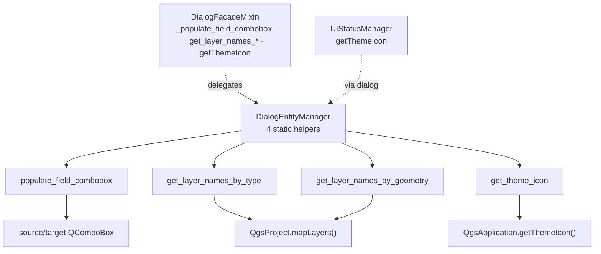

---
tags:
  - secinterp
  - code-walkthrough
  - gui
  - utils
aliases:
  - main_dialog_utils.py
  - DialogEntityManager
cssclass: secinterp-note
---

# `gui/main_dialog_utils.py`

> [!abstract] One-line summary
> `DialogEntityManager`: four static helpers isolating access to QGIS entities (layer fields, names by type/geometry, theme icons) so the dialog facade never calls `QgsProject` directly.

**Path**: `gui/main_dialog_utils.py` (50 lines)
**Main class**: `DialogEntityManager` (static methods only)
**Layer**: GUI (Extract helpers · QGIS-dependent)
**Tags**: #secinterp #gui #utils

---

## 🎯 Why does this file exist?

Pages and the facade need to list layers, read fields and fetch icons. Without this module, every caller would repeat `QgsProject.instance().mapLayers()` and `QgsApplication.getThemeIcon` with its own filters:

| Problem | Solution |
|---------|----------|
| `QgsProject` queries scattered across the dialog | Two filtered listings in one place |
| Field-combo filling with repeated loops | Reusable `populate_field_combobox(source, target)` |
| Theme icons requested with hardcoded paths | `get_theme_icon(name)` as the single resolution point |
| The facade needs these operations with no inheritance | Static-only class: used without instantiation or MRO mixing |

> [!important] Architectural note
> This is the GUI's thinnest "Extract" edge: it converts live QGIS objects (layers, fields) into **primitives** (`list[str]`, `QIcon`) at the boundary, so consumers work with simple data. It imports nothing from `core/` or managers — only `qgis.core` and Qt.

---

## 🧬 Relationship diagram



> [!tip] How to read
> Solid arrow = calls; dashed = delegation from the facade and the status manager, the two real consumers.

---

## 📦 Imports — architectural reading

```python
# gui/main_dialog_utils.py
from __future__ import annotations

from qgis.core import QgsApplication, QgsMapLayer, QgsProject, QgsWkbTypes
from qgis.PyQt.QtGui import QIcon
```

| # | Observation |
|---|-------------|
| ① | Imports `QgsProject` (live layer registry) and `QgsApplication` (theme icons): the only two QGIS doors it needs. |
| ② | `QgsMapLayer.LayerType` and `QgsWkbTypes.GeometryType` appear **only as parameter types**: filtering is expressed in QGIS vocabulary, with no home-grown enums. |
| ③ | `QIcon` is the only Qt return type; the rest is `None` or `list[str]`: primitives out, QGIS in. |

---

## 🏗️ Structure inventory

**Classes:** `class DialogEntityManager` — 4 static methods, no `__init__`, no attributes.

| Method | Signature | Role |
|---|---|---|
| `populate_field_combobox` | `(source_combobox, target_combobox) -> None` | Copies field names into the target combo |
| `get_layer_names_by_type` | `(layer_type: QgsMapLayer.LayerType) -> list[str]` | Layer names by type (raster/vector/…) |
| `get_layer_names_by_geometry` | `(geometry_type: QgsWkbTypes.GeometryType) -> list[str]` | Vector names by geometry |
| `get_theme_icon` | `(name: str) -> QIcon` | Icon from the active QGIS theme |

---

## 📁 Where it lives inside `gui/`

| Neighbor | Relationship with this module |
|---|---|
| [[main_dialog]] | The facade (`DialogFacadeMixin`) wraps all four helpers as dialog methods |
| [[main_dialog_config]] | `UIConstants.ICON_*` provides the names `get_theme_icon` resolves |
| [[ui_status_manager]] | Requests icons via `dialog.getThemeIcon`, which ends here |
| [[main_window]] | The window builds the sidebar with same-theme icons |

---

## 📖 Method-by-method walkthrough

### `populate_field_combobox` — layer fields into a combo

```python
@staticmethod
def populate_field_combobox(source_combobox, target_combobox) -> None:
    """Populate a combobox with field names from a selected vector layer."""
    layer = source_combobox.currentLayer()
    target_combobox.clear()
    if layer:
        fields = [field.name() for field in layer.fields()]
        target_combobox.addItems(fields)
```

Minimal protocol: the source combo exposes `currentLayer()` (`QgsMapLayerComboBox` does). It always clears the target first, so switching layers never leaves ghost fields. With no layer, the target stays empty but valid — no exceptions.

> [!note] Untyped parameters on purpose
> Combos are implicitly `Any`: the method only requires duck typing (`currentLayer`, `clear`, `addItems`), which admits real combos and test doubles without importing `qgis.gui`.

### `get_layer_names_by_type` — layers by type

```python
@staticmethod
def get_layer_names_by_type(layer_type: QgsMapLayer.LayerType) -> list[str]:
    """Get a list of layer names filtered by the specified layer type."""
    return [
        layer.name()
        for layer in QgsProject.instance().mapLayers().values()
        if layer.type() == layer_type
    ]
```

Walks the project's live registry and returns **names only**, never the layers. That is the Extract decision: listing retains no references to QGIS objects that could later cross threads or caches.

### `get_layer_names_by_geometry` — vectors by geometry

```python
@staticmethod
def get_layer_names_by_geometry(
    geometry_type: QgsWkbTypes.GeometryType,
) -> list[str]:
    """Get a list of layer names filtered by the specified geometry type."""
    return [
        layer.name()
        for layer in QgsProject.instance().mapLayers().values()
        if (
            layer.type() == QgsMapLayer.LayerType.VectorLayer
            and layer.geometryType() == geometry_type
        )
    ]
```

Double filter: vector first, then geometry (`Point`, `LineString`, `Polygon`). It feeds the section-line, outcrop and structure selectors: each page requests exactly the geometry it accepts, and incompatible layers never show up.

### `get_theme_icon` — active-theme icon

```python
@staticmethod
def get_theme_icon(name: str) -> QIcon:
    """Get a theme icon from QGIS."""
    return QgsApplication.getThemeIcon(name)
```

One line centralizing theming: if QGIS switches icon sets, the whole plugin follows with no code change. Names (`"mIconRaster.svg"`, `"mMessageLogCritical.svg"`) come from [[main_dialog_config]] and the pages.

---

## 🔌 Consumption from the facade (proxies)

The dialog never calls `DialogEntityManager` from pages directly: `DialogFacadeMixin` wraps it to offer a uniform API on `self.dialog`:

```python
# gui/dialog_facade_mixin.py — real proxies
def _populate_field_combobox(self, source_combobox: Any, target_combobox: Any) -> None:
    DialogEntityManager.populate_field_combobox(source_combobox, target_combobox)

def get_layer_names_by_type(self, layer_type) -> list[str]:
    return DialogEntityManager.get_layer_names_by_type(layer_type)

def get_layer_names_by_geometry(self, geometry_type) -> list[str]:
    return DialogEntityManager.get_layer_names_by_geometry(geometry_type)

def getThemeIcon(self, name: str) -> Any:
    return DialogEntityManager.get_theme_icon(name)
```

Four proxies, one rule: the facade maps `self.method(...)` → `DialogEntityManager.method(...)`, and [[ui_status_manager]] reaches the same place via `dialog.getThemeIcon`. A single road to `QgsProject` and `QgsApplication`, four entry doors.

## 📐 Filter matrix per page

| Page | Helper used | Effective filter |
|---|---|---|
| DEM / Raster | `get_layer_names_by_type(RasterLayer)` | Raster layers (`DEFAULT_BAND` band) |
| Section Line | `get_layer_names_by_geometry(LineString)` | Lines only |
| Geology | `get_layer_names_by_geometry(Polygon)` | Outcrop polygons only |
| Structural | `get_layer_names_by_geometry(Point)` | Measurement points only |
| Drillholes | `populate_field_combobox` + listings | Collar/survey/interval layers and their fields |
| Sidebar and indicators | `get_theme_icon("m*.svg")` | Active-theme icons |

> [!tip] Each page requests what it accepts
> Filtering happens at listing time, not at validation: an incompatible layer never appears as an option. `InputManager` validates the choice; here the eligible set is trimmed.

---

## 🔄 Data flow

| Phase | Input | Transformation | Output |
|---|---|---|---|
| Layer pick | Source combo `currentLayer()` | `[f.name() for f in layer.fields()]` | Text items in the target combo |
| Listing | `QgsProject.instance().mapLayers()` | Filter by `type()` and/or `geometryType()` | `list[str]` of names |
| Icon | `"m*.svg"` name | `QgsApplication.getThemeIcon(name)` | `QIcon` from the active theme |
| Consumption | Primitives (`str`, `QIcon`) | Facade and pages present them | Combos, sidebars, indicators |

---

## 🏛️ Design patterns present

| Pattern | Where | Purpose |
|---|---|---|
| **Static utility class** | `DialogEntityManager` | Group helpers with no state or instance |
| **Extract (thin edge)** | Both listings | Turn the live QGIS registry into `list[str]` |
| **Duck typing** | `populate_field_combobox` | Accept any combo with `currentLayer` |
| **Theme indirection** | `get_theme_icon` | Names instead of icon paths |

---

## 🧾 API summary

| Symbol | Signature | Typical use |
|---|---|---|
| `DialogEntityManager` | 4 statics | `DialogEntityManager.get_theme_icon("mIconRaster.svg")` |
| `populate_field_combobox` | `(source, target) -> None` | Refresh the field combo on layer change |
| `get_layer_names_by_type` | `(LayerType) -> list[str]` | List rasters or vectors |
| `get_layer_names_by_geometry` | `(GeometryType) -> list[str]` | List lines / points / polygons |
| `get_theme_icon` | `(str) -> QIcon` | Sidebar and indicator icons |

---

## 🛡️ Error handling

Silent-degradation philosophy: with no selected layer, the target combo stays empty; with no project layers, listings return `[]`. No method raises on missing data — validation that must fail lives in `InputManager` with [[main_dialog_config]] messages. The only possible failure is operational (project closed mid-iteration), outside a helper's scope.

---

## 🧪 Associated tests

There is no dedicated `tests/gui/test_main_dialog_utils.py`; stated plainly. Coverage is indirect:

- `tests/gui/test_main_dialog_core.py` — the facade wrapping these helpers runs at dialog construction.
- `tests/gui/test_dem_page.py`, `test_drillhole_page.py` — pages listing layers and filling fields.
- `tests/gui/test_message_manager.py` — dialog icons and messaging.

A dedicated test with a mocked `QgsProject` (two fake layers per type) would cover all four methods in about 30 lines.

---

## 👀 Observations and notes

> [!success] Strengths
> - 50 lines, zero state, zero plugin dependencies: the cheapest module to maintain in `gui/`.
> - Returns primitives, not live layers: honors the Extract edge unforced.
> - Duck-typed combos: testable without `qgis.gui`.

> [!warning] Points of attention
> - Untyped combos (`source_combobox` with no annotation) hurt autocomplete; a `Protocol` with `currentLayer` would cost two lines.
> - Iterates the whole `mapLayers()` per call: with hundreds of layers and per-keystroke calls it could show; no caching.
> - `get_theme_icon` never validates the name: a typo returns a silent null icon.

> [!question] Open questions
> - Add `test_main_dialog_utils.py` with a mocked project?
> - Type combos with a minimal `Protocol` (`currentLayer`, `clear`, `addItems`)?

---

## 🔗 Related notes

- [[Index]] — vault index
- [[main_dialog]] — facade wrapping these four helpers
- [[dialog_facade_mixin]] — `_populate_field_combobox`, `get_layer_names_*`, `getThemeIcon`
- [[main_dialog_config]] — `UIConstants.ICON_*`, names resolved here
- [[ui_status_manager]] — icon consumer via `dialog.getThemeIcon`
- [[main_window]] — sidebar built with same-theme icons
- [[dem_page]] / [[section_page]] / [[geology_page]] — pages listing layers and fields

---

*Note of the SecInterp Code Walkthrough v2 vault — v3.8.0*
