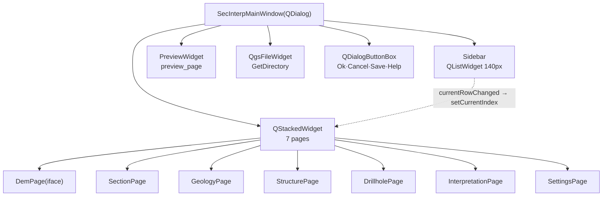

---
tags:
  - secinterp
  - code-walkthrough
  - gui
  - ui
aliases:
  - main_window.py
  - SecInterpMainWindow
cssclass: secinterp-note
---

# `gui/ui/main_window.py`

> [!abstract] One-line summary
> `SecInterpMainWindow`: the programmatic `QDialog` assembling sidebar, seven stacked pages and preview in a three-pane `QSplitter`, with a premium stylesheet and `currentRowChanged` navigation.

**Path**: `gui/ui/main_window.py` (158 lines)
**Main class**: `SecInterpMainWindow(QDialog)`
**Layer**: GUI (programmatic UI · no `.ui`, no `core/`)
**Tags**: #secinterp #gui #ui

---

## 🎯 Why does this file exist?

The plugin uses no Qt Designer or compiled `.ui` files: the whole window is built in code to control theme, proportions and navigation. This module is the visual skeleton onto which `SecInterpDialog` adds managers:

| Problem | Solution |
|---------|----------|
| Seven configuration pages competing for space | `QStackedWidget` + navigation sidebar |
| Preview needs maximum space without crushing settings | Three-pane horizontal `QSplitter` with 0/0/1 stretches |
| Navigation coupled to next/previous buttons | Direct `sidebar.currentRowChanged → stacked.setCurrentIndex` |
| Leaks from signals connected and never disconnected | `disconnect_signals()` with `contextlib.suppress` |
| Output folder separate from the page flow | Bottom row with `QgsFileWidget` in directory mode |

> [!important] Architectural note
> Deliberately **dumb window**: no validation, no computation, no persistence. It only assembles widgets and forwards the navigation index. Intelligence lives in [[main_dialog]] and its managers; here there is only layout, style and two signals.

---

## 🧬 Relationship diagram



> [!tip] How to read
> Solid arrow = contains/builds; dashed = the only logical connection (navigation). Everything else is static containment.

---

## 📦 Imports — architectural reading

```python
# gui/ui/main_window.py
from __future__ import annotations

import contextlib
from typing import Any

from qgis.gui import QgsFileWidget
from qgis.PyQt.QtCore import Qt
from qgis.PyQt.QtWidgets import (
    QDialog,
    QDialogButtonBox,
    QHBoxLayout,
    QLabel,
    QSplitter,
    QStackedWidget,
    QVBoxLayout,
    QWidget,
)

from .pages.dem_page import DemPage                        # ①
from .pages.drillhole_page import DrillholePage
from .pages.geology_page import GeologyPage
from .pages.interpretation_page import InterpretationPage
from .pages.preview_page import PreviewWidget
from .pages.section_page import SectionPage
from .pages.settings_page import SettingsPage
from .pages.structure_page import StructurePage
from .sidebar import Sidebar
```

| # | Observation |
|---|-------------|
| ① | All eight page/sidebar pieces use relative imports (`.pages.*`, `.sidebar`): internal parts of `gui/ui`, not public API. |
| ② | `QgsFileWidget` is the only QGIS widget: a native folder picker with `GetDirectory` mode, no custom browsing code. |
| ③ | `contextlib` serves only `disconnect_signals`: suppressing `TypeError/RuntimeError` when disconnecting dead signals. |
| ④ | Zero imports from `core/` or managers: the window does not know `PreviewService` or `InputManager` exist. |

---

## 🏗️ Structure inventory

**Classes:** `class SecInterpMainWindow(QDialog)` — 3 methods.

| Method | Role |
|---|---|
| `__init__(iface=None, parent=None)` | Title, size, widgets, pages, assembly and signals |
| `_setup_ui()` | Layout, styled splitter, output row, sidebar items |
| `_connect_signals()` | A single navigation connection |
| `disconnect_signals()` | Defensive anti-leak disconnection |

Attributes created in `__init__`: `sidebar`, `stacked_widget`, `preview_widget`, `output_widget`, `button_box`, `page_dem`, `page_section`, `page_geology`, `page_struct`, `page_drillhole`, `page_interpretation`, `page_settings`.

---

## 📁 Where it lives inside `gui/ui/`

| Neighbor | Relationship with this module |
|---|---|
| [[sidebar]] (`ui/sidebar.py`) | Side navigation used here |
| [[preview_page]] (`ui/pages/preview_page.py`) | Right panel: `PreviewWidget` |
| [[settings_page]] (`ui/pages/settings_page.py`) | Last page of the stack |
| [[dem_page]], [[section_page]], [[geology_page]], [[structure_page]], [[drillhole_page]], [[interpretation_page]] | Stack pages 1–6 |
| [[main_dialog]] (`gui/main_dialog.py`) | Subclass via mixins: adds managers and lifecycle |

---

## 📖 Method-by-method walkthrough

### `__init__` — identity and parts

```python
def __init__(self, iface: Any | None = None, parent: QWidget | None = None) -> None:
    super().__init__(parent)
    self.setWindowTitle(self.tr("Sec Interp"))
    self.resize(1200, 700)

    # Initialize UI components
    self.sidebar = Sidebar()
    self.stacked_widget = QStackedWidget()
    self.preview_widget = PreviewWidget()
    self.output_widget = QgsFileWidget()

    flags = QDialogButtonBox.StandardButton.Ok | QDialogButtonBox.StandardButton.Cancel
    flags |= QDialogButtonBox.StandardButton.Save | QDialogButtonBox.StandardButton.Help
    self.button_box = QDialogButtonBox(flags)

    # Initialize Pages
    self.page_dem = DemPage(iface)
    self.page_section = SectionPage()
    self.page_geology = GeologyPage()
    self.page_struct = StructurePage()
    self.page_drillhole = DrillholePage()
    self.page_interpretation = InterpretationPage()
    self.page_settings = SettingsPage()

    self._setup_ui()
    self._connect_signals()
```

Only `DemPage` receives `iface` (it needs the project to list rasters); the remaining pages are self-contained. The `button_box` combines `Ok|Cancel|Save|Help`: `Save` and `Help` are wired later by `SignalManager` (see [[main_dialog]]). Fixed title and initial size: 1200×700, landscape to give the preview room.

### `_setup_ui` — the three-pane splitter

```python
def _setup_ui(self) -> None:
    main_layout = QVBoxLayout(self)
    main_layout.setContentsMargins(5, 5, 5, 5)
    main_layout.setSpacing(5)

    # -- Main Content Area: Splitter [Sidebar | Settings | Preview] --
    splitter = QSplitter(Qt.Orientation.Horizontal)
    splitter.setHandleWidth(6)  # Nominal width
    splitter.setChildrenCollapsible(True)

    # Style the splitter handle to be visible and indicate interaction
    splitter.setStyleSheet("""
        QSplitter::handle {
            background-color: #e0e0e0;
            border: 1px solid #c0c0c0;
            margin: 1px;
            border-radius: 2px;
        }
        QSplitter::handle:hover {
            background-color: #d0d0d0;
            border-color: #a0a0a0;
        }
        QSplitter::handle:pressed {
            background-color: #b0b0b0;
            border-color: #808080;
        }
    """)

    # 1. Left: Sidebar
    splitter.addWidget(self.sidebar)

    # 2. Middle: Settings (Stacked Pages)
    self.stacked_widget.addWidget(self.page_dem)
    self.stacked_widget.addWidget(self.page_section)
    self.stacked_widget.addWidget(self.page_geology)
    self.stacked_widget.addWidget(self.page_struct)
    self.stacked_widget.addWidget(self.page_drillhole)
    self.stacked_widget.addWidget(self.page_interpretation)
    self.stacked_widget.addWidget(self.page_settings)

    splitter.addWidget(self.stacked_widget)

    # 3. Right: Preview Widget
    splitter.addWidget(self.preview_widget)

    # Set Splitter Stretches (Sidebar minimal, Settings medium, Preview expanding)
    splitter.setStretchFactor(0, 0)
    splitter.setStretchFactor(1, 0)  # Settings doesn't need to hog space
    splitter.setStretchFactor(2, 1)  # Preview gets the rest

    # Make settings panel collapsible
    splitter.setCollapsible(1, True)

    main_layout.addWidget(splitter, stretch=10)
```

| Decision | Effect |
|---|---|
| 6px handle with its own QSS (normal/hover/pressed) | The divider is visible and suggests dragging; "premium" feel independent of the OS style |
| `setChildrenCollapsible(True)` + `setCollapsible(1, True)` | The settings panel can hide entirely, yielding everything to preview |
| Stretches 0/0/1 | Sidebar and settings keep their size; **all** extra space goes to preview |
| `addWidget` order sidebar → stack → preview | The stack index (0–6) matches the sidebar row |

Insertion order into the `stacked_widget` is an implicit contract with the sidebar: row N shows page N. Adding a page requires adding its item at the same position (see below).

### Bottom row and sidebar population

```python
    out_layout = QHBoxLayout()
    out_layout.addWidget(QLabel(self.tr("Output Folder")))

    self.output_widget.setStorageMode(QgsFileWidget.StorageMode.GetDirectory)
    out_layout.addWidget(self.output_widget)

    main_layout.addLayout(out_layout)
    main_layout.addWidget(self.button_box)

    # Populate sidebar
    self.sidebar.add_item(self.tr("DEM / Raster"), "mIconRaster.svg")
    self.sidebar.add_item(self.tr("Section Line"), "mIconLineLayer.svg")
    self.sidebar.add_item(self.tr("Geology"), "mIconPolygonLayer.svg")
    self.sidebar.add_item(self.tr("Structural"), "mIconPointLayer.svg")
    self.sidebar.add_item(self.tr("Drillholes"), "mActionDataSourceManager.svg")
    self.sidebar.add_item(self.tr("Interpretation"), "mActionEdit.svg")
    self.sidebar.add_item(self.tr("Settings"), "mActionOptions.svg")

    self.sidebar.setCurrentRow(0)
```

Each item pairs a translated label (`self.tr(...)`) with a QGIS theme icon, in stack order. `setCurrentRow(0)` opens on DEM/Raster. The output folder stays outside the stack on purpose: it is transversal to every page.

### `_connect_signals` and `disconnect_signals` — navigation without leaks

```python
def _connect_signals(self) -> None:
    """Connect navigation signals."""
    self.sidebar.currentRowChanged.connect(self.stacked_widget.setCurrentIndex)

def disconnect_signals(self) -> None:
    """Disconnect all signals to prevent memory leaks."""
    with contextlib.suppress(TypeError, RuntimeError):
        self.sidebar.currentRowChanged.disconnect(self.stacked_widget.setCurrentIndex)
    with contextlib.suppress(TypeError, RuntimeError):
        self.output_widget.fileChanged.disconnect(self.update_button_state)
```

Navigation is one mediator-free signal→slot connection: `currentRowChanged(int)` fits `setCurrentIndex(int)`. On disconnect, the second block references `self.update_button_state`, which does **not** exist on this class: it resolves through the MRO on the full dialog ([[dialog_facade_mixin]] provides it). It works because `disconnect_signals` is only ever called on `SecInterpDialog`, but it couples this window to a method it never declares.

---

## 🔄 Data flow

| Phase | Input | Transformation | Output |
|---|---|---|---|
| Construction | `iface` (only to `DemPage`) | Seven pages + sidebar + preview + output | Widget tree |
| Navigation | `currentRowChanged(int)` | Direct `setCurrentIndex(int)` | Visible page |
| Output | Chosen directory | `QgsFileWidget` in `GetDirectory` mode | Path for `InputManager`/`ExportManager` |
| Close | `closeEvent` (mixin) | Defensive `disconnect_signals()` | No dangling connections |

---

## 📐 Geometry and proportions

| Element | Measure | Intent |
|---|---|---|
| Initial window | 1200 × 700 | Landscape: wide preview from the first frame |
| Sidebar | Fixed 140px | Stable column, immune to splitter resizing |
| Splitter handle | 6px + custom QSS | Visible and draggable, OS-style independent |
| Margins / spacing | 5px / 5px | Minimal air, professional-tool density |
| Stretches | 0 / 0 / 1 | Sidebar and settings keep size; all extra goes to preview |
| Splitter in layout | `stretch=10` | Fills the area; output and buttons keep minimal height |

> [!note] Resizing
> On grow, only the preview grows (stretch 1 vs 0/0). On shrink, the settings panel collapses first (`setCollapsible(1, True)`) before the preview is clipped.

---

## 🌐 i18n: `self.tr()` on every literal

Title (`"Sec Interp"`), `"Output Folder"` and all seven sidebar labels go through `self.tr()`, inherited from `QDialog` via `qgis.PyQt`. Icon names stay untranslated (theme keys, not prose). Pages translate their own content; the window only translates its shell.

---

## 🏛️ Design patterns present

| Pattern | Where | Purpose |
|---|---|---|
| **Programmatic UI (no Designer)** | Whole module | Full control of theme and proportions |
| **Stacked navigation** | Sidebar + `QStackedWidget` | Seven pages in the space of one |
| **Direct signal-slot** | `_connect_signals` | Navigation without mediators |
| **Guarded disconnect** | `contextlib.suppress` | Disconnect the already-dead without verbose `try/except` |

---

## 🧾 API summary

| Symbol | Signature / Inherits | Typical use |
|---|---|---|
| `SecInterpMainWindow` | `QDialog` | Base of `SecInterpDialog` via mixins |
| `__init__` | `(iface=None, parent=None)` | `SecInterpMainWindow(iface, parent)` |
| `_setup_ui` | `() -> None` | Assembles splitter, output and sidebar |
| `_connect_signals` | `() -> None` | Sidebar → stack navigation |
| `disconnect_signals` | `() -> None` | Cleanup on `closeEvent` |
| `page_dem…page_settings` | Seven pages | Surface packed into `Pages` |
| `preview_widget` / `output_widget` | `PreviewWidget` / `QgsFileWidget` | Manager anchors |

---

## 🛡️ Error handling

No explicit `try/except`: the defense is `contextlib.suppress(TypeError, RuntimeError)` on disconnect (already-disconnected signal or destroyed C++ object). No index or page validation: it trusts the sidebar↔stack order contract. Construction errors (e.g. invalid `iface` in `DemPage`) propagate to the caller, which is [[main_dialog]].

---

## 🧪 Associated tests

No dedicated `tests/gui/test_main_window.py`; honest, indirect coverage:

- `tests/gui/test_dem_page.py`, `test_drillhole_page.py`, `test_settings_page.py` — individual stack pages.
- `tests/gui/test_main_dialog_core.py` — builds the whole window via `SecInterpDialog`.
- `tests/gui/test_main_dialog_signals_wiring.py` — checks signal wiring after assembly.

---

## 👀 Observations and notes

> [!success] Strengths
> - 158 lines for a full 7-page window: high density, no rush.
> - One-line navigation, unbreakable by intermediate states.
> - Custom QSS on splitter and sidebar: visual identity without fighting the OS style.
> - Defensive `disconnect_signals`: closing twice never explodes.

> [!warning] Points of attention
> - `disconnect_signals` references `self.update_button_state`, missing on this class: implicit facade coupling via MRO.
> - The sidebar↔stack order is a contract with no assert: inserting a misaligned page breaks navigation silently.
> - `Save`/`Help` in the `button_box` are created here but wired in `SignalManager`: two files per button.

> [!question] Open questions
> - Add an assert or test freezing the sidebar↔stack order (7 items, same order)?
> - Move the `fileChanged` disconnect into `SignalManager` with the rest of the signals?

---

## 🔗 Related notes

- [[Index]] — vault index
- [[main_dialog]] — subclass adding managers, signals and lifecycle
- [[sidebar]] — side navigation widget
- [[preview_page]] — right panel of the splitter
- [[settings_page]] — last page of the stack
- [[dem_page]] / [[section_page]] / [[geology_page]] / [[structure_page]] / [[drillhole_page]] / [[interpretation_page]] — stack pages
- [[dialog_signal_manager]] — wires the `Save`/`Help` created here
- [[dialog_lifecycle_mixin]] — triggers the cleanup including `disconnect_signals`
- [[dialog_facade_mixin]] — provides `update_button_state` referenced in `disconnect_signals`
- [[gui_ui_pages]] — page index

---

*Note of the SecInterp Code Walkthrough v2 vault — v3.8.0*
