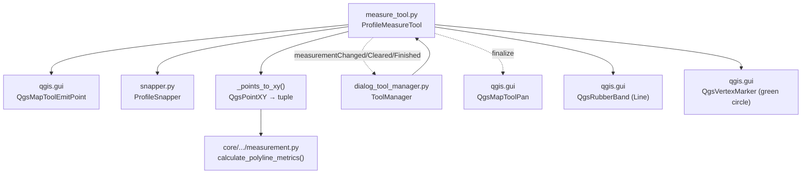

---
tags:
  - secinterp
  - code-walkthrough
  - gui
  - tools
aliases:
  - measure_tool.py
  - ProfileMeasureTool
cssclass: secinterp-note
---

# `gui/tools/measure_tool.py`

> [!abstract] One-line summary
> Multi-point measurement map tool for the profile: snapped polyline, metrics computed by the core's pure `calculate_polyline_metrics()`, and a lifecycle with a persistent finalized measurement.

**Path**: `gui/tools/measure_tool.py` (330 lines)
**Main class**: `ProfileMeasureTool(QgsMapToolEmitPoint)` + `_points_to_xy()` helper
**Layer**: GUI · Tools (events + visual rubber band; math is QGIS-agnostic in `core/`)
**Tags**: #secinterp #gui #tools

---

## 🎯 Why does this file exist?

Measuring on the profile (distance, elevation change, slope) requires drawing an interactive polyline with live metrics, while keeping the math testable without QGIS.

| Problem | Solution |
|---------|----------|
| Measure multi-segment distances/slopes on the canvas | `ProfileMeasureTool`: click adds points, movement emits metric previews |
| The math must not depend on `QgsPointXY` or the canvas | Core `calculate_polyline_metrics()` works on `list[tuple[float, float]]`; `_points_to_xy()` adapts |
| A confirmed measurement must stay visible when back on pan | `finalized`/`finalized_points` state: `reset()` keeps the rubber band and `finalize_measurement()` switches to `QgsMapToolPan` |
| The dialog must display, clear, and react to measurement end | Three signals: `measurementChanged(dict)`, `measurementCleared`, `measurementFinished` |

> [!important] Architectural note
> **UI vs. math** separation: the tool handles events, snapping, and the rubber band; `core/utils/geometry_utils/measurement.py` computes. The `_points_to_xy()` helper is the only seam between both worlds. Lifecycle is orchestrated by `ToolManager` ([[dialog_tool_manager]]), which wires the three signals to the preview widget.

---

## 🧬 Relationship diagram



> [!tip] How to read
> Solid arrow = imports/delegates; dashed = signal or tool switch. The computation (`MATH`) never sees a QGIS object: only tuples.

---

## 📦 Imports — architectural reading

```python
# gui/tools/measure_tool.py
from __future__ import annotations

import contextlib
from typing import Any

from qgis.core import (
    QgsPointXY,
    QgsWkbTypes,
)
from qgis.gui import (
    QgsMapCanvas,
    QgsMapToolEmitPoint,
    QgsMapToolPan,
    QgsRubberBand,
    QgsVertexMarker,
)
from qgis.PyQt.QtCore import Qt, pyqtSignal
from qgis.PyQt.QtGui import QColor

from sec_interp.core.utils.geometry_utils.measurement import calculate_polyline_metrics
from sec_interp.gui.tools.snapper import ProfileSnapper
from sec_interp.logger_config import get_logger
```

| # | Observation |
|---|-------------|
| ① | `contextlib` only for scene cleanup (`cleanup_finalized`, `reset`): the tools' "clean without breaking" pattern. |
| ② | `QgsMapToolPan` is imported for **self-deactivation**: on finalize, the tool builds a pan tool and installs it on the canvas. |
| ③ | The only tool importing a **compute function** (not a DTO) from the core: `calculate_polyline_metrics`. The legitimate exception to "GUI does not compute": it delegates to pure code. |
| ④ | `ProfileSnapper` by composition, like `ProfileInterpretationTool`: same snapping, different button semantics. |
| ⑤ | No `QCoreApplication.translate`, `datetime`, or `uuid`: a measurement creates no persistent entity, only ephemeral dicts. |

---

## 🏗️ Structure inventory

**Helper function (1):**

| Function | Signature | Role |
|---------|-------|------|
| `_points_to_xy` | `(points: list[QgsPointXY]) -> list[tuple[float, float]]` | Adapts QGIS points to pure math |

**Class (1):** `ProfileMeasureTool(QgsMapToolEmitPoint)` — 3 signals + 14 methods.

**Signals:**

| Signal | Payload | Reaction in `ToolManager` |
|-------|---------|---------------------------|
| `measurementChanged` | metrics `dict` | `update_measurement_display()` renders HTML |
| `measurementCleared` | — | `results_text.clear()` |
| `measurementFinished` | — | `btn_measure.setChecked(False)` |

**Internal state:**

| Attribute | Type | Role |
|----------|------|-----|
| `points` | `list[QgsPointXY]` | Vertices of the measurement in progress |
| `finalized` | `bool` | Measurement confirmed and frozen |
| `finalized_points` | `list[QgsPointXY]` | Copy of confirmed points (for display) |
| `rubber_band` | `QgsRubberBand \| None` | Red polyline (width 2) |
| `vertex_markers` | `list[QgsVertexMarker]` | Green circles (size 8, width 2) |
| `snapper` | `ProfileSnapper` | Shared snapping |
| `cursor` | `CrossCursor` | Crosshair while active |

**Methods:**

| Method | Signature | Role |
|--------|-------|------|
| `__init__` | `(canvas: QgsMapCanvas) -> None` | Empty state + snapper |
| `activate` / `deactivate` | `() -> None` | Cross cursor; `deactivate` does **not** reset (finalized output persists) |
| `disconnect_signals` | `() -> None` | Disconnects all 3 signals (`try/except TypeError`) |
| `cleanup_finalized` | `() -> None` | Full teardown on dialog close (hide + remove + empty) |
| `reset` | `() -> None` | If `finalized`: data-only clear; else full clear + `measurementCleared` |
| `canvasReleaseEvent` | `(event: Any) -> None` | Right resets; left adds (ignored when `finalized`) |
| `canvasMoveEvent` | `(event: Any) -> None` | Rubber band + metric preview (frozen when `finalized`) |
| `keyPressEvent` | `(event: Any) -> None` | `Enter` finalizes (≥ 2 points), `Escape` resets |
| `_add_point` | `(point: QgsPointXY) -> None` | Adds, marks, and emits metrics from 2 points on |
| `finalize_measurement` | `() -> None` | Freezes, redraws final band, switches to pan, emits `measurementFinished` |
| `_add_vertex_marker` | `(point: QgsPointXY) -> None` | Green circle per point |
| `_ensure_rubber_band` | `() -> None` | Creates the red line band if missing |
| `_update_rubber_band` | `(current_point: QgsPointXY) -> None` | Fixed points + moving cursor |
| `_calculate_and_emit_preview` | `(target_point: QgsPointXY) -> None` | Provisional metrics with cursor included |

---

## 📁 Files in the package

| File | Lines | Role |
|---|--:|---|
| `measure_tool.py` | 330 | This note: persistent multi-point measurement |
| `interpretation_tool.py` | 269 | Sibling: polygons with `polygonFinished` (DTO) |
| `snapper.py` | 112 | `ProfileSnapper` shared by both |
| `__init__.py` | — | Package marker |

---

## 📖 Method-by-method walkthrough

### `_points_to_xy`

```python
def _points_to_xy(points: list[QgsPointXY]) -> list[tuple[float, float]]:
    """Extract (x, y) tuples from QgsPointXY points for pure-math processing."""
    return [(p.x(), p.y()) for p in points]
```

The Extract seam: converts live geometry into plain data before calling the core. Thanks to it, `calculate_polyline_metrics()` is testable without QGIS (`tests/core/test_geometry_utils.py` and `tests/core/test_utils.py` exercise it with tuples).

### `activate` / `deactivate` (visual persistence)

```python
def deactivate(self) -> None:
    """Note: We no longer call reset() here to allow measurements to persist
    visually until a new one is started or explicitly cleared."""
    super().deactivate()
```

Key difference from the interpretation tool: deactivating does **not** clean up, so the finalized measurement stays drawn under the pan tool. Real cleanup happens in `reset()` (new measurement), `cleanup_finalized()` (close), or the manager's `toggle_measure_tool(False)`.

### `disconnect_signals` / `cleanup_finalized`

```python
def disconnect_signals(self) -> None:
    try:
        self.measurementChanged.disconnect()
        self.measurementCleared.disconnect()
        self.measurementFinished.disconnect()
    except TypeError:
        pass
```

Disconnects all three signals at once; if one had no slots, the `TypeError` aborts the `try` and the rest may stay connected (see risks). `cleanup_finalized()` is the heavy close-time artillery: it hides (`hide()`) and removes band and markers from the scene with `suppress(Exception)`, and empties `points`, `finalized_points`, and flags. Invoked by `_cleanup_map_tools()` in `dialog_lifecycle_mixin`.

### `reset` (dual behavior)

```python
if self.finalized:
    self.points = []
    self.finalized = False
    return  # visuals + results stay!
```

When finalized, `reset()` only empties `points` and lowers the flag: band, markers, and result text **remain**. Only the non-finalized "normal" reset tears down the scene and emits `measurementCleared`. This is the trick behind the "measure → finalize → measure again" loop without flicker.

### `canvasReleaseEvent` / `canvasMoveEvent`

Right-click means `reset()` (cancel everything; contrast with interpretation, where right-click only undoes one vertex). Left-clicks while `finalized` are ignored with a log `info`. On movement, `_calculate_and_emit_preview()` runs besides the rubber band: **provisional** metrics computed with `[*points, cursor]`, so the panel shows the live distance before clicking.

### `keyPressEvent`

`Enter`/`Return` finalizes with ≥ 2 points (`MIN_MEASURE_POINTS = 2`); `Escape` resets. Module style uses local UPPER_SNAKE constants.

### `_add_point`

```python
def _add_point(self, point: QgsPointXY) -> None:
    self.points.append(point)
    self._ensure_rubber_band()
    self.rubber_band.addPoint(point, True)
    self._add_vertex_marker(point)
    MIN_RELEVANT_POINTS = 2
    if len(self.points) >= MIN_RELEVANT_POINTS:
        metrics = calculate_polyline_metrics(_points_to_xy(self.points))
        self.measurementChanged.emit(metrics)
```

No anti-duplicate guard (unlike interpretation): two clicks on the same spot yield a zero-length segment, harmless to the metrics. Emits the full dict (`total_distance`, `horizontal_distance`, `elevation_change`, `avg_slope`, `segment_count`, `segments`, `point_count`), which `ToolManager.update_measurement_display()` formats to HTML.

### `finalize_measurement`

```python
self.finalized_points = self.points.copy()
self.finalized = True
metrics = calculate_polyline_metrics(_points_to_xy(self.points))
self.measurementChanged.emit(metrics)
if self.rubber_band:
    self.rubber_band.reset(QgsWkbTypes.GeometryType.LineGeometry)
    for point in self.finalized_points:
        self.rubber_band.addPoint(point, False)
    self.rubber_band.show()
pan_tool = QgsMapToolPan(self.canvas)
self.canvas.setMapTool(pan_tool)
self.measurementFinished.emit()
```

Freeze sequence: copy points, emit final metrics, **redraw** the band with fixed points only (removing the elastic cursor segment), switch to pan, and emit `measurementFinished` to uncheck the button. It is public: the preview "Finalizar" button calls it too. Under 2 points it logs a `warning` and does nothing.

### `_update_rubber_band` / `_calculate_and_emit_preview` / `_add_vertex_marker` / `_ensure_rubber_band`

Red `LineGeometry` band (`255,0,0`, width 2), green circle markers (`0,255,0`, size 8, width 2). The metric preview builds `temp_points = [*self.points, target_point]` without mutating state: the cursor joins the computation but never `points`.

### Metrics-dict keys (what the panel consumes)

`calculate_polyline_metrics()` always returns the same keys, even with < 2 points (all zeroed):

| Key | Meaning | Unit |
|-------|-------------|--------|
| `total_distance` | Accumulated 2D length of all segments | m (profile units) |
| `horizontal_distance` | Sum of `dx` (horizontal reach) | m |
| `elevation_change` | `y_last − y_first` (signed) | m |
| `avg_slope` | Average slope | degrees |
| `segment_count` | `len(points) − 1` | count |
| `segments` | Per-segment detail (`distance`, `dx`, `dy`) | list (panel ignores it today) |
| `point_count` | Vertices included | count |

> [!note] The panel filters on `point_count`
> `ToolManager.update_measurement_display()` drops dicts with fewer than 2 points and formats the rest to HTML (`total`, `horizontal`, signed `elevation_change`, `avg_slope`). The `segments` list travels in the dict but is not displayed.

### Measurement vs. interpretation (same base, different semantics)

| Aspect | `ProfileMeasureTool` | `ProfileInterpretationTool` |
|---------|---------------------|----------------------------|
| Right-click | full `reset()` | drops only the last vertex |
| `deactivate()` | keeps visuals | full `reset()` |
| Confirm threshold | ≥ 2 points | ≥ 3 points |
| Output | ephemeral metrics `dict` | `InterpretationPolygon` DTO |
| Anti-duplicates | no | `compare(point, 1e-6)` |
| Self-stand-down | switches to `QgsMapToolPan` | no (manager deactivates) |

> [!tip] Where each behavior lives
> The shared semantics (snapper, rubber band, `disconnect_signals`, `suppress` cleanup) follow the common tool pattern; the differing semantics (right-click role, persistence on deactivate, output type) are why two classes exist instead of one parameterized class.

> [!note] Local threshold constants
> `MIN_MEASURE_POINTS = 2` (confirm) and `MIN_RELEVANT_POINTS = 2` (emit) appear as uppercase locals in `keyPressEvent`, `_add_point`, and `finalize_measurement`. Same value, three places: unifying them into one class constant would prevent future drift.
> Logging distinguishes the three moments (`Point N added`, `finalize_measurement called`, `Measurement finalized` with total distance), handy for debugging lost measurements.
> See also [[dialog_lifecycle_mixin]] (`_cleanup_map_tools` invokes `cleanup_finalized()`) and [[preview_page]] for the Finalize button.
> Without `cleanup_finalized()`, each dialog reopening would leave an orphan red band on the canvas.

---

## 🔄 Data flow

| Phase | Input | Transformation | Output |
|-------|-------|----------------|--------|
| Activation | `ToolManager.toggle_measure_tool(True)` | `reset()` + `setMapTool` + Finalize button shown | tool ready |
| Tracing | clicks (pixels) | `snap()` → `QgsPointXY` → `_points_to_xy()` → core | live `measurementChanged(dict)` |
| Preview | mouse movement | `[*points, cursor]` → provisional metrics | draft dict in the panel |
| Finalization | `Enter` / button (≥ 2 points) | copy + redraw + pan + `measurementFinished` | frozen, still visible measurement |
| New measurement | toggle again | `reset()` keeps visuals; next click starts fresh | repeatable cycle |
| Close | dialog close | `cleanup_finalized()` | orphan-free scene |

---

## 🏛️ Design patterns present

| Pattern | Where | Purpose |
|---------|-------|---------|
| **Map Tool (QGIS)** | `QgsMapToolEmitPoint` inheritance | Standard canvas events |
| **Observer (3 signals)** | `measurementChanged/Cleared/Finished` | Progress, cleanup, and end observable by the manager |
| **Adapter** | `_points_to_xy()` | QGIS → pure math (Extract) |
| **Composition** | `ProfileSnapper` + core function | Reusable snapping and math |
| **State flag** | `finalized` / `finalized_points` | Visual persistence after confirmation |
| **Self-deactivation** | `finalize_measurement()` installs `QgsMapToolPan` | The tool stands down on completion |

---

## 🧾 API summary

| Symbol | Signature / Inherits | Typical use |
|--------|----------------------|-------------|
| `ProfileMeasureTool` | `QgsMapToolEmitPoint` | `ProfileMeasureTool(canvas)` (created by `ToolManager`) |
| `measurementChanged` | `pyqtSignal(dict)` | Keys `total_distance`, `horizontal_distance`, `elevation_change`, `avg_slope`, `segment_count`, `point_count` |
| `measurementCleared` | `pyqtSignal()` | Clear `results_text` |
| `measurementFinished` | `pyqtSignal()` | Uncheck `btn_measure` |
| `finalize_measurement` | `() -> None` | Finalize button / `Enter` |
| `reset` / `cleanup_finalized` | `() -> None` | Restart / dialog close |
| `_points_to_xy` | `(list[QgsPointXY]) -> list[tuple]` | Core adapter |

---

## 🛡️ Error handling

| Situation | Behavior |
|-----------|----------|
| Finalize with < 2 points | `warning`, return, no signals |
| Click while finalized | Ignored with a log `info` |
| Movement while `finalized` or pointless | Early return, no rubber band or emissions |
| Destroyed scene objects | `suppress(Exception)` in `reset()` and `cleanup_finalized()` |
| Signal without slots in `disconnect_signals` | `except TypeError: pass` (see risk below) |

---

## 🧪 Associated tests

GUI coverage in `tests/gui/test_measure_tool.py` (`TestMeasureTool`, 337 lines, mocked canvas):

- `test_snapper_no_layers` plus patched-`QgsPointLocator` cases: snapping with no layers, with a valid layer, with failing or missing locators.
- Tool tests: adding points, `_calculate_and_emit_preview`, `finalize_measurement`, `reset()` in both states, `cleanup_finalized`, `disconnect_signals` in `tearDown`.

Pure math is covered in `tests/core/` with no QGIS: `test_geometry_utils.py` / `test_utils.py` for `calculate_polyline_metrics` (distances, elevation change, slope, < 2 points). Lifecycle integration in `tests/gui/test_main_dialog_tools.py` (via `ToolManager`).

---

## 👀 Observations and notes

> [!success] Strengths
> - 100% QGIS-agnostic, unit-testable math in the core; the tool only adapts and draws.
> - Live metric preview with the cursor included, without mutating state.
> - Persistent finalized measurement: the user contemplates it while panning.
> - Three sharply-defined signals (change / clear / finish).

> [!warning] Points of attention
> - `disconnect_signals()` uses a single `try` for three `disconnect()` calls: if the first raises `TypeError`, the other two are never attempted. Per-signal disconnect would be more robust.
> - No anti-duplicate guard: an accidental double-click creates a zero segment (harmless but pollutes `segment_count`).
> - `finalize_measurement()` builds a `QgsMapToolPan` without keeping a reference: the manager's previous pan tool is replaced outside its control.

> [!question] Open questions
> - Unify per-signal disconnect with `contextlib.suppress`, as `ToolManager.disconnect_signals()` does?
> - Also display per-segment metrics (`segments`) in the panel, currently ignored by `update_measurement_display()`?

---

## 🔗 Related notes

- [[Index]] — vault index
- [[gui_tools]] — family note for map tools
- [[dialog_tool_manager]] — wires the 3 signals and toggles measurement/pan/interpretation
- [[snapper]] — snapping shared with the interpretation tool
- [[interpretation_tool]] — sibling with different right-click semantics and DTO output
- [[measurement]] — `calculate_polyline_metrics()`: dict keys and math
- [[main_dialog]] — hosts canvas, buttons, and `results_text`
- [[preview_task_orchestrator]] — heavy compute lives in `QgsTask`; measuring is light interaction

---

*Note of the SecInterp Code Walkthrough v2 vault — v3.8.0*
