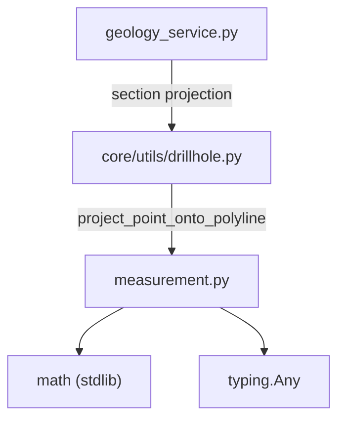

---
tags:
  - secinterp
  - code-walkthrough
  - core
  - utils
aliases:
  - measurement.py
  - project_point_onto_polyline
  - calculate_polyline_metrics
cssclass: secinterp-note
---

# `core/utils/geometry_utils/measurement.py`

> [!abstract] One-line summary
> Pure **geometric measurement** utilities for profiles: projects a point onto a polyline and computes aggregate metrics (total/horizontal distance, elevation change, average slope) without touching QGIS.

**Path**: `core/utils/geometry_utils/measurement.py` (136 lines)
**Main function**: `project_point_onto_polyline`, `calculate_polyline_metrics`
**Layer**: Core (QGIS-agnostic)
**Tags**: #secinterp #core #utils

---

## 🎯 Why does this file exist?

The profile viewer needs to measure distances along the section line and summarize the
terrain shape, but that computation must not depend on `QgsGeometry`:

| Problem | Solution |
|---------|----------|
| Project a drillhole/structure onto the section line without `QgsGeometry.closestSegmentWithContext` | `project_point_onto_polyline` with planar math |
| Summarize a profile shape (distance, elevation, slope) for the UI | `calculate_polyline_metrics` returns an aggregate dict |
| Run inside background threads (`QgsTask`) without QGIS objects | Only `math` + `(x, y)` tuples |

> [!important] Architectural note
> Fully QGIS-agnostic: no `qgis.*` import at all. Everything is `tuple[float, float]`
> and `dict`. Approximates projection with **planar math**, valid for projected CRS.

---

## 🧬 Relationship diagram



> [!tip] How to read
> `measurement` depends on nothing from the project: it is the geometry spreadsheet.
> `drillhole.py` imports it to project trajectories; the rest of core reaches it transitively.

---

## 📦 Imports — architectural reading

```python
# core/utils/geometry_utils/measurement.py
from __future__ import annotations

import math
from typing import Any
```

| # | Observation |
|---|-------------|
| ① | `math` (hypot, sqrt, atan, degrees) — all trigonometry is stdlib, no NumPy. |
| ② | `typing.Any` only for the flexible return type of the metrics dict. |
| ③ | **Zero project imports**: no coupling with `drillhole`, `sampling` or `domain`. |

> [!note] Deliberate "pure leaf" design
> Being the base of the stack (nobody below) makes it trivially testable and reusable from
> `drillhole.py` without import-cycle risk.

---

## 🏗️ Structure inventory

**Functions (2 public, 0 classes):**

- `project_point_onto_polyline(point, polyline) -> tuple[float, tuple[float, float]]`
- `calculate_polyline_metrics(points) -> dict[str, Any]`

**Local constants:**

- `MIN_POINTS_REQUIRED = 2` (inside `calculate_polyline_metrics`)

---

## 📁 Files in the package

| File | Lines | Role |
|---|--:|---|
| [[#measurementpy|measurement.py]] | 136 | Planar geometric measurement (projection + metrics) |

> [!note] Sub-package `geometry_utils/`
> Lives alongside [[optimization]] (simplification) and [[processing]] (densification /
> interpolation). See [[core_utils_geometry_utils]] for the namespace role.

---

## 📖 Method-by-method walkthrough

### `project_point_onto_polyline`

```python
def project_point_onto_polyline(
    point: tuple[float, float],
    polyline: list[tuple[float, float]],
) -> tuple[float, tuple[float, float]]:
    if not polyline:
        return 0.0, point
    if len(polyline) == 1:
        return 0.0, polyline[0]

    px, py = point
    best_dist_along = 0.0
    best_point = polyline[0]
    best_sq = float("inf")
    cumulative = 0.0

    for i in range(len(polyline) - 1):
        x1, y1 = polyline[i]
        x2, y2 = polyline[i + 1]
        dx = x2 - x1
        dy = y2 - y1
        seg_len = math.hypot(dx, dy)

        if seg_len == 0:
            nearest = (x1, y1)
            t = 0.0
        else:
            t = ((px - x1) * dx + (py - y1) * dy) / (dx * dx + dy * dy)
            t = max(0.0, min(1.0, t))
            nearest = (x1 + t * dx, y1 + t * dy)

        sq = (px - nearest[0]) ** 2 + (py - nearest[1]) ** 2
        if sq < best_sq:
            best_sq = sq
            best_dist_along = cumulative + t * seg_len
            best_point = nearest

        cumulative += seg_len

    return best_dist_along, best_point
```

Point-to-segment projection iterating over all segments. Returns `(distance_along_line,
nearest_point)`.
- `t` is the **parametric projection** of the point onto the segment, clamped to `[0, 1]`
  to stay inside the segment (does not extend the line).
- `seg_len == 0` avoids division by zero on duplicated vertices.
- Compares **squared** distances (`sq < best_sq`) to skip `sqrt` on every segment.
- `cumulative` accumulates length, so `dist_along` is the real position along the polyline,
  not on a single segment.

> [!tip] Edge cases
> Empty polyline → `(0.0, point)`; single vertex → `(0.0, polyline[0])`. No exceptions.

### `calculate_polyline_metrics`

```python
def calculate_polyline_metrics(points: list[tuple[float, float]]) -> dict[str, Any]:
    MIN_POINTS_REQUIRED = 2
    if len(points) < MIN_POINTS_REQUIRED:
        return {
            "total_distance": 0.0,
            "horizontal_distance": 0.0,
            "elevation_change": 0.0,
            "avg_slope": 0.0,
            "segment_count": 0,
            "segments": [],
            "point_count": len(points),
        }

    total_dist = 0.0
    total_dx = 0.0
    segments = []

    for i in range(len(points) - 1):
        p1 = points[i]
        p2 = points[i + 1]
        dx = abs(p2[0] - p1[0])
        dy = p2[1] - p1[1]
        seg_dist = math.sqrt(dx * dx + dy * dy)

        total_dist += seg_dist
        total_dx += dx
        segments.append({
            "distance": seg_dist,
            "dx": dx,
            "dy": dy,
            "start": (p1[0], p1[1]),
            "end": (p2[0], p2[1]),
        })

    elevation_change = points[-1][1] - points[0][1]

    avg_slope = 0.0
    if total_dx > 0:
        avg_slope = math.degrees(math.atan(abs(elevation_change) / total_dx))

    return {
        "total_distance": total_dist,
        "horizontal_distance": total_dx,
        "elevation_change": elevation_change,
        "avg_slope": avg_slope,
        "segment_count": len(segments),
        "segments": segments,
        "point_count": len(points),
    }
```

Aggregate profile summary. Return keys:
- `total_distance`: accumulated 3D length of all segments.
- `horizontal_distance`: sum of `|dx|` (X span).
- `elevation_change`: final elevation − initial elevation (sign preserved).
- `avg_slope`: `atan(|Δz| / Δx)` in degrees; `0` when no horizontal advance.
- `segments`: per-segment detail (distance, `dx`, `dy`, endpoints) for the UI.

> [!tip] `elevation_change` preserves sign
> Unlike `horizontal_distance` (always positive), elevation change uses
> `points[-1][1] - points[0][1]` **without `abs`**, to distinguish rise from fall.

---

## 📐 Mathematical foundation

### Point-to-segment projection

The parameter `t` comes from the vector dot product:

```
t = ((p − p1) · (p2 − p1)) / |p2 − p1|²
```

| Term | Meaning |
|------|---------|
| `(p2 − p1)` | segment direction vector |
| `(p − p1) · (p2 − p1)` | component of the point vector along the segment |
| `|p2 − p1|²` | normalization (squared length) |
| `max(0.0, min(1.0, t))` | projection clamped to the segment interior |

### Average slope

```
avg_slope = degrees(atan(|elevation_change| / total_dx))
```

- `total_dx` is the sum of `|dx|` (not the Euclidean distance along the profile).
- If `total_dx == 0` (vertical profile), `avg_slope` is set to `0` to avoid the
  `atan(∞)` indetermination.

### Worked example (3-4-5 triangle)

| Metric | Computation | Value |
|--------|-------------|-------|
| `total_distance` | `hypot(3, 4)` | `5.0` |
| `horizontal_distance` | `|3 − 0|` | `3.0` |
| `elevation_change` | `4 − 0` | `4.0` |
| `avg_slope` | `degrees(atan(4/3))` | `≈ 53.13°` |

---

## 🧮 Complexity and performance

| Operation | Complexity | Note |
|-----------|------------|------|
| `project_point_onto_polyline` | `O(n)` | traverses the `n − 1` segments once |
| `calculate_polyline_metrics` | `O(n)` | linear accumulation |

- Both are linear in the number of vertices, suitable for large profiles.
- The **squared** distance comparison avoids `sqrt` on every iteration.
- The natural companion is [[optimization]] (LOD) to reduce `n` before measuring.

---

## 🔄 Data flow

| Phase | Input | Transformation | Output |
|-------|-------|----------------|--------|
| Projection | `(x, y)` + polyline | per-segment parametric projection | `(dist_along, nearest_point)` |
| Metrics | list of `(x, y)` | per-segment accumulation + `atan` | 7-key dict |

**Real consumers:**

| Consumer | What it uses | Why |
|----------|--------------|-----|
| `drillhole.py::project_trajectory_to_section` | `project_point_onto_polyline` | place each 3D point onto the section |
| `preview_service` / profile UI | `calculate_polyline_metrics` | distance and slope labels |

---

## 🏛️ Design patterns present

| Pattern | Where | Purpose |
|---------|-------|---------|
| **Pure function** | both | Stateless, no side effects; deterministic and thread-safe |
| **Dictionary DTO** | `calculate_polyline_metrics` | Returns a by-convention typed dict, not an object |
| **Defensive early return** | both | Empty/short polylines without exceptions |
| **Micro-optimization** | `sq` comparison | Avoids `sqrt` in the inner loop |

---

## 🧾 API summary

| Symbol | Signature | Typical use |
|--------|-----------|-------------|
| `project_point_onto_polyline` | `(point, polyline) -> tuple[float, tuple[float, float]]` | Project a point onto the section line |
| `calculate_polyline_metrics` | `(points) -> dict[str, Any]` | Summarize profile shape for the UI |

---

## 🛡️ Error handling

No domain exceptions; everything is handled with **defensive returns**:

| Case | Behaviour |
|------|-----------|
| `polyline == []` | `project_point_onto_polyline` → `(0.0, point)` |
| `len(polyline) == 1` | → `(0.0, polyline[0])` |
| `len(points) < 2` | `calculate_polyline_metrics` → zeroed dict with real `point_count` |
| `total_dx == 0` | `avg_slope` → `0.0` (avoids division by zero) |

> [!warning] Does not validate units
> The function assumes a projected CRS (planar math). In geographic CRS (degrees) the
> results would be wrong; projecting is the caller's (GUI) responsibility.

---

## 🧪 Associated tests

`tests/core/test_geometry_utils.py` → `TestGeometryMeasurement`:

- `test_calculate_polyline_metrics_empty` — empty and single-point lists (`point_count`).
- `test_calculate_polyline_metrics_valid` — 3-4-5 triangle: `total_distance=5.0`,
  `horizontal_distance=3.0`, `elevation_change=4.0`, `avg_slope≈53.13°`.

> [!note] Indirect coverage
> `project_point_onto_polyline` is exercised via `tests/core/test_drillhole_utils.py`
> (trajectory projection), in addition to its use in `test_geometry_utils.py`.

---

## 🔬 Numerical precision and edge cases

| Case | Behaviour | Risk |
|------|-----------|------|
| Duplicated vertex (`seg_len == 0`) | `t = 0.0`, `nearest = (x1, y1)` | none, division skipped |
| `t` outside `[0, 1]` | clamped with `max/min` | avoids projecting beyond the segment |
| Very small distances | compares squares, not roots | less accumulated rounding error |
| `total_dx == 0` (vertical profile) | `avg_slope = 0.0` | undefined slope → 0 by convention |

> [!warning] Implicit units
> There is no tolerance parameter: the projection is **exact in floating point**. Inclusion
> tolerance (e.g. `buffer_width` in drillholes) is handled by callers.

---

## 👀 Observations and notes

> [!success] Strengths
> - QGIS-agnostic and dependency-free: easy to test and port.
> - Edge cases well covered (empty, single vertex, degenerate segments).
> - `(dist_along, nearest)` return reused directly by `drillhole.py`.

> [!warning] Points of attention
> - `calculate_polyline_metrics` returns `dict[str, Any]` without a typed DTO (`TypedDict`).
> - The planar-CRS assumption is not documented; use in degrees fails silently.
> - `avg_slope` is a **global** slope (first vs last point), not a per-segment average.

> [!question] Open questions
> - Migrate the metrics dict to a `TypedDict` (`PolylineMetrics`) in `core/types.py`?
> - Add optional geodetic `total_distance` for geographic CRS?
> - Expose `project_point_onto_polyline` from `core/utils/__init__.py` like the other pure
>   helpers, or keep it internal to `geometry_utils`?

---

## 🔗 Related notes

- [[Index]] — vault index
- [[drillhole]] — main consumer of `project_point_onto_polyline`
- [[optimization]] / [[processing]] — sibling modules in `geometry_utils/`
- [[core_utils_geometry_utils]] — sub-package namespace
- [[performance_metrics]] — performance metrics (applicable to these computations)

---

*Note of the SecInterp Code Walkthrough v2 vault — v3.9.0*
