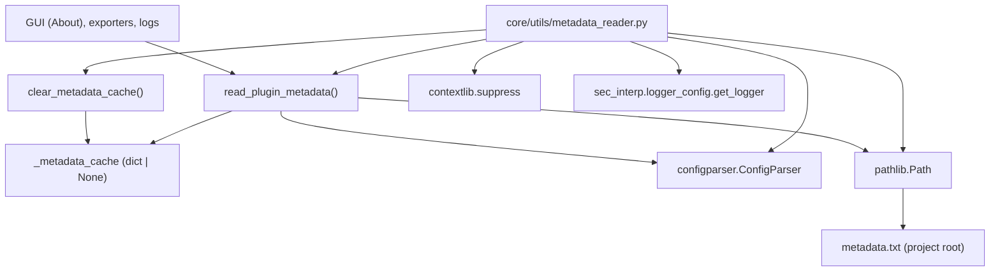

---
tags:
  - secinterp
  - code-walkthrough
  - core
  - utils
  - metadata
aliases:
  - metadata_reader.py
  - read_plugin_metadata
  - clear_metadata_cache
cssclass: secinterp-note
---

# `core/utils/metadata_reader.py`

> [!abstract] One-line summary
> Reads QGIS's standard `metadata.txt` with `ConfigParser` and exposes it as a cached dict, guaranteeing a **single source of truth** for the plugin's name, version, author and email.

**Path**: `core/utils/metadata_reader.py` (129 lines)
**Main function**: `read_plugin_metadata`
**Layer**: Core · Utilities (QGIS-agnostic)
**Tags**: #secinterp #core #utils #metadata

---

## 🎯 Why does this file exist?

The plugin's version, author and email are repeated in several places (About, UI,
logs, exporters). If each module hardcodes them, they drift out of sync with the
official `metadata.txt` that QGIS uses to publish the plugin.

| Problem | Solution |
|---------|----------|
| Version/author duplicated across modules | `read_plugin_metadata()` centralizes the `metadata.txt` read |
| Repeated file read on every call | Module-level cache (`_metadata_cache`) |
| Optional fields that may be absent | `contextlib.suppress` ignores them without breaking the read |
| Tests / hot updates | `clear_metadata_cache()` resets the cache |

> [!important] Architectural note — pure QGIS-agnostic
> Although it reads QGIS's `metadata.txt`, the module **does not import `qgis.*`**: it
> uses `configparser.ConfigParser` and `pathlib.Path` from the stdlib. It is fully
> testable without QGIS (Mock-first), as `tests/core/utils/test_metadata_reader.py` shows.

---

## 🧬 Relationship diagram



> [!tip] How to read
> `read_plugin_metadata` locates `metadata.txt` (via `Path`), parses it (`ConfigParser`)
> and caches the result. `clear_metadata_cache` invalidates the cache. Consumers only
> call `read_plugin_metadata`, never read the file directly.

---

## 📦 Imports — architectural reading

```python
# core/utils/metadata_reader.py
from __future__ import annotations

from configparser import ConfigParser
from contextlib import suppress
from pathlib import Path
from typing import TYPE_CHECKING

from sec_interp.logger_config import get_logger

if TYPE_CHECKING:
    pass

logger = get_logger(__name__)
```

| # | Observation |
|---|-------------|
| ① | `configparser.ConfigParser` reads the INI format of `metadata.txt` (section `[general]`). |
| ② | `contextlib.suppress` lets optional missing fields be ignored without noisy `try/except`. |
| ③ | `pathlib.Path` resolves the `metadata.txt` path portably (Windows/Linux/macOS). |
| ④ | `TYPE_CHECKING` with `pass`: a block ready for future annotations at no runtime cost. |
| ⑤ | `get_logger(__name__)` from `sec_interp.logger_config` (project, not stdlib) → centralized logging. |
| ⑥ | **Zero `qgis.*` imports** ⇒ the module is QGIS-agnostic. |

---

## 🏗️ Structure inventory

**Global state (1):**

- `_metadata_cache: dict[str, str] | None` — module-level cache to avoid repeated reads.

**Functions (2):**

- `read_plugin_metadata() -> dict[str, str]` — reads and caches the metadata.
- `clear_metadata_cache() -> None` — invalidates the cache.

**Logger (1):**

- `logger = get_logger(__name__)` — used for `error`, `exception` and `debug`.

---

## 📁 Files in the package

`metadata_reader.py` lives in `core/utils/`:

| File | Lines | Role |
|---|--:|---|
| [[metadata_reader]] | 129 | Reads `metadata.txt` (version, author) |
| [[io]] | 101 | Vector writing (`create_vector_writer`) |
| [[parsing]] | 222 | Strike/dip parsing, cardinal azimuth, attributes |
| [[rendering]] | 129 | Bounds, coordinate transform, intervals |
| [[safe_loader]] | 79 | Safe/lazy import loading |
| [[drillhole]] | 298 | Drillhole trajectory and projection |

> [!note] `metadata_reader` and `safe_loader` share the logger
> Both import `from sec_interp.logger_config import get_logger`, unlike the other pure
> utilities that do not log. See [[safe_loader]].

---

## 📖 Method-by-method walkthrough

### `read_plugin_metadata`

```python
def read_plugin_metadata() -> dict[str, str]:
    global _metadata_cache

    if _metadata_cache is not None:
        return _metadata_cache

    metadata_path = Path(__file__).parent.parent.parent / "metadata.txt"

    if not metadata_path.exists():
        msg = f"metadata.txt not found at {metadata_path}"
        logger.error(msg)
        raise FileNotFoundError(msg)

    parser = ConfigParser()
    try:
        parser.read(metadata_path, encoding="utf-8")
    except Exception as e:
        msg = f"Failed to parse metadata.txt: {e}"
        logger.exception(msg)
        raise ValueError(msg) from e

    required_fields = ["name", "version", "author", "email"]
    metadata = {}
    for field in required_fields:
        try:
            metadata[field] = parser.get("general", field)
        except Exception as e:
            msg = f"Required field '{field}' missing in metadata.txt"
            logger.exception(msg)
            raise ValueError(msg) from e

    optional_fields = ["description", "homepage", "repository", "about"]
    for field in optional_fields:
        with suppress(Exception):
            metadata[field] = parser.get("general", field)

    _metadata_cache = metadata
    logger.debug(f"Loaded plugin metadata: {metadata['name']} v{metadata['version']}")
    return metadata
```

The flow follows a **memoization + fail-fast** pattern:

1. **Cache hit** → returns the already-read dict without touching the disk.
2. **Locate** → `Path(__file__).parent.parent.parent / "metadata.txt"` goes up 2 levels from `core/utils/` to the project root.
3. **Existence** → if missing, `FileNotFoundError` with the exact path in the message.
4. **Parse** → `ConfigParser.read(..., encoding="utf-8")`; any error is wrapped in `ValueError` via `raise ... from e`.
5. **Required fields** → `name`, `version`, `author`, `email`; if one is missing, `ValueError`.
6. **Optional fields** → `description`, `homepage`, `repository`, `about`; absent ones are ignored with `suppress`.
7. **Cache and return**.

> [!tip] The path is relative to `__file__`, not the CWD
> `Path(__file__).parent.parent.parent` makes resolution **independent of the working
> directory**, robust both in development and when QGIS loads the plugin from the
> profile's plugin directory.

### `clear_metadata_cache`

```python
def clear_metadata_cache() -> None:
    global _metadata_cache
    _metadata_cache = None
    logger.debug("Metadata cache cleared")
```

Useful for tests (each `setUp`/`tearDown` calls it) and for when `metadata.txt` is
updated at runtime. It is the lever that makes the memoization testable.

---

## 🔄 Data flow

| Phase | Input | Transformation | Output |
|-------|-------|----------------|--------|
| Cache hit | `_metadata_cache` (dict) | direct return | `dict[str, str]` |
| Location | `Path(__file__)` | `.parent.parent.parent / "metadata.txt"` | absolute path |
| Parse | INI content | `ConfigParser.read(encoding="utf-8")` | sections/options |
| Required extraction | `[general]` name/version/author/email | `parser.get("general", field)` | required fields |
| Optional extraction | description/homepage/repository/about | `suppress(Exception)` | optional fields |
| Memoization | `metadata` | assignment to `_metadata_cache` | populated cache |

---

## 🏛️ Design patterns present

| Pattern | Where | Purpose |
|---------|-------|---------|
| **Memoization (cache-aside)** | `_metadata_cache` + early return | Avoid repeated file I/O |
| **Single source of truth** | centralized `metadata.txt` read | One definition of version/author |
| **Fail-fast + context** | `raise ... from e` | Preserve the original trace when wrapping errors |
| **Null-object-ish (suppress)** | `contextlib.suppress` on optionals | Ignore absences without noisy branches |
| **Module singleton state** | `_metadata_cache` global | State shared by the whole process |

---

## 🧾 API summary

| Symbol | Signature / Inherits | Typical use |
|--------|----------------------|-------------|
| `read_plugin_metadata` | `() -> dict[str, str]` | Get `name`, `version`, `author`, `email` (cached) |
| `clear_metadata_cache` | `() -> None` | Reset the cache (tests or hot reload) |

**Keys of the returned dict:**

| Key | Required | Description |
|-----|:---:|---|
| `name` | yes | Plugin name |
| `version` | yes | Version (e.g. `v3.8.0`) |
| `author` | yes | Author |
| `email` | yes | Contact email |
| `description` | no | Short description |
| `homepage` | no | Documentation URL |
| `repository` | no | Source code URL |
| `about` | no | "About" text |

---

## 📄 Structure of `metadata.txt`

The read file follows the standard INI format of QGIS plugins:

```ini
[general]
name=Sec Interp
version=3.8.0
author=Juan M Bernales
email=juanbernales@gmail.com
description=Data extraction for geological interpretation
homepage=https://...
repository=https://github.com/...
about=...long text...
```

| Element | Detail |
|---------|--------|
| Section | `[general]` — the only section read by the module |
| Encoding | `utf-8` (explicit in `parser.read`) |
| Delimiters | `=` (classic INI) |
| Comments | lines with `#` or `;` — `ConfigParser` ignores them |

> [!note] The GPL header of the `.py` is not part of the metadata
> `metadata_reader.py` keeps the inherited GPL/Plugin Builder header, but it is
> irrelevant to the logic: only the external `metadata.txt` matters.

---

## 🧠 Memoization: lifecycle

```python
if _metadata_cache is not None:   # ① cache hit
    return _metadata_cache
...
_metadata_cache = metadata        # ② cache write
```

| Moment | Cache state | Effect |
|--------|-------------|--------|
| First `read_plugin_metadata()` | `None` → reads and writes | 1 disk read |
| Later calls | dict → direct return | 0 disk reads |
| `clear_metadata_cache()` | `None` (reset) | next call re-reads |
| At process end | dict in memory | released with the interpreter |

> [!tip] Cost ≈ one read per process
> The file read happens **once** per QGIS process lifetime. Tests invalidate it
> explicitly to guarantee isolation.

---

## 🔎 Who consumes it?

| Consumer | Purpose |
|----------|---------|
| "About" dialog / UI | Show name, version and author |
| Exporters | Emit version metadata in the generated files |
| Logs | Annotate the plugin version at startup |

> [!note] Not imported in `core/utils/__init__.py`
> `metadata_reader` does not appear in the package re-exports; it is imported
> explicitly where needed (`from sec_interp.core.utils.metadata_reader import ...`).

---

## 🛡️ Error handling

| Case | Exception | Log |
|------|-----------|-----|
| `metadata.txt` missing | `FileNotFoundError` | `logger.error(msg)` |
| Parse failure | `ValueError` (from `Exception`) | `logger.exception(msg)` |
| Missing required field | `ValueError` (from `Exception`) | `logger.exception(msg)` |
| Missing optional field | — (suppressed) | — |

```python
# Preserve the original cause when wrapping
try:
    parser.read(metadata_path, encoding="utf-8")
except Exception as e:
    msg = f"Failed to parse metadata.txt: {e}"
    logger.exception(msg)
    raise ValueError(msg) from e
```

> [!tip] `raise ... from e` keeps the exception chain
> The original traceback (e.g. a `UnicodeDecodeError`) is not lost: it stays accessible
> via `__cause__`, easing diagnosis.

> [!warning] `except Exception` is deliberately broad
> Catching `Exception` in parsing and required fields normalizes **any** failure to
> `ValueError`, at the cost of losing granularity. It is pragmatic for a small config
> file, but hides the concrete cause until the log is inspected.

---

## 🧪 Associated tests

`tests/core/utils/test_metadata_reader.py` (104 lines, Mock-first, no QGIS):

- `test_read_plugin_metadata_success` — patches `Path` and `ConfigParser`; checks `name`, `version`, `author`, `email`, `homepage`.
- `test_read_plugin_metadata_file_not_found` — `exists() -> False` ⇒ `FileNotFoundError`.
- `test_read_plugin_metadata_missing_fields` — `parser.get` fails on `version` ⇒ `ValueError`.
- `test_integration_real_metadata` — reads the real `metadata.txt`; checks `name == "Sec Interp"`.

> [!note] `setUp`/`tearDown` call `clear_metadata_cache()`
> Each test resets the cache so memoization does not leak one test's result into
> another (isolation).

---

## 👀 Observations and notes

> [!success] Strengths
> - 100% QGIS-agnostic: only stdlib + the project logger.
> - Simple, testable memoization thanks to `clear_metadata_cache`.
> - Error messages include the exact path of the missing file.

> [!warning] Points of attention
> - Broad `except Exception` in parsing/fields; the concrete cause is only visible in the log.
> - The `TYPE_CHECKING: pass` block is empty; it contributes nothing today.
> - The returned dict is mutable and shared: a consumer could mutate it and silently corrupt the cache.

> [!question] Open questions
> - Type the return as a `TypedDict` (`PluginMetadata`) to document the keys?
> - Return a copy (`dict(metadata)`) to protect the cache from external mutation?
> - Remove the `if TYPE_CHECKING: pass` block that declares nothing?

---

## 🔗 Related notes

- [[Index]] — vault index
- [[core_utils]] — the `core/utils/` package and its pure utilities
- [[safe_loader]] — shares the `logger_config` logger and the infrastructure role
- [[io]] — writes vectors; its export accompanies the version read here
- [[controller]] — may expose the version in the UI/logs
- [[parsing]] / [[rendering]] — pure neighbors in the same package

---

*Note of the SecInterp Code Walkthrough v2 vault — v3.8.0*
