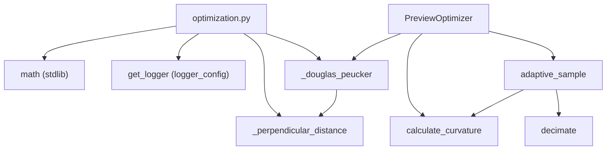

---
tags:
  - secinterp
  - code-walkthrough
  - core
  - utils
aliases:
  - optimization.py
  - PreviewOptimizer
  - decimate
  - calculate_curvature
  - adaptive_sample
cssclass: secinterp-note
---

# `core/utils/geometry_utils/optimization.py`

> [!abstract] One-line summary
> Geometric optimization for preview rendering: simplifies polylines with **Douglas-Peucker**, estimates local **curvature** by angular deviation, and samples **adaptively** by curvature, without touching QGIS.

**Path**: `core/utils/geometry_utils/optimization.py` (197 lines)
**Main class**: `PreviewOptimizer`
**Layer**: Core (QGIS-agnostic)
**Tags**: #secinterp #core #utils

---

## 🎯 Why does this file exist?

Profiles and 3D structures can have thousands of vertices; drawing all of them degrades the
render. There is a need to **reduce point count** while preserving shape:

| Problem | Solution |
|---------|----------|
| Profiles with too many vertices slow rendering | `decimate` with Douglas-Peucker |
| Uniform simplification erases important detail | `adaptive_sample` lowers tolerance where curvature is high |
| Quantify "how much a line bends" | `calculate_curvature` (angular deviation between segments) |

> [!important] Architectural note
> QGIS-agnostic: only `math` and `sec_interp.logger_config.get_logger`. The **LOD**
> (Level of Detail) is computed in core; the GUI decides when to apply it based on zoom.

---

## 🧬 Relationship diagram



> [!tip] How to read
> `PreviewOptimizer` is a **static facade**: `adaptive_sample` orchestrates curvature →
> tolerance → `decimate`. The private helpers (`_douglas_peucker`, `_perpendicular_distance`)
> implement the recursive algorithm.

---

## 📦 Imports — architectural reading

```python
# core/utils/geometry_utils/optimization.py
from __future__ import annotations

import math

from sec_interp.logger_config import get_logger

logger = get_logger(__name__)
```

| # | Observation |
|---|-------------|
| ① | `math` for trigonometry (`hypot`, `acos`, `degrees`). |
| ② | `get_logger(__name__)` injects the project logger; no direct `qgis.*`. |
| ③ | A single project import (`logger_config`), which is infrastructure, not domain. |

> [!note] Module-level logger
> `logger = get_logger(__name__)` is created once at import. The `logger.debug` calls in
> `decimate` and `adaptive_sample` report LOD reduction without production noise.

---

## 🏗️ Structure inventory

**Classes (1):**

- `class PreviewOptimizer` — 3 static/class methods, stateless.

**Private functions (2):**

- `_perpendicular_distance(point, line_start, line_end) -> float`
- `_douglas_peucker(points, tolerance) -> list[tuple[float, float]]`

**Local constants:**

- `MIN_POINTS_REQUIRED = 3` (Douglas-Peucker)
- `MIN_COMPONENTS_REQUIRED = 3` (curvature)

---

## 📁 Files in the package

| File | Lines | Role |
|---|--:|---|
| [[#optimizationpy|optimization.py]] | 197 | Simplification, curvature and adaptive sampling |

> [!note] Sub-package `geometry_utils/`
> Lives alongside [[measurement]] (measurement) and [[processing]] (densification). See
> [[core_utils_geometry_utils]] for the namespace role.

---

## 📖 Method-by-method walkthrough

### `_perpendicular_distance`

```python
def _perpendicular_distance(
    point: tuple[float, float],
    line_start: tuple[float, float],
    line_end: tuple[float, float],
) -> float:
    px, py = point
    x1, y1 = line_start
    x2, y2 = line_end

    dx = x2 - x1
    dy = y2 - y1
    if dx == 0 and dy == 0:
        return math.hypot(px - x1, py - y1)

    t = ((px - x1) * dx + (py - y1) * dy) / (dx * dx + dy * dy)
    t = max(0.0, min(1.0, t))
    return math.hypot(px - (x1 + t * dx), py - (y1 + t * dy))
```

Perpendicular distance from a point to a segment, with `t` clamped to `[0, 1]`. It is the
same parametric projection as [[measurement]], but here returns the **distance**.
- Degenerate segment (`dx == 0 and dy == 0`) → Euclidean distance to the vertex.
- This is the metric Douglas-Peucker uses to decide which point to keep.

### `_douglas_peucker`

```python
def _douglas_peucker(
    points: list[tuple[float, float]], tolerance: float
) -> list[tuple[float, float]]:
    MIN_POINTS_REQUIRED = 3
    if len(points) < MIN_POINTS_REQUIRED:
        return points

    start = points[0]
    end = points[-1]

    max_dist = 0.0
    index = 0
    for i in range(1, len(points) - 1):
        dist = _perpendicular_distance(points[i], start, end)
        if dist > max_dist:
            max_dist = dist
            index = i

    if max_dist > tolerance:
        left = _douglas_peucker(points[: index + 1], tolerance)
        right = _douglas_peucker(points[index:], tolerance)
        return left[:-1] + right
    return [start, end]
```

Classic recursive **Ramer–Douglas–Peucker** algorithm:
1. Join `start` and `end` with a line and find the farthest point.
2. If `max_dist > tolerance`, keep that point and recurse left and right.
3. Otherwise collapse the span to `[start, end]`.
4. `left[:-1] + right` avoids duplicating the split vertex.

> [!tip] Base case
> With `< 3` points it cannot simplify: returned as-is. Tolerance is the **maximum
> deviation** allowed from the reference line.

### `PreviewOptimizer.decimate`

```python
class PreviewOptimizer:
    @staticmethod
    def decimate(
        data: list[tuple[float, float]],
        tolerance: float | None = None,
        max_points: int = 1000,
    ) -> list[tuple[float, float]]:
        if not data or len(data) <= max_points:
            return data

        try:
            if tolerance is None:
                xs = [p[0] for p in data]
                ys = [p[1] for p in data]
                width = max(xs) - min(xs)
                height = max(ys) - min(ys)
                tolerance = math.hypot(width, height) / max_points

            result = _douglas_peucker(data, tolerance)

            logger.debug(
                f"LOD Decimation: {len(data)} -> {len(result)} points (tol={tolerance:.2f})"
            )
        except Exception as e:
            logger.warning(f"LOD decimation failed: {e}")
            return data
        else:
            return result
```

Simplification entry point. If `tolerance` is not given, it is **auto-computed**:
`hypot(width, height) / max_points`, a diagonal of the bounding box spread over the target
points. The `try/except` returns `data` intact on any failure (**fail-safe** for the render).

### `PreviewOptimizer.calculate_curvature`

```python
    @staticmethod
    def calculate_curvature(data: list[tuple[float, float]]) -> list[float]:
        MIN_COMPONENTS_REQUIRED = 3
        if len(data) < MIN_COMPONENTS_REQUIRED:
            return [0.0] * len(data)

        curvatures = [0.0]
        for i in range(1, len(data) - 1):
            p_prev = data[i - 1]
            p_curr = data[i]
            p_next = data[i + 1]

            v1_x = p_curr[0] - p_prev[0]
            v1_y = p_curr[1] - p_prev[1]
            v2_x = p_next[0] - p_curr[0]
            v2_y = p_next[1] - p_curr[1]

            dot_product = v1_x * v2_x + v1_y * v2_y
            mag_v1 = math.sqrt(v1_x**2 + v1_y**2)
            mag_v2 = math.sqrt(v2_x**2 + v2_y**2)

            if mag_v1 == 0 or mag_v2 == 0:
                angle = 0.0
            else:
                cosine_angle = dot_product / (mag_v1 * mag_v2)
                cosine_angle = max(-1.0, min(1.0, cosine_angle))
                angle = math.degrees(math.acos(cosine_angle))

            curvatures.append(angle)
        curvatures.append(0.0)
        return curvatures
```

Approximate curvature as the **deviation angle** between the incoming and outgoing segment
at each vertex. `cosine_angle` is clamped to `[-1, 1]` to avoid `NaN` from floating point
inaccuracies. Endpoints stay at `0.0` (no previous/next segment).

> [!tip] High values = sharp turns
> A straight line gives `0°` everywhere; a `90°` turn gives exactly `90`. This is the
> signal `adaptive_sample` uses to decide where to keep detail.

### `PreviewOptimizer.adaptive_sample`

```python
    @classmethod
    def adaptive_sample(
        cls,
        data: list[tuple[float, float]],
        min_tolerance: float = 0.1,
        max_tolerance: float = 10.0,
        max_points: int = 1000,
    ) -> list[tuple[float, float]]:
        if len(data) <= max_points:
            return data

        curvatures = cls.calculate_curvature(data)
        avg_curvature = sum(curvatures) / len(curvatures)

        normalized_curvature = avg_curvature / 180.0
        tolerance_factor = 1.0 - normalized_curvature

        tolerance = min_tolerance + (max_tolerance - min_tolerance) * tolerance_factor
        tolerance = max(min_tolerance, min(max_tolerance, tolerance))

        logger.debug(
            f"Adaptive sampling: Avg curvature={avg_curvature:.2f}, "
            f"calculated tolerance={tolerance:.2f}"
        )

        return cls.decimate(data, tolerance=tolerance, max_points=max_points)
```

**Adaptive** sampling: computes the average curvature, normalizes it (`/180`) and inverts
it to obtain a tolerance factor. Higher curvature → lower tolerance (more detail kept);
lower curvature → higher tolerance (more simplification). Finally delegates to `decimate`
with the interpolated tolerance clamped to `[min_tolerance, max_tolerance]`.

---

## 📐 Mathematical foundation

### Douglas-Peucker (summary)

| Step | Action |
|------|--------|
| 1 | Line `start → end` as reference |
| 2 | Perpendicular distance of each interior point |
| 3 | If `max_dist > tolerance` → split at the farthest point |
| 4 | Else → discard the whole interior |

- Average complexity `O(n log n)`, worst case `O(n²)` (zero tolerance).
- The result is a subset of the original points (no interpolation).

### Angular curvature

```
angle = degrees(acos(clamp(v1·v2 / (|v1|·|v2|), -1, 1)))
```

- `v1` = incoming segment, `v2` = outgoing segment.
- The `clamp` avoids out-of-domain `acos` from rounding.

### Adaptive tolerance

```
tolerance = min_tol + (max_tol − min_tol) · (1 − avg_curvature/180)
```

| Average curvature | Factor | Tolerance | Effect |
|-------------------|--------|-----------|--------|
| Low (~0°) | ≈ 1.0 | high | aggressive simplification |
| High (~180°) | ≈ 0.0 | low | keeps detail |

---

## 🧮 Complexity and performance

| Operation | Complexity | Note |
|-----------|------------|------|
| `calculate_curvature` | `O(n)` | single linear sweep |
| `_douglas_peucker` | `O(n log n)` typical / `O(n²)` worst | recursive |
| `decimate` / `adaptive_sample` | `O(n log n)` | dominated by DP |

- The Douglas-Peucker recursion creates sublist copies (`points[: i + 1]`), adding memory
  overhead on very large profiles.
- `decimate` returns `data` unprocessed when `len(data) <= max_points`, avoiding wasted work.

---

## 🔄 Data flow

| Phase | Input | Transformation | Output |
|-------|-------|----------------|--------|
| Curvature | list of `(x, y)` | angle between consecutive segments | `list[float]` |
| Tolerance | average curvature | normalization + inversion | `tolerance` |
| Decimation | list + tolerance | recursive Douglas-Peucker | reduced list |

**Real consumers:**

| Consumer | What it uses | Why |
|----------|--------------|-----|
| Preview render (GUI) | `decimate` / `adaptive_sample` | reduce vertices per LOD |
| Any profile module | `calculate_curvature` | detect turning zones |

---

## 🏛️ Design patterns present

| Pattern | Where | Purpose |
|---------|-------|---------|
| **Static facade** | `PreviewOptimizer` | unified API without instantiation |
| **Strategy (tolerance parameter)** | `decimate(tolerance=...)` | adjust aggressiveness |
| **Template Method** | `adaptive_sample` → `decimate` | step-by-step orchestration |
| **Fail-safe** | `try/except` in `decimate` | never break the render |
| **Divide & Conquer** | `_douglas_peucker` | recursive simplification |

---

## 🧾 API summary

| Symbol | Signature | Typical use |
|--------|-----------|-------------|
| `PreviewOptimizer.decimate` | `(data, tolerance=None, max_points=1000) -> list` | simplify polyline |
| `PreviewOptimizer.calculate_curvature` | `(data) -> list[float]` | estimate local bends |
| `PreviewOptimizer.adaptive_sample` | `(data, min_tolerance=0.1, max_tolerance=10.0, max_points=1000) -> list` | shape-sensitive sampling |
| `_perpendicular_distance` | `(point, start, end) -> float` | internal DP metric |
| `_douglas_peucker` | `(points, tolerance) -> list` | recursive algorithm |

---

## 🛡️ Error handling

| Case | Behaviour |
|------|-----------|
| `data` empty or `<= max_points` | `decimate`/`adaptive_sample` return `data` intact |
| `< 3` points | DP and curvature return input / zeros |
| Degenerate segment | `_perpendicular_distance` uses vertex distance |
| Unexpected decimation exception | caught and `return data` (fail-safe) |

> [!warning] Broad `except Exception`
> `decimate`'s `except Exception` hides the root cause (only `logger.warning`). Intentional
> to avoid breaking the render, but it complicates diagnosing real bugs.

---

## 🧪 Associated tests

`tests/core/test_geometry_utils.py` → `TestGeometryOptimization`:

- `test_preview_optimizer_decimate` — passthrough with `max_points=10`; `list` type with `max_points=1`.
- `test_calculate_curvature` — straight line sums to `0.0`; 90° turn gives `90.0` at the vertex.
- `test_adaptive_sample` — 100 collinear points with `max_points=50` return a `list`.

> [!note] Fallback coverage
> The `except` path (failed decimation) is not explicitly covered by tests; the contract
> is "never raise".

---

## 👀 Observations and notes

> [!success] Strengths
> - Fail-safe: a failed decimation never breaks the render.
> - Correct, compact Douglas-Peucker; a solid base for LOD.
> - `adaptive_sample` keeps detail where it matters (high curvature).

> [!warning] Points of attention
> - The recursion creates list copies (memory overhead on huge lines).
> - `except Exception` is too broad and masks logic errors.
> - The "curvature" is angular, not geometric curvature (1/radius); not scale-invariant.

> [!question] Open questions
> - Replace recursion with an iterative stack version to avoid `RecursionError` on
>   polylines with thousands of vertices?
> - Narrow `except Exception` to concrete exceptions (`ValueError`, `TypeError`)?

---

## 🔗 Related notes

- [[Index]] — vault index
- [[measurement]] / [[processing]] — sibling modules in `geometry_utils/`
- [[core_utils_geometry_utils]] — sub-package namespace
- [[drillhole]] — generates the trajectories later optimized for render
- [[performance_metrics]] — measures the cost of these simplifications

---

*Note of the SecInterp Code Walkthrough v2 vault — v3.9.1*
