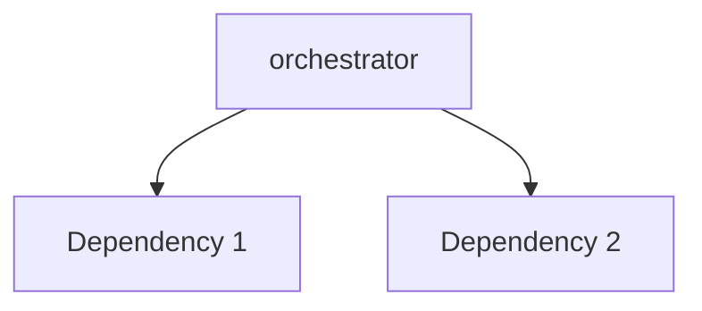

---
tags:
  - secinterp
  - code-walkthrough
  - core      # core | gui | exporters
  - general     # services | managers | renderers | adapters | validation | etc.
aliases:
  - orchestrator.py  # e.g. path_resolver.py
  - orchestrator     # e.g. resolve_export_path
cssclass: secinterp-note
note_lines: 700
---

# `core/services/export/orchestrator.py`

> [!abstract] One-line summary
> Export orchestrator — thin facade delegating to handlers. — what this module does in one sentence, without touching QGIS if it is core.

**Path**: `core/services/export/orchestrator.py` (207 lines)
**Main class/function**: `orchestrator`
**Layer**: core (QGIS-agnostic / GUI · Type)
**Tags**: #secinterp #core #general

---

## 🎯 Why does this file exist?

| Problem | Solution |
|---------|----------|
| (pending) | (pending) |
| (pending) | (pending) |

> [!important] Architectural note
> QGIS-agnóstico (e.g. "QGIS-agnostic", "Extract Adapter", "Factory").

---

## 🧬 Relationship diagram



> [!tip] How to read
> Solid arrow = imports/delegates; dashed = callback/injected.

---

## 📦 Imports — architectural reading

```python
# orchestrator.py
from __future__ import annotations
from pathlib import Path
from typing import Any
from qgis.PyQt.QtCore import QCoreApplication
from sec_interp.core.domain import PreviewParams
from sec_interp.core.exceptions import DataMissingError
from sec_interp.core.services.access_control_service import AccessControlService
from sec_interp.logger_config import get_logger
```

| # | Observation |
|---|-------------|
| ① | (pending) |
| ② | (pending) |

---

## 🏗️ Structure inventory

**Clases:** `class ExportService` — 6 métodos
**Funciones/Métodos:**
- `ExportService.__init__(def __init__(self, controller: Any | None=None) -> None:)`
- `ExportService.tr(def tr(self, message: str) -> str:)`
- `ExportService.export_data(def export_data(self, output_folder: Path, params: PreviewParams, profile_data: list[tuple], geol_data: list[Any] | None, struct_data: list[Any] | None, drillhole_data: list[Any] | None=None, interp_data: list[Any] | None=None, export_options: dict[str, bool] | None=None) -> list[str]:)`
- `ExportService._resolve_layers(def _resolve_layers(self, params: PreviewParams) -> tuple[Any, Any]:)`
- `ExportService._orchestrate_exports(def _orchestrate_exports(self, folder: Path, params: PreviewParams, profile_data: list[tuple], geol_data: list[Any] | None, struct_data: list[Any] | None, drillhole_data: list[Any] | None, interp_data: list[Any] | None, options: dict[str, Any], msg: list[str]) -> None:)`
- `ExportService.get_map_settings(def get_map_settings(self, layers: list[Any], extent: Any, size: Any | None, background_color: Any) -> Any:)`

---

## 📁 Files in the package

- `orchestrator.py` — individual note for this file.

---

## 📖 Method-by-method walkthrough

### `method_1`

```python
# (enriquecer)
```

_(enriquecer leyendo el fuente)_

### `method_2`

```python
# (enriquecer)
```

_(enriquecer leyendo el fuente)_

<!-- Add one subsection per public method of the module -->

---

## 🔄 Data flow

| Phase | Input | Transformation | Output |
|-------|-------|----------------|--------|
| - | - | - | - |
| - | - | - | - |

---

## 🏛️ Design patterns present

| Pattern | Where | Purpose |
|---------|-------|---------|
| - | - | - |

---

## 🧾 API summary

| Symbol | Signature / Inherits | Typical use |
|--------|----------------------|-------------|
| (no symbols) | `-` | - |

---

## 🛡️ Error handling

_(pending)_

---

## 🧪 Associated tests

_(pending)_

---

## 👀 Observations and notes

> [!success] Strengths
> - (skeleton)

> [!warning] Points of attention
> - (skeleton)

> [!question] Open questions
> - (skeleton)

---

## 🔗 Related notes

- [[Index]] — vault index
- [[Index]] — index
- [[controller]] — orchestrator

---

*Note of the SecInterp Code Walkthrough v2 vault — v3.8.0*
