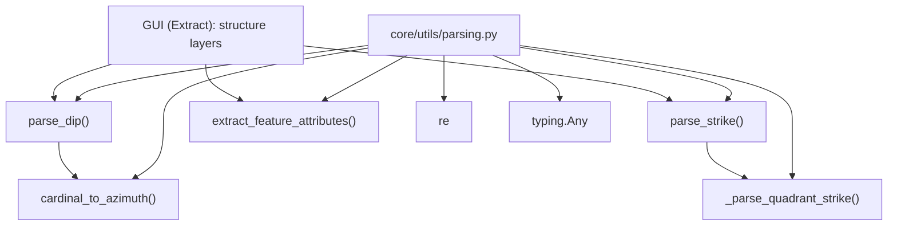

---
tags:
  - secinterp
  - code-walkthrough
  - core
  - utils
  - parsing
aliases:
  - parsing.py
  - parse_strike
  - parse_dip
  - cardinal_to_azimuth
  - extract_feature_attributes
cssclass: secinterp-note
---

# `core/utils/parsing.py`

> [!abstract] One-line summary
> Converts raw structural inputs (strike/dip in varied formats, cardinal azimuths and QGIS feature attributes) into clean, noise-tolerant Python primitives, ready for the core's pure Compute.

**Path**: `core/utils/parsing.py` (222 lines)
**Main functions**: `parse_strike`, `parse_dip`, `cardinal_to_azimuth`, `extract_feature_attributes`
**Layer**: Core · Utilities (QGIS-agnostic)
**Tags**: #secinterp #core #utils #parsing

---

## 🎯 Why does this file exist?

Structural geology data arrives in heterogeneous human formats: numbers, strings with
degree symbols, quadrant notation (`N 30 E`), `strike/dip` combinations, and QGIS
attributes with `QVariant`. The core needs azimuths (0-360) and primitives, not dirty
strings.

| Problem | Solution |
|---------|----------|
| Strike in quadrant notation (`N 30 E`, `S 45 W`) | `_parse_quadrant_strike` + `parse_strike` → 0-360 azimuth |
| Dip with direction (`45 NE`) and noisy degree symbols | `parse_dip` → `(dip_angle, dip_direction_azimuth)` |
| Cardinal direction as text (`NE`, `SW`) | `cardinal_to_azimuth` → degrees |
| QGIS `QVariant`/`NULL` breaks threading in QGIS 4/Qt6 | `extract_feature_attributes` → dict of Python primitives |

> [!important] Architectural note — QGIS-agnostic with duck typing
> No function imports `qgis.*`. `extract_feature_attributes` receives `feature: Any` and
> uses **duck typing** (`hasattr(feature, "fields")`), so the core does not couple the
> `QgsFeature` type. It is the "sanitization" bridge between the Extract phase (GUI) and
> the Compute phase (core).

---

## 🧬 Relationship diagram



> [!tip] How to read
> `parse_strike` reuses the private helper `_parse_quadrant_strike`; `parse_dip` reuses
> `cardinal_to_azimuth`. The GUI (Extract phase) is the only consumer: it delivers clean
> data to the Compute phase.

---

## 📦 Imports — architectural reading

```python
# core/utils/parsing.py
from __future__ import annotations

import re
from typing import Any
```

| # | Observation |
|---|-------------|
| ① | `re` (regex) is the central tool: noise- and prefix-tolerant parsing. |
| ② | `typing.Any` appears in `parse_strike`, `parse_dip` and `extract_feature_attributes`: accepts any raw input. |
| ③ | **Zero QGIS imports** ⇒ the module is testable without a QGIS installation. |
| ④ | It imports no domain DTOs: it returns primitives (`float`, `tuple`, `dict`), not entities. |

---

## 🏗️ Structure inventory

**Public functions (4):**

- `parse_strike(value: Any) -> float | None`
- `parse_dip(value: Any) -> tuple[float | None, float | None]`
- `cardinal_to_azimuth(text: str) -> float | None`
- `extract_feature_attributes(feature: Any) -> dict[str, Any]`

**Private functions (1):**

- `_parse_quadrant_strike(part: str) -> float | None`

**No classes or global state:** a module of pure functions.

---

## 📁 Files in the package

`parsing.py` lives in `core/utils/`:

| File | Lines | Role |
|---|--:|---|
| [[parsing]] | 222 | Strike/dip parsing, cardinal azimuth, attributes |
| [[io]] | 101 | Vector writing |
| [[metadata_reader]] | 129 | Reads `metadata.txt` |
| [[rendering]] | 129 | Bounds, coordinate transform, intervals |
| [[safe_loader]] | 79 | Safe/lazy import loading |
| [[drillhole]] | 298 | Drillhole trajectory and projection |

> [!note] `parsing.py` is the richest in regex of the package
> See [[core_utils]] for the rest of the pure utilities.

---

## 📖 Method-by-method walkthrough

### `_parse_quadrant_strike`

```python
def _parse_quadrant_strike(part: str) -> float | None:
    match = re.search(r"([NS])\s*(\d+\.?\d*)\s*([EW])", part)
    if not match:
        return None

    d1, ang, d2 = match.groups()
    ang = float(ang)
    strike = 0.0
    if d1 == "N" and d2 == "E":
        strike = ang
    elif d1 == "N" and d2 == "W":
        strike = 360 - ang
    elif d1 == "S" and d2 == "E":
        strike = 180 - ang
    elif d1 == "S" and d2 == "W":
        strike = 180 + ang

    return strike % 360
```

Converts quadrant notation to azimuth. The regex `([NS])\s*(\d+\.?\d*)\s*([EW])`
tolerates spaces and uses `re.search` (allows prefixes like `"Strike: "`). The
conversion table is the standard geological rule for quadrant strike.

### `parse_strike`

```python
def parse_strike(value: Any) -> float | None:
    if value is None:
        return None

    try:
        return float(value) % 360
    except (ValueError, TypeError):
        pass

    text = (
        str(value)
        .replace("°", "").replace("º", "").replace("ø", "").replace("O", "")
        .strip().upper()
    )

    parts = re.split(r"[,/\\;|]", text)
    parts = [p.strip() for p in parts if p.strip()]

    for part in parts:
        strike = _parse_quadrant_strike(part)
        if strike is not None:
            return strike

    if re.search(r"(?:DIP|BUZA|PEND)", text):
        return None

    numeric_match = re.search(r"(\d+\.?\d*)", text)
    if numeric_match:
        if re.search(r"\d+\.?\d*\s+[NSEW]{1,2}(?!\w)", text):
            pass
        else:
            try:
                return float(numeric_match.group(1)) % 360
            except (ValueError, TypeError):
                pass

    return None
```

A cascade strategy: **direct numeric** → **quadrant** → **guarded numeric
extraction**. The guards avoid confusing a dip-with-direction (`45 SE`) with a strike.
The `DIP`/`BUZA`/`PEND` label (English/Spanish) aborts strike parsing.

### `parse_dip`

```python
def parse_dip(value: Any) -> tuple[float | None, float | None]:
    if value is None:
        return None, None

    text = (
        str(value)
        .replace("°", "").replace("º", "").replace("ø", "").replace("O", "")
        .strip().upper()
    )

    numeric_only = re.match(r"^(\d+\.?\d*)$", text)
    if numeric_only:
        return float(text), None

    parts = re.split(r"[,/\\;|]", text)
    parts = [p.strip() for p in parts if p.strip()]

    for part in parts:
        if re.search(r"[NS]\s*\d+\.?\d*\s*[EW]", part):
            continue

        match = re.search(r"(\d+\.?\d*)\s*([NSEW]{1,2})", part)
        if match:
            dip, cardinal = match.groups()
            dip_val = float(dip)
            dip_dir = cardinal_to_azimuth(cardinal)
            if dip_dir is not None:
                return dip_val, dip_dir

    if not re.search(r"[NS]\s*\d+\.?\d*", text):
        numeric_match = re.search(r"(\d+\.?\d*)", text)
        if numeric_match:
            try:
                return float(numeric_match.group(1)), None
            except (ValueError, TypeError):
                pass

    return None, None
```

Returns a **tuple** `(dip_angle, dip_direction_azimuth)`. Distinguishes pure numeric
(`45` → `(45.0, None)`) from direction (`45 NE` → `(45.0, 45.0)`). Discards quadrant
notation to avoid confusing strike with dip.

### `cardinal_to_azimuth`

```python
def cardinal_to_azimuth(text: str) -> float | None:
    table = {
        "N": 0, "NE": 45, "E": 90, "SE": 135,
        "S": 180, "SW": 225, "W": 270, "NW": 315,
    }
    return table.get(text)
```

Direct translation of the 8 cardinal bearings to degrees. `dict.get` returns `None`
for invalid inputs (no exception).

### `extract_feature_attributes`

```python
def extract_feature_attributes(feature: Any) -> dict[str, Any]:
    if not feature or not hasattr(feature, "fields"):
        return {}

    names = feature.fields().names()
    raw_values = feature.attributes()
    sanitized = {}

    for name, val in zip(names, raw_values, strict=False):
        if val is None or str(val) == "NULL":
            sanitized[name] = None
        elif isinstance(val, int | float | str | bool):
            sanitized[name] = val
        else:
            sanitized[name] = str(val)

    return sanitized
```

Extracts a (duck-typed) feature's attributes into a dict of **Python primitives**.
Converts `QVariant`/`NULL` to `None`, passes primitives through, and converts the rest
(dates, etc.) to `str`. `strict=False` avoids failures if names and values differ in
length.

> [!important] Motivation: thread-safety in QGIS 4 / Qt6
> QGIS `QVariant`s are not safe to use in background threads. Sanitizing to primitives
> here lets the core process inside a `QgsTask` without dragging Qt objects along.

---

## 🔄 Data flow

| Phase | Input | Transformation | Output |
|-------|-------|----------------|--------|
| Numeric strike | `45` / `"45"` | `float(...) % 360` | `45.0` |
| Quadrant strike | `"N 30 E"` | regex + quadrant table | `30.0` |
| Combined strike | `"N30E, 45"` | delimiter split + cascade | azimuth or `None` |
| Numeric dip | `"45"` | exact `re.match` | `(45.0, None)` |
| Dip with direction | `"45 NE"` | regex + `cardinal_to_azimuth` | `(45.0, 45.0)` |
| Feature attributes | `QgsFeature` | `QVariant`→primitive sanitization | `dict[str, Any]` |

---

## 🏛️ Design patterns present

| Pattern | Where | Purpose |
|---------|-------|---------|
| **Parsing pipeline / cascade** | `parse_strike`, `parse_dip` | Try strategies in order, return on first success |
| **Strategy table (dict)** | `cardinal_to_azimuth` | Map bearings to degrees without `if/elif` |
| **Guard clause + early return** | `if value is None: return None` | Fail softly on empty input |
| **Duck typing** | `extract_feature_attributes` | Avoid coupling the `QgsFeature` type |
| **Sanitizer / Adapter** | `extract_feature_attributes` | Normalize `QVariant` to primitives for the core |

---

## 🧾 API summary

| Symbol | Signature / Inherits | Typical use |
|--------|----------------------|-------------|
| `parse_strike` | `(value: Any) -> float \| None` | 0-360 azimuth from varied format |
| `parse_dip` | `(value: Any) -> tuple[float \| None, float \| None]` | Angle + direction azimuth |
| `cardinal_to_azimuth` | `(text: str) -> float \| None` | `"NE"` → `45.0` |
| `extract_feature_attributes` | `(feature: Any) -> dict[str, Any]` | Feature attributes → primitives |

---

## 🛡️ Error handling

This module **raises no exceptions to the user**: it is a *tolerant* parser that returns
`None` (or tuples with `None`) on any invalid input.

| Input | `parse_strike` | `parse_dip` | `cardinal_to_azimuth` |
|-------|:---:|:---:|:---:|
| `None` | `None` | `(None, None)` | `None` |
| `"abc"` (no number) | `None` | `(None, None)` | `None` |
| `"XYZ"` (invalid direction) | — | — | `None` |

> [!tip] Internal `try/except (ValueError, TypeError)`
> The `float(...)` conversions are protected: on failure it moves to the next strategy
> instead of propagating. It is the "never crash on dirty data" contract.

> [!warning] `None` is ambiguous
> `parse_strike` returns `None` both for "no strike" and "unparseable". The caller
> cannot distinguish the two cases without extra context.

---

## 🧪 Associated tests

Coverage lives in three files (Mock-first, no QGIS):

- `tests/core/test_utils.py` — `test_parse_strike_*` (numeric, string, NE/NW/SE/SW quadrants, invalid), `test_parse_dip_*` (numeric, with direction, cardinals, invalid), `test_cardinal_to_azimuth_*`.
- `tests/core/test_utils_standalone.py` — extra variants: `test_parse_strike_combined_notation`, `test_parse_dip_combined_notation`, `test_parse_dip_alternative_symbols`.
- `tests/core/test_structural_parsing_advanced.py` — `test_partial_data_dip_only`, `test_partial_data_strike_only` (partial data).

---

## 👀 Observations and notes

> [!success] Strengths
> - Defensive parser tolerant of human noise (degrees, prefixes, combinations).
> - QGIS-agnostic: duck typing in `extract_feature_attributes` respects the core boundary.
> - Primitive sanitization solves thread-safety with `QVariant` in QGIS 4.

> [!warning] Points of attention
> - Overloaded `None`: "absent" and "unparseable" are indistinguishable.
> - `extract_feature_attributes` relies on undocumented methods as a contract (`fields()`, `attributes()`).
> - The regex logic is dense, with a `pass` branch (apparent dead code in `parse_strike`).

> [!question] Open questions
> - Return a `Result[T]` type to distinguish "absent" from "parse error"?
> - Extract the `cardinal_to_azimuth` bearing table into a constant shared with other modules?
> - Clean up the `pass` branch in `parse_strike` (a comment line with no action)?

---

## 🔗 Related notes

- [[Index]] — vault index
- [[core_utils]] — the `core/utils/` package and its pure utilities
- [[geology]] — `calculate_apparent_dip` uses the azimuths parsed here
- [[rendering]] — bounds and transform of the already-parsed data
- [[drillhole]] — drillhole projection (pure numeric data)
- [[entities]] / [[dtos]] — domain DTOs that receive these primitives
- [[controller]] — consumes the parsing in the Extract phase

---

*Note of the SecInterp Code Walkthrough v2 vault — v3.9.0*
