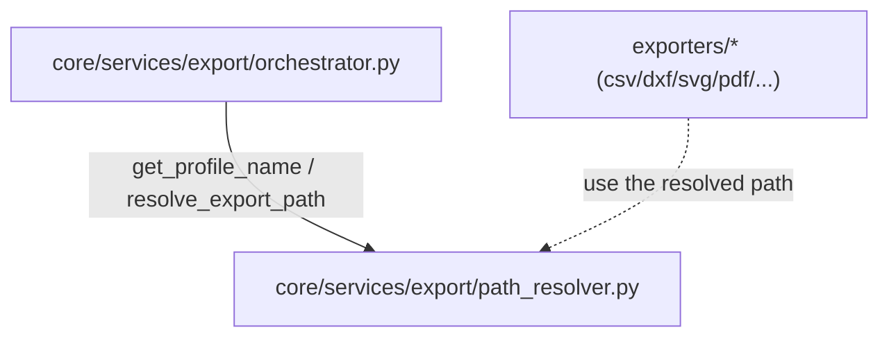

---
tags:
  - secinterp
  - code-walkthrough
  - core
  - services
  - export
aliases:
  - path_resolver.py
  - resolve_export_path
  - get_profile_name
cssclass: secinterp-note
---

# `core/services/export/path_resolver.py`

> [!abstract] One-line summary
> Resolves **where** and **under what name** each export file is written: derives the profile name and composes the output path (and the logical layer name) uniformly for all exporters.

**Path**: `core/services/export/path_resolver.py` (60 lines)
**Main function**: `resolve_export_path`
**Layer**: Core (QGIS-agnostic)
**Tags**: #secinterp #core #services #export

---

## 🎯 Why does this file exist?

Every exporter (SHP, GPKG, CSV, DXF, PDF, SVG, image) must decide **two things**: the
physical file and the logical layer name. If that logic is repeated in each exporter,
any change propagates to 12 places.

| Problem | Solution |
|---------|----------|
| Output naming duplicated across all exporters | Centralise it in `resolve_export_path` |
| Derive a safe filename from the section layer | `get_profile_name` + sanitisation of `/` and `\` |
| Handle the GeoPackage special case (single container) | `ext == ".gpkg"` branch inside `resolve_export_path` |

> [!important] QGIS-agnostic verified
> Only imports `pathlib.Path` and `typing.Any`. The `controller` is accessed via
> **defensive introspection** (chained `hasattr`), never through a QGIS import.

---

## 🧬 Relationship diagram



> [!tip] How to read
> Solid = imports; dashed = consumes the result. `path_resolver` is a **leaf** utility:
> it imports nothing internal, only the orchestrator and exporters use it.

---

## 📦 Imports — architectural reading

```python
# core/services/export/path_resolver.py
from __future__ import annotations

from pathlib import Path
from typing import Any
```

| # | Observation |
|---|-------------|
| ① | `pathlib.Path` (not `os.path`) — the project's idiomatic, portable style. |
| ② | `Any` in `controller` and `naming_pattern`: the signature tolerates `None` and external types. |
| ③ | No internal dependencies: fully isolated and testable module. |

---

## 🏗️ Structure inventory

**Functions/Methods:**
- `get_profile_name(controller)`
- `resolve_export_path(folder, base_name, profile_name, naming_pattern, ext)`

Two pure functions. No classes, no constants.

---

## 📖 Method-by-method walkthrough

### `get_profile_name`

```python
def get_profile_name(controller: Any | None) -> str:
    profile_name = "profile"
    has_sect = (
        controller and hasattr(controller, "settings") and hasattr(controller.settings, "section")
    )
    if has_sect:
        sect = controller.settings.section
        if hasattr(sect, "layer_name") and sect.layer_name:
            profile_name = sect.layer_name
    return profile_name.replace("/", "_").replace("\\", "_")
```

**Behaviour:**

1. Starts with the fallback `"profile"`.
2. Tries to read `controller.settings.section.layer_name` via **chained `hasattr`**.
3. Sanitises by replacing `/` and `\` with `_`.

> [!tip] Chained `hasattr` as short-circuit
> `controller and hasattr(...) and hasattr(...)` evaluates left-to-right and stops at
> the first `None`/`False`, avoiding `AttributeError` without `try/except`.

### `resolve_export_path`

```python
def resolve_export_path(
    folder: Path,
    base_name: str,
    profile_name: str,
    naming_pattern: str | None,
    ext: str,
) -> tuple[Path, str]:
```

Returns the tuple `(file Path, logical layer name)`. The logical name is decoupled
from the filename because, in a GeoPackage, a layer may be named differently from the
container file.

```python
new_name = base_name
if naming_pattern:
    new_name = naming_pattern.format(filename=base_name, profile=profile_name)
    new_name = new_name.replace("/", "_").replace("\\", "_")

if ext == ".gpkg":
    return folder / f"{profile_name}{ext}", new_name

container_folder = folder / profile_name
container_folder.mkdir(parents=True, exist_ok=True)
return container_folder / f"{new_name}{ext}", new_name
```

| Branch | Result |
|--------|--------|
| **`.gpkg`** | Single file `folder/<profile>.gpkg`; logical name `new_name` (internal layer) |
| **Others (`.shp`, `.csv`, `.dxf`, …)** | Per-profile subfolder `folder/<profile>/<new_name><ext>` |

> [!important] Why `.gpkg` is special
> A GeoPackage is a **container** of multiple layers: it does not need a folder per
> profile. The other formats are one file per layer, grouped in a subfolder per profile.

> [!note] `naming_pattern` with placeholders
> The pattern uses `str.format(filename=..., profile=...)`. After applying the pattern
> it is **re-sanitised** in case it introduces `/` or `\`.

---

## 🔄 Data flow

| Phase | Input | Transformation | Output |
|-------|-------|----------------|--------|
| Profile name | `controller` (or `None`) | chained `hasattr` + sanitisation | `profile_name: str` |
| Output path | `folder`, `base_name`, `profile_name`, `pattern`, `ext` | `format()` + `.gpkg` / subfolder branch | `(Path, logical_name)` |

---

## 📂 Worked path examples

Assume `folder = /tmp/out`, `profile_name = "secc1"`, `base_name = "topo_profile"`:

| `ext` | `naming_pattern` | Resulting path | Logical name |
|-------|------------------|----------------|--------------|
| `.gpkg` | — | `/tmp/out/secc1.gpkg` | `topo_profile` |
| `.gpkg` | `"{profile}_{filename}"` | `/tmp/out/secc1.gpkg` | `secc1_topo_profile` |
| `.csv` | — | `/tmp/out/secc1/topo_profile.csv` | `topo_profile` |
| `.dxf` | `"{filename}"` | `/tmp/out/secc1/topo_profile.dxf` | `topo_profile` |

> [!tip] Note the asymmetry
> For `.gpkg` the logical name does **not** appear in the path (it is the internal
> layer name); for the others, the logical name matches the file (without extension).

---

## 🔬 `ext` → behaviour matrix

| Format | Container | Per-profile folder | Comment |
|--------|-----------|:---:|---------|
| `.gpkg` | multi-layer | ❌ | A single file groups layers |
| `.shp` / `.csv` / `.dxf` / `.pdf` / `.svg` / image | one file per layer | ✅ | Grouped under `folder/<profile>/` |

---

## 🏛️ Design patterns present

| Pattern | Where | Purpose |
|---------|-------|---------|
| **Pure function** | both functions | Determinism and trivial testing (no state) |
| **Null object / default** | `get_profile_name` → `"profile"` | Safe fallback without an exception |
| **Template (naming pattern)** | `naming_pattern.format(...)` | User-customisable naming |
| **Special case** | `ext == ".gpkg"` branch | Treat the container differently |

---

## 🧾 API summary

| Symbol | Signature / Inherits | Typical use |
|--------|----------------------|-------------|
| `get_profile_name` | `(controller: Any \| None) -> str` | Sanitised profile name |
| `resolve_export_path` | `(folder, base_name, profile_name, naming_pattern, ext) -> (Path, str)` | Physical path + logical layer name |

---

## 🛡️ Error handling

It raises no exceptions; it degrades with defaults:

| Case | Behaviour |
|------|-----------|
| `controller` is `None` or has no `settings` | `get_profile_name` → `"profile"` |
| `naming_pattern` is `None` | `base_name` used unformatted |
| Subfolder does not exist | `mkdir(parents=True, exist_ok=True)` creates it (idempotent) |

> [!warning] `str.format` can raise `KeyError`
> If `naming_pattern` contains an unknown placeholder (e.g. `{foo}`),
> `format(...)` raises `KeyError`. Today it is not guarded; the only fragile point.

---

## 🧪 Associated tests

Direct cases to cover (pure tests, no QGIS):

- `test_get_profile_name_default` — `None` → `"profile"`.
- `test_get_profile_name_sanitizes_slashes` — `"a/b\\c"` → `"a_b_c"`.
- `test_resolve_gpkg_single_container` — `ext=".gpkg"` returns `folder/<profile>.gpkg`.
- `test_resolve_creates_profile_folder` — the subfolder is created on non-GPKG export.
- `test_resolve_naming_pattern` — `"{profile}_{filename}"` expands correctly.

---

## 🔁 Call flow inside the orchestrator

The export orchestrator uses it in **two steps**:

```python
# 1. Profile name (once per export)
profile_name = get_profile_name(controller)

# 2. Path + logical name (once per exporter)
path, layer_name = resolve_export_path(folder, "topo_profile", profile_name, pattern, ".shp")
```

| Step | Function | Frequency |
|------|----------|-----------|
| Derive profile | `get_profile_name` | 1 per export |
| Resolve output | `resolve_export_path` | 1 per format/exporter |

> [!note] `base_name` is a **stable logical name**
> It is not the final filename: it is the dataset identifier (e.g. `"topo_profile"`,
> `"geol_profile"`). The pattern and extension shape it afterwards.

---

## 🌐 Usage and migration notes

- **No user-facing strings**: pure module with no i18n; messages are added by the exporter.
- **`pathlib` end-to-end**: all paths are built with `Path`, never `os.path`.
- **Idempotent**: `mkdir(parents=True, exist_ok=True)` makes re-execution safe.
- **Extensible**: adding a new format only requires deciding its `ext` in the matrix.

---

## 👀 Observations and notes

> [!success] Strengths
> - Minimal, pure module; a single responsibility (output naming).
> - Idiomatic `pathlib`, consistent with the project standard.
> - `None`-safe without noisy `try/except` blocks.

> [!warning] Points of attention
> - `naming_pattern.format(...)` without `try/except` may blow up with `KeyError`.
> - Chained `hasattr` duplicates the `settings` structure in code.

> [!question] Open questions
> - Validate `naming_pattern` at the source (configuration) rather than here?
> - Return a `ResolvedPath` dataclass instead of a `(Path, str)` tuple?

---

## 🔗 Related notes

- [[Index]] — vault index
- [[layer_core_services_export]] — the `export/` package it belongs to
- [[orchestrator]] — main consumer of `resolve_export_path`
- [[core_services_export]] — sibling in the `export/` package
- [[core_services]] — shim re-exporting the public API

---

*Note of the SecInterp Code Walkthrough v2 vault — v3.9.1*
