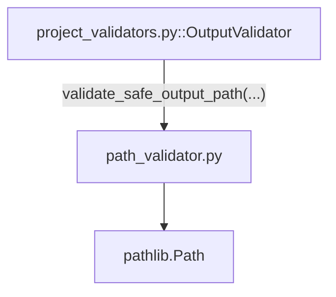

---
tags:
  - secinterp
  - code-walkthrough
  - core
  - validation
aliases:
  - path_validator.py
  - validate_safe_output_path
  - validate_output_path
  - _check_path_security
  - _check_base_restriction
cssclass: secinterp-note
---

# `core/validation/path_validator.py`

> [!abstract] One-line summary
> **Secure** output-path validation in the core: it checks null bytes, directory traversal, confinement to a base directory, existence/creation and real filesystem writability, all via `pathlib.Path`.

**Path**: `core/validation/path_validator.py` (111 lines)
**Main functions**: `validate_safe_output_path`, `validate_output_path`
**Layer**: Core (QGIS-agnostic)
**Tags**: #secinterp #core #validation

---

## 🎯 Why does this file exist?

Exporting a profile to a user-chosen path is a security-sensitive operation (path
traversal, writing to arbitrary locations). This module applies a **3-step validation
policy** before allowing a write:

| Problem | Solution |
|---------|----------|
| A `..` in the path can escape the expected directory | `_check_path_security` detects traversal |
| Null bytes can trick C/OS APIs | `_check_path_security` rejects them |
| The path must stay inside a base directory (sandbox) | `_check_base_restriction` with `Path.relative_to` |
| The directory must exist, be created, or be writable | `_validate_path_state` (real write test) |

> [!important] Architectural note
> **QGIS-agnostic and stdlib-only** (`pathlib`). It imports neither QGIS nor PyQt; path
> validation is a pure filesystem concern. The GUI passes the path as a `str` and
> receives a resolved `Path` back.

---

## 🧬 Relationship diagram



> [!tip] How to read
> Solid = imports/delegates. `OutputValidator` (in `project_validators.py`) is the only
> in-package consumer; other uses go through `validate_output_path` re-exported in
> `core/validation/__init__.py`.

---

## 📦 Imports — architectural reading

```python
# core/validation/path_validator.py
from __future__ import annotations

from pathlib import Path
```

| # | Observation |
|---|-------------|
| ① | `from __future__ import annotations` — deferred annotations. |
| ② | Only `pathlib.Path` — no `os`, no `shutil`, no QGIS. `Path` centralizes all I/O. |
| ③ | Zero domain dependencies: it is a pure utility module. |

---

## 🏗️ Structure inventory

**Public functions (2):**

- `validate_safe_output_path(path, base_dir=None, must_exist=False, create_if_missing=False) -> (bool, str, Path|None)`
- `validate_output_path(path) -> (bool, str, Path|None)` — convenience wrapper.

**Private functions (3):**

- `_check_path_security(path) -> (bool, str, Path|None)` — null bytes + traversal.
- `_check_base_restriction(path_obj, base_dir) -> (bool, str, Path|None)` — confinement to `base_dir`.
- `_validate_path_state(path, must_exist, create_if_missing) -> (bool, str)` — existence/creation/writability.

> [!note] No classes
> Purely functional module. The 3 private helpers mirror the 3 pipeline steps:
> security → confinement → filesystem state.

---

## 📁 Files in the package

`path_validator.py` is the filesystem piece of the `core/validation/` package:

| File | Role |
|------|------|
| `path_validator.py` | Secure path validation (this file) |
| `field_validator.py` | Atomic field validation |
| `layer_validator.py` | Spatial layer validation |
| `validation_helpers.py` | `ValidationContext`, `DependencyRule` |
| `project_validator.py` | `ProjectValidator` + `ValidationParams` |
| `project_validators.py` | `OutputValidator` (consumes this module) |
| `validators.py` | Dataclass field validator factories |
| `layer_metadata.py` | `LayerMetadata` + constants |
| `base_validator.py` | `IValidator` (ABC) |
| `pipeline.py` | `ValidationPipeline` |

---

## 📖 Method-by-method walkthrough

### `validate_safe_output_path`

```python
def validate_safe_output_path(
    path: str,
    base_dir: Path | None = None,
    must_exist: bool = False,
    create_if_missing: bool = False,
) -> tuple[bool, str, Path | None]:
    if not path or path.strip() == "":
        return False, "Output path is required", None

    # 1. Security check
    is_safe, msg, path_obj = _check_path_security(path)
    if not is_safe or not path_obj:
        return False, msg, None

    # 2. Base directory restriction
    if base_dir:
        is_within, msg, resolved_path = _check_base_restriction(path_obj, base_dir)
        if not is_within or not resolved_path:
            return False, msg, None
    else:
        try:
            resolved_path = path_obj.resolve(strict=False)
        except (OSError, RuntimeError) as e:
            return False, f"Cannot resolve path: {e!s}", None

    # 3. Existence and Permissions
    is_valid, msg = _validate_path_state(resolved_path, must_exist, create_if_missing)
    if not is_valid:
        return False, msg, None

    return True, "", resolved_path
```

Entry point. Orchestrates the 3 steps (security, confinement, state) and returns the
**resolved** (absolute) path in the third slot. If `base_dir` is absent, it only calls
`resolve(strict=False)` without requiring existence.

| Parameter | Role |
|-----------|------|
| `base_dir` | If given, the path must stay **inside** this directory (sandbox) |
| `must_exist` | If `True`, the path must already exist |
| `create_if_missing` | If `True`, create the directory if missing |

### `_check_path_security`

```python
def _check_path_security(path: str) -> tuple[bool, str, Path | None]:
    if "\0" in path:
        return False, "Path contains invalid null bytes", None
    try:
        path_obj = Path(path)
        if ".." in path_obj.parts:
            return False, "Path contains directory traversal sequences (..)", None
        return True, "", path_obj
    except (TypeError, ValueError) as e:
        return False, f"Invalid path: {e!s}", None
```

Security step 1. Rejects null bytes (`\0`) and `..` sequences in any segment
(`Path.parts` splits the path into components, so `"a/../b"` is detected). Catches
`TypeError`/`ValueError` from the `Path` constructor.

### `_check_base_restriction`

```python
def _check_base_restriction(path_obj: Path, base_dir: Path) -> tuple[bool, str, Path | None]:
    try:
        resolved_path = path_obj.resolve(strict=False)
        base_resolved = base_dir.resolve(strict=False)
        resolved_path.relative_to(base_resolved)
        return True, "", resolved_path
    except ValueError:
        return False, f"Path escapes base directory: {base_dir}", None
    except (OSError, RuntimeError) as e:
        return False, f"Cannot validate base directory: {e!s}", None
```

Confinement step 2. `relative_to()` raises `ValueError` if the path is not under
`base_dir`, translated into `"Path escapes base directory"`. This is the **sandbox**
mechanism preventing writes outside the working directory.

### `_validate_path_state`

```python
def _validate_path_state(path: Path, must_exist: bool, create_if_missing: bool) -> tuple[bool, str]:
    if not path.exists():
        if must_exist:
            return False, f"Path does not exist: {path}"
        if create_if_missing:
            try:
                path.mkdir(parents=True, exist_ok=True)
            except OSError as e:
                return False, f"Cannot create directory: {e!s}"
        else:
            return True, ""

    if not path.is_dir():
        return False, f"Path is not a directory: {path}"

    # Check if writable
    try:
        test_file = path / ".write_test"
        test_file.touch()
        test_file.unlink()
        return True, ""
    except OSError:
        return False, f"Directory is not writable: {path}"
```

Filesystem state step 3. Handles existence, creation (`mkdir(parents=True,
exist_ok=True)`) and verifies it is a **directory**. The writability check is
**empirical**: it creates a `.write_test` file, touches and removes it. Any `OSError`
declares the directory non-writable.

### `validate_output_path`

```python
def validate_output_path(path: str) -> tuple[bool, str, Path | None]:
    return validate_safe_output_path(path, must_exist=True)
```

Convenience wrapper validating that a path is an **existing, writable directory**. It
is the function re-exported in `core/validation/__init__.py` and used by most
consumers and tests.

---

## 🔄 Data flow

| Phase | Input | Transformation | Output |
|-------|-------|----------------|--------|
| Security | raw `str` | detect `\0` and `..` | `Path` or `(False, msg)` |
| Confinement | `Path` + `base_dir` | `resolve` + `relative_to` | resolved `Path` or error |
| State | resolved `Path` | exists/create/write | `(bool, str)` |
| Convenience | `str` | delegate with `must_exist=True` | `(bool, str, Path\|None)` |

> [!tip] The final path is already resolved
> The `resolved_path` return is **absolute and normalized**, ready for the export phase
> without resolving again.

---

## 🔒 Security analysis

| Threat | Defense |
|--------|---------|
| Path traversal (`../../etc/passwd`) | `".." in Path.parts` → reject |
| Null byte injection (`\0`) | `"\0" in path` → reject |
| Write outside the workspace | `relative_to(base_dir)` → `ValueError` |
| Non-writable directory | `.write_test` touch/unlink |
| Non-directory path | `path.is_dir()` → reject |

> [!important] Residual TOCTOU
> The write test (touch/unlink) is a *best-effort* check: between validating and the
> real write (export phase) there can be a time-of-check/time-of-use race. For this
> plugin (local export, single user) it is acceptable, but worth knowing.

---

## 🔀 Parameter combination matrix

`validate_safe_output_path` has 3 boolean flags that combine in different ways. This
table documents the resulting behaviour for a **non-existent** path:

| `base_dir` | `must_exist` | `create_if_missing` | Result |
|:--:|:--:|:--:|--------|
| no | `False` | `False` | `(True, "", resolved)` — existence not required |
| no | `True` | `False` | `(False, "Path does not exist")` |
| no | `False` | `True` | creates the directory; on failure → `(False, ...)` |
| yes | `False` | `False` | must stay inside `base_dir` |
| yes | `True` | `False` | inside `base_dir` and existing |
| yes | `False` | `True` | inside `base_dir`, created if missing |

> [!note] `create_if_missing` only applies to non-existent paths
> If the path already exists, `create_if_missing` is ignored (it proceeds to verify it
> is a directory and that it is writable).

## 🔢 Full-flow example

Given `base_dir = Path("/home/user/secinterp/exports")` and a request to validate the
path `"exports/profile_2026"`:

```python
is_valid, msg, resolved = validate_safe_output_path(
    "exports/profile_2026",
    base_dir=Path("/home/user/secinterp/exports"),
    create_if_missing=True,
)
# is_valid  -> True
# resolved  -> Path("/home/user/secinterp/exports/profile_2026")
```

1. `_check_path_security` — no `\0` nor `..` → `Path("exports/profile_2026")`.
2. `_check_base_restriction` — `resolve()` → `/home/user/secinterp/exports/profile_2026`,
   which is relative to `/home/user/secinterp/exports` → inside the sandbox.
3. `_validate_path_state` — does not exist, `create_if_missing=True` → `mkdir(parents=True)`.
4. Returns `(True, "", <resolved Path>)`.

If the user had typed `"../other/project"`, step 1 would have rejected it as traversal;
if `"/tmp/outside"`, step 2 for escaping the base directory.

## 🧮 Input validation vs output validation

`path_validator` covers the **output** (where to write). The **input** of paths/layers is
resolved by other project components:

| Aspect | `path_validator.py` | `path_resolver` / GUI |
|--------|---------------------|------------------------|
| Purpose | Validate the output path | Resolve input paths |
| Concern | Security + writability | Resource location |
| Return | `(bool, str, Path)` | resolved path / layer object |
| Fails if | traversal, non-writable… | resource not found |

> [!tip] Clean boundary
> The core never touches the filesystem beyond what is needed to validate **output**.
> Reading input layers/resources is the GUI's responsibility.

---

## 🏛️ Design patterns present

| Pattern | Where | Purpose |
|---------|-------|---------|
| **3-step pipeline** | `validate_safe_output_path` | Separate security / confinement / state |
| **Sandbox** | `_check_base_restriction` | Confine writes to `base_dir` |
| **Result tuple** | all | `(bool, str, Path\|None)` without exceptions |
| **Convenience wrapper** | `validate_output_path` | Simple API for the common case |
| **Empirical check** | `.write_test` | Verify real writability, not assume it |

---

## 🧾 API summary

| Symbol | Signature / Inherits | Typical use |
|--------|----------------------|-------------|
| `validate_safe_output_path` | `(path, base_dir=None, must_exist=False, create_if_missing=False) -> (bool, str, Path\|None)` | Full validation with sandbox |
| `validate_output_path` | `(path) -> (bool, str, Path\|None)` | Existing, writable directory |

---

## 🛡️ Error handling

No exceptions to the consumer; each failure is translated to `(False, msg, None)`:

| Situation | Message |
|-----------|---------|
| Empty path | `"Output path is required"` |
| Null bytes | `"Path contains invalid null bytes"` |
| Traversal `..` | `"Path contains directory traversal sequences (..)"` |
| Outside `base_dir` | `"Path escapes base directory: {base_dir}"` |
| `must_exist` and missing | `"Path does not exist: {path}"` |
| Creation failure | `"Cannot create directory: {e}"` |
| Not a directory | `"Path is not a directory: {path}"` |
| Not writable | `"Directory is not writable: {path}"` |

> [!note] `OSError`/`RuntimeError` capture
> The `except` blocks catch `OSError` (and sometimes `RuntimeError`) from the
> filesystem, never domain exceptions. This module does not raise `ValidationError`.

---

## 🧪 Associated tests

Cases mapped to `tests/core/test_path_validator.py` (plus `test_validation.py` and
`test_validation_refactor.py`, which test `validate_output_path`):

- `test_validate_safe_output_path_basic` — valid path returns `Path`; empty → `"required"`.
- `test_validate_safe_output_path_security` — null byte and `../../etc/passwd` rejected.
- `test_validate_safe_output_path_sandbox` — inside `base_dir` ok; `/tmp/outside.txt` → `"escapes base directory"`.
- `test_validate_safe_output_path_creation` — `must_exist=True` fails; `create_if_missing=True` creates.
- `test_validate_safe_output_path_is_dir` — an existing file → `"not a directory"`.
- `test_validate_output_path_convenience` — existing dir ok; missing fails.

---

## 👀 Observations and notes

> [!success] Strengths
> - Only `pathlib`: portable and dependency-free.
> - Clear, separated defense-in-depth (security → confinement → state).
> - Empirical write test (touch/unlink) instead of assumptions.

> [!warning] Points of attention
> - TOCTOU race between validation and the real export write.
> - `validate_output_path` forces `must_exist=True`; it cannot validate paths to create.
> - `_validate_path_state` requires a **directory**; a single output-file path must be handled separately.

> [!question] Open questions
> - Move the real write into an export try/except instead of validating beforehand?
> - Add support for validating **file** paths (not only directories)?

---

## 🔗 Related notes

- [[Index]] — vault index
- [[core_validation]] — package note for the `validation/` directory
- [[project_validators]] — `OutputValidator` consumes `validate_safe_output_path`
- [[project_validator]] — `ValidationParams.output_path` is the validated field
- [[path_resolver]] — path resolution (complementary, GUI/export side)
- [[io]] — file I/O and export handling

---

*Note of the SecInterp Code Walkthrough v2 vault — v3.8.0*
