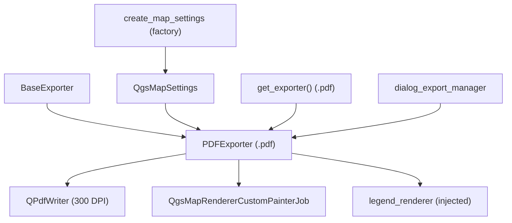

---
tags:
  - secinterp
  - code-walkthrough
  - exporters
  - print
aliases:
  - pdf_exporter.py
  - PDFExporter
cssclass: secinterp-note
---

# `exporters/pdf_exporter.py`

> [!abstract] One-line summary
> PDF document exporter: renders a `QgsMapSettings` with `QgsMapRendererCustomPainterJob` onto `QPdfWriter` at 300 DPI with a custom-sized page and zero margins, plus an optional legend.

**Path**: `exporters/pdf_exporter.py` (79 lines)
**Main class**: `PDFExporter(BaseExporter)`
**Layer**: Exporters (coupled to `qgis.core` + `QtGui`: printable rendering)
**Tags**: #secinterp #exporters #print

---

## 🎯 Why does this file exist?

The geological report ships as PDF: a portable, printable, press-quality document
that PNG cannot give (fixed raster) and SVG cannot guarantee (printers vary):

| Problem | Solution |
|---------|----------|
| Printable report at fixed quality | `QPdfWriter` at 300 DPI |
| Page exactly the profile's size | Custom `QPageSize(QSizeF(width, height), Point)` |
| White margins clipping the drawing | Explicit `QMarginsF(0, 0, 0, 0)` |
| Blurry print output | `map_settings.setOutputDpi(writer.resolution())` with the real DPI |
| Legend outside the document | `legend_renderer.draw_legend()` on the same painter |

> [!important] Architectural note
> Second member of the render triptych (`image`/`pdf`/`svg`): same choreography
> (settings → painter + job → legend → save), different device. Its `data` is a
> `QgsMapSettings` cooked by `create_map_settings` (see [[orchestrator]]).

---

## 🧬 Relationship diagram



> [!tip] How to read
> The writer defines page and resolution; the `QgsMapSettings` is **recalibrated**
> against the real device (`setOutputSize`/`setOutputDpi`) before rendering. Without
> that recalibration, the PDF would carry the on-screen canvas scale.

---

## 📦 Imports — architectural reading

```python
# exporters/pdf_exporter.py
from __future__ import annotations

from pathlib import Path

from qgis.core import QgsMapRendererCustomPainterJob, QgsMapSettings
from qgis.PyQt.QtCore import QMarginsF, QRectF, QSize, QSizeF
from qgis.PyQt.QtGui import QPageSize, QPainter, QPdfWriter

from sec_interp.logger_config import get_logger

from .base_exporter import BaseExporter
```

| # | Observation |
|---|-------------|
| ① | `QPdfWriter` + `QPageSize`: the device is a paginated document, not a canvas. |
| ② | Float `QMarginsF`/`QSizeF`: the page is defined in typographic **points**, not pixels. |
| ③ | `QgsMapSettings` typed in the signature: the caller must deliver a cooked scene. |
| ④ | No `QImage` or `QColor`: there is no background to fill; the page rules. |
| ⑤ | `get_logger`: `painter.begin()` failures and exceptions are logged. |

---

## 🏗️ Structure inventory

**Classes:** `class PDFExporter(BaseExporter)` — 1 class, 2 methods.

**Methods:**

- `get_supported_extensions() -> list[str]` — `[".pdf"]`
- `export(output_path: Path, map_settings: QgsMapSettings) -> bool` — full document

**Consumed settings:**

| Key | Default | Role |
|-----|---------|------|
| `width` | `800` | Page width in points |
| `height` | `600` | Page height in points |
| `show_legend` | `True` | Legend switch |
| `legend_renderer` | `None` | Object with `draw_legend(painter, rect)` |

**Hardcoded constants:** `300` DPI resolution, `0` margins.

---

## 📁 Files in the package

| File | Lines | Role |
|---|--:|---|
| `__init__.py` | 81 | `get_exporter()`: `.pdf` → `PDFExporter` |
| `base_exporter.py` | 137 | Inherited contract (see [[base_exporter]]) |
| `pdf_exporter.py` | 79 | `PDFExporter` (this note) |
| `image_exporter.py` | 72 | Raster twin: same choreography over `QImage` |
| `svg_exporter.py` | 85 | Vector twin: same choreography over `QSvgGenerator` |

---

## 📖 Method-by-method walkthrough

### `get_supported_extensions`

```python
def get_supported_extensions(self) -> list[str]:
    """Get supported PDF extension."""
    return [".pdf"]
```

A single extension: PDF is both document and vector image, so there are no variants
(unlike the png/jpg/jpeg trio).

### `export` — full document

```python
def export(self, output_path: Path, map_settings: QgsMapSettings) -> bool:
    """Export map to PDF.

    Args:
        output_path: Output file path
        map_settings: QgsMapSettings instance configured for rendering

    Returns:
        True if export successful, False otherwise

    """
    try:
        width = self.get_setting("width", 800)
        height = self.get_setting("height", 600)

        # Setup PDF writer
        writer = QPdfWriter(str(output_path))
        writer.setResolution(300)  # Set DPI
        writer.setPageSize(QPageSize(QSizeF(width, height), QPageSize.Unit.Point))
        writer.setPageMargins(QMarginsF(0, 0, 0, 0))

        # Setup painter
        painter = QPainter()
        if not painter.begin(writer):
            logger.error(f"Failed to begin painting for PDF export to {output_path}")
            return False

        try:
            painter.setRenderHint(QPainter.RenderHint.Antialiasing)

            # Update map settings with actual writer device dimensions and DPI
            dev = painter.device()
            map_settings.setOutputSize(QSize(dev.width(), dev.height()))
            map_settings.setOutputDpi(writer.resolution())

            # Render map
            job = QgsMapRendererCustomPainterJob(map_settings, painter)
            job.start()
            job.waitForFinished()

            # Draw legend if available
            show_legend = self.get_setting("show_legend", True)
            legend_renderer = self.get_setting("legend_renderer")
            if legend_renderer and show_legend:
                legend_renderer.draw_legend(painter, QRectF(0, 0, dev.width(), dev.height()))

        finally:
            painter.end()
    except Exception:
        logger.exception(f"PDF export failed for {output_path}")
        return False
    else:
        return True
```

| Step | Detail |
|------|--------|
| Page | `QPdfWriter(str(path))` + 300 DPI + point-sized page + zero margins |
| `begin` | If `painter.begin(writer)` fails → `logger.error` + `False` (the only explicit pre-render `False`) |
| Recalibration | `setOutputSize` with the real device size and `setOutputDpi(300)`: the map renders at press resolution, not screen resolution |
| Render | Synchronous job (`start` + `waitForFinished`) with antialiasing |
| Legend | Box with the real device dimensions (`dev.width/height`), not the settings ones |
| Close | `finally: painter.end()` guarantees the document flush even if the job raises |
| Success | `else: return True` after the full `try` |

> [!important] DPI recalibration is load-bearing
> Without `setOutputDpi(writer.resolution())`, the map would paint at ~96 screen DPI
> inside a 300-DPI page: everything microscopic. This step does not exist in
> `image_exporter` (where image pixel = settings pixel).

> [!tip] `finally` seals the document
> Unlike `image_exporter`, `painter.end()` sits in `finally` here: a mid-job failure
> never leaves the PDF half-closed. The pattern repeats in `svg_exporter`.

---

## 🔄 Data flow

| Phase | Input | Transformation | Output |
|-------|-------|----------------|--------|
| Page | `width`, `height` | `QPdfWriter` + point `QPageSize`, 300 DPI | empty document |
| Calibration | real painter device | `setOutputSize` + `setOutputDpi` | press-DPI `QgsMapSettings` |
| Render | map + optional legend | synchronous job + `draw_legend` | complete page |
| Close | open painter | `finally: painter.end()` | `.pdf` + `bool` |

---

## 🧩 Why 300 DPI and zero margins

| Decision | Reason |
|----------|--------|
| Fixed 300 DPI | Press standard; avoids giant 600+ DPI PDFs and blurry 96-DPI ones |
| Custom page (`width`×`height` in points) | The profile rules: no page breaks, no surprise scaling |
| `0` margins | The map extent already frames the shot; the GUI controls whitespace |

---

## 🏛️ Design patterns present

| Pattern | Where | Purpose |
|---------|-------|---------|
| **Template Method** | `export()` over [[base_exporter]] | Document with `bool` return |
| **Dependency Injection** | `map_settings` + `legend_renderer` | No scene construction here |
| **Device calibration** | `setOutputSize`/`setOutputDpi` | Render at device resolution |
| **Guaranteed cleanup** | `try/finally` with `painter.end()` | Document always closed |

---

## 🧾 API summary

| Symbol | Signature / Inherits | Typical use |
|--------|----------------------|-------------|
| `PDFExporter` | `(BaseExporter)` | `PDFExporter({"width": 1200, "height": 800})` |
| `export` | `(output_path: Path, map_settings: QgsMapSettings) -> bool` | `export(path, map_settings)` |
| `get_supported_extensions` | `() -> list[str]` | `[".pdf"]` |

---

## 🛡️ Error handling

| Situation | Behaviour |
|-----------|-----------|
| `painter.begin(writer)` fails | `logger.error` + immediate `False` (full disk, bad path) |
| Exception in render or legend | `logger.exception` + `False`; `finally` still closes the painter |
| Empty `map_settings` | Valid but blank PDF → `True` (write success, not content success) |
| Extreme resolution/page size | No prior validation: an absurd `width` yields an absurd PDF |

---

## 🧪 Associated tests

Mock-first in `tests/exporters/test_pdf_exporter.py` (writer, painter and job mocked):

- `test_get_supported_extensions` — declares `[".pdf"]`.
- `test_export_success` — `begin() == True` + job → `True`.
- `test_export_painter_begin_fails` — `begin() == False` → `False` with logged error.
- `test_export_exception_handling` — job exception → `False`.

Integration:

- `tests/exporters/test_exporters.py` — `BaseExporter` contract.
- `tests/integration/test_export_workflow.py` — full run with PDF.
- `tests/integration/test_qgis_smoke.py` — smoke with real QGIS.

---

## 👀 Observations and notes

> [!success] Strengths
> - Explicit DPI recalibration: the PDF is genuinely press-grade, not screen-grade.
> - `finally` guarantees a closed document under any mid-flight failure.
> - Checked `begin()` with a dedicated log: open failures are distinguishable.
> - Custom margin-less page: framing decided by extent, not the writer.

> [!warning] Points of attention
> - `300` DPI and `0` margins are **hardcoded**: no `dpi` setting even though `BaseExporter.__init__` documents one.
> - `width`/`height` are points, not pixels: a caller passing screen pixels gets a tiny page.
> - Blank PDF (empty settings) returns `True`: write success, not content success.
> - Single page: long profiles do not paginate (by design, but worth knowing).

> [!question] Open questions
> - Expose `dpi` and `margins` as settings (`get_setting("dpi", 300)`)?
> - Document units (points) in the docstring to avoid pixel confusion?
> - Validate `begin()` in `svg_exporter` with an equivalent log?

---

## 🔗 Related notes

- [[Index]] — vault index
- [[base_exporter]] — inherited contract
- [[image_exporter]] / [[svg_exporter]] — render twins
- [[exporters]] — package layer note
- [[orchestrator]] — `get_map_settings` cooking the `QgsMapSettings`
- [[dialog_export_manager]] — GUI requesting the PDF
- [[preview_renderer]] — view frozen into the document
- [[dtos]] — displayed `PreviewResult`
- [[exceptions]] — upstream `ExportError`

---

*Note of the SecInterp Code Walkthrough v2 vault — v3.9.1*
