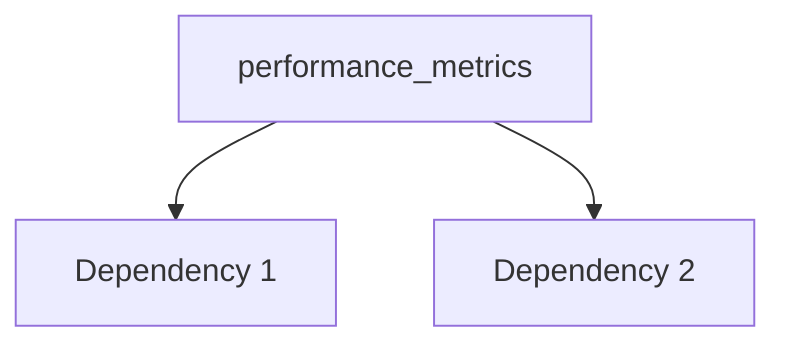

---
tags:
  - secinterp
  - code-walkthrough
  - core      # core | gui | exporters
  - general     # services | managers | renderers | adapters | validation | etc.
aliases:
  - performance_metrics.py  # e.g. path_resolver.py
  - performance_metrics     # e.g. resolve_export_path
cssclass: secinterp-note
# note_lines: 700      # optional: ceiling > 500 for high-importance modules (max 700)
---

# `core/performance_metrics.py`

> [!abstract] One-line summary
> Performance metrics module for SecInterp plugin. — what this module does in one sentence, without touching QGIS if it is core.

**Path**: `core/performance_metrics.py` (321 lines)
**Main class/function**: `performance_metrics`
**Layer**: core (QGIS-agnostic / GUI · Type)
**Tags**: #secinterp #core #general

---

## 🎯 Why does this file exist?

| Problem | Solution |
|---------|----------|
| (pending) | (pending) |
| (pending) | (pending) |

> [!important] Architectural note
> QGIS-agnóstico (e.g. "QGIS-agnostic", "Extract Adapter", "Factory").

---

## 🧬 Relationship diagram



> [!tip] How to read
> Solid arrow = imports/delegates; dashed = callback/injected.

---

## 📦 Imports — architectural reading

```python
# performance_metrics.py
from __future__ import annotations
import logging
import time
import tracemalloc
from collections.abc import Callable, Generator
from contextlib import contextmanager
from functools import wraps
from typing import Any
```

| # | Observation |
|---|-------------|
| ① | (pending) |
| ② | (pending) |

---

## 🏗️ Structure inventory

**Clases:** `class MetricsCollector` — 6 métodos; `class PerformanceTimer` — 3 métodos; `class PerformanceMonitor` — 5 métodos
**Funciones/Métodos:**
- `MetricsCollector.__init__(def __init__(self) -> None:)`
- `MetricsCollector.record_timing(def record_timing(self, operation: str, duration: float) -> None:)`
- `MetricsCollector.record_count(def record_count(self, metric: str, count: int) -> None:)`
- `MetricsCollector.add_metadata(def add_metadata(self, key: str, value: Any) -> None:)`
- `MetricsCollector.get_summary(def get_summary(self) -> dict[str, Any]:)`
- `MetricsCollector.clear(def clear(self) -> None:)`
- `PerformanceTimer.__init__(def __init__(self, operation_name: str, collector: MetricsCollector | None=None, logger_func: Any | None=None) -> None:)`
- `PerformanceTimer.__enter__(def __enter__(self) -> PerformanceTimer:)`
- `PerformanceTimer.__exit__(def __exit__(self, exc_type: type[BaseException] | None, exc_val: BaseException | None, exc_tb: Any | None) -> None:)`
- `format_duration(def format_duration(seconds: float) -> str:)`
- `PerformanceMonitor.__init__(def __init__(self, log_file: str='performance.log') -> None:)`
- `PerformanceMonitor._setup_logger(def _setup_logger(self, log_file: str) -> logging.Logger:)`
- `PerformanceMonitor.measure_operation(@contextmanager)`
- `PerformanceMonitor._get_memory_usage(def _get_memory_usage(self) -> float:)`
- `PerformanceMonitor.get_operation_stats(def get_operation_stats(self, operation_name: str) -> dict[str, Any] | None:)`
- `performance_monitor(def performance_monitor(func: Callable) -> Callable:)`

---

## 📁 Files in the package

- `performance_metrics.py` — individual note for this file.

---

## 📖 Method-by-method walkthrough

### `method_1`

```python
# (enriquecer)
```

_(enriquecer leyendo el fuente)_

### `method_2`

```python
# (enriquecer)
```

_(enriquecer leyendo el fuente)_

<!-- Add one subsection per public method of the module -->

---

## 🔄 Data flow

| Phase | Input | Transformation | Output |
|-------|-------|----------------|--------|
| - | - | - | - |
| - | - | - | - |

---

## 🏛️ Design patterns present

| Pattern | Where | Purpose |
|---------|-------|---------|
| - | - | - |

---

## 🧾 API summary

| Symbol | Signature / Inherits | Typical use |
|--------|----------------------|-------------|
| `format_duration`, `performance_monitor` | `-` | - |

---

## 🛡️ Error handling

_(pending)_

---

## 🧪 Associated tests

_(pending)_

---

## 👀 Observations and notes

> [!success] Strengths
> - (skeleton)

> [!warning] Points of attention
> - (skeleton)

> [!question] Open questions
> - (skeleton)

---

## 🔗 Related notes

- [[Index]] — vault index
- [[Index]] — index
- [[controller]] — orchestrator

---

*Note of the SecInterp Code Walkthrough v2 vault — v3.8.0*
