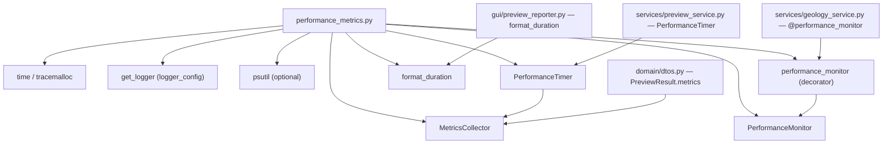

---
tags:
  - secinterp
  - code-walkthrough
  - core
  - metrics
aliases:
  - performance_metrics.py
  - MetricsCollector
  - PerformanceMonitor
  - PerformanceTimer
  - performance_monitor
  - format_duration
cssclass: secinterp-note
---

# `core/performance_metrics.py`

> [!abstract] One-line summary
> Plugin **performance measurement** infrastructure: collects timings and counters (`MetricsCollector`), times operations (`PerformanceTimer`, `PerformanceMonitor.measure_operation`) and decorates functions (`@performance_monitor`) using only the stdlib.

**Path**: `core/performance_metrics.py` (321 lines)
**Main classes**: `MetricsCollector`, `PerformanceTimer`, `PerformanceMonitor`
**Decorator**: `performance_monitor`
**Layer**: Core (QGIS-agnostic)
**Tags**: #secinterp #core #metrics

---

## 🎯 Why does this file exist?

Geological algorithms can be expensive; measuring their cost (time and memory) allows
detecting regressions and reporting performance to the user:

| Problem | Solution |
|---------|----------|
| No way to quantify how long a service takes | `PerformanceTimer` / `measure_operation` |
| Aggregate timings and counters of several operations | `MetricsCollector` (timings/counts dicts) |
| Instrument without polluting the function body | `@performance_monitor` (decorator) |
| Show human-readable durations to the user | `format_duration` (µs/ms/s) |

> [!important] Architectural note
> 100% stdlib (`time`, `tracemalloc`, `contextlib`, `functools`) + `get_logger`. Memory is
> measured with **optional** `psutil` (fallback to `0.0` if missing). Lives in core because
> services (`geology_service`) and DTOs (`PreviewResult.metrics`) use it.

---

## 🧬 Relationship diagram



> [!tip] How to read
> `performance_metrics` is cross-cutting infrastructure: services **decorate** it, DTOs
> **store** it (`metrics`), the GUI **reads** it (`format_duration`). Dashed arrow =
> optional use (`psutil`).

---

## 📦 Imports — architectural reading

```python
# core/performance_metrics.py
from __future__ import annotations

import logging
import time
import tracemalloc
from collections.abc import Callable, Generator
from contextlib import contextmanager
from functools import wraps
from typing import Any

from sec_interp.logger_config import get_logger

logger = get_logger(__name__)
```

| # | Observation |
|---|-------------|
| ① | `time.perf_counter()` (monotonic) instead of `time.time()` — immune to clock adjustments. |
| ② | `tracemalloc` (stdlib) for memory peak, no dependencies. |
| ③ | `contextmanager` + `wraps` → idiomatic context managers and decorators. |
| ④ | `psutil` is imported **inside** `_get_memory_usage`, not at module level. |

> [!note] `logging` imported but not used directly
> The module imports `logging` for the `logging.Logger` type of `_setup_logger`; actual
> logging is delegated to `get_logger("performance")`.

---

## 🏗️ Structure inventory

**Classes (3):**

- `class MetricsCollector` — 6 methods (timings/counts/metadata aggregation)
- `class PerformanceTimer` — 3 methods (manual context manager)
- `class PerformanceMonitor` — 5 methods (time + memory + stats)

**Functions (2):**

- `format_duration(seconds) -> str`
- `performance_monitor(func) -> Callable` (decorator)

---

## 📁 Files in the package

| File | Lines | Role |
|---|--:|---|
| [[#performance_metricspy|performance_metrics.py]] | 321 | Time/memory measurement and decorator |

---

## 📖 Method-by-method walkthrough

### `MetricsCollector`

```python
class MetricsCollector:
    def __init__(self) -> None:
        self.timings: dict[str, float] = {}
        self.counts: dict[str, int] = {}
        self.metadata: dict[str, Any] = {}
        self._start_time = time.perf_counter()

    def record_timing(self, operation: str, duration: float) -> None:
        self.timings[operation] = duration

    def record_count(self, metric: str, count: int) -> None:
        self.counts[metric] = count

    def add_metadata(self, key: str, value: Any) -> None:
        self.metadata[key] = value

    def get_summary(self) -> dict[str, Any]:
        return {
            "timings": self.timings,
            "counts": self.counts,
            "metadata": self.metadata,
            "total_duration": time.perf_counter() - self._start_time,
        }

    def clear(self) -> None:
        self.timings.clear()
        self.counts.clear()
        self.metadata.clear()
        self._start_time = time.perf_counter()
```

**Collector** (aggregator) of metrics. Three buckets (`timings`, `counts`, `metadata`) plus a
`_start_time` for the total duration since creation (or the last `clear`).

> [!tip] It is the type that travels in DTOs
> `PreviewResult` carries it as `metrics: MetricsCollector = field(default_factory=...)`. The
> GUI fills and reads it without coupling the core to Qt.

### `PerformanceTimer`

```python
class PerformanceTimer:
    def __init__(self, operation_name, collector=None, logger_func=None) -> None:
        self.operation_name = operation_name
        self.collector = collector
        self.logger_func = logger_func
        self.start_time: float = 0.0
        self.duration: float = 0.0

    def __enter__(self) -> PerformanceTimer:
        self.start_time = time.perf_counter()
        return self

    def __exit__(self, exc_type, exc_val, exc_tb) -> None:
        self.duration = time.perf_counter() - self.start_time
        if self.collector:
            self.collector.record_timing(self.operation_name, self.duration)
        if self.logger_func:
            self.logger_func(f"{self.operation_name}: {self.duration:.3f}s")
```

**Manual** context manager (without `@contextmanager`). In `__exit__` it records the duration
into an optional `MetricsCollector` and/or calls `logger_func`. `__exit__` does not return
`False`, so it **does not suppress exceptions** (they propagate after measuring).

### `format_duration`

```python
def format_duration(seconds: float) -> str:
    if seconds < 0.001:
        return f"{seconds * 1_000_000:.0f}µs"
    if seconds < 1.0:
        return f"{seconds * 1000:.0f}ms"
    return f"{seconds:.1f}s"
```

Formats a duration into a readable string with thresholds: `< 1 ms` → microseconds,
`< 1 s` → milliseconds, else seconds with one decimal.

### `PerformanceMonitor`

```python
class PerformanceMonitor:
    def __init__(self, log_file: str = "performance.log") -> None:
        self.logger = self._setup_logger(log_file)
        self.metrics: dict[str, Any] = {}

    def _setup_logger(self, log_file: str) -> logging.Logger:
        return get_logger("performance")

    @contextmanager
    def measure_operation(self, operation_name: str, **metadata: Any) -> Generator[None, None, None]:
        start_time = time.perf_counter()
        start_memory = self._get_memory_usage()
        tracemalloc.start()
        try:
            yield
        finally:
            end_time = time.perf_counter()
            end_memory = self._get_memory_usage()
            try:
                _, peak = tracemalloc.get_traced_memory()
            except RuntimeError:
                _, peak = 0, 0
            tracemalloc.stop()
            duration = end_time - start_time
            memory_diff = end_memory - start_memory
            log_data = {
                "operation": operation_name,
                "duration_seconds": round(duration, 4),
                "memory_mb": round(memory_diff, 2),
                "memory_peak_mb": round(peak / 1024 / 1024, 2),
                "timestamp": time.strftime("%Y-%m-%d %H:%M:%S"),
                **metadata,
            }
            self.logger.info(f"Performance: {log_data}")
            if operation_name not in self.metrics:
                self.metrics[operation_name] = []
            self.metrics[operation_name].append(log_data)
```

Context manager measuring **time and memory** around a block. Combines `perf_counter`, RSS
from `psutil` and `tracemalloc` (memory peak). Accumulates each run in
`self.metrics[operation_name]` for later analysis.

> [!tip] `try/finally` guarantees the recording
> Even if the block raises, the `finally` computes and records the metrics. The `except
> RuntimeError` covers `tracemalloc` not started (badly handled nested calls).

### `_get_memory_usage`

```python
    def _get_memory_usage(self) -> float:
        try:
            import psutil
            process = psutil.Process()
            return process.memory_info().rss / 1024 / 1024
        except ImportError:
            return 0.0
```

Returns the process RSS memory in MB via `psutil`. If not installed, returns `0.0`
(**silent fallback**), making memory measurement optional.

### `get_operation_stats`

```python
    def get_operation_stats(self, operation_name: str) -> dict[str, Any] | None:
        if operation_name not in self.metrics:
            return None
        operation_metrics = self.metrics[operation_name]
        durations = [m["duration_seconds"] for m in operation_metrics]
        memory_usages = [m["memory_mb"] for m in operation_metrics]
        return {
            "count": len(operation_metrics),
            "avg_duration": sum(durations) / len(durations),
            "min_duration": min(durations),
            "max_duration": max(durations),
            "avg_memory": sum(memory_usages) / len(memory_usages),
            "min_memory": min(memory_usages),
            "max_memory": max(memory_usages),
        }
```

Aggregated statistics (mean/min/max) of an operation's multiple runs. Returns `None` if the
operation has never been measured.

### `performance_monitor` — the decorator

```python
def performance_monitor(func: Callable) -> Callable:
    monitor = PerformanceMonitor()

    @wraps(func)
    def wrapper(*args: Any, **kwargs: Any) -> Any:
        operation_name = f"{func.__module__}.{func.__name__}"
        with monitor.measure_operation(
            operation_name, args_count=len(args), kwargs_keys=list(kwargs.keys())
        ):
            return func(*args, **kwargs)

    return wrapper
```

Decorator that wraps a function and measures every call. Key points:
- `@wraps(func)` preserves the name, docstring and signature of the decorated function.
- The operation name is `module.function`, stable and unique per symbol.
- Metadata `args_count`/`kwargs_keys` enrich the log without inspecting values.
- Used on `GeologyService.build_segments` (`@performance_monitor`).

> [!important] The decorator pattern
> `performance_monitor` is a **stateful decorator**: it creates one `PerformanceMonitor` per
> function (at import) and reuses its `metrics` across calls. It separates the cross-cutting
> concern (measuring) from the business logic (computing), without touching the function body.

---

## 🧬 Comparing the three ways to measure

| Mechanism | Type | When to use |
|-----------|------|-------------|
| `MetricsCollector` | aggregator (data) | accumulate timings/counts and carry them in DTOs |
| `PerformanceTimer` | context manager | measure a specific block and record it |
| `PerformanceMonitor.measure_operation` | context manager (time+memory) | full analysis |
| `performance_monitor` | decorator | instrument a whole function declaratively |

---

## 🔄 Data flow

| Phase | Input | Transformation | Output |
|-------|-------|----------------|--------|
| Decoration | function | `@wraps` + `measure_operation` | instrumented wrapper |
| Measurement | block/function | `perf_counter` + `tracemalloc` + `psutil` | `log_data` |
| Aggregation | `log_data` | `self.metrics[name].append` | mean/min/max stats |
| Presentation | `timings` | `format_duration` | `"1.2s"`, `"150ms"`, `"100µs"` |

**Real consumers:**

| Consumer | What it uses |
|----------|--------------|
| `geology_service.py` | `@performance_monitor` on `build_segments` |
| `preview_service.py` | `PerformanceTimer` |
| `domain/dtos.py` | `MetricsCollector` as `PreviewResult.metrics` field |
| `gui/preview_reporter.py` | `format_duration`, `MetricsCollector` |
| `gui/dialog_export_manager.py` / `preview_render_mixin.py` | `MetricsCollector`, `PerformanceTimer` |

---

## 🏛️ Design patterns present

| Pattern | Where | Purpose |
|---------|-------|---------|
| **Decorator** | `performance_monitor` | declarative instrumentation |
| **Context Manager** | `PerformanceTimer`, `measure_operation` | delimit a block to measure |
| **Collector / Registry** | `MetricsCollector` | aggregate scattered metrics |
| **Stdlib facade** | `PerformanceMonitor` | hide `tracemalloc`/`psutil` |

---

## 🧾 API summary

| Symbol | Signature | Typical use |
|--------|-----------|-------------|
| `MetricsCollector.record_timing` | `(operation, duration) -> None` | record duration |
| `MetricsCollector.record_count` | `(metric, count) -> None` | record counter |
| `MetricsCollector.get_summary` | `() -> dict` | aggregate dump |
| `PerformanceTimer` | context manager | time a block |
| `format_duration` | `(seconds) -> str` | readable string |
| `PerformanceMonitor.measure_operation` | `(name, **metadata)` | time + memory |
| `PerformanceMonitor.get_operation_stats` | `(name) -> dict | None` | mean/min/max |
| `performance_monitor` | `(func) -> Callable` | decorate a function |

---

## 🛡️ Error handling

| Case | Behaviour |
|------|-----------|
| `psutil` not installed | `_get_memory_usage` returns `0.0` (fallback) |
| `tracemalloc` not started | `except RuntimeError` → peak `0` |
| Exception in the measured block | `finally` records and **propagates** the exception |
| Operation never measured | `get_operation_stats` returns `None` |

> [!warning] `_get_memory_usage` does not catch `psutil.Error`
> It only catches `ImportError`. If `psutil` is installed but `Process()` fails (e.g.
> permissions), the exception would propagate. Low risk, but a broader `except` would be more
> robust for a non-critical metric.

---

## 🧪 Associated tests

There is no dedicated `test_performance_metrics.py`. Coverage arrives **indirectly**:

- `tests/gui/test_dialog_preview_manager.py` — imports and instantiates `MetricsCollector`
  (`PreviewResult(..., metrics=MetricsCollector())`).
- `tests/core/test_geology_service.py` — exercises `build_segments`, which is decorated with
  `@performance_monitor` (verifies the decorator does not alter the return).

> [!note] Direct coverage gap
> `format_duration`, `PerformanceTimer` and `get_operation_stats` have no unit tests of their
> own. They are candidates for a future `test_performance_metrics.py` (pure, no QGIS).

---

## 👀 Observations and notes

> [!success] Strengths
> - 100% stdlib + optional `psutil`: works without heavy dependencies.
> - The decorator cleanly separates measurement from business logic (`@wraps`).
> - `try/finally` guarantees recording even on exceptions.

> [!warning] Points of attention
> - `_setup_logger(log_file)` **ignores** the `log_file` parameter (uses `get_logger("performance")`).
> - `_get_memory_usage` only catches `ImportError`, not runtime `psutil` errors.
> - `MetricsCollector.record_count` has no visible consumer in core.

> [!question] Open questions
> - Remove the dead `log_file` parameter from `PerformanceMonitor.__init__`?
> - Add `test_performance_metrics.py` for `format_duration` and `PerformanceTimer`?
> - Use `performance_monitor` on more services (preview, structures)?

---

## 🔗 Related notes

- [[Index]] — vault index
- [[geology_service]] — `build_segments` decorated with `@performance_monitor`
- [[preview_service]] — uses `PerformanceTimer`
- [[dtos]] — `PreviewResult.metrics` is a `MetricsCollector`
- [[core_utils_geometry_utils]] — the geometric algorithms one wants to measure
- [[measurement]] / [[optimization]] / [[processing]] — candidates to be instrumented

---

*Note of the SecInterp Code Walkthrough v2 vault — v3.8.0*
