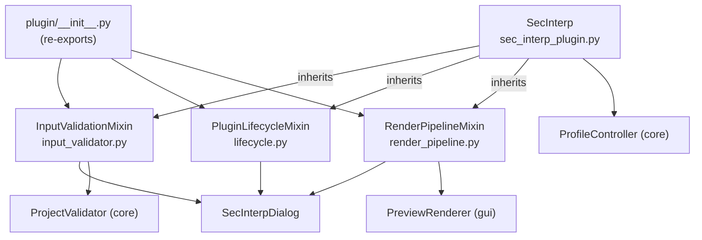
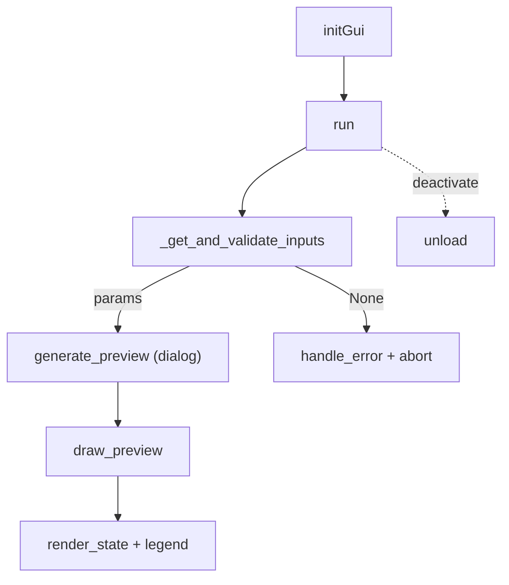

---
tags:
  - secinterp
  - code-walkthrough
  - plugin
aliases:
  - plugin/
  - SecInterp
  - InputValidationMixin
  - PluginLifecycleMixin
  - RenderPipelineMixin
cssclass: secinterp-note
---

# `plugin/` — Plugin Mixins (QGIS Boundary)

> [!abstract] One-line summary
> Package `plugin/` (4 files): `__init__` re-exports the three mixins composing `SecInterp` — [[input_validator]] (validation boundary), [[lifecycle]] (QGIS cycle) and [[render_pipeline]] (preview presentation).

**Path**: `plugin/` (4 files, ~392 lines)
**Main class**: `SecInterp` (host in `sec_interp_plugin.py`, composes the three mixins)
**Layer**: Plugin / GUI (the only layer talking to `iface`, `QAction` and widgets)
**Tags**: #secinterp #plugin

---

## 🎯 Why does this package exist?

`SecInterp` (the class QGIS instantiates via `classFactory`) needs three orthogonal
capabilities: validating inputs, living the QGIS cycle, and drawing the preview.
Without the package, all three would live in a single giant `sec_interp_plugin.py`:

| Problem | Solution |
|---------|----------|
| One class with validation + lifecycle + rendering is unreadable | Three single-responsibility mixins composing `SecInterp` |
| `sec_interp_plugin.py` must stay a readable composition root | It delegates the three behaviours to `plugin/` and only keeps `__init__` and `save_profile_line` |
| The mixins must be imported from a single point | `__init__.py` re-exports all three with an explicit `__all__` |

> [!important] Architectural note
> The package is a **composition namespace**, not a computation layer: it defines
> no geological logic and touches the core only via DTOs (`PreviewParams`) and
> validators. The three mixins operate on host state (`self.dlg`,
> `self.preview_renderer`, `self.layer_notification_manager`, `self.actions`…).

---

## 🧬 Relationship diagram



> [!tip] How to read
> Solid arrow = imports/inherits/delegates. The `SecInterp` host inherits all three
> mixins; each mixin collaborates with the dialog and a different piece
> (validator, renderer, QGIS cycle).

---

## 📦 Imports — architectural reading

```python
# plugin/__init__.py
"""Plugin component mixins (lifecycle, input validation, render pipeline)."""

from __future__ import annotations

from .input_validator import InputValidationMixin
from .lifecycle import PluginLifecycleMixin
from .render_pipeline import RenderPipelineMixin

__all__ = ["InputValidationMixin", "PluginLifecycleMixin", "RenderPipelineMixin"]
```

| # | Observation |
|---|-------------|
| ① | The one-line docstring documents the full content: lifecycle, validation, render. No ambiguity. |
| ② | Relative imports (`.input_validator`): an internally cohesive package, not a cross-layer public API. |
| ③ | Explicit `__all__` with the three symbols: `from sec_interp.plugin import (...)` in `sec_interp_plugin.py` imports exactly this. |
| ④ | No `qgis.*` or core imports in `__init__`: the package executes nothing on import, it only re-exports. Zero side effects. |
| ⑤ | Alphabetical order of the three imports (`input_validator`, `lifecycle`, `render_pipeline`): a convention that eases diffs. |

---

## 🏗️ Structure inventory

**Exported symbols (3, all stateless mixins):**

- `InputValidationMixin` — validation boundary (106 lines).
- `PluginLifecycleMixin` — QGIS init → dialog → cleanup cycle (167 lines).
- `RenderPipelineMixin` — preview presentation (110 lines).

The package declares no classes, functions or constants of its own: every
behavioural symbol lives in the three sibling modules, documented in their notes.

---

## 📁 Files in the package

| File | Lines | Role |
|---|--:|---|
| [[#__init__\|__init__.py]] | 9 | Re-exports the three mixins; explicit `__all__` |
| [[#InputValidationMixin\|input_validator.py]] | 106 | Extract + Guard boundary: dialog → `PreviewParams` → `ProjectValidator` → layer monitoring |
| [[#PluginLifecycleMixin\|lifecycle.py]] | 167 | QGIS mechanics: `initGui`/`run`/`process_data`/`unload` + deterministic disconnection |
| [[#RenderPipelineMixin\|render_pipeline.py]] | 110 | Present phase: `show_*` filter, vertical exaggeration, `PreviewRenderer.render`, legend |

> [!tip] Anchors of this table
> Each `[[#Section|file.py]]` link points to the same-named section further down in
> this note. The deep notes for each module are [[input_validator]],
> [[lifecycle]] and [[render_pipeline]].

---

## 📖 Module-by-module walkthrough

### __init__

```python
__all__ = ["InputValidationMixin", "PluginLifecycleMixin", "RenderPipelineMixin"]
```

Nine lines serving a single function: turning three modules into one importable
unit. The consumer is `sec_interp_plugin.py`:

```python
from sec_interp.plugin import (
    InputValidationMixin,
    PluginLifecycleMixin,
    RenderPipelineMixin,
)


class SecInterp(TranslatableMixin, PluginLifecycleMixin, InputValidationMixin, RenderPipelineMixin):
```

The inheritance order (`PluginLifecycleMixin` first) only defines the MRO; since
no method collides between mixins, the order is irrelevant in practice but best
left untouched.

> [!tip] How to verify there are no collisions
> `SecInterp.__mro__` lists the resolution order and `[m for m in dir(SecInterp)]`
> audits overlaps. Today the three mixins use disjoint prefixes (`_get_`,
> `_collect_`, `_disconnect_`, `_calculate_`, `draw_`, `run`, `unload`…), so every
> name resolves in exactly one mixin.

### InputValidationMixin

Input boundary (full detail in [[input_validator]]):

```python
def _get_and_validate_inputs(self) -> PreviewParams | None: ...
def disconnect_layer_notifications(self) -> None: ...
def _collect_active_layers(self, params: PreviewParams) -> dict[str, QgsMapLayer]: ...
```

| Responsibility | Delegated to |
|----------------|--------------|
| Read widgets | `self.dlg.get_selected_values()` + `get_preview_options()` |
| Validate primitives | `PreviewParams.validate()` (band ≥ 1, buffer ≥ 0) |
| Validate project | `ProjectValidator.validate_all(build_validation_params(params))` |
| Report | `self.dlg.handle_error(e, title)` + `return None` |
| Arm monitoring | `layer_notification_manager.connect(...)` by buckets (`topo`, `section`, `geol`, `struct`, `drill_*`) |

It is the only mixin talking to core validation; the other two import nothing
from the core.

### PluginLifecycleMixin

QGIS lifecycle (full detail in [[lifecycle]]):

```python
def add_action(icon_path, text, callback, ...) -> QAction: ...
def initGui(self) -> None: ...          # noqa: N802 (QGIS-imposed name)
def run(self) -> None: ...
def process_data(self, inputs=None) -> tuple | None: ...
def unload(self) -> None: ...
def disconnect_signals(self) -> None: ...
def _disconnect_actions(self) -> None: ...
def _disconnect_dialog(self) -> None: ...
```

| QGIS phase | Method | Effect |
|------------|--------|--------|
| Load | `initGui` | registers the "Geological data extraction" action → `run` |
| Click | `run` | reuses the dialog; only the first launch injects the canvas and connects `accepted` |
| Accept | `process_data` | `preview_manager.generate_preview()` + unpacks `(topo, geol, struct)` |
| Exit | `unload` | disconnects signals, cleans renderer, removes menu/toolbar; never raises |

### RenderPipelineMixin

Presentation (full detail in [[render_pipeline]]):

```python
def draw_preview(topo_data, geol_data=None, struct_data=None, drillhole_data=None,
                 max_points=1000, vert_exag=None, **kwargs) -> None: ...
def _get_filtered_preview_data(topo, geol, struct, drill, options) -> dict: ...
def _calculate_dip_length(struct_data) -> float | None: ...
```

| Responsibility | Source |
|----------------|--------|
| Per-domain visibility | `show_topo/geol/struct/drillholes/interpretations` flags from `get_preview_options()` |
| Vertical exaggeration | explicit argument or `page_dem.vertexag_spin` |
| Dip length | `raster resolution × page_struct.scale_spin`, in map units |
| Drawing | `preview_renderer.render(...)`; on `canvas=None`, aborts with `debug` |
| Publication | `dlg.render_state.update(canvas, layers)` + `legend_widget.update_legend(...)` |

It is the most decoupled mixin: it does not even import `qgis.*`.

---

## 🔄 Data flow

| Phase | Mixin | Input | Output |
|-------|-------|-------|--------|
| Registration | `PluginLifecycleMixin.initGui` | `plugin_dir/icon.png` | action in menu + toolbar |
| Opening | `PluginLifecycleMixin.run` | user click | modal dialog |
| Boundary | `InputValidationMixin._get_and_validate_inputs` | dialog widgets | valid `PreviewParams` or `None` |
| Computation | (delegated: `PreviewManager` → `ProfileController`) | `PreviewParams` | `cached_data` per domain |
| Presentation | `RenderPipelineMixin.draw_preview` | data + `show_*` options | canvas scene + legend |
| Exit | `PluginLifecycleMixin.unload` | — | resources released |



---

## 🧭 CRS and transform context

The package **does not manage CRS**: no mixin imports
`QgsCoordinateReferenceSystem` or creates a `QgsCoordinateTransform`. The strategy
is delegation:

| Need | Where it is resolved |
|------|----------------------|
| Project `QgsCoordinateTransformContext` | `PreviewManager._get_transform_context()` (GUI) |
| Elevation sampling over the raster | GUI extractors (`profile_extractor`, `structure_extractor`) |
| Drawing in section coordinates | `PreviewRenderer.render()` with already-projected data |
| Visual scale (exaggeration, dips) | `RenderPipelineMixin` in map units, no geodesy |

The boundary is deliberate: lifecycle and validation must not know which
projection is drawn; only computation and the renderer know it.

---

## 🏛️ Design patterns present

| Pattern | Where | Purpose |
|---------|-------|---------|
| **Mixin composition** | `SecInterp` inherits all three | Compose without a deep hierarchy |
| **Namespace package** | re-exporting `__init__.py` | A single import point |
| **Guard / Boundary** | `InputValidationMixin` | Nothing unvalidated crosses into computation |
| **Plugin entry (QGIS)** | `PluginLifecycleMixin` | Host-imposed `initGui`/`unload` |
| **Presenter** | `RenderPipelineMixin` | Presentation split from computation and renderer |

---

## 🧾 API summary

| Symbol | Comes from | Inherited by |
|--------|-----------|--------------|
| `InputValidationMixin` | `plugin/input_validator.py` | `SecInterp` |
| `PluginLifecycleMixin` | `plugin/lifecycle.py` | `SecInterp` |
| `RenderPipelineMixin` | `plugin/render_pipeline.py` | `SecInterp` |
| `SecInterp` | `sec_interp_plugin.py` (host) | instantiated by `classFactory` in `__init__.py` |

> [!note] No symbols of its own
> Every behavioural symbol is documented in its note: [[input_validator]],
> [[lifecycle]], [[render_pipeline]]. This note only describes the composition.

---

## 🛡️ Error handling

The package policy is **soft failure + silent shutdown**:

| Mixin | Operating failure | Shutdown |
|-------|-------------------|----------|
| `InputValidationMixin` | `handle_error` + `return None` (four `except` levels, fatals re-raised) | `disconnect_layer_notifications` with `getattr` + `suppress` |
| `PluginLifecycleMixin` | `QMessageBox.critical` with no dialog; `warning` when preview fails | `unload`/`disconnect_*` with `suppress(TypeError, RuntimeError, Exception)` |
| `RenderPipelineMixin` | `warning`/`debug` + `return` (no exceptions of its own) | nothing to clean (stateless) |

---

## 🧪 Associated tests

There is no dedicated `tests/plugin/`; the package coverage is the sum of its
collaborators:

- `tests/core/test_project_validator.py`, `tests/core/test_validation.py`, `tests/core/validation/test_validators.py` — validation armed by [[input_validator]].
- `tests/gui/test_dialog_input_manager.py`, `tests/gui/test_main_dialog_validation_manager.py` — dialog value reading.
- `tests/gui/test_dialog_preview_manager.py` — `generate_preview()` used by `process_data` and caller of `draw_preview`.
- `tests/gui/renderers/test_renderers.py` — drawing downstream of the pipeline.
- `tests/gui/test_main_dialog_signals_wiring.py`, `tests/gui/test_main_dialog_core.py` — signals and dialog construction reused by `run`.
- `tests/integration/test_preview_pipeline.py`, `tests/integration/test_qgis_smoke.py` — end to end with and without live QGIS.

> [!note] Honest coverage gap
> The three mixins have no direct tests. `_get_filtered_preview_data` and
> `add_action` (with a mocked `iface`) are the cheapest candidates; `initGui` /
> `unload` / `draw_preview` need live QGIS or widget mocks.

---

## 🧩 The `SecInterp` host — what is NOT in the package

To understand the mixins you must see what `SecInterp` provides
(`sec_interp_plugin.py`, 129 lines, detail in [[sec_interp_plugin]]). Its
`__init__` builds, in order:

| Step | Attribute | Via |
|------|-----------|-----|
| Logging + `iface` + `plugin_dir` | `self.iface`, `self.plugin_dir` | direct |
| Translations | `_load_translator()` (`QSettings` locale → `i18n/SecInterp_<loc>.qm`) | direct |
| Renderer and Extract adapters | `self.preview_renderer`, `data_fetcher`, `structure/geology/profile/drillhole_extractor` | `SafeLoader.lazy_load` |
| Core orchestrator | `self.controller` (`ProfileController` with injected extractors) | `SafeLoader.lazy_load` with kwargs |
| Layer monitoring | `self.layer_notification_manager` (controller's `DataCache`) | `SafeLoader.lazy_load` |
| Export | `self.export_service` (`ExportService(controller)`) | `safe_import` + `get_class` |
| Dialog | `self.dlg` (`SecInterpDialog(iface, self)`) | `safe_import` + `get_class` |
| QGIS UI | `self.actions = []`, `self.menu`, `self.toolbar` (`iface.addToolBar`) | direct |

It also keeps two own methods outside the mixins:

- `save_profile_line()` — delegates to `self.dlg.export_manager.export_data()`.
- `_load_translator()` — resolves `SecInterp_<locale>.qm` with a 2-letter fallback.

> [!important] Why this matters here
> Every `self.dlg`, `self.preview_renderer` or `self.layer_notification_manager`
> the mixins touch is born in this table (or stays `None` when the `SafeLoader`
> fails — hence all the `if`/`hasattr` guards). The `plugin/` package contributes
> behaviour; the host contributes state.

---

## 👀 Observations and notes

> [!success] Strengths
> - Split into three crisp responsibilities with a minimal, honest `__init__`.
> - No mixin sleeps geological logic: all computation stays in core/GUI.
> - Deterministic cleanup in the lifecycle; double-level validation; render with no QGIS imports.
> - Explicit `__all__`: the re-export is intentional, not accidental.

> [!warning] Points of attention
> - `SecInterp` reaches into the dialog's privates (`_load_interpretations`, `_load_user_settings`) from `run`: the package knows the dialog's interior.
> - The `process_data` tuple omits the drillhole although the cache holds it.
> - The `get_selected_values()` keys are an implicit contract with validation.
> - `interp` is read from the dialog in render while the rest arrives via parameters.

> [!question] Open questions
> - Does the package deserve its own `tests/plugin/` with `iface` and dialog mocks?
> - Document `process_data.inputs` (unused today) as a reserved API or remove it?

---

## 🔗 Related notes

- [[Index]] — vault index
- [[sec_interp_plugin]] — host `SecInterp`: `__init__`, `save_profile_line`, `_load_translator`
- [[input_validator]] — deep note for `input_validator.py`
- [[lifecycle]] — deep note for `lifecycle.py`
- [[render_pipeline]] — deep note for `render_pipeline.py`
- [[main_dialog]] — the dialog all three mixins operate
- [[controller]] — `ProfileController`, destination of the `PreviewParams`
- [[project_validator]] — core project validation
- [[validation_extractor]] — `build_validation_params` and `LayerMetadata`
- [[preview_renderer]] — renderer invoked by the pipeline
- [[preview_task_orchestrator]] — async preview orchestration
- [[layer_notification_manager]] — layer monitoring and invalidation
- [[logger_config]] — `get_logger`

---

*Note of the SecInterp Code Walkthrough v2 vault — v3.9.1*
