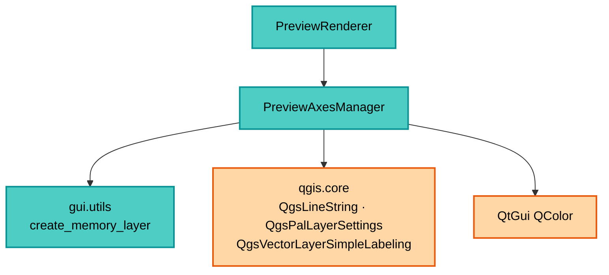

---
tags:
  - secinterp
  - code-walkthrough
  - gui
  - managers
aliases:
  - preview_axes_manager.py
  - PreviewAxesManager
cssclass: secinterp-note
---

# `gui/preview_axes_manager.py`

> [!abstract] One-line summary
> Stateless specialist drawing the preview grid and its labels: "nice" intervals (1-2-5 sequence), Y-axis correction for vertical exaggeration, and label placement with `QgsPalLayerSettings` plus quadrant offsets.

**Path**: `gui/preview_axes_manager.py` (204 lines)
**Main class**: `PreviewAxesManager`
**Layer**: GUI (Present · Axes Manager)
**Tags**: #secinterp #gui #managers

---

## 🎯 Why does this file exist?

A profile without distance/elevation references is unreadable. This manager adds the
reading frame without polluting [[preview_renderer]] with grid geometry:

| Problem | Solution |
|---------|----------|
| Arbitrary intervals (e.g. 37.4 m) are unreadable | `get_nice_interval`: 1-2-5 sequence over powers of 10 |
| The drawn Y axis is exaggerated but must label real values | `_compute_grid` divides by `vert_exag` before picking the interval |
| Mixed grid and labels complicate Z-order | Two separate layers: `create_axes_layer` (lines) and `create_axes_labels_layer` (points) |
| Fixed labels collide with the profile line | Per-quadrant offsets via data-defined properties (`quadrant` + `IF` expression) |
| Recalculating per zoom is cheap to run but costly to design | Stateless class: everything `staticmethod`/`classmethod`, no cache |

> [!important] Architectural note
> **Stateless Present manager.** It keeps nothing between calls; it receives
> `extent + vert_exag` and returns ready layers. [[preview_renderer]] treats it as a
> pure function with QGIS superpowers.

---

## 🧬 Relationship diagram



> [!tip] How to read
> The manager only depends on GUI utilities and the QGIS symbology/labeling API. It
> knows neither core nor data: only the already-combined `extent` passed by the renderer.

---

## 📦 Imports — architectural reading

```python
# gui/preview_axes_manager.py
import math

from qgis.core import (
    QgsFeature, QgsGeometry, QgsLineString, QgsLineSymbol, QgsMarkerSymbol,
    QgsPalLayerSettings, QgsPointXY, QgsProperty, QgsPropertyCollection,
    QgsSingleSymbolRenderer, QgsTextFormat, QgsVectorLayer,
    QgsVectorLayerSimpleLabeling,
)
from qgis.PyQt.QtGui import QColor

from sec_interp.gui.utils import create_memory_layer as make_memory_layer
from sec_interp.logger_config import get_logger
```

| # | Observation |
|---|-------------|
| ① | `math` underpins all computation: `log10`, `floor`, `ceil` for intervals and origins. |
| ② | The longest `qgis.core` block in the preview sub-package: lines, symbols, PAL and labeling. |
| ③ | `QgsLineString([p1, p2])` wrapped in `QgsGeometry(...)`: explicit geometry construction. |
| ④ | `QgsProperty`/`QgsPropertyCollection` = data-defined labels (per-feature offset). |
| ⑤ | `QColor(0,0,0)` only for text; the grid uses a string color (`"200,200,200"`). |
| ⑥ | Shared `make_memory_layer`: CRS consistency with the factory. |
| ⑦ | Zero core imports: axes depend on no DTO. |

---

## 🏗️ Structure inventory

**Class:** `class PreviewAxesManager` — 4 members, all instance-free

- `get_nice_interval(target_step) -> float` (`@staticmethod`)
- `_compute_grid(extent, vert_exag)` (`@classmethod`) → `(x_interval, y_interval, x_start, y_start, y_max_orig)`
- `create_axes_layer(extent, vert_exag=1.0)` (`@classmethod`) → `QgsVectorLayer | None`
- `create_axes_labels_layer(extent, vert_exag=1.0)` (`@classmethod`) → `QgsVectorLayer | None`

**Local constants** (inside `get_nice_interval`):
- `THRESHOLD_QUARTER = 1.5`, `THRESHOLD_HALF = 3.5`, `THRESHOLD_FULL = 7.5`
- `DIV_ONE = 1.0`, `DIV_TWO = 2.0`, `DIV_FIVE = 5.0`

---

## 📁 Files in the package

| File | Role relative to the manager |
|---|---|
| `gui/preview_renderer.py` | Calls `create_axes_layer` + `create_axes_labels_layer` with the combined extent |
| `gui/preview_layer_factory.py` | Creates the data layers defining that extent |
| `gui/utils.py` | Shared `create_memory_layer` |
| `gui/preview_render_mixin.py` | `preserve_extent` zoom reuses the live render's grid |

---

## 📖 Method-by-method walkthrough

### `get_nice_interval` — the 1-2-5 sequence

```python
@staticmethod
def get_nice_interval(target_step: float) -> float:
    if target_step <= 0:
        return 100.0
    exponent = math.floor(math.log10(target_step))
    fraction = target_step / (10**exponent)
    THRESHOLD_QUARTER = 1.5
    THRESHOLD_HALF = 3.5
    THRESHOLD_FULL = 7.5
    DIV_ONE = 1.0
    DIV_TWO = 2.0
    DIV_FIVE = 5.0
    if fraction < THRESHOLD_QUARTER:
        nice_fraction = DIV_ONE
    elif fraction < THRESHOLD_HALF:
        nice_fraction = DIV_TWO
    elif fraction < THRESHOLD_FULL:
        nice_fraction = DIV_FIVE
    else:
        nice_fraction = 10.0
    return nice_fraction * (10**exponent)
```

| Input | Fraction | Output |
|-------|----------|--------|
| `target = 37` | `3.7` → [3.5, 7.5) | `5 × 10 = 50` |
| `target = 120` | `1.2` → < 1.5 | `1 × 100 = 100` |
| `target = 900` | `9.0` → ≥ 7.5 | `10 × 100 = 1000` |
| `target ≤ 0` | — | `100.0` (defensive) |

The typical `target` is `width / 5` (≈ 5 divisions per axis). The `<= 0` guard avoids
`log10(0)` on degenerate extents.

### `_compute_grid` — intervals and origins with VE correction

```python
@classmethod
def _compute_grid(cls, extent, vert_exag):
    width = extent.width()
    height = extent.height()
    x_interval = cls.get_nice_interval(width / 5)
    y_interval = cls.get_nice_interval((height / vert_exag) / 5)
    x_start = math.floor(extent.xMinimum() / x_interval) * x_interval
    y_min_orig = extent.yMinimum() / vert_exag
    y_max_orig = extent.yMaximum() / vert_exag
    y_start = math.floor(y_min_orig / y_interval) * y_interval
    return x_interval, y_interval, x_start, y_start, y_max_orig
```

The key move: `height / vert_exag` restores **true** units before picking the Y
interval, and `y_min/max_orig` de-exaggerate the edges. The grid is thus drawn in
exaggerated coordinates while labels show true elevations. `x_start`/`y_start` snap to
the lower multiple (`floor`), keeping the grid stable under pan.

> [!tip] `y_max_orig` travels in true units
> Creators re-exaggerate when drawing (`y * vert_exag`). The internal contract is:
> X intervals in drawn units, Y interval in true units, mixed origins as documented
> in the tuple.

### `create_axes_layer` — dashed grid lines

```python
@classmethod
def create_axes_layer(cls, extent, vert_exag=1.0):
    if not extent:
        return None
    layer = make_memory_layer("LineString", "Axes")
    if layer is None:
        return None
    provider = layer.dataProvider()
    x_interval, y_interval, x_start, y_start, y_max_orig = cls._compute_grid(extent, vert_exag)
    y_floor = y_start * vert_exag
    y_ceil = (math.ceil(y_max_orig / y_interval) * y_interval) * vert_exag
    features = []
    x = x_start
    last_x = x_start
    while x <= extent.xMaximum() + 0.1:  # Small epsilon
        feat = QgsFeature()
        feat.setGeometry(QgsGeometry(QgsLineString(
            [QgsPointXY(x, y_floor), QgsPointXY(x, y_ceil)])))
        features.append(feat)
        last_x = x
        x += x_interval
    y = y_start
    while y <= y_max_orig + 0.1:
        y_draw = y * vert_exag
        feat = QgsFeature()
        feat.setGeometry(QgsGeometry(QgsLineString(
            [QgsPointXY(x_start, y_draw), QgsPointXY(last_x, y_draw)])))
        features.append(feat)
        y += y_interval
    provider.addFeatures(features)
    symbol = QgsLineSymbol.createSimple(
        {"color": "200,200,200", "width": "0.3", "line_style": "dash"})
    layer.setRenderer(QgsSingleSymbolRenderer(symbol))
    return layer
```

| Decision | Detail |
|----------|--------|
| `+ 0.1` epsilon | Includes the last line even when float math lands just under the edge |
| `last_x` | Horizontals end at the last real vertical, not at `xMaximum` |
| No attributes | Bare `QgsFeature()`: the grid needs no fields |
| Style | Gray `200,200,200`, width `0.3`, `dash`: visible without competing with the profile |

### `create_axes_labels_layer` — invisible points with PAL labels

```python
@classmethod
def create_axes_labels_layer(cls, extent, vert_exag=1.0):
    if not extent:
        return None
    layer = make_memory_layer("Point?field=label:string&field=quadrant:integer",
                              "Axes Labels")
    ...
    # X Axis Labels
    feat.setAttribute("label", f"{x:.0f}")
    feat.setAttribute("quadrant", 7)  # Below
    # Y Axis Labels
    feat.setAttribute("label", f"{y:.0f}")
    feat.setAttribute("quadrant", 3)  # Left
    settings = QgsPalLayerSettings()
    settings.fieldName = "label"
    settings.placement = QgsPalLayerSettings.Placement.OverPoint
    txt_format = QgsTextFormat()
    txt_format.setColor(QColor(0, 0, 0))
    txt_format.setSize(8)
    settings.setFormat(txt_format)
    props = QgsPropertyCollection()
    props.setProperty(QgsPalLayerSettings.Property.OffsetQuad,
                      QgsProperty.fromField("quadrant"))
    props.setProperty(QgsPalLayerSettings.Property.LabelDistance,
                      QgsProperty.fromExpression("IF(quadrant=3, 15, 8)"))
    settings.setDataDefinedProperties(props)
    settings.dist = 8.0  # Fallback
    layer.setLabeling(QgsVectorLayerSimpleLabeling(settings))
    layer.setLabelsEnabled(True)
    symbol = QgsMarkerSymbol.createSimple({"size": "0", "color": "0,0,0,0"})
    layer.setRenderer(QgsSingleSymbolRenderer(symbol))
    return layer
```

| Decision | Detail |
|----------|--------|
| Invisible points | Zero-size transparent marker: they exist only to anchor labels |
| `label` with `:.0f` | No decimals: consistent with 1-2-5 intervals |
| `quadrant` 7/3 | X below, Y left (PAL convention) |
| Data-defined distance | `IF(quadrant=3, 15, 8)`: Y breathes more (15) than X (8); `dist=8.0` fallback |
| Font | System default, size 8, black |

---

## 🔄 Data flow

| Phase | Input | Transformation | Output |
|-------|-------|----------------|--------|
| Compute | `extent` + `vert_exag` | `_compute_grid` | intervals and origins |
| Grid | intervals | vertical/horizontal loops | dashed `Axes` layer |
| Labels | same intervals | points + `label`/`quadrant` + PAL | `Axes Labels` layer |
| Z-order | both layers | renderer: `[labels, *data, axes]` | labels on top, grid at bottom |
| Re-zoom | new extent | full re-render | recalculated grid |

---

## 🏛️ Design patterns present

| Pattern | Where | Purpose |
|---------|-------|---------|
| **Stateless manager** | all `classmethod`/`static` | No lifecycle, no cache |
| **Nice numbers** | `get_nice_interval` | Readable axes (1-2-5) |
| **Dual-layer** | grid vs labels | Independent Z-order |
| **Data-defined labeling** | `quadrant` + `IF(...)` | Per-feature offsets without code |
| **Invisible anchor** | zero-size marker | Labels without symbols |

---

## 🧾 API summary

| Symbol | Signature | Typical use |
|--------|-----------|-------------|
| `PreviewAxesManager` | no useful constructor | Class-level calls |
| `get_nice_interval` | `(target_step: float) -> float` (static) | Direct unit test |
| `_compute_grid` | `(extent, vert_exag) -> tuple` (classmethod) | Base of both layers |
| `create_axes_layer` | `(extent, vert_exag=1.0) -> QgsVectorLayer \| None` | Grid |
| `create_axes_labels_layer` | `(extent, vert_exag=1.0) -> QgsVectorLayer \| None` | Labels |

---

## 🛡️ Error handling

| Situation | Behavior |
|-----------|----------|
| Falsy `extent` | `return None` (both creators) |
| `make_memory_layer` → `None` | `return None` |
| `target_step ≤ 0` | default `100.0` interval |
| Degenerate (zero-width) extent | defensive interval + single-line loop |

> [!note] No custom exceptions
> Soft failures return `None` and the renderer filters them from the final list.

---

## 🧪 Associated tests

- `tests/gui/test_preview_components.py` — `TestPreviewComponents`: nice intervals, axes and label layers with mocked `QgsRectangle`.
- `tests/gui/test_preview_renderer_custom.py` — grid as part of the `render` pipeline.
- `tests/core/test_preview_service.py` — the extent originates from `result.topo` (upstream contract).

---

## 👀 Observations and notes

> [!success] Strengths
> - Rigorous VE correction: drawn exaggerated, labeled in true units.
> - 1-2-5 sequence with named thresholds (`THRESHOLD_*`, `DIV_*`).
> - Data-defined labels with no per-feature Python logic.

> [!warning] Points of attention
> - The `0.1` epsilon is in map units: fine in meters, excessive for degrees or millimeters.
> - `f"{x:.0f}"` drops decimals on small profiles (sub-meter intervals show repeated labels).
> - "Axes" / "Axes Labels" bypass `translate` (unlike the factory).
> - `last_x` as right edge leaves the grid unclosed with a single vertical line.

> [!question] Open questions
> - Relative epsilon (`interval × 1e-6`) instead of absolute `0.1`?
> - Adaptive label format (`:.0f` vs `:.1f`) based on interval size?

---

## 📐 Worked example

A 2400 m long profile, 180 m true elevation range, `vert_exag = 2.0`:

| Quantity | Computation | Value |
|----------|-------------|-------|
| Width | `extent.width()` | `2400` |
| Drawn height | `extent.height()` | `360` (= 180 × 2) |
| X target | `2400 / 5` | `480` → nice `500` |
| Y target | `(360 / 2) / 5` | `36` → nice `50` (true) |
| Verticals | `0, 500, 1000, 1500, 2000` | 5 lines |
| Horizontals | every 50 true m → 100 drawn px | 4–5 lines |
| Y labels | `f"{y:.0f}"` over true `y` | `... 100, 150, 200 ...` |

### Thresholds in action

| `target_step` | Fraction | Branch | Nice |
|---------------|----------|--------|------|
| `480` | `4.8` in `10²` | [3.5, 7.5) → 5 | `500` |
| `36` | `3.6` in `10¹` | [3.5, 7.5) → 5 | `50` |
| `0.02` | `2.0` in `10⁻²` | [1.5, 3.5) → 2 | `0.02` |
| `0` or negative | — | defensive guard | `100.0` |

> [!note] Labels lie honestly
> The 150 true-m line draws at `y = 300` but labels `150`: the user reads true elevation
> over exaggerated geometry. That is the manager's visual contract.

---

## 🔗 Related notes

- [[Index]] — vault index
- [[preview_renderer]] — consumes both layers and sets Z-order
- [[preview_layer_factory]] — data layers defining the extent
- [[preview_page]] — canvas showing the grid
- [[vertical_exaggeration_service]] — the `vert_exag` corrected here
- [[dtos]] — `PreviewResult` behind the extent
- [[dialog_preview_manager]] — renderer owner

---

*Note of the SecInterp Code Walkthrough v2 vault — v3.9.1*
