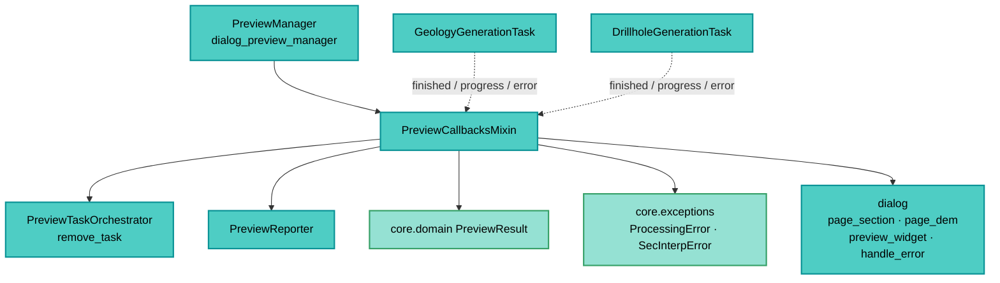

---
tags:
  - secinterp
  - code-walkthrough
  - gui
  - preview
aliases:
  - preview_callbacks_mixin.py
  - PreviewCallbacksMixin
cssclass: secinterp-note
---

# `gui/preview_callbacks_mixin.py`

> [!abstract] One-line summary
> Mixin receiving the async `QgsTask` signals (geology and drillholes): caches each result, re-renders, refreshes the report via `PreviewReporter`, and converts errors into translated `ProcessingError`s.

**Path**: `gui/preview_callbacks_mixin.py` (127 lines)
**Main class**: `PreviewCallbacksMixin`
**Layer**: GUI (Present · Async Callbacks Mixin)
**Tags**: #secinterp #gui #preview

---

## 🎯 Why does this file exist?

The `_on_*` slots would have pushed [[dialog_preview_manager]] past the 300-line dialog
limit (see GUI Stop Conditions). This mixin isolates them:

| Problem | Solution |
|---------|----------|
| The manager mixed lifecycle, rendering and async callbacks | Mixin dedicated to the six signals + two helpers |
| Async results arrive in different shapes (list vs tuple) | Per-branch validation: `isinstance(results, list)` vs tuple ≥ 2 |
| Every arrival must refresh canvas and report | `update_from_checkboxes()` + `_update_results_display()` |
| Background errors arrive as `str` | Wrapped into translated `ProcessingError` via `handle_error` |
| Exceptions in Qt slots are silent/fatal | Double `except`: expected `SecInterpError` & co. with trace, generic as critical |

> [!important] Architectural note
> **Stateless Present mixin.** It defines no `__init__`: it operates on manager
> attributes (`cached_data`, `orchestrator`, `metrics`, `dialog`, `last_result`). It only
> makes sense composed into `PreviewManager`.

---

## 🧬 Relationship diagram



> [!tip] How to read
> Solid arrow = uses/calls; dashed = incoming Qt signal. The mixin is the receiving end
> of the wiring assembled by the orchestrator.

---

## 📦 Imports — architectural reading

```python
# gui/preview_callbacks_mixin.py
from typing import Any

from sec_interp.core.domain import PreviewResult
from sec_interp.core.exceptions import ProcessingError, SecInterpError
from sec_interp.logger_config import get_logger

from .preview_reporter import PreviewReporter
```

| # | Observation |
|---|-------------|
| ① | Zero `qgis.*`: slots run on the UI thread but never touch the QGIS API directly. |
| ② | `PreviewResult` is rebuilt from the cache for the report (it never travels in the signal). |
| ③ | `ProcessingError` wraps async errors; `SecInterpError` bounds the expected `except`. |
| ④ | Single GUI import: `PreviewReporter` (formatting, not widgets). |
| ⑤ | `Any` on signal payloads: the task emits `object` and each slot validates the shape. |

---

## 🏗️ Structure inventory

**Class:** `class PreviewCallbacksMixin` — 8 methods, no `__init__`

**Helpers:**
- `_get_buffer_distance() -> float`
- `_update_results_display() -> None`

**Geology slots:**
- `_on_geology_finished(results)`
- `_on_geology_progress(progress: float)`
- `_on_geology_error(error_msg: str)`

**Drillhole slots:**
- `_on_drillhole_finished(result)`
- `_on_drillhole_progress(progress: float)`
- `_on_drillhole_error(error_msg: str)`

---

## 📁 Files in the package

| File | Role relative to the mixin |
|---|---|
| `gui/dialog_preview_manager.py` | `PreviewManager`: composes it and provides state |
| `gui/preview_task_orchestrator.py` | Connects these signals in each `start_*` |
| `gui/preview_reporter.py` | Formats the refreshed report |
| `gui/preview_render_mixin.py` | `update_from_checkboxes` and `_resolve_vertical_exaggeration` used here |
| `gui/preview_state.py` | `PreviewCache` (`cached_data`) written here |
| `gui/tasks/geology_task.py` | Emits the three geology signals |
| `gui/tasks/drillhole_task.py` | Emits the three drillhole signals |

---

## 📖 Method-by-method walkthrough

### `_get_buffer_distance` — buffer with fallback

```python
def _get_buffer_distance(self) -> float:
    return self.dialog.page_section.buffer_spin.value()
```

Reads the section page spinbox on every report: the rebuilt `PreviewResult` always
carries the live buffer, not the one from compute time.

### `_on_geology_finished` — cache segment list

```python
def _on_geology_finished(self, results: Any) -> None:
    try:
        if results and isinstance(results, list):
            self.cached_data["geol"] = results
            logger.info(f"Async geology finished: {len(results)} segments")
        else:
            self.cached_data["geol"] = None
            logger.debug("Geology task returned no results or invalid format.")
        self.update_from_checkboxes()
        self._update_results_display()
        self.orchestrator.remove_task(self.orchestrator.geology_task)
    except (AttributeError, TypeError, ValueError, SecInterpError) as e:
        logger.exception(f"Error updating UI after async geology: {e}")
    except Exception as e:
        logger.exception(f"Unexpected critical error after async geology: {e}")
```

| Step | Detail |
|------|--------|
| Validation | Only a non-empty `list` is cached; any other shape → `None` |
| Double refresh | Re-render (`update_from_checkboxes`) + report (`_update_results_display`) |
| Anchor | `remove_task` releases the orchestrator reference |
| Errors | Expected ones with trace; unexpected flagged "critical", neither propagates (Qt slots) |

### `_update_results_display` — rebuild and report

```python
def _update_results_display(self) -> None:
    topo = self.cached_data.get("topo")
    if not topo:
        return
    result = PreviewResult(
        topo=topo,
        geol=self.cached_data.get("geol"),
        struct=self.cached_data.get("struct"),
        drillhole=self.cached_data.get("drillhole"),
        buffer_dist=self._get_buffer_distance(),
    )
    auto_vert_exag = self.dialog.page_dem.auto_ve_check.isChecked()
    vert_exag = self._resolve_vertical_exaggeration()
    self.dialog.page_dem.set_auto_ve(vert_exag if auto_vert_exag else None)
    msg = PreviewReporter.format_results_message(
        result, self.metrics, vert_exag=vert_exag, auto_vert_exag=auto_vert_exag)
    self.dialog.preview_widget.results_text.setPlainText(msg)
    self.last_result = result
```

Without topo there is no report (early guard): async callbacks with no base topography
never paint partial text. `set_auto_ve(ve|None)` syncs the adaptive-factor display (see
[[vertical_exaggeration_service]]), and `last_result` feeds auto VE on the next render.

### `_on_geology_progress` / `_on_drillhole_progress` — progress text

```python
def _on_geology_progress(self, progress: float) -> None:
    self.dialog.preview_widget.results_text.setPlainText(
        self.tr("Generating Geology: {}%...").format(progress))

def _on_drillhole_progress(self, progress: float) -> None:
    self.dialog.preview_widget.results_text.setPlainText(
        self.tr("Generating Drillholes: {:.1f}%...").format(progress))
```

Overwrite `results_text` with the percentage (via `self.tr`, translatable). Note the
inherited asymmetry: geology without decimals, drillholes with `{:.1f}`.

### `_on_geology_error` / `_on_drillhole_error` — elevate to domain

```python
def _on_geology_error(self, error_msg: str) -> None:
    logger.error(f"Geology Task Error: {error_msg}")
    error = ProcessingError(self.tr("Geology processing failed: {}").format(error_msg))
    self.dialog.handle_error(error, self.dialog.tr("Geology Error"))

def _on_drillhole_error(self, error_msg: str) -> None:
    logger.error(f"Drillhole Task Error: {error_msg}")
    error = ProcessingError(self.tr("Drillhole processing failed: {}").format(error_msg))
    self.dialog.handle_error(error, self.dialog.tr("Drillhole Error"))
```

The background `str` is elevated to `ProcessingError` ([[exceptions]] hierarchy) with
translated message and title, delivered to `dialog.handle_error` (central messageBar).

### `_on_drillhole_finished` — unpack tuple

```python
def _on_drillhole_finished(self, result: Any) -> None:
    if not result:
        logger.debug("Drillhole task returned no results.")
        return
    MIN_RESULT_PARTS = 2
    try:
        if isinstance(result, tuple) and len(result) >= MIN_RESULT_PARTS:
            _, drill_part = result[:MIN_RESULT_PARTS]
            self.cached_data["drillhole"] = drill_part
            logger.info(f"Async Drillholes finished: {len(drill_part)} holes")
        else:
            logger.warning(f"Unexpected result format from drillhole task: {type(result)}")
            return
        self.update_from_checkboxes()
        self._update_results_display()
        self.orchestrator.remove_task(self.orchestrator.drillhole_task)
    except (AttributeError, TypeError, ValueError, SecInterpError) as e:
        logger.exception(f"Error syncing UI after async drillhole: {e}")
    except Exception as e:
        logger.exception(f"Unexpected critical error after async drillhole: {e}")
```

The task returns `(geol_data_all, drillhole_data_all)`; only the second part matters
here (`result[:2]` tolerates longer tuples). Unexpected shape → `warning` and return
without touching the cache (the live preview is never corrupted).

---

## 🔄 Data flow

| Phase | Input | Transformation | Output |
|-------|-------|----------------|--------|
| Finish signal | `list` (geol) / tuple (drillholes) | shape validation | `cached_data["geol"/"drillhole"]` |
| Re-render | updated cache | `update_from_checkboxes` | canvas with the new branch |
| Report | cache + VE + metrics | `_update_results_display` | `results_text` + `last_result` |
| Progress | `float` 0–100 | `setPlainText` | visible percentage |
| Error | background `str` | `ProcessingError` + `handle_error` | user-facing message |
| Anchor | finished task | `orchestrator.remove_task` | reference released |

---

## 🏛️ Design patterns present

| Pattern | Where | Purpose |
|---------|-------|---------|
| **Mixin** | the class | Split the manager without real inheritance |
| **Slot (Qt Observer)** | `_on_*` | React to signals without polling |
| **Validate-then-cache** | finished | Unexpected shapes never corrupt cache |
| **Error elevation** | `_on_*_error` | `str` → domain `ProcessingError` |
| **Double except** | finished | Expected vs critical, both logged |

---

## 🧾 API summary

| Symbol | Signature | Typical use |
|--------|-----------|-------------|
| `PreviewCallbacksMixin` | no `__init__` | Composed into `PreviewManager` |
| `_on_geology_finished` | `(results: Any)` | Geology slot |
| `_on_drillhole_finished` | `(result: Any)` | Drillhole slot |
| `_on_geology_progress` | `(progress: float)` | Geology progress |
| `_on_drillhole_progress` | `(progress: float)` | Drillhole progress |
| `_on_geology_error` | `(error_msg: str)` | Geology error |
| `_on_drillhole_error` | `(error_msg: str)` | Drillhole error |
| `_update_results_display` | `()` | Rebuild report |
| `_get_buffer_distance` | `() -> float` | Live buffer |

---

## 🛡️ Error handling

| Situation | Behavior |
|-----------|----------|
| Unexpectedly shaped result | `None` or return without touching cache |
| UI refresh failure | `logger.exception` (expected) or "critical" (generic) |
| Background error | translated `ProcessingError` + `handle_error` |
| No topo in cache | report silently skipped |

---

## 🧪 Associated tests

- `tests/gui/test_dialog_preview_manager.py` — slots with mocked results, cache + report verification.
- `tests/gui/test_preview_task_orchestrator.py` — wiring of these signals.
- `tests/gui/tasks/test_geology_task.py`, `tests/gui/tasks/test_drillhole_task.py` — real emitted payloads.
- `tests/core/test_preview_service.py` — shape of cached `geol`/`drillhole`.

---

## 👀 Observations and notes

> [!success] Strengths
> - Shape validation before caching: a corrupt task never breaks the preview.
> - Cache-rebuilt report: coherent even when branches arrive out of order.
> - Errors elevated to domain with i18n and a central channel (`handle_error`).

> [!warning] Points of attention
> - Asymmetric progress formats (`{}` vs `{:.1f}`).
> - `_on_drillhole_finished` returns without `remove_task` on unexpected shape: the anchor survives until the next `cancel_active_tasks`.
> - `last_result` is set in `_update_results_display`, not in render: a topo-less preview leaves auto VE on the previous result.

> [!question] Open questions
> - Unify progress formatting in a shared helper?
> - Release the anchor on the unexpected-shape branch too?

---

## 🔀 Signal matrix

| Signal | Slot | Payload | Cache effect |
|--------|------|---------|--------------|
| `geology.finished_with_results` | `_on_geology_finished` | `list[GeologySegment]` | `cached_data["geol"]` |
| `geology.progress_changed` | `_on_geology_progress` | `float` | none (text) |
| `geology.error_occurred` | `_on_geology_error` | `str` | none (error dialog) |
| `drillhole.finished_with_results` | `_on_drillhole_finished` | `(geol_all, drill_all)` | `cached_data["drillhole"]` |
| `drillhole.progress_changed` | `_on_drillhole_progress` | `float` | none (text) |
| `drillhole.error_occurred` | `_on_drillhole_error` | `str` | none (error dialog) |

---

## ⏱️ Arrival order and re-entry

Async branches finish in any order; the design tolerates it:

| Scenario | Behavior |
|----------|----------|
| Geology before drillholes | two renders: one with geol, one with geol+drillholes |
| Drillholes before geology | symmetric: drillhole first, then both |
| Double `finished` (retry) | cache overwritten; render is idempotent |
| `finished` after close | impossible when `cancel_active_tasks` ran on close |
| `progress` after `finished` | final report overwrites progress text |
| Error in one branch | the other continues: partial preview with "No data" on the failed one |

> [!tip] Idempotency as contract
> `update_from_checkboxes` + `_update_results_display` may run N times on the same
> cache: the visible result is always the latest complete state.

---

## 🧪 Accepted payload shapes

| Payload | Branch | Slot decision |
|---------|--------|---------------|
| non-empty `list` | geology | caches |
| empty `list` / `None` / other type | geology | `cached_data["geol"] = None` |
| tuple `len ≥ 2` | drillholes | caches `result[1]` |
| short tuple / non-tuple / `None` | drillholes | `warning`/`debug`, cache untouched |
| `float` 0–100 | progress | text in `results_text` |
| `str` | error | `ProcessingError` + `handle_error` |

---

## 🔗 Related notes

- [[Index]] — vault index
- [[dialog_preview_manager]] — manager composing the mixin
- [[preview_task_orchestrator]] — connects these signals
- [[preview_render_mixin]] — `update_from_checkboxes`, VE and LOD
- [[preview_reporter]] — report refreshed here
- [[preview_state]] — cache written here
- [[drillhole_task]] / [[geology_task]] — signal emitters
- [[vertical_exaggeration_service]] — VE auto display
- [[preview_page]] — `results_text` target

---

*Note of the SecInterp Code Walkthrough v2 vault — v3.9.0*
