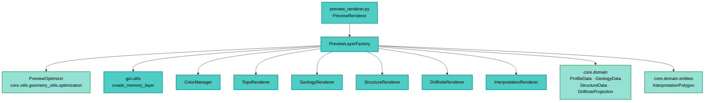

---
tags:
  - secinterp
  - code-walkthrough
  - gui
  - preview
aliases:
  - preview_layer_factory.py
  - PreviewLayerFactory
cssclass: secinterp-note
note_lines: 700
---

# `gui/preview_layer_factory.py`

> [!abstract] One-line summary
> Factory that turns each branch of the `PreviewResult` (topography, geology, structures, drillholes, interpretations) into styled QGIS memory layers, applying vertical exaggeration and LOD decimation before handing them to the canvas.

**Path**: `gui/preview_layer_factory.py` (471 lines)
**Main class**: `PreviewLayerFactory`
**Layer**: GUI (Present · Factory + QGIS Adapter)
**Tags**: #secinterp #gui #preview

---

## 🎯 Why does this file exist?

The core produces pure data (`PreviewResult` with tuple lists and DTOs) while the
canvas only understands `QgsVectorLayer`. This factory bridges both worlds:

| Problem | Solution |
|---------|----------|
| The `PreviewResult` cannot be shown on the canvas directly | One `create_*_layer` method per result branch |
| Each branch needs different symbology (polychrome, units, dips) | Delegation to specialized renderers (`topo`, `geology`, `structure`, `drillhole`, `interpretation`) |
| Profiles with thousands of points stall rendering | Decimation via `PreviewOptimizer` (`decimate` / `adaptive_sample`) with `max_points` |
| Vertical exaggeration must apply at draw time, not compute time | `_apply_exaggeration` multiplies `e * vert_exag` during `QgsPointXY` conversion |
| Geometries with 0–1 points break `fromPolylineXY` | `MIN_REQUIRED_POINTS` guards returning `None` |

> [!important] Architectural note
> **Factory + Present Adapter.** It lives entirely in the *Present* phase of the
> Extract-then-Compute pattern: it never computes geology, it only translates core
> DTOs into QGIS objects and styles them. It is the only place that knows how to
> build the preview's temporary layers.

---

## 🧬 Relationship diagram



> [!tip] How to read
> Solid arrow = imports/delegates. The factory inherits from nothing: it composes six
> collaborators (one color manager + five renderers) and coordinates them per method.

---

## 📦 Imports — architectural reading

```python
# gui/preview_layer_factory.py
import math
from typing import TYPE_CHECKING, Any

from qgis.core import QgsFeature, QgsGeometry, QgsPointXY, QgsVectorLayer
from qgis.PyQt.QtGui import QColor

from sec_interp.core.domain import DrillholeProjection, GeologyData, ProfileData, StructureData
from sec_interp.core.domain.entities import InterpretationPolygon
from sec_interp.core.utils.geometry_utils.optimization import PreviewOptimizer
from sec_interp.gui.utils import create_memory_layer as make_memory_layer
from sec_interp.logger_config import get_logger

if TYPE_CHECKING:
    from qgis.core import QgsVectorDataProvider
    from sec_interp.gui.renderers.color_manager import ColorManager  # noqa: F401
    from sec_interp.gui.renderers.drillhole_renderer import DrillholeRenderer  # noqa: F401
    from sec_interp.gui.renderers.geology_renderer import GeologyRenderer  # noqa: F401
    from sec_interp.gui.renderers.structure_renderer import StructureRenderer  # noqa: F401
    from sec_interp.gui.renderers.topo_renderer import TopoRenderer  # noqa: F401
```

| # | Observation |
|---|-------------|
| ① | `math` is only used in `create_struct_layer` (apparent-dip trigonometry). |
| ② | `QgsFeature / QgsGeometry / QgsPointXY / QgsVectorLayer` confirm the GUI layer: core never imports them. |
| ③ | `QColor` (QtGui, not `qgis.core`) appears only in the `get_color_for_unit` signature. |
| ④ | From core only **data types** enter (`ProfileData`, `GeologyData`, `StructureData`, `DrillholeProjection`, `InterpretationPolygon`) plus the pure `PreviewOptimizer`. |
| ⑤ | `make_memory_layer` (`gui.utils`) centralizes creation with the project CRS; the factory never touches `QgsProject`. |
| ⑥ | The `TYPE_CHECKING` block avoids circular imports with the renderers (typing only). |
| ⑦ | The real renderer imports live **inside `__init__`** (lazy) with `noqa: F811` — see walkthrough. |

---

## 🏗️ Structure inventory

**Class:** `class PreviewLayerFactory` — 1 property with setter + 15 methods

**Construction and compatibility:**
- `__init__()`
- `active_units` (compatibility property + setter)
- `get_color_for_unit(name) -> QColor`

**Internal primitives:**
- `_apply_exaggeration(points, vert_exag)`
- `_to_qgs_points(points)`
- `create_memory_layer(geometry_type, name, fields=None)`

**Layer creators (one per `PreviewResult` branch):**
- `create_topo_layer(topo_data, vert_exag, max_points, use_adaptive_sampling)`
- `create_topo_fill_layer(topo_data, vert_exag, max_points, base_elevation)`
- `create_geol_layer(geol_data, vert_exag, max_points)`
- `create_struct_layer(struct_data, reference_data, vert_exag, dip_line_length)`
- `create_drillhole_trace_layer(drillhole_data, vert_exag)`
- `create_drillhole_interval_layer(drillhole_data, vert_exag)`
- `create_interp_layer(interp_data, vert_exag)`

**Drillhole helpers:**
- `_extract_trace_data(hole_data)`
- `_create_trace_feature(hole_id, trace_points, fields, vert_exag)`
- `_collect_all_segments(drillhole_data)`
- `_create_interval_features(all_segments, fields, vert_exag, unique_units)`

---

## 📁 Files in the package

The factory belongs to the `gui/` root and collaborates with these sibling modules:

| File | Role relative to the factory |
|---|---|
| `gui/preview_renderer.py` | Orchestrator calling the `create_*_layer` methods and assembling Z-order |
| `gui/preview_axes_manager.py` | Grid/label layers (bypass the factory) |
| `gui/preview_legend_renderer.py` | Legend; reads `active_units` from the factory |
| `gui/renderers/color_manager.py` | `ColorManager`: stable color per geological unit |
| `gui/renderers/topo_renderer.py` | `TopoRenderer.apply_style`: elevation polychromy |
| `gui/renderers/geology_renderer.py` | `GeologyRenderer.apply_style(layer, unique_units=...)` |
| `gui/renderers/structure_renderer.py` | `StructureRenderer.apply_style`: dip ticks + topo fill |
| `gui/renderers/drillhole_renderer.py` | `DrillholeRenderer.apply_style(layer, role=..., unique_units=...)` |
| `gui/renderers/interpretation_renderer.py` | `InterpretationRenderer.apply_style(layer, interp_data=...)` |
| `gui/utils.py` | `create_memory_layer(uri, name)` with the project CRS |

---

## 📖 Method-by-method walkthrough

### `__init__` — lazy renderer composition

```python
def __init__(self) -> None:
    from sec_interp.gui.renderers.color_manager import ColorManager  # noqa: F811
    from sec_interp.gui.renderers.drillhole_renderer import DrillholeRenderer  # noqa: F811
    from sec_interp.gui.renderers.geology_renderer import GeologyRenderer  # noqa: F811
    from sec_interp.gui.renderers.interpretation_renderer import InterpretationRenderer
    from sec_interp.gui.renderers.structure_renderer import StructureRenderer  # noqa: F811
    from sec_interp.gui.renderers.topo_renderer import TopoRenderer  # noqa: F811

    self.color_manager: ColorManager = ColorManager()
    self.topo_renderer: TopoRenderer = TopoRenderer()
    self.geol_renderer: GeologyRenderer = GeologyRenderer(self.color_manager)
    self.struct_renderer: StructureRenderer = StructureRenderer()
    self.drill_renderer: DrillholeRenderer = DrillholeRenderer(self.color_manager)
    self.interp_renderer: InterpretationRenderer = InterpretationRenderer()
```

Deferred imports break the `preview_layer_factory ↔ renderers` cycle (renderers are
only typed against the factory under `TYPE_CHECKING`). `geol_renderer` and
`drill_renderer` **share** the same `ColorManager`, so a lithological unit gets the
identical color on the profile trace and on drillhole intervals. See [[gui_renderers]].

### `active_units` — compatibility property

```python
@property
def active_units(self) -> dict[str, Any]:
    return self.color_manager._active_units

@active_units.setter
def active_units(self, value: dict[str, Any]) -> None:
    if not value:
        self.color_manager._active_units = {}
```

Exposes the `ColorManager`'s internal unit registry so [[preview_renderer]] and
[[preview_legend_renderer]] can read the legend without knowing the color manager.
The setter only accepts clearing (`if not value`): it is the hook used by
`PreviewRenderer._cleanup_layers` to reset the legend on cleanup. It reaches into the
private `_active_units` attribute — a deliberate, documented coupling.

### `get_color_for_unit` — stable color per name

```python
def get_color_for_unit(self, name: str) -> QColor:
    return self.color_manager.get_color(name)
```

Pure delegation. Guarantees a deterministic per-unit color across renders (the manager
memoizes by name).

### `_apply_exaggeration` + `_to_qgs_points` — the two primitives

```python
def _apply_exaggeration(self, points, vert_exag):
    return [(d, e * vert_exag) for d, e in points]

def _to_qgs_points(self, points):
    return [QgsPointXY(x, y) for x, y in points]
```

All preview vertical exaggeration flows through here: only `e` (elevation) is scaled,
never `d` (distance). The core computes in true elevations and the GUI exaggerates at
draw time, which is why VE can change without regenerating the `PreviewResult`.
`_to_qgs_points` is the single tuple→QGIS conversion.

### `create_memory_layer` — project-CRS wrapper

```python
def create_memory_layer(self, geometry_type, name, fields=None):
    uri = geometry_type
    if fields:
        uri += f"?{fields}"
    layer = make_memory_layer(uri, name)
    if layer is None:
        return None, None
    return layer, layer.dataProvider()
```

Builds the URI (`"LineString?field=elev:double"`) and delegates to `gui.utils`.
Returns `(None, None)` on creation failure so each creator aborts with
`if not layer: return None`. CRS resolution belongs to `make_memory_layer`, not the factory.

### `create_topo_layer` — polychromatic profile segments

```python
def create_topo_layer(self, topo_data, vert_exag=1.0, max_points=1000,
                      use_adaptive_sampling=False):
    MIN_REQUIRED_POINTS = 2
    if not topo_data or len(topo_data) < MIN_REQUIRED_POINTS:
        return None
    if use_adaptive_sampling:
        render_data = PreviewOptimizer.adaptive_sample(topo_data, max_points=max_points)
    else:
        render_data = PreviewOptimizer.decimate(topo_data, max_points=max_points)
    layer, provider = self.create_memory_layer("LineString", "Topography",
                                               "field=elev:double")
    if not layer:
        return None
    features = []
    for i in range(len(render_data) - 1):
        p1, p2 = render_data[i], render_data[i + 1]
        line_points = self._to_qgs_points(self._apply_exaggeration([p1, p2], vert_exag))
        line_geom = QgsGeometry.fromPolylineXY(line_points)
        feat = QgsFeature(layer.fields())
        feat.setGeometry(line_geom)
        avg_elev = (p1[1] + p2[1]) / 2.0
        feat.setAttribute("elev", avg_elev)
        features.append(feat)
    if not features:
        return None
    provider.addFeatures(features)
    self.topo_renderer.apply_style(layer)
    layer.updateExtents()
    return layer
```

| Decision | Detail |
|----------|--------|
| LOD | `adaptive_sample` when the render mixin requests it, otherwise `decimate`; both honor `max_points` |
| One feature per span | Enables per-segment coloring (polychromy) using `avg_elev` as attribute |
| `elev:double` field | Consumed by `TopoRenderer` for the elevation gradient |
| Closing | `apply_style` + `updateExtents` before returning |

### `create_topo_fill_layer` — curtain under the profile

```python
def create_topo_fill_layer(self, topo_data, vert_exag=1.0, max_points=1000,
                           base_elevation=None):
    ...
    render_data = PreviewOptimizer.decimate(topo_data, max_points=max_points)
    layer, provider = self.create_memory_layer(
        "Polygon", QCoreApplication.translate("PreviewLayerFactory", "Topography Fill"))
    elevs = [p[1] for p in topo_data]
    if base_elevation is None:
        base_elevation = min(elevs) - (max(elevs) - min(elevs)) * 0.2
    base_y = base_elevation * vert_exag
    poly_points = [QgsPointXY(d, e * vert_exag) for d, e in render_data]
    poly_points.append(QgsPointXY(render_data[-1][0], base_y))
    poly_points.append(QgsPointXY(render_data[0][0], base_y))
    poly_points.append(QgsPointXY(render_data[0][0], render_data[0][1] * vert_exag))
    geom = QgsGeometry.fromPolygonXY([poly_points])
```

Builds the "curtain" polygon: top edge = profile, closed at the base with a 20 % range
margin. The name goes through `QCoreApplication.translate` (i18n). Styling reuses
`struct_renderer.apply_style` (simple fill, flagged as provisional in a code comment).

### `create_geol_layer` — one feature per lithological segment

```python
def create_geol_layer(self, geol_data, vert_exag=1.0, max_points=1000):
    if not geol_data:
        return None
    layer, provider = self.create_memory_layer("LineString", "Geology",
                                               "field=unit:string")
    unique_units = {s.unit_name for s in geol_data}
    for segment in geol_data:
        if not segment.points or len(segment.points) < MIN_REQUIRED_POINTS:
            continue
        render_points = PreviewOptimizer.decimate(segment.points, max_points=max_points)
        ...
        feat.setAttribute("unit", segment.unit_name)
    provider.addFeatures(features)
    self.geol_renderer.apply_style(layer, unique_units=unique_units)
```

Each `GeologySegment` is decimated **separately** (`max_points` applies per segment, not
globally). `unique_units` feeds both the categorized renderer and the legend via
`active_units`. Segments with fewer than 2 points are skipped silently.

### `create_struct_layer` — apparent-dip ticks

```python
def create_struct_layer(self, struct_data, reference_data, vert_exag=1.0,
                        dip_line_length=None):
    if not struct_data:
        return None
    ...
    if dip_line_length is not None and dip_line_length > 0:
        line_length = dip_line_length
    else:
        elevs = [e for _, e in reference_data] if reference_data else []
        e_range = (max(elevs) - min(elevs)) if elevs else 100
        line_length = e_range * 0.1
    for m in struct_data:
        rad_dip = math.radians(abs(m.apparent_dip))
        dx = line_length * math.cos(rad_dip)
        dy = line_length * math.sin(rad_dip)
        if m.apparent_dip < 0:
            dx = -dx
        points = [(m.distance, m.elevation), (m.distance + dx, m.elevation - dy)]
```

| Decision | Detail |
|----------|--------|
| Length | Manual (`dip_line_length`) or 10 % of the reference elevation range |
| Reference | `reference_data` = topo when present; otherwise the renderer passes geology points |
| Sign | `apparent_dip < 0` flips `dx` (dip toward the other side) |
| Drawing | The tick hangs downward (`elev - dy`) from the measurement point |

### `create_drillhole_trace_layer` — traces with `hole_id`

```python
def create_drillhole_trace_layer(self, drillhole_data, vert_exag=1.0):
    ...
    layer, provider = self.create_memory_layer(
        "LineString",
        QCoreApplication.translate("PreviewLayerFactory", "Drillhole Traces"),
        "field=hole_id:string")
    for hole_data in drillhole_data:
        hole_id, trace_points = self._extract_trace_data(hole_data)
        feat = self._create_trace_feature(hole_id, trace_points, layer.fields(), vert_exag)
        if feat:
            features.append(feat)
    self.drill_renderer.apply_style(layer, role="trace")
```

Accepts both `DrillholeProjection` and legacy `(hole_id, points, ...)` tuples via
`_extract_trace_data`. Emits `debug`/`info`/`warning` logs with counts, useful for
diagnosing drillhole-less previews.

### `_extract_trace_data` + `_create_trace_feature` — DTO/tuple duality

```python
def _extract_trace_data(self, hole_data):
    if isinstance(hole_data, DrillholeProjection):
        return hole_data.hole_id, hole_data.points_3d
    return hole_data[0], hole_data[1]

def _create_trace_feature(self, hole_id, trace_points, fields, vert_exag):
    MIN_TRACE_POINTS = 2
    if not trace_points or len(trace_points) < MIN_TRACE_POINTS:
        return None
    render_points = []
    for p in trace_points:
        dist = getattr(p, "dist_along", p[0] if isinstance(p, list | tuple) else 0.0)
        z = getattr(p, "z", p[1] if isinstance(p, list | tuple) else 0.0)
        render_points.append((dist, z))
```

The `getattr`-with-fallback accepts 3D points with attributes (`dist_along`, `z`) or
flat `(dist, z)` pairs. A defensive pattern for data arriving from the async
[[drillhole_task]].

### `create_drillhole_interval_layer` — lithological intervals

```python
def create_drillhole_interval_layer(self, drillhole_data, vert_exag=1.0):
    all_segments = self._collect_all_segments(drillhole_data)
    if not all_segments:
        return None
    ...
    unique_units = set()
    features = self._create_interval_features(all_segments, layer.fields(),
                                              vert_exag, unique_units)
    provider.addFeatures(features)
    self.drill_renderer.apply_style(layer, role="interval", unique_units=unique_units)
```

Separates traces (hole geometry, `role="trace"`) from intervals (lithology,
`role="interval"`): two layers, two styles, same source. `unique_units` is filled as a
side effect inside `_create_interval_features`.

### `_collect_all_segments` + `_create_interval_features` — flattening

```python
def _collect_all_segments(self, drillhole_data):
    for hole_data in drillhole_data:
        if isinstance(hole_data, DrillholeProjection):
            segments = hole_data.segments
        else:
            segments = hole_data[-1] if len(hole_data) >= 3 else []
        if segments and isinstance(segments, list):
            all_segments.extend(segments)
```

Flattens every hole's segments into a single list; each feature carries the `unit`
attribute with `segment.unit_name` for the categorized renderer.

### `create_interp_layer` — interpretation polygons

```python
def create_interp_layer(self, interp_data, vert_exag=1.0):
    if not interp_data:
        return None
    layer, provider = self.create_memory_layer(
        "Polygon", "Interpretations", "field=id:string&field=name:string")
    MIN_POLYGON_POINTS = 3
    for interp in interp_data:
        if not interp.vertices_2d or len(interp.vertices_2d) < MIN_POLYGON_POINTS:
            continue
        points = [QgsPointXY(x, y * vert_exag) for x, y in interp.vertices_2d]
        if points[0] != points[-1]:
            points.append(points[0])
        geom = QgsGeometry.fromPolygonXY([points])
        feat.setAttribute("id", interp.id)
        feat.setAttribute("name", interp.name)
    self.interp_renderer.apply_style(layer, interp_data=interp_data)
```

Closes the ring when needed (a `QgsGeometry` requirement), applies VE to `y` only, and
passes `interp_data` to the renderer so it can recover color/visibility per id.

---

## 🔄 Data flow

| Phase | Input | Transformation | Output |
|-------|-------|----------------|--------|
| Result branch | `result.topo / geol / struct / drillhole` (+ `interp_data`) | `create_*_layer` with `vert_exag` and `max_points` | Styled `QgsVectorLayer` or `None` |
| LOD | full profile | `PreviewOptimizer.decimate / adaptive_sample` | point subset |
| Exaggeration | real `(d, e)` | `_apply_exaggeration` | `(d, e × VE)` |
| Conversion | tuples | `_to_qgs_points` → `fromPolylineXY / fromPolygonXY` | `QgsGeometry` |
| Styling | unstyled layer | `*_renderer.apply_style` | canvas-ready layer |
| Empty | empty branch or < 2 points | early guard | `None` (renderer filters it from Z-order) |

---

## 🏛️ Design patterns present

| Pattern | Where | Purpose |
|---------|-------|---------|
| **Factory** | `create_*_layer` | Centralize temporary-layer construction |
| **Adapter (Present)** | whole class | Translate core DTOs into QGIS objects |
| **Delegation** | `*_renderer.apply_style` | Symbology lives in specialists, not the factory |
| **Shared collaborator** | shared `ColorManager` | Consistent color across geology and drillholes |
| **Lazy import** | `__init__` | Break circular imports with renderers |
| **Null return** | `None` on empty branches | The orchestrator filters without `try/except` |
| **Dual-format input** | `_extract_trace_data`, `_collect_all_segments` | Accept modern DTO and legacy tuple |

---

## 🧾 API summary

| Symbol | Signature | Typical use |
|--------|-----------|-------------|
| `PreviewLayerFactory` | `__init__()` no args | Composed by `PreviewRenderer` |
| `active_units` | property `dict[str, Any]` + setter | Legend and cleanup |
| `get_color_for_unit` | `(name: str) -> QColor` | Stable color per unit |
| `create_memory_layer` | `(geometry_type, name, fields=None) -> tuple` | Base of all creators |
| `create_topo_layer` | `(topo_data, vert_exag=1.0, max_points=1000, use_adaptive_sampling=False)` | Polychromatic profile |
| `create_topo_fill_layer` | `(topo_data, vert_exag=1.0, max_points=1000, base_elevation=None)` | Curtain under the profile |
| `create_geol_layer` | `(geol_data, vert_exag=1.0, max_points=1000)` | Per-unit segments |
| `create_struct_layer` | `(struct_data, reference_data, vert_exag=1.0, dip_line_length=None)` | Dip ticks |
| `create_drillhole_trace_layer` | `(drillhole_data, vert_exag=1.0)` | Traces with `hole_id` |
| `create_drillhole_interval_layer` | `(drillhole_data, vert_exag=1.0)` | Intervals with `unit` |
| `create_interp_layer` | `(interp_data: list[InterpretationPolygon], vert_exag=1.0)` | Interpretation polygons |

---

## 🛡️ Error handling

| Situation | Behavior |
|-----------|----------|
| Empty / `None` result branch | Early `return None` (no exception) |
| Fewer than 2 points (3 for polygons) | Feature or whole layer skipped |
| `make_memory_layer` returns `None` | `(None, None)` → creator returns `None` |
| No drillholes | log `warning` + `None` (diagnosable) |
| No features left after filtering | `None` before `addFeatures` |

> [!note] No domain exceptions
> The factory never raises `SecInterpError`: soft failures are expressed with `None`
> and the orchestrator decides. Hard errors (styling, project) propagate.

---

## 🧪 Associated tests

Mock-first coverage (no real QGIS, via `tests/base_test.py`):

- `tests/gui/test_preview_components.py` — `TestPreviewComponents`: per-unit color, topo/geol/struct layers; header cites (`PreviewLayerFactory`, `PreviewAxesManager`, `PreviewRenderer`).
- `tests/gui/test_preview_renderer_custom.py` — custom `dip_line_length` on the structural branch.
- `tests/gui/renderers/test_renderers.py` — styles applied by the delegated renderers.
- `tests/core/test_preview_service.py` — the `PreviewResult` feeding the factory (input contract).

---

## 👀 Observations and notes

> [!success] Strengths
> - One creator per branch: adding new data never touches existing ones.
> - VE applied at draw time only: changing it never recomputes.
> - Per-segment LOD and decimation keep rendering fluid.
> - DTO/tuple duality in drillholes eases progressive migration.

> [!warning] Points of attention
> - `create_topo_fill_layer` reuses `struct_renderer.apply_style` (provisional fill, see code comment).
> - `max_points` in geology applies **per segment**, not globally: many small segments multiply features.
> - `active_units` reaches into the color manager's private `_active_units`.
> - "Topography Fill", "Drillhole Traces/Intervals" use `translate`; "Topography", "Geology", "Structures", "Interpretations" do not.

> [!question] Open questions
> - Unify `max_points` as a global budget for geology with many segments?
> - Give the topo fill its own style instead of reusing the structural one?

---

## 🔗 Related notes

- [[Index]] — vault index
- [[preview_service]] — produces the `PreviewResult` consumed by the factory
- [[preview_renderer]] — orchestrator calling the `create_*_layer` methods
- [[dialog_preview_manager]] — owner of the renderer and its lifecycle
- [[preview_page]] — page hosting the canvas and legend
- [[dtos]] — `PreviewResult`, `ProfileData`, `GeologyData`, `StructureData`
- [[optimization]] — `PreviewOptimizer.decimate / adaptive_sample`
- [[gui_renderers]] — specialized renderers and `ColorManager`
- [[vertical_exaggeration_service]] — computes the `vert_exag` applied here
- [[drillhole_task]] — async source of `drillhole_data`
- [[layer_notification_manager]] — invalidates caches when base layers change

---

*Note of the SecInterp Code Walkthrough v2 vault — v3.9.0*
