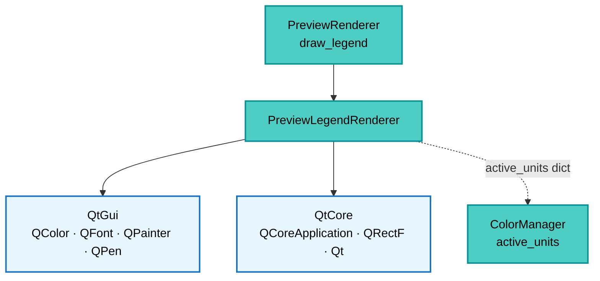

---
tags:
  - secinterp
  - code-walkthrough
  - gui
  - renderers
aliases:
  - preview_legend_renderer.py
  - PreviewLegendRenderer
cssclass: secinterp-note
---

# `gui/preview_legend_renderer.py`

> [!abstract] One-line summary
> Draws the preview legend on a `QPainter`: a translucent top-right box with the blue topography line, red structures line and per-unit swatches, auto-sized from `fontMetrics`.

**Path**: `gui/preview_legend_renderer.py` (178 lines)
**Main class**: `PreviewLegendRenderer`
**Layer**: GUI (Present · Legend Renderer)
**Tags**: #secinterp #gui #renderers

---

## 🎯 Why does this file exist?

The canvas shows temporary layers kept out of the project legend (registered with
`addMapLayer(layer, False)`), so the preview needs its own painted legend:

| Problem | Solution |
|---------|----------|
| Temporaries never appear in the QGIS legend | Hand-painted legend with `QPainter` over the canvas |
| Unit count varies per preview | `_calculate_legend_size` measures each string with `fontMetrics` |
| Topography and structures are optional | `has_topography` / `has_structures` flags with early exit when all empty |
| Literals must be translated | `QCoreApplication.translate("PreviewLegendRenderer", ...)` |
| Painting must not leak into the canvas | `painter.save()` / `restore()`: font and pens restored |

> [!important] Architectural note
> **Stateless immediate renderer.** All `staticmethod`, no constructor, no state: in go
> `painter + rect + units + flags`, out go pixels. [[preview_renderer]] only forwards.

---

## 🧬 Relationship diagram



> [!tip] How to read
> Solid arrow = calls/imports; dashed = the `active_units` dict (name → `QColor`) produced
> in the `ColorManager` and traveling via factory and renderer.

---

## 📦 Imports — architectural reading

```python
# gui/preview_legend_renderer.py
from typing import Any

from qgis.PyQt.QtCore import QCoreApplication, QRectF, Qt
from qgis.PyQt.QtGui import QColor, QFont, QPainter, QPen

from sec_interp.logger_config import get_logger
```

| # | Observation |
|---|-------------|
| ① | Zero `qgis.core`: the legend touches no layers or geometries, only Qt pixels. |
| ② | `QPainter` only as a type: the canvas creates the painter, the renderer just paints. |
| ③ | `QCoreApplication.translate` for "Topography"/"Structures" (real i18n). |
| ④ | `Qt.PenStyle / Qt.BrushStyle / Qt.AlignmentFlag` with namespaced enums (QGIS 4/Qt6 style). |
| ⑤ | `Any` only in the layout `config: dict[str, Any]`. |
| ⑥ | `logger` defined but never called: painting stays silent (paint hot path). |

---

## 🏗️ Structure inventory

**Class:** `class PreviewLegendRenderer` — 5 `staticmethod`s

- `draw_legend(painter, rect, active_units, has_topography=False, has_structures=False)`
- `_calculate_legend_size(painter, active_units, has_topo, has_struct, config)` → `(QRectF, max_text_width)`
- `_draw_legend_background(painter, x, y, width, height)`
- `_draw_line_item(painter, x, y, label, color, max_width, config)`
- `_draw_geology_items(painter, x, y, units, max_width, config)`

**Layout configuration** (dict in `draw_legend`):
- `padding = 6`, `item_height = 16`, `symbol_size = 10`, `line_width = 2`, `margin = 20`

---

## 📁 Files in the package

| File | Role relative to the legend |
|---|---|
| `gui/preview_renderer.py` | `draw_legend(painter, rect)` forwards units + flags |
| `gui/preview_layer_factory.py` | `active_units` (via `ColorManager`) feeds geological rows |
| `gui/renderers/color_manager.py` | Produces the per-unit `QColor`s |
| `gui/ui/pages/preview_page.py` | Page/canvas triggering the paint (see [[preview_page]]) |

---

## 📖 Method-by-method walkthrough

### `draw_legend` — vertical composition

```python
@staticmethod
def draw_legend(painter, rect, active_units, has_topography=False, has_structures=False):
    if not active_units and not has_topography and not has_structures:
        return
    config = {"padding": 6, "item_height": 16, "symbol_size": 10,
              "line_width": 2, "margin": 20}
    painter.save()
    painter.setFont(QFont("Arial", 8))
    legend_size, max_text_width = PreviewLegendRenderer._calculate_legend_size(
        painter, active_units, has_topography, has_structures, config)
    x = rect.width() - legend_size.width() - config["margin"]
    y = config["margin"]
    PreviewLegendRenderer._draw_legend_background(
        painter, x, y, legend_size.width(), legend_size.height())
    current_y = y + config["padding"]
    if has_topography:
        PreviewLegendRenderer._draw_line_item(
            painter, x, current_y,
            QCoreApplication.translate("PreviewLegendRenderer", "Topography"),
            QColor(0, 102, 204), max_text_width, config)
        current_y += config["item_height"]
    if has_structures:
        PreviewLegendRenderer._draw_line_item(
            painter, x, current_y,
            QCoreApplication.translate("PreviewLegendRenderer", "Structures"),
            QColor(204, 0, 0), max_text_width, config)
        current_y += config["item_height"]
    PreviewLegendRenderer._draw_geology_items(
        painter, x, current_y, active_units, max_text_width, config)
    painter.restore()
```

| Step | Detail |
|------|--------|
| Early exit | No rows → no box (canvas stays clean on empty previews) |
| Position | Top-right: `rect.width() - legend_width - margin`, `y = margin` |
| Fixed order | Topography → structures → units (dict insertion) |
| Canonical colors | Topo blue `(0,102,204)`, struct red `(204,0,0)` |
| Vertical cursor | `current_y` advances `item_height` per row |

### `_calculate_legend_size` — measure before painting

```python
@staticmethod
def _calculate_legend_size(painter, active_units, has_topo, has_struct, config):
    fm = painter.fontMetrics()
    max_text_width = 0
    items = []
    if has_topo:
        items.append(QCoreApplication.translate("PreviewLegendRenderer", "Topography"))
    if has_struct:
        items.append(QCoreApplication.translate("PreviewLegendRenderer", "Structures"))
    items.extend(active_units.keys())
    for item in items:
        max_text_width = max(max_text_width, fm.boundingRect(item).width())
    width = max_text_width + config["symbol_size"] + config["padding"] * 3
    height = len(items) * config["item_height"] + config["padding"] * 2
    return QRectF(0, 0, width, height), max_text_width
```

Measures with the final font (`Arial 8`) so widths are real, including translated
strings (longer in ES/FR than EN). The `QRectF` returns at origin: the caller places it
top-right. With empty `items` this is unreachable (the `draw_legend` guard returns
first; called directly it would yield height `2×padding`).

### `_draw_legend_background` — translucent box with border

```python
@staticmethod
def _draw_legend_background(painter, x, y, width, height):
    rect = QRectF(x, y, width, height)
    painter.setBrush(QColor(255, 255, 255, 200))
    painter.setPen(Qt.PenStyle.NoPen)
    painter.drawRect(rect)
    painter.setBrush(Qt.BrushStyle.NoBrush)
    painter.setPen(QColor(100, 100, 100))
    painter.drawRect(rect)
```

Two passes: alpha-200 white fill without border + `(100,100,100)` gray border without
fill. The alpha lets the profile show through under the box.

### `_draw_line_item` — row with line symbol

```python
@staticmethod
def _draw_line_item(painter, x, y, label, color, max_width, config):
    p, ih, ss = config["padding"], config["item_height"], config["symbol_size"]
    painter.setPen(QPen(color, config["line_width"]))
    painter.drawLine(int(x + p), int(y + ih / 2), int(x + p + ss), int(y + ih / 2))
    painter.setPen(QColor(0, 0, 0))
    text_rect = QRectF(x + p * 2 + ss, y, max_width, ih)
    painter.drawText(text_rect,
                     Qt.AlignmentFlag.AlignLeft | Qt.AlignmentFlag.AlignVCenter, label)
```

Line vertically centered in the row (`y + ih/2`), `int` coordinates for a crisp stroke;
black text left-aligned + vertically centered within `max_width` (text column aligned
across rows).

### `_draw_geology_items` — one swatch per unit

```python
@staticmethod
def _draw_geology_items(painter, x, y, units, max_width, config):
    p, ih, ss = config["padding"], config["item_height"], config["symbol_size"]
    for name, color in units.items():
        painter.setBrush(color)
        painter.setPen(Qt.PenStyle.NoPen)
        painter.drawRect(QRectF(x + p, y + (ih - ss) / 2, ss, ss))
        painter.setPen(QColor(0, 0, 0))
        text_rect = QRectF(x + p * 2 + ss, y, max_width, ih)
        painter.drawText(text_rect,
                         Qt.AlignmentFlag.AlignLeft | Qt.AlignmentFlag.AlignVCenter, name)
        y += ih
```

`10×10` square with the `ColorManager`'s `QColor` (same as the layers: the legend never
lies) and the unit name **untranslated** (data, not UI). Iterates in dict insertion
order: legend order is first-use order in the render.

---

## 🔄 Data flow

| Phase | Input | Transformation | Output |
|-------|-------|----------------|--------|
| Guard | units + flags | all empty → `return` | no painting |
| Measure | strings + `fontMetrics` | bounding rects | `(size, max_text_width)` |
| Background | size + margin | double `drawRect` | top-right box |
| Rows | flags + `active_units` | `_draw_line_item` / `_draw_geology_items` | 0–N rows |
| Restore | `painter.restore()` | original font/pens | canvas untouched |

---

## 🏛️ Design patterns present

| Pattern | Where | Purpose |
|---------|-------|---------|
| **Immediate-mode rendering** | all `staticmethod` | Paint without scene or items |
| **Measure-then-layout** | `_calculate_legend_size` | Exact box, no clipping |
| **Save/restore (pictorial RAII)** | `save()`/`restore()` | Never leak painter state |
| **Canonical colors** | topo blue / struct red | Stable visual convention |

---

## 🧾 API summary

| Symbol | Signature | Typical use |
|--------|-----------|-------------|
| `PreviewLegendRenderer` | stateless | `PreviewRenderer.draw_legend` delegates |
| `draw_legend` | `(painter, rect, active_units, has_topography=False, has_structures=False)` | Single entry |
| `_calculate_legend_size` | `(painter, active_units, has_topo, has_struct, config)` | Layout |
| `_draw_legend_background` | `(painter, x, y, width, height)` | Box |
| `_draw_line_item` | `(painter, x, y, label, color, max_width, config)` | Topo/struct rows |
| `_draw_geology_items` | `(painter, x, y, units, max_width, config)` | Unit rows |

---

## 🛡️ Error handling

| Situation | Behavior |
|-----------|----------|
| Empty legend | early return, painter untouched |
| Empty `active_units` with flags | topo/struct rows only |
| False flags with units | geological rows only |
| Foreign painter | `save/restore` guarantees font and pen unchanged |

---

## 🧪 Associated tests

- `tests/gui/test_preview_legend_renderer.py` — `TestPreviewLegendRenderer`: empty early exit, box and rows with mocked `painter` and stubbed `fontMetrics`.
- `tests/gui/test_preview_components.py` — `active_units` as the factory→legend bridge.
- `tests/gui/renderers/test_renderers.py` — `ColorManager` colors mirrored by the legend.

---

## 👀 Observations and notes

> [!success] Strengths
> - No `qgis.core`: testable with a mocked `QPainter`, no canvas needed.
> - Real measurement with the final font: no clipped text in other locales.
> - Disciplined `save/restore` on a paint hot path.

> [!warning] Points of attention
> - Hardcoded `Arial 8` font: ignores system/QGIS theme fonts.
> - Fixed top-right position without collision checks: may cover the profile start.
> - `logger` imported but never used (refactor leftover).
> - No row cap: dozens of units stretch the box beyond the canvas.

> [!question] Open questions
> - Font from `QgsSettings`/theme instead of fixed `Arial`?
> - Paginate or collapse units when they exceed canvas height?

---

## 🎨 Visual anatomy

With topo + struct + two units (`Sandstone`, `Shale`), the box looks like this:

```text
┌──────────────────────┐
│ ── Topography         │
│ ── Structures         │
│ ■■ Sandstone          │
│ ■■ Shale              │
└──────────────────────┘
```

| Piece | Geometry | Color |
|-------|----------|-------|
| Box | `legend_size + margin`, top-right | alpha-200 white fill |
| Border | same `QRectF`, second pass | gray `(100,100,100)` |
| Topo line | `drawLine(x+p, y+ih/2, ...)`, width 2 | blue `(0,102,204)` |
| Struct line | identical, other color | red `(204,0,0)` |
| Swatch | `10×10` centered in the row | `ColorManager`'s `QColor` |
| Text | `max_text_width × ih`, black | `AlignLeft + AlignVCenter` |

---

## 📏 Sizing example

`fontMetrics` with `Arial 8` measures: "Topography" → 62 px, "Structures" → 58 px,
"Sandstone" → 52 px, "Long Beach Formation" → 122 px:

| Step | Computation | Value |
|------|-------------|-------|
| `max_text_width` | `max(62, 58, 52, 122)` | `122` |
| Width | `122 + 10 + 6×3` | `150` |
| Height (4 rows) | `4×16 + 6×2` | `76` |
| X position | `rect.width() − 150 − 20` | canvas-dependent |
| Y position | `margin` | `20` |

> [!tip] The long name rules
> A single long-named unit widens the whole box: the text column is shared
> (`max_text_width`) to align every row.

---

## 🌐 Internationalization and long cases

| Aspect | Detail |
|--------|--------|
| UI literals | "Topography"/"Structures" via `translate` (measured translated) |
| Data | unit names untranslated (layer data) |
| Elastic box | grows per locale: ES usually wider than EN |
| No pagination | N units → N rows; 30 units overflow the canvas |

---

## 🧩 Legend in the pipeline

| Question | Answer |
|----------|--------|
| Who calls it? | `PreviewRenderer.draw_legend(painter, rect)` after `render` |
| Where do units come from? | `layer_factory.active_units` (`ColorManager` registry) |
| Where do flags come from? | renderer's `has_topography` / `has_structures` |
| When is it reset? | `_cleanup_layers` empties `active_units` and flags |
| Does it paint over layers? | Yes: canvas painter, after `refresh`, top-right |

> [!note] Painting, not a layer
> The legend is no `QgsVectorLayer`: it never enters extent, Z-order or cleanup. It
> lives only for the milliseconds of the paint.

---

## 🔗 Related notes

- [[Index]] — vault index
- [[preview_renderer]] — `draw_legend` delegating here
- [[preview_layer_factory]] — provides `active_units`
- [[preview_page]] — canvas being painted
- [[gui_renderers]] — `ColorManager` and symbology
- [[dialog_preview_manager]] — renderer owner

---

*Note of the SecInterp Code Walkthrough v2 vault — v3.9.1*
