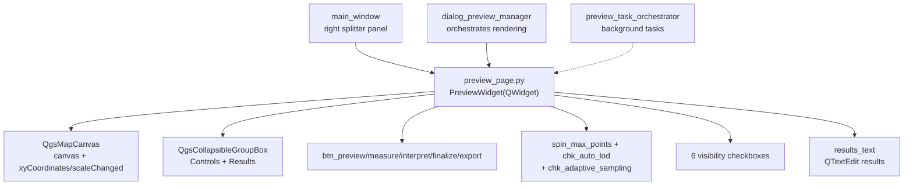

---
tags:
  - secinterp
  - code-walkthrough
  - gui
  - pages
aliases:
  - preview_page.py
  - PreviewWidget
cssclass: secinterp-note
---

# `gui/ui/pages/preview_page.py`

> [!abstract] One-line summary
> Section viewer (`PreviewWidget`, direct `QWidget`, not `BasePage`): `QgsMapCanvas` with status bar, collapsible controls (actions, LOD, layer visibility) and a text results area.

**Path**: `gui/ui/pages/preview_page.py` (262 lines)
**Main class**: `PreviewWidget(QWidget)`
**Layer**: GUI (viewer + render controls · no `get_data/validate`)
**Tags**: #secinterp #gui #pages

---

## 🎯 Why does this file exist?

The preview is where users verify the section before exporting: it needs a live
canvas, action buttons (preview, measure, interpret, export), level-of-detail
control and per-layer visibility, all in a panel living next to the settings pages.

| Problem | Solution |
|---------|----------|
| The dialog needs a preview canvas with visible coordinates and scale | `QgsMapCanvas` + status bar (`lbl_coords/lbl_scale/lbl_crs`) |
| Always rendering thousands of points is slow on dense profiles | LOD controls: `spin_max_points` + `chk_auto_lod` + `chk_adaptive_sampling` |
| Users must isolate topography, geology, structures, drillholes, interpretations or legend | Six visibility checkboxes + collapsible results area |

> [!important] Architectural note
> Deliberately **not** a `BasePage`: it is no settings page (no
> `get_data/validate/is_complete`) but a viewer with persistable controls
> (`dump/load/reset`). Preview managers orchestrate it, not `InputManager`.

---

## 🧬 Relationship diagram



> [!tip] How to read
> Solid arrow = contains/orchestrates; dashed = the task orchestrator feeds the canvas.

---

## 📦 Imports — architectural reading

```python
# gui/ui/pages/preview_page.py
from __future__ import annotations

import contextlib
from typing import Any

from qgis.core import QgsApplication
from qgis.gui import QgsCollapsibleGroupBox, QgsMapCanvas
from qgis.PyQt.QtGui import QColor
from qgis.PyQt.QtWidgets import (
    QCheckBox, QFrame, QHBoxLayout, QLabel,
    QPushButton, QSpinBox, QTextEdit, QVBoxLayout, QWidget,
)
```

| # | Observation |
|---|-------------|
| ① | `QgsMapCanvas` is the heart: the plugin's only preview canvas lives here. |
| ② | `QgsCollapsibleGroupBox` (QGIS) for Controls/Results groups: native collapsibles with QGIS styling. |
| ③ | `QgsApplication.getThemeIcon(...)` for all 5 buttons: active-theme icons, no own resources. |
| ④ | `QColor(255, 255, 255)` pins a white canvas background: the section always draws on white. |
| ⑤ | No `sec_interp` imports: graph leaf; managers wire it from outside (`btn_preview.clicked`, etc.). |

---

## 🏗️ Structure inventory

**`PreviewWidget(QWidget)` class** — no `layer_keys`, no `get_data`:

Construction:

- `__init__(self, parent: Any = None) -> None`
- `_setup_ui(self) -> None` — frame + 3 blocks + `connect_signals()`
- `_setup_canvas_area(self) -> None`
- `_setup_controls_group(self) -> None`
- `_setup_action_buttons(self, parent_layout: QVBoxLayout) -> None`
- `_setup_lod_controls(self, parent_layout: QVBoxLayout) -> None`
- `_setup_layer_checkboxes(self, parent_layout: QVBoxLayout) -> None`
- `_setup_results_area(self) -> None`

Reaction:

- `_update_coords(self, point: Any) -> None`
- `_update_scale(self, scale: float) -> None`
- `_toggle_lod_spin(self, checked: bool) -> None`
- `connect_signals(self) / disconnect_signals(self) -> None`

Control persistence:

- `dump(self) -> dict[str, Any]` (9 keys), `load`, `reset`

**Controls (exact names):**

| Group | Widgets | Role |
|-------|---------|------|
| Canvas | `canvas`, `lbl_coords`, `lbl_scale`, `lbl_crs` | map + state (grey 9pt) |
| Actions | `btn_preview/measure/interpret/finalize/export` | render, measure, draw, export |
| LOD | `spin_max_points`, `chk_auto_lod`, `chk_adaptive_sampling` | point cap + auto + adaptive |
| Visibility | `chk_topo/geol/struct/drillholes/interpretations/legend` | six layers, all on |
| Results | `results_group`, `results_text` | collapsible group + read-only text |

---

## 📖 Method-by-method walkthrough

### `__init__` / `_setup_ui` — frame with three blocks

```python
def __init__(self, parent: Any = None) -> None:
    super().__init__(parent)
    self._setup_ui()

def _setup_ui(self) -> None:
    layout = QVBoxLayout(self)
    layout.setContentsMargins(0, 0, 0, 0)

    # Frame for preview (optional visual container)
    self.frame = QFrame()
    self.frame.setFrameShape(QFrame.Shape.StyledPanel)
    self.frame_layout = QVBoxLayout(self.frame)

    self._setup_canvas_area()
    self._setup_controls_group()
    self._setup_results_area()

    layout.addWidget(self.frame)

    # Setup connections
    self.connect_signals()
```

The `StyledPanel` `QFrame` visually groups canvas + controls + results. Unlike
`BasePage` pages (which wait for `SignalManager`), the widget **self-connects**
its internal signals at the end of `_setup_ui`: the canvas→label wiring belongs
to it, not to the dialog.

### `_setup_canvas_area` — canvas and status bar

```python
def _setup_canvas_area(self) -> None:
    self.canvas = QgsMapCanvas()
    self.canvas.setCanvasColor(QColor(255, 255, 255))
    self.canvas.setMinimumHeight(300)
    self.frame_layout.addWidget(self.canvas, stretch=10)

    # -- Status Bar --
    status_layout = QHBoxLayout()
    status_layout.setContentsMargins(5, 0, 5, 0)

    self.lbl_coords = QLabel(self.tr("Coords: - , -"))
    self.lbl_scale = QLabel(self.tr("Scale 1: -"))
    self.lbl_crs = QLabel(self.tr("CRS: -"))

    for lbl in [self.lbl_coords, self.lbl_scale, self.lbl_crs]:
        lbl.setStyleSheet("color: #666; font-size: 9pt;")
    # ... coords + stretch + scale + stretch + crs ...
```

White 300-px-minimum canvas with `stretch=10` (takes nearly all frame height). The
status bar shows cursor coordinates, scale and CRS in the same grey 9pt style;
dashes are the "no render yet" state. `lbl_crs` is updated by the preview manager
from outside (the widget never touches it).

### `_setup_action_buttons` — five theme-iconed buttons

```python
def _setup_action_buttons(self, parent_layout: QVBoxLayout) -> None:
    btn_layout = QHBoxLayout()
    self.btn_preview = QPushButton(self.tr("Preview"))
    self.btn_preview.setIcon(QgsApplication.getThemeIcon("mActionRefresh.svg"))
    # ... Export (mActionSaveMapAsImage), Measure checkable (mActionMeasure),
    # ... Interpret checkable (mActionAddPolygon), Finalize hidden (mActionCheck)
```

Buttons: Preview (render), Export (to file), Measure (checkable: distance and
slope), Interpret (checkable: draw polygons) and Finalize (hidden until a
multi-point measurement needs finalising). Checkable modes activate the matching
`MapTool` (`measure_tool`, `interpretation_tool`) from the tool manager. QGIS
theme icons follow the light/dark theme.

### `_setup_lod_controls` — level of detail

```python
lod_layout.addWidget(QLabel(self.tr("Max Points:")))

self.spin_max_points = QSpinBox()
self.spin_max_points.setRange(100, 10000)
self.spin_max_points.setValue(1000)
self.spin_max_points.setSingleStep(100)
# ... tooltip "Maximum points to render in preview (LOD Optimization)" ...

self.chk_auto_lod = QCheckBox(self.tr("Auto"))
self.chk_auto_lod.toggled.connect(self._toggle_lod_spin)
# ... chk_adaptive_sampling "Adaptive", checked, "based on curvature (Phase 2)" ...
```

Manual point cap (100–10000, default 1000, step 100), Auto mode (sizes detail to
the preview and disables the spin) and curvature-based adaptive sampling (Phase 2,
on by default). Note `chk_auto_lod.toggled` is connected here **and** in
`connect_signals`: a real double connection (see observations).

### `_setup_layer_checkboxes` — six visibilities

```python
self.chk_topo = QCheckBox(self.tr("Show Topography"))
self.chk_topo.setChecked(True)
# ... chk_geol, chk_struct, chk_drillholes, chk_interpretations, chk_legend ...
```

Six checkboxes, all on by default. The preview renderer consults them before
adding each layer family to the canvas. They are the visual counterpart of the
settings pages: hiding "Show Geology" never erases the [[geology_page]]
configuration, only its render.

### `_setup_results_area` — results text

```python
def _setup_results_area(self) -> None:
    self.results_group = QgsCollapsibleGroupBox(self.tr("Results"))
    results_layout = QVBoxLayout(self.results_group)
    self.results_text = QTextEdit()
    self.results_text.setReadOnly(True)
    self.results_text.setMaximumHeight(100)
    results_layout.addWidget(self.results_text)
    self.frame_layout.addWidget(self.results_group)
```

Collapsible group with a read-only 100-px-max `QTextEdit`: `preview_reporter`
dumps the numeric summary here (length, relief, point counts). Read-only so users
cannot edit it by accident.

### `_update_coords` / `_update_scale` — live labels

```python
def _update_coords(self, point: Any) -> None:
    self.lbl_coords.setText(f"{point.x():.2f}, {point.y():.2f}")

def _update_scale(self, scale: float) -> None:
    self.lbl_scale.setText(self.tr("Scale 1:{}").format(int(scale)))
```

Direct slots for the canvas `xyCoordinates` and `scaleChanged`. Coordinates with
2 decimals (no `tr`: numbers); integer scale with `tr` + `.format()` so
translators can reorder the pattern.

### `_toggle_lod_spin` — LOD spin toggle

```python
def _toggle_lod_spin(self, checked: bool) -> None:
    self.spin_max_points.setEnabled(not checked)
```

Same language as `_on_auto_ve_toggled` ([[dem_page]]): in Auto the manual value is
disabled. Connected twice (in `_setup_lod_controls` and in `connect_signals`); the
slot is idempotent so the visible effect is single, but `disconnect_signals` uses
an argument-less `disconnect()` to cut both at once.

### `connect_signals` / `disconnect_signals` — explicit idempotency

```python
def connect_signals(self) -> None:
    """Connect internal signals for coordinates and scale tracking."""
    # Disconnect first to ensure idempotency
    self.disconnect_signals()

    self.canvas.xyCoordinates.connect(self._update_coords)
    self.canvas.scaleChanged.connect(self._update_scale)
    self.chk_auto_lod.toggled.connect(self._toggle_lod_spin)

def disconnect_signals(self) -> None:
    with contextlib.suppress(TypeError, RuntimeError):
        self.canvas.xyCoordinates.disconnect()
        # ... scaleChanged.disconnect(), chk_auto_lod.toggled.disconnect() ...
```

`connect` disconnects first ("Disconnect first to ensure idempotency"): calling
twice never duplicates canvas connections. Disconnects are argument-less (they cut
**all** slots, including the extra LOD one made in `_setup_lod_controls`). Each
sits in its own `suppress`, but the real code groups three statements under one
`with`: if the first raises, the other two never run (same asymmetry as [[dem_page]]).

### `dump` / `load` / `reset` — control persistence

```python
def dump(self) -> dict[str, Any]:
    return {
        "show_topo": self.chk_topo.isChecked(),
        "show_geol": self.chk_geol.isChecked(),
        "show_struct": self.chk_struct.isChecked(),
        "show_drillholes": self.chk_drillholes.isChecked(),
        "show_interpretations": self.chk_interpretations.isChecked(),
        "show_legend": self.chk_legend.isChecked(),
        "auto_lod": self.chk_auto_lod.isChecked(),
        "adaptive_sampling": self.chk_adaptive_sampling.isChecked(),
        "max_points": self.spin_max_points.value(),
    }
```

Nine keys: `show_*/auto_lod/adaptive_sampling/max_points`. `load` iterates
`(chk, key)` pairs with a per-key `is not None` guard; `reset` re-enables the six
visibilities + adaptive, disables Auto and restores 1000 points. The canvas itself
(rendered layers) never persists: only the controls.

---

## 🧩 Dialog lifecycle

| Moment | Who | What it does with the widget |
|--------|-----|------------------------------|
| Construction | [[main_window]] | `PreviewWidget()` as the splitter's third panel (largest stretch) |
| External wiring | `dialog_preview_manager` | wires `btn_preview/export` and the measure/interpret tools |
| Render | `preview_task_orchestrator` | background tasks → layers to canvas + `set_auto_ve` on [[dem_page]] |
| Report | `preview_reporter` | dumps the summary into `results_text` |
| Session | persistence | `dump/load` of the 9 controls |
| Teardown | dialog | widget `disconnect_signals()` + canvas release |

---

## 🔄 Data flow

| Phase | Input | Transformation | Output |
|-------|-------|----------------|--------|
| Cursor | `xyCoordinates` | `_update_coords` | `"x.xx, y.yy"` in grey 9pt |
| Zoom | `scaleChanged` | `_update_scale` | `"Scale 1:N"` |
| LOD | Auto on/off | `_toggle_lod_spin` | spin enabled or not |
| Action | Preview click | manager → tasks → canvas | rendered section |
| Visibility | checkboxes | renderer filters families | canvas with/without layers |
| Results | `PreviewResult` | `preview_reporter` | text in `results_text` |
| Persistence | controls | `dump/load/reset` | 9 visibility + LOD keys |

---

## 🏛️ Design patterns present

| Pattern | Where | Purpose |
|---------|-------|---------|
| **Viewer (non-Page)** | direct `QWidget` | Viewer with controls, outside the `BasePage` protocol |
| **Block builder** | 4× `_setup_*` | Canvas, controls, buttons/LOD/checkboxes, results |
| **Idempotent connect** | disconnect-before-connect | Safe dialog rewires |
| **Feature toggle** | `_toggle_lod_spin` | Manual or automatic LOD |

---

## 🧾 API summary

| Symbol | Signature / Inherits | Typical use |
|--------|----------------------|-------------|
| `PreviewWidget` | `(QWidget)` | right panel of [[main_window]] |
| `canvas` | `QgsMapCanvas` | preview render target |
| Buttons | `btn_preview/measure/interpret/finalize/export` | manager-wired actions |
| LOD | `spin_max_points/chk_auto_lod/chk_adaptive_sampling` | render density control |
| Visibilities | 6× `chk_*` (all ✓) | per-family renderer filter |
| `dump/load/reset` | 9 `show_*/auto_lod/…` keys | control sessions |

---

## 🛡️ Error handling

- Argument-less `disconnect()` on canvas and LOD: cuts every connection even with doubles (the extra `chk_auto_lod` one).
- `load` with missing keys: per-checkbox `is not None` guard plus `max_points`; old sessions restore partially.
- `Finalize` hidden until a multi-point measurement exists: finalising without context is impossible.
- No `get_data/validate`: the widget never blocks export/preview on its own; canvas failures are handled by the preview manager.

---

## 🧪 Associated tests

No dedicated `tests/gui/test_preview_page.py` for the widget exists; coverage is
indirect and must be described honestly:

- `tests/gui/test_signal_restoration.py` — `test_preview_widget_connect_logic` and `test_preview_signals_wire`: widget wiring logic and preview wiring.
- `tests/gui/test_preview_task_orchestrator.py` — the orchestrator feeding the canvas.
- `tests/gui/test_preview_components.py` — does **not** test the widget: covers `PreviewLayerFactory`, `PreviewAxesManager`, `PreviewRenderer` (the render the canvas exhibits).
- `tests/gui/test_main_dialog_tools.py` — measure/interpret tools over the canvas.
- `tests/gui/test_multi_session_persistence.py` — round-trip of the 9 controls.

| Aspect to test | Status |
|----------------|--------|
| Control `dump/load/reset` | no dedicated test; trivial with mocks |
| `_toggle_lod_spin` | no dedicated test (1-line slot) |
| `chk_auto_lod` double connection | no test pinning it as intentional or bug |
| End-to-end render | via preview pipeline and integration tests |

---

## 🌐 i18n and migration notes

- Labels, buttons and tooltips with `self.tr(...)` (`"Preview"`, `"Max Points:"`, `"Show Topography"`…); numbers and formats outside `tr`.
- Icon names (`"mActionRefresh.svg"`…) untranslatable: QGIS theme keys.
- `QgsMapCanvas` and `QgsCollapsibleGroupBox` from `qgis.gui`: stable API toward QGIS 4.x.

---

## 👀 Observations and notes

> [!success] Strengths
> - Idempotent `connect_signals` by design (disconnects first): the pattern sibling pages should copy.
> - Clean split: the widget exhibits (canvas, labels, controls) and managers execute (tasks, tools, reports).
> - Symmetric `dump/load/reset` with a `(chk, key)` pair table: a seventh toggle is one line away.

> [!warning] Points of attention
> - `chk_auto_lod.toggled` connected twice (setup + `connect_signals`): harmless today via slot idempotency, but stops being so if the slot grows.
> - `disconnect_signals` groups three `disconnect()` calls under one `with suppress`: if the first raises, the rest never run.
> - `lbl_crs` with no own updater: relies on the manager setting it; otherwise it shows `"CRS: -"` forever.
> - No dedicated widget test: the likeliest regression (renamed `btn_*`/`chk_*`) is only caught by dialog tests.

> [!question] Open questions
> - Drop the duplicated `chk_auto_lod` connection (keep only the `connect_signals` one)?
> - Add `tests/gui/test_preview_page.py` with a `dump/load/reset` contract + `connect_signals` idempotency?
> - Give `lbl_crs` its own canvas-connected updater (e.g. `destinationCrsChanged`)?

---

## 🔗 Related notes

- [[Index]] — vault index
- [[base_page]] — protocol this widget skips (and why)
- [[gui_ui_pages]] — pages and widgets package
- [[main_window]] — hosts the widget in the right splitter
- [[sidebar]] — no entry of its own (the widget is permanent, not a page)
- [[dialog_preview_manager]] — wires buttons and governs rendering
- [[preview_task_orchestrator]] — tasks feeding the canvas + adaptive VE
- [[preview_renderer]] / [[preview_axes_manager]] / [[preview_layer_factory]] — exhibited render (see `test_preview_components.py`)
- [[preview_reporter]] — writes into `results_text`
- [[measure_tool]] / [[interpretation_tool]] — tools behind the checkable buttons
- [[dem_page]] — receives the adaptive VE (`set_auto_ve`) computed after preview

---

*Note of the SecInterp Code Walkthrough v2 vault — v3.9.0*
