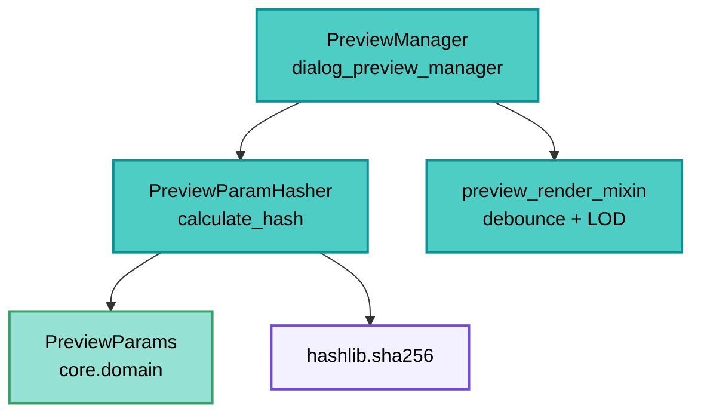

---
tags:
  - secinterp
  - code-walkthrough
  - gui
  - preview
aliases:
  - preview_param_hasher.py
  - PreviewParamHasher
cssclass: secinterp-note
---

# `gui/preview_param_hasher.py`

> [!abstract] One-line summary
> Static utility reducing a `PreviewParams` to a stable SHA-256 hash (layer IDs + settings + LOD) for detecting configuration changes without field-by-field comparison.

**Path**: `gui/preview_param_hasher.py` (68 lines)
**Main class**: `PreviewParamHasher`
**Layer**: GUI (Present · Change-detection Utility)
**Tags**: #secinterp #gui #preview

---

## 🎯 Why does this file exist?

Regenerating the preview is expensive (raster + async tasks). Hand-comparing parameters
is fragile (7 layers, 10+ settings). A single hash turns "did anything change?" into `!=`:

| Problem | Solution |
|---------|----------|
| Comparing `PreviewParams` field by field is verbose and forgets new fields | `calculate_hash(params) -> str` with an explicit part list |
| Layers travel as objects or IDs depending on timing | `get_id` accepts `str` or any object with `.id()` |
| Collisions with short hashes in long sessions | Full hexadecimal SHA-256 |
| Redundant re-renders after no-op toggles | The manager compares hashes and skips work |

> [!important] Architectural note
> **Stateless value hash.** A pure `staticmethod`: params in, `str` out. No QGIS or core
> imports; only stdlib `hashlib`. The natural companion of [[preview_render_mixin]]'s
> debounce: one avoids renders from zoom, the other from identical params.

---

## 🧬 Relationship diagram



> [!tip] How to read
> The manager hashes before launching: when the hash matches the previous one, the
> preview can be skipped or degraded to a cheap re-render. The hasher never decides; it
> only measures.

---

## 📦 Imports — architectural reading

```python
# gui/preview_param_hasher.py
import hashlib
from typing import Any
```

| # | Observation |
|---|-------------|
| ① | Stdlib only: the most decoupled module in the preview sub-package. |
| ② | `Any` on `params` and `get_id(layer)`: layers as `str`, `QgsMapLayer` or `None`. |
| ③ | No `qgis.*`, no core, no logger: a total function without side effects. |

> [!note] `from __future__ import annotations` present
> No compound annotations exist, but the future header keeps the project standard (see
> `AGENTS.md` coding standards).

---

## 🏗️ Structure inventory

**Class:** `class PreviewParamHasher` — 1 `staticmethod` + 1 closure

- `calculate_hash(params: Any) -> str`
- `get_id(layer: Any) -> str` (inner closure)

**Hash parts** (fixed order, joined with `"|"`):
1. Geometric and layer IDs (7): `line_layer`, `raster_layer`, `outcrop_layer`, `struct_layer`, `collar_layer`, `survey_layer`, `interval_layer`
2. Core settings (2): `band_num`, `buffer_dist`
3. Structure settings (3): `dip_field`, `strike_field`, `dip_scale_factor`
4. Drillhole settings (2): `collar_id_field`, `collar_use_geometry`
5. LOD (3): `max_points`, `canvas_width`, `auto_lod`

Total: 17 parts → `"|".join` → `sha256(...).hexdigest()`.

---

## 📁 Files in the package

| File | Role relative to the hasher |
|---|---|
| `gui/dialog_preview_manager.py` | Consumer: compares hashes across previews |
| `gui/preview_render_mixin.py` | Companion: temporal debounce vs param equality |
| `gui/preview_state.py` | `PreviewCache`: what hash equality avoids regenerating |
| `core/domain/dtos.py` | `PreviewParams`: the hashed object (see [[dtos]]) |

---

## 📖 Method-by-method walkthrough

### `calculate_hash` — 17 parts, one digest

```python
@staticmethod
def calculate_hash(params: Any) -> str:
    hash_parts = []

    def get_id(layer: Any) -> str:
        if isinstance(layer, str):
            return layer
        return layer.id() if hasattr(layer, "id") else "None"

    # Geometric & Layer IDs
    hash_parts.append(get_id(params.line_layer))
    hash_parts.append(get_id(params.raster_layer))
    hash_parts.append(get_id(params.outcrop_layer))
    hash_parts.append(get_id(params.struct_layer))
    hash_parts.append(get_id(params.collar_layer))
    hash_parts.append(get_id(params.survey_layer))
    hash_parts.append(get_id(params.interval_layer))

    # Core Settings
    hash_parts.append(str(params.band_num))
    hash_parts.append(str(params.buffer_dist))

    # Structure Settings
    hash_parts.append(str(params.dip_field))
    hash_parts.append(str(params.strike_field))
    hash_parts.append(str(params.dip_scale_factor))

    # Drillhole Settings
    hash_parts.append(str(params.collar_id_field))
    hash_parts.append(str(params.collar_use_geometry))

    # LOD Params
    hash_parts.append(str(params.max_points))
    hash_parts.append(str(params.canvas_width))
    hash_parts.append(str(params.auto_lod))

    combined = "|".join(hash_parts)
    return hashlib.sha256(combined.encode()).hexdigest()
```

| Decision | Detail |
|----------|--------|
| Tolerant `get_id` | `str` → as-is; with `.id()` → its id; rest (`None`) → `"None"` |
| Universal `str(...)` | Numbers, bools and field `None`s compare by representation |
| `"|"` separator | Prevents concatenation ambiguity (`"ab"+"c"` vs `"a"+"bc"`) |
| SHA-256 | 64 hex chars; untruncated (long sessions, negligible collisions) |
| Fixed order | Append order is the contract: reordering invalidates stored hashes |

### `get_id` — the closure

```python
def get_id(layer: Any) -> str:
    if isinstance(layer, str):
        return layer
    return layer.id() if hasattr(layer, "id") else "None"
```

Resolves the lifecycle duality: in `PreviewParams`, layers may be persisted IDs (`str`)
or resolved live layers. `hasattr(layer, "id")` accepts any QGIS binding without
importing it (duck typing, consistent with the GUI boundary).

---

## 🔄 Data flow

| Phase | Input | Transformation | Output |
|-------|-------|----------------|--------|
| Capture | current `PreviewParams` | 17 ordered `append`s | part list |
| Join | parts | `"|".join` | canonical string |
| Digest | string | `sha256(...).hexdigest()` | 64-char hash |
| Compare | new vs previous hash | `!=` | regenerate or skip |
| `None` | missing layer/setting | `"None"` | change equally detectable |

---

## 🏛️ Design patterns present

| Pattern | Where | Purpose |
|---------|-------|---------|
| **Value hashing** | `calculate_hash` | Cheap configuration equality |
| **Canonical string** | `"|".join` | Stable, ordered representation |
| **Duck typing** | `get_id` | No QGIS import to read `.id()` |
| **Pure function** | all `static` | No state, no effects, testable |

---

## 🧾 API summary

| Symbol | Signature | Typical use |
|--------|-----------|-------------|
| `PreviewParamHasher` | stateless | `PreviewParamHasher.calculate_hash(params)` |
| `calculate_hash` | `(params: Any) -> str` | Configuration-change detection |
| `get_id` | closure `(layer: Any) -> str` | Normalize layer → id |

---

## 🛡️ Error handling

| Situation | Behavior |
|-----------|----------|
| `None` layer | `"None"` (change to/from layer still detectable) |
| Missing field on params | `AttributeError` (fails loudly: explicit contract) |
| Non-`str`, non-`.id()` params | `"None"` via the `hasattr` branch |

> [!note] Fail fast on contract
> All 17 attributes are read directly (no defaulting `getattr`): if `PreviewParams`
> changes shape, the hash breaks loudly instead of colliding silently.

---

## 🧪 Associated tests

- `tests/gui/test_dialog_preview_manager.py` — hash usage in the preview cycle.
- `tests/core/test_preview_service.py` — input `PreviewParams` (hashed shape).
- Natural coverage: pure function, `assertEqual`/`assertNotEqual` over param pairs.

**Cases that should exist** (recommended verification):

| Case | Inputs | Expected |
|------|--------|----------|
| Equality | same params twice | same hash |
| Layer change | different `line_layer` | different hash |
| `str` vs object | id `"abc"` vs mock with `.id()=="abc"` | same hash |
| `None` vs layer | `struct_layer=None` vs layer | different hash |

---

## 👀 Observations and notes

> [!success] Strengths
> - Zero dependencies: the most portable preview module.
> - `str`/object/`None` normalization robust to the layer lifecycle.
> - Explicit separator against concatenation ambiguity.

> [!warning] Points of attention
> - Partial coverage: excludes `outcrop_name_field`, survey/interval fields (`survey_*`, `interval_*`), `collar_x/y/z/depth_field` and `use_adaptive_sampling`: changing them does **not** change the hash.
> - `canvas_width` in the hash: resizing the dialog invalidates even with identical data.
> - `str(True)` vs `str(1)`-style representation is type-fragile in edge cases.
> - No schema version: adding a field silently redefines the contract.

> [!question] Open questions
> - Include the missing survey/interval fields and `outcrop_name_field`?
> - Drop `canvas_width` (window geometry, not data) from the hash?
> - Prefix a version (`"v1|"`) to invalidate persisted hashes?

---

## 🧮 Worked example

Two previews differing only in buffer:

| Part | Preview A | Preview B |
|------|-----------|-----------|
| `line_layer` | `"line_01"` | `"line_01"` |
| `raster_layer` | `"dtm_05m"` | `"dtm_05m"` |
| `buffer_dist` | `"50.0"` | `"25.0"` |
| rest (14 parts) | identical | identical |
| SHA-256 | `9f2c…a1` | `44bd…e7` |

> [!note] One field suffices
> Changing a single part changes the whole digest (avalanche effect): comparing
> `hash_a != hash_b` detects the change without knowing which field mutated.

---

## 🔗 Related notes

- [[Index]] — vault index
- [[dialog_preview_manager]] — hash consumer
- [[preview_render_mixin]] — companion temporal debounce
- [[preview_state]] — cache guarded by the hash
- [[dtos]] — hashed `PreviewParams`
- [[preview_service]] — validation (`validate()`) before hashing

---

*Note of the SecInterp Code Walkthrough v2 vault — v3.8.0*
