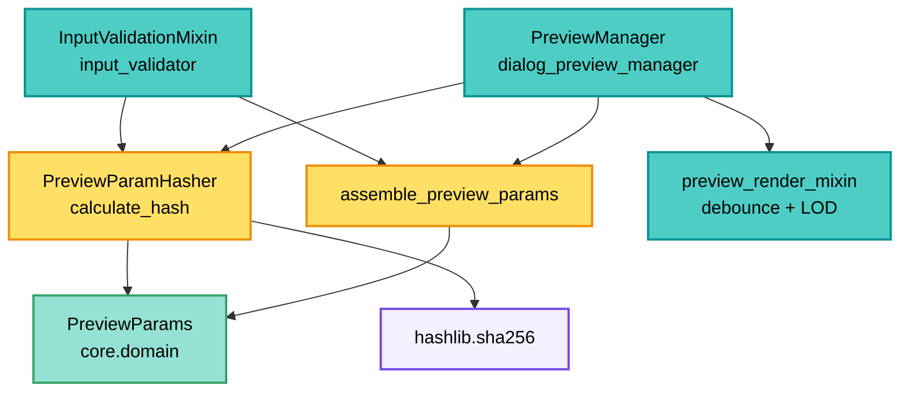
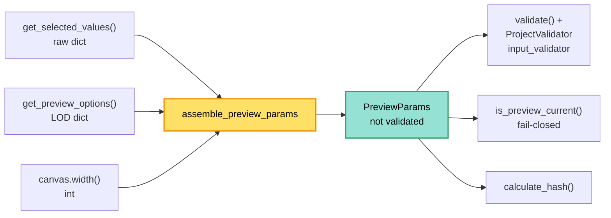

---
tags:
  - secinterp
  - code-walkthrough
  - gui
  - preview
aliases:
  - preview_param_hasher.py
  - PreviewParamHasher
cssclass: secinterp-note
---

# `gui/preview_param_hasher.py`

> [!abstract] One-line summary
> Pure two-sided utility: it assembles raw dialog values into a `PreviewParams` without side effects and reduces it to a stable SHA-256 hash (layer IDs + settings + `section_feature_id` + LOD) for detecting configuration changes without field-by-field comparison.

**Path**: `gui/preview_param_hasher.py` (133 lines)
**Main class**: `PreviewParamHasher`
**Main function**: `assemble_preview_params`
**Layer**: GUI (Present · Assembly and Change-detection)
**Tags**: #secinterp #gui #preview

---

## 🎯 Why does this file exist?

Regenerating the preview is expensive (raster + async tasks). Hand-comparing parameters
is fragile (7 layers, 10+ settings). A single hash turns "did anything change?" into `!=`.
Since v3.9.0 the module carries **two** pure responsibilities, kept together because
they are two faces of the same question: *is this preview still current?*

| Problem | Solution |
|---------|----------|
| Assembling `PreviewParams` was duplicated between validation and currency checks | A single, side-effect-free `assemble_preview_params(values, options, width)` |
| Comparing `PreviewParams` field by field is verbose and forgets new fields | `calculate_hash(params) -> str` with an explicit part list |
| Layers travel as objects or IDs depending on timing | `get_id` accepts `str` or any object with `.id()` |
| Selecting another section feature did not invalidate the preview | `section_feature_id` enters the hash |
| Collisions with short hashes in long sessions | Full hexadecimal SHA-256 |
| Redundant re-renders after no-op toggles | The manager compares hashes and skips work |

> [!important] Architectural note
> **Two pure functions, zero QGIS dependencies.** `assemble_preview_params` only maps
> dictionary keys to a DTO (no `validate()`, no dialogs, no notification `connect`, no
> geometry reads). `calculate_hash` is a pure `staticmethod`: params in, `str` out. The
> only non-stdlib import is `PreviewParams` from `core.domain`, a QGIS-agnostic DTO.
> The natural companion of [[preview_render_mixin]]'s debounce: one avoids renders from
> zoom, the other from identical params.

---

## 🧬 Relationship diagram



> [!tip] How to read
> The manager hashes before launching: when the hash matches the previous one, the
> preview can be skipped or degraded to a cheap re-render. The hasher never decides; it
> only measures. Assembly (`ASM`) is the single point that produces the `PreviewParams`
> both consumers measure.

---

## 📦 Imports — architectural reading

```python
# gui/preview_param_hasher.py
import hashlib
from typing import Any

from sec_interp.core.domain import PreviewParams
```

| # | Observation |
|---|-------------|
| ① | `hashlib` and `typing.Any`: standard library only. |
| ② | `PreviewParams` comes from `core.domain`: a QGIS-agnostic data DTO; an allowed GUI→core boundary. |
| ③ | `Any` on `params` and `get_id(layer)`: layers as `str`, `QgsMapLayer` or `None`. |
| ④ | No `qgis.*`, no logger, no services: total functions without side effects. |

> [!note] `from __future__ import annotations` present
> No compound annotations exist, but the future header keeps the project standard (see
> `AGENTS.md` coding standards).

> [!warning] Change since v3.8.0
> The previous version imported nothing from `core`. It now imports the DTO
> `PreviewParams` so it can **build** the object, not only consume it. The rule holds:
> no `qgis.*` and no stateful services.

---

## 🏗️ Structure inventory

**Public symbols:** 1 module function + 1 class with 1 `staticmethod` and 1 closure

- `assemble_preview_params(values, preview_options, canvas_width) -> PreviewParams`
- `PreviewParamHasher.calculate_hash(params: Any) -> str`
- `get_id(layer: Any) -> str` (inner closure of `calculate_hash`)

**Hash parts** (fixed order, joined with `"|"`):

| Group | # | Fields |
|-------|---|--------|
| Geometric and layer IDs | 7 | `line_layer`, `raster_layer`, `outcrop_layer`, `struct_layer`, `collar_layer`, `survey_layer`, `interval_layer` |
| Core settings | 3 | `band_num`, `buffer_dist`, `section_feature_id` |
| Topography style | 3 | `color_mode`, `ramp_name`, `single_color_hex` |
| Structure settings | 3 | `dip_field`, `strike_field`, `dip_scale_factor` |
| Drillhole settings | 2 | `collar_id_field`, `collar_use_geometry` |
| LOD | 3 | `max_points`, `canvas_width`, `auto_lod` |

Total: **21 parts** → `"|".join` → `sha256(...).hexdigest()`.
(In v3.8.0 there were 17: `section_feature_id` and the 3 style keys were added.)

---

## 📁 Files in the package

| File | Role relative to the hasher |
|---|---|
| `gui/dialog_preview_manager.py` | Consumer: assembles in `is_preview_current()` and compares hashes |
| `plugin/input_validator.py` | Consumer: assembles and then validates (`validate()` + `ProjectValidator`) |
| `gui/preview_render_mixin.py` | Companion: temporal debounce vs param equality |
| `gui/preview_state.py` | `PreviewCache`: what hash equality avoids regenerating |
| `core/domain/dtos.py` | `PreviewParams`: the assembled and hashed object (see [[dtos]]) |
| `core/domain/task_inputs.py` | Detached contexts for async tasks (see [[task_inputs]]) |

---

## 🧩 `assemble_preview_params` — pure assembly

The big v3.9.0 addition. Before, the dialog and the validator built `PreviewParams` on
their own; now there is a **single** side-effect-free assembler.

```python
def assemble_preview_params(
    values: dict[str, Any], preview_options: dict[str, Any], canvas_width: int
) -> PreviewParams:
    """Assemble PreviewParams from raw dialog values without side effects."""
    return PreviewParams(
        raster_layer=values.get("raster_layer"),
        line_layer=values.get("crossline_layer"),
        band_num=values.get("selected_band", 1),
        buffer_dist=values.get("buffer_distance", 100.0),
        section_feature_id=values.get("section_feature_id"),
        color_mode=values.get("color_mode", "gradient"),
        ramp_name=values.get("ramp_name"),
        single_color_hex=values.get("single_color_hex"),
        outcrop_layer=values.get("outcrop_layer"),
        outcrop_name_field=values.get("outcrop_name_field"),
        struct_layer=values.get("structural_layer"),
        dip_field=values.get("dip_field"),
        # ... structure and drillhole fields ...
        max_points=preview_options.get("max_points", 1000),
        auto_lod=preview_options.get("auto_lod", True),
        canvas_width=canvas_width,
    )
```

> [!important] No `validate()`, no wiring, no geometries
> The real docstring states it: *"no `validate()` call, no error dialogs, no
> layer-notification wiring, and no geometry reads"*. The hasher only uses layer
> `.id()` values and primitives, so this stays cheap enough to run on every UI state
> refresh (for example inside `is_preview_current`).

### Key translation: dialog → domain

Names do not match one to one; the assembler is the **adapter** between both
vocabularies. This table is the mapping contract:

| Key in `values` / `options` | Field in `PreviewParams` | Default |
|---|---|---|
| `raster_layer` | `raster_layer` | `None` |
| `crossline_layer` | `line_layer` | `None` |
| `selected_band` | `band_num` | `1` |
| `buffer_distance` | `buffer_dist` | `100.0` |
| `section_feature_id` | `section_feature_id` | `None` |
| `color_mode` | `color_mode` | `"gradient"` |
| `structural_layer` | `struct_layer` | `None` |
| `dip_scale_factor` | `dip_scale_factor` | `1.0` |
| `collar_layer_obj` | `collar_layer` | `None` |
| `collar_use_geometry` | `collar_use_geometry` | `True` |
| `survey_layer_obj` | `survey_layer` | `None` |
| `interval_layer_obj` | `interval_layer` | `None` |
| `max_points` (options) | `max_points` | `1000` |
| `auto_lod` (options) | `auto_lod` | `True` |
| `canvas_width` (3rd argument) | `canvas_width` | — |

> [!tip] The `_obj` suffix matters
> Collar/survey/interval layers travel as `collar_layer_obj`, `survey_layer_obj`,
> `interval_layer_obj`: these are the resolved objects, not the IDs. The assembler
> renames them to the DTO's clean field.

### Assembly flow and its consumers



> [!question] Why not validate here?
> Because assembly must be able to run on every state refresh without showing error
> dialogs or touching layer notifications. Validation is a **separate**, explicit step
> (`params.validate()` + `ProjectValidator`) in [[input_validator]].

---

## 📖 Method-by-method walkthrough

### `calculate_hash` — 21 parts, one digest

```python
@staticmethod
def calculate_hash(params: Any) -> str:
    hash_parts = []

    def get_id(layer: Any) -> str:
        if isinstance(layer, str):
            return layer
        return layer.id() if hasattr(layer, "id") else "None"

    # Geometric & Layer IDs
    hash_parts.append(get_id(params.line_layer))
    hash_parts.append(get_id(params.raster_layer))
    hash_parts.append(get_id(params.outcrop_layer))
    hash_parts.append(get_id(params.struct_layer))
    hash_parts.append(get_id(params.collar_layer))
    hash_parts.append(get_id(params.survey_layer))
    hash_parts.append(get_id(params.interval_layer))

    # Core Settings
    hash_parts.append(str(params.band_num))
    hash_parts.append(str(params.buffer_dist))
    hash_parts.append(str(params.section_feature_id))

    # Topography style
    hash_parts.append(str(params.color_mode))
    hash_parts.append(str(params.ramp_name))
    hash_parts.append(str(params.single_color_hex))

    # Structure Settings
    hash_parts.append(str(params.dip_field))
    hash_parts.append(str(params.strike_field))
    hash_parts.append(str(params.dip_scale_factor))

    # Drillhole Settings
    hash_parts.append(str(params.collar_id_field))
    hash_parts.append(str(params.collar_use_geometry))

    # LOD Params
    hash_parts.append(str(params.max_points))
    hash_parts.append(str(params.canvas_width))
    hash_parts.append(str(params.auto_lod))

    combined = "|".join(hash_parts)
    return hashlib.sha256(combined.encode()).hexdigest()
```

| Decision | Detail |
|----------|--------|
| Tolerant `get_id` | `str` → as-is; with `.id()` → its id; rest (`None`) → `"None"` |
| Universal `str(...)` | Numbers, bools and field `None`s compare by representation |
| `"|"` separator | Prevents concatenation ambiguity (`"ab"+"c"` vs `"a"+"bc"`) |
| SHA-256 | 64 hex chars; untruncated (long sessions, negligible collisions) |
| Fixed order | Append order is the contract: reordering invalidates stored hashes |

> [!warning] v3.9.0 additions
> `section_feature_id` (the *Core Settings* block) and the three *Topography style*
> fields (`color_mode`, `ramp_name`, `single_color_hex`) are now part of the contract.
> Before, changing the topography color or the chosen feature did not alter the digest.

### `get_id` — the closure

```python
def get_id(layer: Any) -> str:
    if isinstance(layer, str):
        return layer
    return layer.id() if hasattr(layer, "id") else "None"
```

Resolves the lifecycle duality: in `PreviewParams`, layers may be persisted IDs (`str`)
or resolved live layers. `hasattr(layer, "id")` accepts any QGIS binding without
importing it (duck typing, consistent with the GUI boundary).

---

## 🔄 Data flow

| Phase | Input | Transformation | Output |
|-------|-------|----------------|--------|
| Assembly | `values` + `options` + `width` | `.get(key, default)` → `PreviewParams(...)` | unvalidated DTO |
| Validation | `PreviewParams` | `validate()` + `ProjectValidator` | valid DTO |
| Capture | current `PreviewParams` | 21 ordered `append`s | part list |
| Join | parts | `"|".join` | canonical string |
| Digest | string | `sha256(...).hexdigest()` | 64-char hash |
| Compare | new vs previous hash | `!=` | regenerate or skip |
| `None` | missing layer/setting | `"None"` | change equally detectable |

---

## 🏛️ Design patterns present

| Pattern | Where | Purpose |
|---------|-------|---------|
| **Pure assembly** | `assemble_preview_params` | Build the DTO without side effects |
| **Value hashing** | `calculate_hash` | Cheap configuration equality |
| **Canonical string** | `"|".join` | Stable, ordered representation |
| **Duck typing** | `get_id` | No QGIS import to read `.id()` |
| **Pure function** | all `static` | No state, no effects, testable |

---

## 🧾 API summary

| Symbol | Signature | Typical use |
|--------|-----------|-------------|
| `assemble_preview_params` | `(values, options, canvas_width) -> PreviewParams` | Build params from the dialog |
| `PreviewParamHasher` | stateless | `PreviewParamHasher.calculate_hash(params)` |
| `calculate_hash` | `(params: Any) -> str` | Configuration-change detection |
| `get_id` | closure `(layer: Any) -> str` | Normalize layer → id |

---

## 🛡️ Error handling

| Situation | Behavior |
|-----------|----------|
| Empty `values` | Every field falls back to its default |
| Missing key | `.get(key, default)` avoids `KeyError` |
| Empty `preview_options` | `max_points=1000`, `auto_lod=True` |
| `None` layer | `"None"` (change to/from layer still detectable) |
| Missing field on params | `AttributeError` (fails loudly: explicit contract) |
| Non-`str`, non-`.id()` params | `"None"` via the `hasattr` branch |

> [!note] Fail fast on contract
> `assemble_preview_params` is tolerant (defaults via `.get`), but `calculate_hash`
> reads all 21 attributes directly (no defaulting `getattr`): if `PreviewParams`
> changes shape, the hash breaks loudly instead of colliding silently.

---

## 🧪 Associated tests

- `tests/gui/test_ui_gating.py` — `TestAssemblePreviewParams`, `TestIsPreviewCurrent`
  and `TestResetClearsPreviewCurrency` exercise assembly and hash currency.
- `tests/gui/test_dialog_preview_manager.py` — hash usage in the preview cycle.
- `tests/core/test_preview_service.py` — input `PreviewParams` (hashed shape).

**Cases that should exist** (recommended verification):

| Case | Inputs | Expected |
|------|--------|----------|
| Defaults | `assemble_preview_params({}, {}, 800)` | `band_num==1`, `buffer_dist==100.0`, `max_points==1000`, `auto_lod is True` |
| Explicit values | `{"selected_band": 3}`, `{"max_points": 500}`, `640` | all three respected |
| Equality | same params twice | same hash |
| Layer change | different `line_layer` | different hash |
| Feature change | different `section_feature_id` | different hash |
| `str` vs object | id `"abc"` vs mock with `.id()=="abc"` | same hash |
| `None` vs layer | `struct_layer=None` vs layer | different hash |

---

## 👀 Observations and notes

> [!success] Strengths
> - Zero QGIS dependencies: the most portable preview module.
> - A single assembler that removes duplication between validation and currency.
> - `str`/object/`None` normalization robust to the layer lifecycle.
> - Explicit separator against concatenation ambiguity.
> - `assemble_preview_params` can run on every UI refresh without dialogs.

> [!warning] Points of attention
> - Partial hash coverage: it excludes `outcrop_name_field`, survey/interval fields
>   (`survey_*`, `interval_*`) and `collar_x/y/z/depth_field`: changing them does
>   **not** change the hash.
> - No smoothing field (`smooth`/`smooth_window`) or adaptive-sampling field exists in
>   `PreviewParams` today; when they are added, it must be decided whether they enter
>   the hash.
> - `canvas_width` in the hash: resizing the dialog invalidates even with identical
>   data (mitigated by the fail-closed `is_preview_current` comparison).
> - `str(True)`/`str(1)` and `str(1.0)`/`str("1")` representations are type-fragile;
>   the separator helps but does not remove type ambiguity.
> - No schema version: adding a field silently redefines the contract.

> [!question] Open questions
> - Include the missing survey/interval fields and `outcrop_name_field`?
> - Drop `canvas_width` (window geometry, not data) from the hash?
> - Prefix a version (`"v1|"`) to invalidate persisted hashes?
> - How to integrate future smoothing or adaptive-sampling fields?

---

## 🧮 Worked example

Two previews differing only in buffer:

| Part | Preview A | Preview B |
|------|-----------|-----------|
| `line_layer` | `"line_01"` | `"line_01"` |
| `raster_layer` | `"dtm_05m"` | `"dtm_05m"` |
| `buffer_dist` | `"50.0"` | `"25.0"` |
| `section_feature_id` | `"7"` | `"7"` |
| rest (17 parts) | identical | identical |
| SHA-256 | `9f2c…a1` | `44bd…e7` |

> [!note] One field suffices
> Changing a single part changes the whole digest (avalanche effect): comparing
> `hash_a != hash_b` detects the change without knowing which field mutated. Choosing
> another feature of the same section line also changes `section_feature_id` and hence
> the hash.

---

## 🔗 Related notes

- [[Index]] — vault index
- [[dialog_preview_manager]] — hash consumer and `is_preview_current`
- [[input_validator]] — assembles and then validates before launching the preview
- [[preview_render_mixin]] — companion temporal debounce
- [[preview_state]] — cache guarded by the hash
- [[dtos]] — assembled and hashed `PreviewParams`
- [[task_inputs]] — async task input DTOs
- [[preview_service]] — validation (`validate()`) before hashing

---

*Note of the SecInterp Code Walkthrough v2 vault — v3.9.1*
