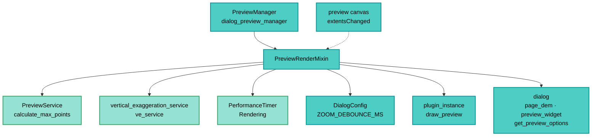

---
tags:
  - secinterp
  - code-walkthrough
  - gui
  - preview
aliases:
  - preview_render_mixin.py
  - PreviewRenderMixin
cssclass: secinterp-note
---

# `gui/preview_render_mixin.py`

> [!abstract] One-line summary
> Mixin running the manager's render pipeline: LOD via `PreviewService.calculate_max_points`, vertical exaggeration resolved auto (through `ve_service`) or manual from the spinbox, and debounced re-render on zoom.

**Path**: `gui/preview_render_mixin.py` (129 lines)
**Main class**: `PreviewRenderMixin`
**Layer**: GUI (Present · Render + LOD Mixin)
**Tags**: #secinterp #gui #preview

---

## 🎯 Why does this file exist?

Rendering needs options (LOD, VE, sampling) and zoom reactions. This mixin isolates that
logic from the manager's lifecycle:

| Problem | Solution |
|---------|----------|
| Every zoom re-rendered in cascade and hung the canvas | `extentsChanged → debounce_timer → _update_lod_for_zoom` |
| Point count must adapt to the canvas | `PreviewService.calculate_max_points(canvas_width, manual_max, auto_lod)` |
| Auto vs manual VE was resolved in several places | Single `_resolve_vertical_exaggeration` (auto from `last_result`, manual from spinbox) |
| Rendering without a plugin instance crashes | `plugin_instance` guards with `_handle_invalid_plugin_instance` |
| Mixin signals had to be cleaned on close | Symmetric `connect_signals` / `disconnect_signals` with `suppress` |

> [!important] Architectural note
> **Present mixin with signals.** Unlike the callbacks mixin (slots only), this one
> connects the canvas `extentsChanged` and the `debounce_timer`. It lives the GUI rule:
> check `chk_auto_lod` before scheduling work.

---

## 🧬 Relationship diagram



> [!tip] How to read
> The mixin reads dialog options, asks core for LOD and the VE service for exaggeration,
> then orders the plugin to draw. The canvas only notifies framing changes (dashed).

---

## 📦 Imports — architectural reading

```python
# gui/preview_render_mixin.py
import contextlib

from sec_interp.core.performance_metrics import PerformanceTimer
from sec_interp.core.services.preview_service import PreviewService
from sec_interp.logger_config import get_logger

from .main_dialog_config import DialogConfig
```

| # | Observation |
|---|-------------|
| ① | `contextlib` only for tolerant `disconnect_signals` (already-detached signals). |
| ② | `PreviewService` used **only** for its static `calculate_max_points`: LOD without instantiating. |
| ③ | `PerformanceTimer("Rendering", self.metrics)` times drawing in the manager's cycle. |
| ④ | `DialogConfig.ZOOM_DEBOUNCE_MS` centralizes the anti-cascade delay. |
| ⑤ | Zero `qgis.*`, zero widgets: everything arrives via `self.dialog` / `self.debounce_timer`. |

---

## 🏗️ Structure inventory

**Class:** `class PreviewRenderMixin` — 7 methods, no `__init__`

**Signals:**
- `connect_signals()` — `debounce_timer.timeout` + `canvas.extentsChanged`
- `disconnect_signals()` — both with `suppress`

**Pipeline:**
- `_run_render_pipeline(result)` — `PerformanceTimer` + `_render_cached_data`
- `_render_cached_data(preserve_extent=False)` — LOD + `draw_preview`
- `_resolve_vertical_exaggeration() -> float`

**Zoom/LOD:**
- `update_from_checkboxes()` — re-render after async arrivals or toggles
- `_on_extents_changed()` — `chk_auto_lod` gate + `debounce_timer.start`
- `_update_lod_for_zoom()` — re-render with `preserve_extent=True`

---

## 📁 Files in the package

| File | Role relative to the mixin |
|---|---|
| `gui/dialog_preview_manager.py` | `PreviewManager`: provides `dialog`, `metrics`, `cached_data`, `ve_service`, `debounce_timer` |
| `gui/preview_callbacks_mixin.py` | Calls `update_from_checkboxes` on each async arrival |
| `gui/preview_task_orchestrator.py` | Its results end up in `_render_cached_data` |
| `gui/preview_state.py` | `cached_data` read here |
| `gui/main_dialog_config.py` | `ZOOM_DEBOUNCE_MS` |
| `core/services/preview_service.py` | `calculate_max_points` (LOD, see [[preview_service]]) |
| `core/vertical_exaggeration_service.py` | `ve_service.calculate_from_result` (see [[vertical_exaggeration_service]]) |

---

## 📖 Method-by-method walkthrough

### `connect_signals` / `disconnect_signals` — symmetric wiring

```python
def connect_signals(self) -> None:
    self.disconnect_signals()
    self.debounce_timer.timeout.connect(self._update_lod_for_zoom)
    self.dialog.preview_widget.canvas.extentsChanged.connect(self._on_extents_changed)

def disconnect_signals(self) -> None:
    with contextlib.suppress(TypeError, RuntimeError):
        self.debounce_timer.timeout.disconnect()
    with contextlib.suppress(AttributeError, TypeError, RuntimeError):
        self.dialog.preview_widget.canvas.extentsChanged.disconnect(self._on_extents_changed)
```

`connect` starts by disconnecting: repeated reconnections (reopens) never duplicate
slots. The `suppress` covers destroyed timers, `None` canvas and detached signals. Note
`timeout.connect` has no `suppress`: a missing timer should fail loudly.

### `_run_render_pipeline` — measured render with elevated errors

```python
def _run_render_pipeline(self, result) -> None:
    if not self.dialog.plugin_instance:
        self._handle_invalid_plugin_instance()
        return
    try:
        with PerformanceTimer("Rendering", self.metrics):
            self._render_cached_data()
    except (AttributeError, TypeError, ValueError) as e:
        logger.exception(f"Rendering error: {e}")
        raise ValueError(f"Failed to render preview: {e!s}") from e
    except Exception as e:
        logger.exception("Unexpected rendering pipeline error")
        raise ValueError(f"Critical rendering error: {e!s}") from e
```

The `result` parameter is unused (render reads the cache): a historical signature kept
for caller compatibility. The `PerformanceTimer` feeds the `"Rendering"` key later shown
by [[preview_reporter]]. Errors are elevated to `ValueError` with chaining (`from e`).

### `_render_cached_data` — LOD + plugin delegation

```python
def _render_cached_data(self, preserve_extent: bool = False) -> None:
    if not self.dialog.plugin_instance:
        return
    opts = self.dialog.get_preview_options()
    max_points = PreviewService.calculate_max_points(
        canvas_width=self.dialog.preview_widget.canvas.width(),
        manual_max=opts["max_points"],
        auto_lod=opts["auto_lod"],
    )
    self.dialog.plugin_instance.draw_preview(
        self.cached_data["topo"],
        self.cached_data.get("geol"),
        self.cached_data["struct"],
        drillhole_data=self.cached_data["drillhole"],
        max_points=max_points,
        preserve_extent=preserve_extent,
        use_adaptive_sampling=opts["use_adaptive_sampling"],
        vert_exag=self._resolve_vertical_exaggeration(),
    )
```

| Decision | Detail |
|----------|--------|
| LOD | `calculate_max_points` with the real canvas width (2× pixels + log boost) |
| Mixed access | Strict `["topo"]` (KeyError when missing) vs tolerant `.get` on optional branches |
| Strict `struct` | `["struct"]` also bracketed: the branch is always expected (even as `None`) |
| VE | resolved at render time: every render may change it without recompute |
| Target | `plugin_instance.draw_preview` → [[preview_renderer]] downstream |

### `_resolve_vertical_exaggeration` — auto or manual

```python
def _resolve_vertical_exaggeration(self) -> float:
    auto = self.dialog.page_dem.auto_ve_check.isChecked()
    if auto and self.last_result is not None:
        ve = self.ve_service.calculate_from_result(self.last_result)
        logger.info("Vertical exaggeration: %.1f× (auto)", ve)
        return ve
    ve = self.dialog.page_dem.vertexag_spin.value()
    logger.info("Vertical exaggeration: %.1f× (manual)", ve)
    return ve
```

Auto requires `last_result` (set in `_update_results_display`): with no result yet it
falls back to the manual spinbox even when checked. `ve_service` is the manager's
`VerticalExaggerationService` (consumes `PreviewResult`, see
[[vertical_exaggeration_service]]).

### `update_from_checkboxes` — cheap re-render

```python
def update_from_checkboxes(self) -> None:
    if not self.last_result:
        return
    try:
        self._render_cached_data()
    except (AttributeError, TypeError, ValueError) as e:
        logger.exception(f"UI Sync error in preview: {e}")
    except Exception:
        logger.exception("Unexpected error updating preview from checkboxes")
```

`last_result` guard: with no previous preview there is nothing to re-show. Errors here
are **not** elevated (unlike `_run_render_pipeline`): they are logged because the source
is a toggle/callback, not an explicit action. Visibility filtering belongs to the
plugin's `draw_preview`, not this method (see docstring).

### `_on_extents_changed` + `_update_lod_for_zoom` — debounced zoom

```python
def _on_extents_changed(self) -> None:
    if not self.dialog.preview_widget.chk_auto_lod.isChecked():
        return
    self.debounce_timer.start(DialogConfig.ZOOM_DEBOUNCE_MS)

def _update_lod_for_zoom(self) -> None:
    if not self.dialog.preview_widget.canvas:
        return
    self._render_cached_data(preserve_extent=True)
```

Each pan/zoom with auto-LOD restarts the timer (`ZOOM_DEBOUNCE_MS`): only the last event
of the burst renders, with `preserve_extent=True` so the framing is never stolen from
the user. Without `chk_auto_lod`, zoom costs nothing.

---

## 🔄 Data flow

| Phase | Input | Transformation | Output |
|-------|-------|----------------|--------|
| Options | dialog (`get_preview_options`) | LOD/sampling dict | `max_points`, `use_adaptive_sampling` |
| VE | check + `last_result` / spinbox | `_resolve_vertical_exaggeration` | applied factor |
| Cache | `cached_data` | `draw_preview(...)` | layers on canvas |
| Zoom | `extentsChanged` | debounce → extent-preserving re-render | more/less detail |
| Metric | `PerformanceTimer` block | `"Rendering"` key | report timings |

---

## 🏛️ Design patterns present

| Pattern | Where | Purpose |
|---------|-------|---------|
| **Mixin** | the class | Split the manager (render vs callbacks vs lifecycle) |
| **Debounce** | timer + `ZOOM_DEBOUNCE_MS` | One render per zoom burst |
| **Strategy (VE)** | auto vs manual | Interchangeable factor source |
| **Measured block** | `PerformanceTimer` | Observable draw cost |
| **Symmetric connect** | `connect/disconnect_signals` | No duplicated or dangling slots |

---

## 🧾 API summary

| Symbol | Signature | Typical use |
|--------|-----------|-------------|
| `PreviewRenderMixin` | no `__init__` | Composed into `PreviewManager` |
| `connect_signals` / `disconnect_signals` | `()` | Manager lifetime |
| `_run_render_pipeline` | `(result)` | Initial measured render |
| `_render_cached_data` | `(preserve_extent=False)` | Every re-render |
| `_resolve_vertical_exaggeration` | `() -> float` | Render VE |
| `update_from_checkboxes` | `()` | Refresh after async/toggles |
| `_on_extents_changed` | `()` | Zoom slot |
| `_update_lod_for_zoom` | `()` | Debounce slot |

---

## 🛡️ Error handling

| Situation | Behavior |
|-----------|----------|
| Missing `plugin_instance` | `_handle_invalid_plugin_instance()` or silent return |
| Initial pipeline failure | `ValueError` elevated with cause |
| Toggle refresh failure | `logger.exception` only (not elevated) |
| Already-connected signals | prior `disconnect` prevents duplicates |
| No canvas on LOD zoom | early return |

---

## 🧪 Associated tests

- `tests/gui/test_dialog_preview_manager.py` — render pipeline with mocked `plugin_instance` and stubbed options.
- `tests/gui/test_preview_renderer_custom.py` — downstream `draw_preview` with LOD.
- `tests/core/test_preview_service.py` — `calculate_max_points` (LOD unit).
- `tests/core/test_vertical_exaggeration_service.py` — `calculate_from_result` (auto-VE unit).

---

## 👀 Observations and notes

> [!success] Strengths
> - Real debounce against zoom cascades: the canvas breathes.
> - Per-render VE resolution: switching auto/manual never recomputes.
> - LOD reuses the core static: a single formula across the plugin.

> [!warning] Points of attention
> - `_run_render_pipeline(result)` ignores its parameter: confusing signature for new readers.
> - Bracketed `cached_data["topo"]` and `["struct"]` raise `KeyError` on a plain dict missing those keys (vs `PreviewCache` which pre-creates them).
> - `update_from_checkboxes` swallows errors that `_run_render_pipeline` would elevate: dual criteria by source.
> - `calculate_max_points` `ratio` is never passed here (always 1.0): no zoom boost on this path.

> [!question] Open questions
> - Drop the `result` parameter or use it to validate the cache before drawing?
> - Pass the real zoom `ratio` to enable the logarithmic LOD boost?

---

## ⏱️ Zoom timeline

Sequence with auto-LOD on while the user drags zoom:

| T | Event | Effect |
|---|-------|--------|
| 1 | `extentsChanged` (zoom ×1) | `debounce_timer.start(MS)` |
| 2 | `extentsChanged` (zoom ×2, burst) | timer restarted (no render) |
| 3 | `extentsChanged` (zoom ×3, burst) | timer restarted (no render) |
| 4 | Pause > `ZOOM_DEBOUNCE_MS` | `timeout` → `_update_lod_for_zoom` |
| 5 | `_render_cached_data(preserve_extent=True)` | new LOD, same framing |
| 6 | More zoom | cycle restarts at T1 |

> [!note] No auto-LOD, no cost
> With `chk_auto_lod` unchecked, `_on_extents_changed` returns before `start`:
> zoom is free (same resolution, new framing).

---

## 🧮 LOD example

800 px canvas, `manual_max = 1000`, `use_adaptive_sampling = True`:

| Mode | Computation | `max_points` |
|------|-------------|--------------|
| Auto, no zoom (`ratio = 1.0`) | `max(200, 800×2)` | `1600` |
| Auto, zoom ×4 | `1600 × (1 + log10(4)×0.5)` | `≈ 2080` |
| Manual | direct `manual_max` | `1000` |

Width rules: a 400 px canvas asks `800` points; a 1920 one asks `3840`.
Adaptive sampling (`adaptive_sample`) preserves peaks that `decimate` would cut.

> [!tip] Fixed `ratio` of 1.0 here
> This path never passes the real zoom ratio (see points of attention): the logarithmic
> boost stays latent until the extent gets wired through.

---

## 🔗 Related notes

- [[Index]] — vault index
- [[dialog_preview_manager]] — manager composing the mixin
- [[preview_callbacks_mixin]] — invokes `update_from_checkboxes`
- [[preview_task_orchestrator]] — re-rendered async results
- [[preview_renderer]] — target via `draw_preview`
- [[preview_state]] — shared cache and debounce
- [[preview_param_hasher]] — parameter-change detection (LOD companion)
- [[preview_service]] — `calculate_max_points`
- [[vertical_exaggeration_service]] — `calculate_from_result`
- [[preview_page]] — canvas, `chk_auto_lod` and spinboxes

---

*Note of the SecInterp Code Walkthrough v2 vault — v3.9.1*
