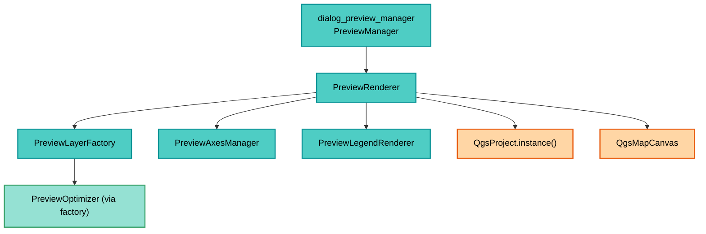

---
tags:
  - secinterp
  - code-walkthrough
  - gui
  - renderers
aliases:
  - preview_renderer.py
  - PreviewRenderer
cssclass: secinterp-note
note_lines: 700
---

# `gui/preview_renderer.py`

> [!abstract] One-line summary
> Preview render orchestrator: requests layers from the factory, adds grid and labels, registers temporaries in the project without legend entries, pushes them to the canvas, and cleans up leak-free (including the 2026-09-21 scratch-layer fix).

**Path**: `gui/preview_renderer.py` (315 lines)
**Main class**: `PreviewRenderer`
**Layer**: GUI (Present · Render Orchestrator)
**Tags**: #secinterp #gui #renderers

---

## 🎯 Why does this file exist?

Turning data into layers is not enough: they must be ordered, framed, lifecycle-managed,
and removed without a trace. This orchestrator centralizes that cycle:

| Problem | Solution |
|---------|----------|
| Seven data branches must compose into a stable Z-order | `_collect_data_layers` with fixed order (top→bottom) |
| Two overlapping renders corrupt `self.layers` | `is_rendering` lock with `try/finally` |
| Orphaned memory layers trigger the scratch-layer prompt on QGIS exit | `cleanup` / `_cleanup_layers` with `removeMapLayers` (2026-09-21 fix) |
| In QGIS 4, off-project layers can crash rendering | Registration via `addMapLayer(layer, False)` (no legend) |
| Grid, labels and legend are distinct responsibilities | Delegation to `PreviewAxesManager` and `PreviewLegendRenderer` |

> [!important] Architectural note
> **Present Facade.** `PreviewRenderer` creates no geometries and computes nothing: it
> coordinates `PreviewLayerFactory` (layers), `PreviewAxesManager` (grid) and
> `PreviewLegendRenderer` (legend). It solely owns `self.layers`.

---

## 🧬 Relationship diagram



> [!tip] How to read
> The manager owns the renderer; the renderer delegates to three specialists and is the
> only one talking to `QgsProject` and the canvas. `PreviewOptimizer` arrives indirectly.

---

## 📦 Imports — architectural reading

```python
# gui/preview_renderer.py
import contextlib
from typing import Any

from qgis.core import QgsProject, QgsWkbTypes
from qgis.gui import QgsMapCanvas
from qgis.PyQt.QtCore import QRectF
from qgis.PyQt.QtGui import QPainter

from sec_interp.core.domain import GeologyData, InterpretationPolygon, ProfileData, StructureData
from sec_interp.logger_config import get_logger

from .preview_axes_manager import PreviewAxesManager
from .preview_layer_factory import PreviewLayerFactory
from .preview_legend_renderer import PreviewLegendRenderer
```

| # | Observation |
|---|-------------|
| ① | `contextlib.suppress` wraps `scale(1.1)` and disconnects: cosmetic failures never break rendering. |
| ② | `QgsProject` is only used to register/remove temporaries (lifecycle, not data). |
| ③ | `QgsWkbTypes` appears only in `_cleanup_rubber_bands` (`reset(PolygonGeometry)`). |
| ④ | `QgsMapCanvas` is only a type annotation for the injected canvas. |
| ⑤ | `QPainter / QRectF` merely transit into `draw_legend` (the renderer never paints). |
| ⑥ | From core only types enter (`ProfileData`, `GeologyData`, `StructureData`, `InterpretationPolygon`). |
| ⑦ | Relative imports (`.preview_*`) mark a cohesive preview sub-package inside `gui/`. |

---

## 🏗️ Structure inventory

**Class:** `class PreviewRenderer` — 1 property + 11 methods

**State (constructor):**
- `__init__(canvas=None)`: `canvas`, `layers`, `interpretation_rubbers`, `layer_factory`, `axes_manager`, `legend_renderer`, `has_topography`, `has_structures`, `is_rendering`
- `active_units` (property delegated to the factory)

**Public pipeline:**
- `render(topo_data, geol_data, struct_data, vert_exag, dip_line_length, max_points, preserve_extent, use_adaptive_sampling, drillhole_data, interp_data)`
- `draw_legend(painter, rect)`
- `cleanup()`

**Internal orchestration:**
- `_collect_data_layers(...)` — Z-order
- `_add_struct_layer(data, topo, geol, exag, dip_len)`
- `_add_drillhole_layers(data, exag)`
- `_calculate_extent(layers)`
- `_setup_canvas(layers, extent, preserve_extent)`

**Lifecycle:**
- `_cleanup_layers(layers=None)`
- `_get_valid_layer_ids(layers)`
- `_cleanup_rubber_bands()`

---

## 📁 Files in the package

| File | Role relative to the renderer |
|---|---|
| `gui/preview_layer_factory.py` | Creates and styles each data layer |
| `gui/preview_axes_manager.py` | Grid (`create_axes_layer`) and labels (`create_axes_labels_layer`) |
| `gui/preview_legend_renderer.py` | Draws the legend from `active_units` + flags |
| `gui/preview_render_mixin.py` | Decides `max_points`/VE and calls `draw_preview` (upstream) |
| `gui/preview_callbacks_mixin.py` | Refreshes after async tasks (upstream) |
| `gui/dialog_preview_manager.py` | Renderer owner (`PreviewManager`) |
| `gui/main_dialog.py` / plugin | `draw_preview` delegates into `render` |
| `gui/utils.py` | `create_memory_layer` used by factory and axes |

---

## 📖 Method-by-method walkthrough

### `__init__` — specialist composition

```python
def __init__(self, canvas: QgsMapCanvas | None = None) -> None:
    self.canvas = canvas
    self.layers: list = []
    self.interpretation_rubbers: list = []

    self.layer_factory = PreviewLayerFactory()
    self.axes_manager = PreviewAxesManager()
    self.legend_renderer = PreviewLegendRenderer()

    self.has_topography = False
    self.has_structures = False
    self.is_rendering = False
```

The canvas is optional and injected (testable without real QGIS). The three specialists
are created once and reused across renders; `has_topography / has_structures` are the
legend flags reset on every `render`.

### `active_units` — legend without coupling

```python
@property
def active_units(self) -> dict[str, Any]:
    return self.layer_factory.active_units
```

Read-only: exposes the unit registry for `draw_legend` without exposing the factory.
Resetting lives in `_cleanup_layers` (`self.layer_factory.active_units = {}`).

### `render` — 6-step pipeline with lock

```python
def render(self, topo_data, geol_data=None, struct_data=None, vert_exag=1.0,
           dip_line_length=None, max_points=1000, preserve_extent=False,
           use_adaptive_sampling=False, drillhole_data=None, interp_data=None):
    if self.is_rendering:
        logger.warning("Render already in progress, skipping overlapping call.")
        return None, []
    try:
        self.is_rendering = True
        self._cleanup_layers()
        self.has_topography = False
        self.has_structures = False
        data_layers = self._collect_data_layers(...)
        if not data_layers:
            return None, []
        extent = self._calculate_extent(data_layers)
        axes_layer = self.axes_manager.create_axes_layer(extent, vert_exag)
        labels_layer = self.axes_manager.create_axes_labels_layer(extent, vert_exag)
        layers = [labels_layer, *data_layers, axes_layer]
        layers = [layer for layer in layers if layer is not None]
        for layer in layers:
            if layer and not QgsProject.instance().mapLayer(layer.id()):
                QgsProject.instance().addMapLayer(layer, False)
        self.layers = layers
        self._setup_canvas(layers, extent, preserve_extent)
        return self.canvas, layers
    finally:
        self.is_rendering = False
```

| Step | Detail |
|------|--------|
| 0. Guard | `is_rendering` prevents overlapping renders (e.g. zoom mid-render); `finally` always releases |
| 1. Cleanup | `_cleanup_layers()` removes the previous render's temporaries |
| 2. Data layers | `_collect_data_layers` in Z-order |
| 3. No data | early `return None, []` (empty dialog, no error) |
| 4. Axes | combined `extent` from data only (grid never expands it) |
| 5. Registration | `addMapLayer(layer, False)`: project lifetime (stable QGIS 4) but hidden from the legend |
| 6. Canvas | `_setup_canvas` pushes layers + framing + `refresh` |

> [!note] The `# 4. Axes and Labels` comment skips 3
> Inherited numbering in the source; the real phases are the six in the table.

### `_setup_canvas` — fault-tolerant push

```python
def _setup_canvas(self, layers, extent, preserve_extent):
    if not self.canvas or not extent:
        return
    self.canvas.setLayers(layers)
    if not preserve_extent:
        padded_extent = extent
        with contextlib.suppress(AttributeError, TypeError, RuntimeError):
            padded_extent.scale(1.1)
    self.canvas.setExtent(padded_extent)
    self.canvas.refresh()
    if self.canvas.scene():
        self.canvas.scene().update()
```

`preserve_extent=True` (LOD zoom) keeps the framing; otherwise it frames with a 10 %
margin. The `suppress` guards mock extents in tests. `scene().update()` forces a
repaint on Qt6.

### `_collect_data_layers` — the canonical Z-order

```python
def _collect_data_layers(self, topo_data, geol_data, struct_data, vert_exag,
                         max_points, use_adaptive, dip_len, drill_data, interp_data):
    topo_layer = self.layer_factory.create_topo_layer(topo_data, vert_exag,
                                                      max_points, use_adaptive)
    if topo_layer:
        self.has_topography = True
    topo_fill = self.layer_factory.create_topo_fill_layer(topo_data, vert_exag, max_points)
    geol_layer = self.layer_factory.create_geol_layer(geol_data, vert_exag, max_points)
    struct_layer = self._add_struct_layer(struct_data, topo_data, geol_data, vert_exag, dip_len)
    drill_layers = self._add_drillhole_layers(drill_data, vert_exag)
    interp_layer = self.layer_factory.create_interp_layer(interp_data, vert_exag)
    candidates = [struct_layer, geol_layer, topo_layer, topo_fill,
                  *drill_layers, interp_layer]
    return [L for L in candidates if L is not None]
```

Paint order (first = top): structures → geology → topography → fill → drillholes
(traces, intervals) → interpretations. `None`s are filtered; legend flags are set as a
side effect.

### `_add_struct_layer` — fallback reference

```python
def _add_struct_layer(self, data, topo, geol, exag, dip_len):
    ref = topo if topo else ([p for s in geol for p in s.points] if geol else None)
    layer = self.layer_factory.create_struct_layer(data, ref, exag, dip_len)
    if layer:
        self.has_structures = True
    return layer
```

Without topo, ticks scale against flattened geology points; with neither, `ref=None`
and the factory falls back to the default range (100 → length 10).

### `_add_drillhole_layers` — traces + intervals

```python
def _add_drillhole_layers(self, data, exag):
    layers = []
    if not data:
        return layers
    t_layer = self.layer_factory.create_drillhole_trace_layer(data, exag)
    if t_layer:
        layers.append(t_layer)
    i_layer = self.layer_factory.create_drillhole_interval_layer(data, exag)
    if i_layer:
        layers.append(i_layer)
    return layers
```

Returns 0–2 layers in trace→interval order. The `if not data` guard avoids empty layers
while the async task is still running.

### `draw_legend` — total delegation

```python
def draw_legend(self, painter: QPainter, rect: QRectF) -> None:
    self.legend_renderer.draw_legend(
        painter, rect, self.active_units, self.has_topography, self.has_structures)
```

The renderer cannot draw legends: it forwards painter, rect, units and flags. See
[[preview_legend_renderer]].

### `cleanup` + `_cleanup_layers` — the scratch-layer fix (2026-09-21)

```python
def cleanup(self) -> None:
    self._cleanup_layers()

def _cleanup_layers(self, layers=None):
    if layers is None:
        layers = self.layers
    project = QgsProject.instance()
    if not project or not layers:
        return
    valid_ids = self._get_valid_layer_ids(layers)
    if valid_ids:
        try:
            project.removeMapLayers(valid_ids)
        except Exception as e:
            logger.warning(f"Non-critical error during layer cleanup: {e}")
    self.layers = []
    self.layer_factory.active_units = {}
    self._cleanup_rubber_bands()
```

Idempotent and safe on dialog close and plugin unload: removes temporaries from the
project so QGIS never prompts about scratch layers on exit. The `try/except` with
`warning` makes cleanup non-critical by design. It accepts an external list (selective
cleanup) although normal use is `self.layers`.

### `_get_valid_layer_ids` — stale-object tolerant

```python
def _get_valid_layer_ids(self, layers):
    valid_ids = []
    for layer in layers:
        try:
            if layer and hasattr(layer, "id"):
                valid_ids.append(layer.id())
        except (RuntimeError, AttributeError):
            continue
    return valid_ids
```

SIP wrappers of C++-deleted layers raise `RuntimeError` on touch; this filter skips
them. Without it, a render after a partial close would break cleanup.

### `_cleanup_rubber_bands` — interpretation C++ memory

```python
def _cleanup_rubber_bands(self):
    if not self.canvas or not self.canvas.scene():
        self.interpretation_rubbers = []
        return
    scene = self.canvas.scene()
    for rb in self.interpretation_rubbers:
        try:
            rb.hide()
            rb.reset(QgsWkbTypes.GeometryType.PolygonGeometry)
            scene.removeItem(rb)
        except Exception as e:
            logger.warning(f"Failed to remove rubber band: {e}")
    self.interpretation_rubbers = []
```

`hide + reset + removeItem` frees scene items (C++ memory Python alone never collects).
Each failure is logged and skipped.

### `_calculate_extent` — combined envelope

```python
def _calculate_extent(self, layers):
    extent = None
    for layer in layers:
        layer_extent = layer.extent()
        if extent is None:
            extent = layer_extent
        else:
            extent.combineExtentWith(layer_extent)
    return extent
```

Data layers only (the grid is drawn afterwards inside that framing).

---

## 🔄 Data flow

| Phase | Input | Transformation | Output |
|-------|-------|----------------|--------|
| Result branches | `topo / geol / struct / drillhole` + `interp_data` | factory → layers | `data_layers` in Z-order |
| Framing | data layers | `_calculate_extent` | combined `extent` |
| Grid | `extent` + `vert_exag` | `axes_manager` | axes and label layers |
| Registration | loose layers | `addMapLayer(layer, False)` | stable lifetime, no legend |
| Canvas | layers + extent | `setLayers / setExtent / refresh` | `(canvas, layers)` |
| Cleanup | `self.layers` | `removeMapLayers` + legend/rubber reset | `[]`, no temporaries |

---

## 🏛️ Design patterns present

| Pattern | Where | Purpose |
|---------|-------|---------|
| **Facade** | `render` | One call composes factory + axes + canvas |
| **Delegation** | three specialists | Separate layers, grid and legend |
| **Guard (reentrancy)** | `is_rendering` + `finally` | No overlapping renders |
| **Fixed Z-order** | `_collect_data_layers` | Deterministic paint order |
| **Lifecycle owner** | `_cleanup_layers` | No scratch-layer leaks |
| **Tolerant reader** | `_get_valid_layer_ids` | Survive stale C++ wrappers |

---

## 🧾 API summary

| Symbol | Signature | Typical use |
|--------|-----------|-------------|
| `PreviewRenderer` | `__init__(canvas=None)` | One instance per dialog |
| `render` | `(topo_data, geol_data=None, struct_data=None, vert_exag=1.0, dip_line_length=None, max_points=1000, preserve_extent=False, use_adaptive_sampling=False, drillhole_data=None, interp_data=None) -> tuple` | Full pipeline |
| `draw_legend` | `(painter: QPainter, rect: QRectF)` | Legend over the canvas |
| `cleanup` | `() -> None` | Leak-free close/unload |
| `active_units` | property | Unit readout for legend |
| `_collect_data_layers` | private | Z-order |
| `_cleanup_layers` | `(layers=None)` | Temporary removal |

---

## 🛡️ Error handling

| Situation | Behavior |
|-----------|----------|
| Overlapping render | `warning` + `return None, []` |
| No data layers | silent `return None, []` |
| No canvas or no extent | `_setup_canvas` returns doing nothing |
| `removeMapLayers` failure | `warning` (non-critical), keeps resetting state |
| Broken rubber band | `warning` per item, continues with the rest |
| Incompatible `scale(1.1)` | suppressed (`AttributeError/TypeError/RuntimeError`) |

---

## 🧪 Associated tests

- `tests/gui/test_preview_components.py` — `TestPreviewComponents`: `render` pipeline with mocks, axes and factory.
- `tests/gui/test_preview_renderer_custom.py` — custom `dip_line_length` down to the structural layer.
- `tests/gui/test_dialog_preview_manager.py` — the manager owning the renderer (accept/close cycle).
- `tests/core/test_preview_service.py` — the input `PreviewResult` for the pipeline.

---

## 👀 Observations and notes

> [!success] Strengths
> - Single owner of `self.layers`: idempotent, leak-free cleanup (2026-09-21 fix).
> - Overlap guard with guaranteed release in `finally`.
> - `addMapLayer(layer, False)` stabilizes QGIS 4 without polluting the project legend.
> - Grid excluded from extent math: data drives the framing.

> [!warning] Points of attention
> - `padded_extent = extent` copies nothing: `scale(1.1)` mutates the combined extent (usually discarded after render).
> - `has_topography / has_structures` as side effects of `_collect_data_layers` couple legend and collection.
> - Canvas-less (tests/headless) `render` still registers into the project but returns layers anyway: callers must tolerate `canvas=None`.

> [!question] Open questions
> - Copy the extent before `scale` to avoid mutating the combined object?
> - Return the legend flags instead of setting them as a side effect?

---

## 🔗 Related notes

- [[Index]] — vault index
- [[preview_service]] — `PreviewResult` feeding the pipeline
- [[preview_layer_factory]] — creates each data layer
- [[preview_axes_manager]] — framing grid and labels
- [[preview_legend_renderer]] — delegated legend
- [[dialog_preview_manager]] — renderer owner
- [[preview_page]] — canvas and results widget
- [[controller]] — root composition of services and extractors
- [[vertical_exaggeration_service]] — adaptive VE on display
- [[layer_notification_manager]] — invalidation on layer changes

---

*Note of the SecInterp Code Walkthrough v2 vault — v3.8.0*
