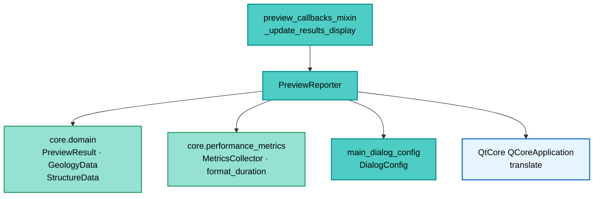

---
tags:
  - secinterp
  - code-walkthrough
  - gui
  - preview
aliases:
  - preview_reporter.py
  - PreviewReporter
cssclass: secinterp-note
---

# `gui/preview_reporter.py`

> [!abstract] One-line summary
> Static formatter turning the `PreviewResult` and its metrics into the dialog results text: per-branch counts, geometric ranges, vertical exaggeration (auto/manual) and `MetricsCollector` timings, all translatable.

**Path**: `gui/preview_reporter.py` (181 lines)
**Main class**: `PreviewReporter`
**Layer**: GUI (Present · Results Formatting)
**Tags**: #secinterp #gui #preview

---

## 🎯 Why does this file exist?

The `PreviewResult` is a data structure; the user needs a readable summary in
`results_text`. This formatter concentrates that text in one place:

| Problem | Solution |
|---------|----------|
| Every callback formatted results its own way | Single `format_results_message(result, metrics, vert_exag, auto_vert_exag)` |
| The summary mixes counts, ranges, VE and timings | One static method per block, composed by lines |
| Literals must be translated | `QCoreApplication.translate("PreviewReporter", ...)` on every string |
| Internal metrics must not leak uncontrolled | `DialogConfig.ENABLE_PERFORMANCE_METRICS and SHOW_METRICS_IN_RESULTS` gate |
| Optional timings (missing geol/struct) pollute the report | Conditional skips when `result.geol`/`result.struct` are empty |

> [!important] Architectural note
> **Pure presenter, no widgets.** It knows neither `results_text` nor the dialog: in goes
> a `PreviewResult`, out goes `str`/`list[str]`. The caller ([[preview_callbacks_mixin]])
> decides where to show it. Testable without Qt.

---

## 🧬 Relationship diagram



> [!tip] How to read
> The mixin assembles the `PreviewResult` from the cache and the reporter reduces it to
> text. `DialogConfig` decides whether timings show; `format_duration` humanizes them.

---

## 📦 Imports — architectural reading

```python
# gui/preview_reporter.py
from typing import Any

from qgis.PyQt.QtCore import QCoreApplication

from sec_interp.core.domain import GeologyData, PreviewResult, StructureData
from sec_interp.core.performance_metrics import MetricsCollector, format_duration

from .main_dialog_config import DialogConfig
```

| # | Observation |
|---|-------------|
| ① | Only `QCoreApplication` from Qt: translate without widgets or canvas. |
| ② | From core only read types (`PreviewResult`, `GeologyData`, `StructureData`) + metrics. |
| ③ | `MetricsCollector` as a parameter (not a global): the caller owns the cycle's metrics. |
| ④ | `DialogConfig` is the only coupling to GUI configuration (metrics double flag). |
| ⑤ | `Any` only in `format_drillhole_summary(drillhole_data: Any)`: the branch is heterogeneous. |
| ⑥ | Zero `qgis.core`: 100 % layer-agnostic formatting. |

---

## 🏗️ Structure inventory

**Class:** `class PreviewReporter` — 7 `staticmethod`s

- `format_results_message(result, metrics, vert_exag=None, auto_vert_exag=False) -> str`
- `format_geology_summary(geol_data) -> str`
- `format_structure_summary(struct_data, buffer_dist) -> str`
- `format_drillhole_summary(drillhole_data) -> str`
- `format_result_metrics(result) -> list[str]`
- `format_vertical_exaggeration(vert_exag, auto_vert_exag) -> list[str]`
- `format_performance_metrics(metrics, result) -> list[str]`

---

## 📁 Files in the package

| File | Role relative to the reporter |
|---|---|
| `gui/preview_callbacks_mixin.py` | `_update_results_display` invokes it and dumps into `results_text` |
| `gui/main_dialog_config.py` | `DialogConfig`: metrics visibility flags |
| `core/domain/dtos.py` | `PreviewResult.get_elevation_range / get_distance_range` (see [[dtos]]) |
| `core/performance_metrics.py` | `MetricsCollector.timings` + `format_duration` |
| `gui/preview_render_mixin.py` | `_resolve_vertical_exaggeration` provides the displayed VE |

---

## 📖 Method-by-method walkthrough

### `format_results_message` — the full report

```python
@staticmethod
def format_results_message(result, metrics, vert_exag=None, auto_vert_exag=False):
    lines = [
        QCoreApplication.translate("PreviewReporter", "✓ Preview generated!"),
        "",
        QCoreApplication.translate("PreviewReporter", "Topography: {} points").format(
            len(result.topo) if result.topo else 0),
    ]
    lines.append(PreviewReporter.format_geology_summary(result.geol))
    lines.append(PreviewReporter.format_structure_summary(result.struct, result.buffer_dist))
    lines.append(PreviewReporter.format_drillhole_summary(result.drillhole))
    lines.extend(PreviewReporter.format_result_metrics(result))
    lines.extend(PreviewReporter.format_vertical_exaggeration(vert_exag, auto_vert_exag))
    if DialogConfig.ENABLE_PERFORMANCE_METRICS and DialogConfig.SHOW_METRICS_IN_RESULTS:
        lines.extend(PreviewReporter.format_performance_metrics(metrics, result))
    footer = (
        QCoreApplication.translate(
            "PreviewReporter", "Vertical exaggeration is set automatically.")
        if auto_vert_exag
        else QCoreApplication.translate(
            "PreviewReporter", "Adjust 'Vert. Exag.' and click Preview to update.")
    )
    lines.extend(["", footer])
    return "\n".join(lines)
```

| Block | Content |
|-------|---------|
| Header | `✓ Preview generated!` + topography (0 when missing) |
| Branches | One line each for geology, structures, drillholes |
| Ranges | Elevation and distance from the result |
| VE | Auto/manual line, or nothing when `vert_exag is None` |
| Timings | Only under the `DialogConfig` double flag |
| Footer | Different message for automatic vs manual VE |

### `format_geology_summary` — one line per branch

```python
@staticmethod
def format_geology_summary(geol_data):
    if not geol_data:
        return QCoreApplication.translate("PreviewReporter", "Geology: No data")
    return QCoreApplication.translate("PreviewReporter", "Geology: {} segments").format(
        len(geol_data))
```

Distinguishes "no data" from "N segments": the user knows whether the branch was skipped
or computed empty. Identical pattern across all three branches (deliberate symmetry).

### `format_structure_summary` — with buffer

```python
@staticmethod
def format_structure_summary(struct_data, buffer_dist):
    if not struct_data:
        return QCoreApplication.translate("PreviewReporter", "Structures: No data")
    return QCoreApplication.translate(
        "PreviewReporter", "Structures: {} measurements (buffer: {}m)"
    ).format(len(struct_data), buffer_dist)
```

Includes the result's `buffer_dist`: measurements depend on the capture buffer and the
report makes that explicit (parameter traceability).

### `format_drillhole_summary` — heterogeneous count

```python
@staticmethod
def format_drillhole_summary(drillhole_data):
    if not drillhole_data:
        return QCoreApplication.translate("PreviewReporter", "Drillholes: No data")
    return QCoreApplication.translate(
        "PreviewReporter", "Drillholes: {} holes found").format(len(drillhole_data))
```

Accepts `Any` (a `DrillholeProjection` list or tuples): only uses `len`, assuming no
shape. "holes found" (not "processed") reflects that this is projection, not compute.

### `format_result_metrics` — geometric ranges

```python
@staticmethod
def format_result_metrics(result):
    min_elev, max_elev = result.get_elevation_range()
    min_dist, max_dist = result.get_distance_range()
    return [
        "",
        QCoreApplication.translate("PreviewReporter", "Geometry Range:"),
        QCoreApplication.translate("PreviewReporter", "  Elevation: {} to {} m").format(
            round(min_elev, 1), round(max_elev, 1)),
        QCoreApplication.translate("PreviewReporter", "  Distance: {} to {} m").format(
            round(min_dist, 1), round(max_dist, 1)),
    ]
```

Delegates to the `PreviewResult` (multi-branch global elevation, topo-based distance)
and rounds to 0.1 m. The two-space indent groups lines visually under the heading.

### `format_vertical_exaggeration` — auto vs manual

```python
@staticmethod
def format_vertical_exaggeration(vert_exag, auto_vert_exag):
    if vert_exag is None:
        return []
    if auto_vert_exag:
        line = QCoreApplication.translate(
            "PreviewReporter", "Vertical exaggeration: {}× (auto)").format(round(vert_exag, 1))
    else:
        line = QCoreApplication.translate(
            "PreviewReporter", "Vertical exaggeration: {}× (manual)").format(round(vert_exag, 1))
    return ["", line]
```

The unicode `×` and the `(auto)/(manual)` suffix mirror the
[[vertical_exaggeration_service]] convention: the user always knows the factor's origin.

### `format_performance_metrics` — filtered timings

```python
@staticmethod
def format_performance_metrics(metrics, result):
    timings = metrics.timings
    if not timings:
        return []
    lines = ["", QCoreApplication.translate("PreviewReporter", "Performance:")]
    mapping = {
        "Topography Generation": "  Topo: {}",  # no-i18n: internal perf key
        "Geology Generation": "  Geol: {}",  # no-i18n: internal perf key
        "Structure Generation": "  Struct: {}",  # no-i18n: internal perf key
        "Rendering": "  Render: {}",  # no-i18n: internal perf key
        "Total Preview Generation": "  Total: {}",  # no-i18n: internal perf key
    }
    for key, template in mapping.items():
        if key in timings:
            if key == "Geology Generation" and not result.geol:  # no-i18n: dict key
                continue
            if key == "Structure Generation" and not result.struct:  # no-i18n: dict key
                continue
            lines.append(QCoreApplication.translate("PreviewReporter", template).format(
                format_duration(timings[key])))
    return lines
```

| Decision | Detail |
|----------|--------|
| `no-i18n` keys | Phase names are internal `PerformanceTimer` keys, not UI |
| Translatable templates | `"  Topo: {}"` does go through `translate` (visible label) |
| Geol/struct filter | Orphaned timings (ran but dataless) are hidden |
| Fixed order | Dict preserves the topo→total narrative order |

---

## 🔄 Data flow

| Phase | Input | Transformation | Output |
|-------|-------|----------------|--------|
| Cache | `cached_data` + metrics | `PreviewResult(...)` assembled | consolidated result |
| Blocks | result + VE + metrics | seven formatters | line list |
| Gate | `DialogConfig` | double flag | timings included or omitted |
| Text | lines | `"\n".join` | `str` for `results_text` |
| Auto VE | `auto_ve_check` | `set_auto_ve` + `(auto)` suffix | coherent display |

---

## 🏛️ Design patterns present

| Pattern | Where | Purpose |
|---------|-------|---------|
| **Presenter (no widgets)** | whole class | Qt-free testable text |
| **Composed formatter** | `format_results_message` | One block = one method |
| **Feature gate** | `DialogConfig` double flag | Metrics only on demand |
| **i18n template** | `translate(...).format(...)` | Translate before interpolating |

---

## 🧾 API summary

| Symbol | Signature | Typical use |
|--------|-----------|-------------|
| `format_results_message` | `(result, metrics, vert_exag=None, auto_vert_exag=False) -> str` | Dialog text |
| `format_geology_summary` | `(geol_data) -> str` | Geology line |
| `format_structure_summary` | `(struct_data, buffer_dist) -> str` | Line + buffer |
| `format_drillhole_summary` | `(drillhole_data) -> str` | Drillhole line |
| `format_result_metrics` | `(result) -> list[str]` | Ranges |
| `format_vertical_exaggeration` | `(vert_exag, auto_vert_exag) -> list[str]` | VE line |
| `format_performance_metrics` | `(metrics, result) -> list[str]` | Timings |

---

## 🛡️ Error handling

| Situation | Behavior |
|-----------|----------|
| Missing branch | "No data" line, never an exception |
| `vert_exag is None` | Block omitted (`[]`) |
| Empty `timings` | Block omitted (`[]`) |
| Disabled metrics | Block omitted by gate |

> [!note] Totally total
> No method raises: an empty result still yields the "all dataless" report. The caller
> needs no `try/except`.

---

## 🧪 Associated tests

- `tests/gui/test_dialog_preview_manager.py` — `_update_results_display` and the final text in `results_text`.
- `tests/core/test_preview_service.py` — `PreviewResult` and `metrics` feeding the report.
- `tests/core/test_vertical_exaggeration_service.py` — the VE shown as auto/manual.

---

## 👀 Observations and notes

> [!success] Strengths
> - Full branch symmetry: adding a new one (e.g. interpretations) is trivial.
> - Systematic i18n with the `"PreviewReporter"` context.
> - Internal keys marked `no-i18n` without polluting the catalog.

> [!warning] Points of attention
> - No interpretations row: `interp_data` renders but is never reported.
> - Fixed `round(..., 1)`: kilometer ranges show useless decimals.
> - The footer names `'Vert. Exag.'` (English control name) untranslated.
> - `format_drillhole_summary` typed `Any`: no tuple-vs-DTO distinction.

> [!question] Open questions
> - Add an interpretations line (`N polygons`) to the report?
> - Adaptive range formatting (m vs km) by magnitude?

---

## 🧾 Report example

With 843 topo points, 12 segments, 5 measurements (50 m buffer), 3 drillholes,
120.4–368.9 m range, 1.5 VE (auto) and metrics enabled:

```text
✓ Preview generated!

Topography: 843 points
Geology: 12 segments
Structures: 5 measurements (buffer: 50.0m)
Drillholes: 3 holes found

Geometry Range:
  Elevation: 120.4 to 368.9 m
  Distance: 0.0 to 2450.0 m

Vertical exaggeration: 1.5× (auto)

Performance:
  Topo: 320 ms
  Geol: 180 ms
  Struct: 95 ms
  Render: 140 ms
  Total: 812 ms

Vertical exaggeration is set automatically.
```

> [!note] One block per method
> Each paragraph comes from one formatter: header, three branches, ranges
> (`format_result_metrics`), VE (`format_vertical_exaggeration`), timings
> (`format_performance_metrics`) and mode-dependent footer.

---

## 🔗 Related notes

- [[Index]] — vault index
- [[preview_callbacks_mixin]] — invokes the report from the cache
- [[preview_render_mixin]] — resolves the displayed VE
- [[preview_service]] — produces `result` + `metrics`
- [[preview_page]] — `results_text` receiving the text
- [[dtos]] — `PreviewResult.get_elevation_range / get_distance_range`
- [[vertical_exaggeration_service]] — auto/manual convention
- [[performance_metrics]] — `MetricsCollector` and `format_duration`
- [[main_dialog_config]] — visibility flags

---

*Note of the SecInterp Code Walkthrough v2 vault — v3.9.1*
