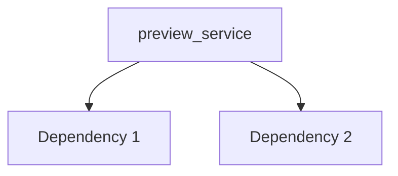

---
tags:
  - secinterp
  - code-walkthrough
  - core      # core | gui | exporters
  - services     # services | managers | renderers | adapters | validation | etc.
aliases:
  - preview_service.py  # e.g. path_resolver.py
  - preview_service     # e.g. resolve_export_path
cssclass: secinterp-note
note_lines: 700
---

# `core/services/preview_service.py`

> [!abstract] One-line summary
> Service for managing preview generation and rendering. — what this module does in one sentence, without touching QGIS if it is core.

**Path**: `core/services/preview_service.py` (175 lines)
**Main class/function**: `preview_service`
**Layer**: core (QGIS-agnostic / GUI · Type)
**Tags**: #secinterp #core #services

---

## 🎯 Why does this file exist?

| Problem | Solution |
|---------|----------|
| (pending) | (pending) |
| (pending) | (pending) |

> [!important] Architectural note
> QGIS-agnóstico (e.g. "QGIS-agnostic", "Extract Adapter", "Factory").

---

## 🧬 Relationship diagram



> [!tip] How to read
> Solid arrow = imports/delegates; dashed = callback/injected.

---

## 📦 Imports — architectural reading

```python
# preview_service.py
from __future__ import annotations
import math
from typing import Any
from sec_interp.core.domain import PreviewParams, PreviewResult
from sec_interp.core.exceptions import ProcessingError
from sec_interp.core.performance_metrics import PerformanceTimer
from sec_interp.logger_config import get_logger
```

| # | Observation |
|---|-------------|
| ① | (pending) |
| ② | (pending) |

---

## 🏗️ Structure inventory

**Clases:** `class PreviewService` — 8 métodos
**Funciones/Métodos:**
- `PreviewService.__init__(def __init__(self, controller: Any) -> None:)`
- `PreviewService.drillhole_service(@property)`
- `PreviewService.geology_service(@property)`
- `PreviewService.structure_service(@property)`
- `PreviewService.calculate_max_points(@staticmethod)`
- `PreviewService.generate_all(def generate_all(self, params: PreviewParams, transform_context: Any) -> PreviewResult:)`
- `PreviewService._generate_topography_step(def _generate_topography_step(self, params: PreviewParams, result: PreviewResult) -> None:)`
- `PreviewService._generate_structures_step(def _generate_structures_step(self, params: PreviewParams, result: PreviewResult) -> None:)`

---

## 📁 Files in the package

- `preview_service.py` — individual note for this file.

---

## 📖 Method-by-method walkthrough

### `method_1`

```python
# (enriquecer)
```

_(enriquecer leyendo el fuente)_

### `method_2`

```python
# (enriquecer)
```

_(enriquecer leyendo el fuente)_

<!-- Add one subsection per public method of the module -->

---

## 🔄 Data flow

| Phase | Input | Transformation | Output |
|-------|-------|----------------|--------|
| - | - | - | - |
| - | - | - | - |

---

## 🏛️ Design patterns present

| Pattern | Where | Purpose |
|---------|-------|---------|
| - | - | - |

---

## 🧾 API summary

| Symbol | Signature / Inherits | Typical use |
|--------|----------------------|-------------|
| (no symbols) | `-` | - |

---

## 🛡️ Error handling

_(pending)_

---

## 🧪 Associated tests

_(pending)_

---

## 👀 Observations and notes

> [!success] Strengths
> - (skeleton)

> [!warning] Points of attention
> - (skeleton)

> [!question] Open questions
> - (skeleton)

---

## 🔗 Related notes

- [[Index]] — vault index
- [[Index]] — index
- [[controller]] — orchestrator

---

*Note of the SecInterp Code Walkthrough v2 vault — v3.8.0*
