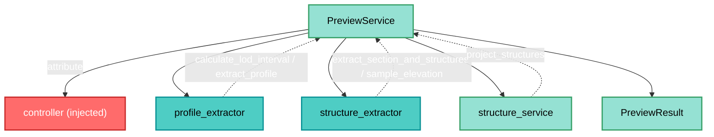

---
tags:
  - secinterp
  - code-walkthrough
  - core
  - services
  - orchestrator
aliases:
  - preview_service.py
  - PreviewService
  - IPreviewService
cssclass: secinterp-note
note_lines: 700
---

# `core/services/preview_service.py`

> [!abstract] One-line summary
> Orchestrator that generates, **synchronously**, the preview's topography and structures into a consolidated `PreviewResult`, relying on the injected controller's adapters and services.

**Path**: `core/services/preview_service.py` (175 lines)
**Main class**: `PreviewService`
**Layer**: Core (QGIS-agnostic)
**Tags**: #secinterp #core #services #orchestrator

---

## 🎯 Why does this file exist?

The preview of a section requires composing several steps (topography + structures) into
a single result, with performance metrics and LOD support. This service centralizes that
orchestration without coupling to QGIS:

| Problem | Solution |
|---------|----------|
| Compose topo + structures into one result | `generate_all` → `PreviewResult` |
| Access other services without coupling to them | injected `controller` + `@property` |
| Measure the cost of each step | `PerformanceTimer` + `result.metrics` |
| Compute adaptive LOD for points | `calculate_max_points` (static) |

> [!important] Architectural note
> **QGIS-agnostic** (zero `qgis.*`): layer objects cross typed as `Any` inside
> `PreviewParams`. The injected `controller` acts as **composition root**: the service
> delegates to its extractors/services without knowing their implementation.

---

## 🧬 Relationship diagram



> [!tip] How to read
> `PreviewService` does not create the extractors: it obtains them from the injected
> `controller`. Dashed arrows mark the Extract-phase calls (GUI) and the pure Compute
> (`structure_service`).

---

## 📦 Imports — architectural reading

```python
# core/services/preview_service.py
import math
from typing import Any

from sec_interp.core.domain import PreviewParams, PreviewResult
from sec_interp.core.exceptions import ProcessingError
from sec_interp.core.performance_metrics import PerformanceTimer
from sec_interp.logger_config import get_logger
```

| # | Observation |
|---|-------------|
| ① | **Zero `qgis.*`**: only stdlib, domain, exceptions and telemetry. |
| ② | `math` is used in `calculate_max_points` for the logarithmic zoom boost. |
| ③ | `PreviewParams`/`PreviewResult` are the input/output DTOs. |
| ④ | `ProcessingError` is raised if required topography layers are missing. |
| ⑤ | `PerformanceTimer` (context manager) feeds `result.metrics`. |

> [!note] Does not inherit `IPreviewService`
> Unlike the other services, `PreviewService` does **not** inherit the `IPreviewService`
> contract: it implements it by shape (duck typing), not by nominal inheritance.

---

## 🏗️ Structure inventory

**Classes:** `class PreviewService` — 8 members (3 properties + 5 methods)

**Properties (delegated access to the controller):**
- `drillhole_service` — `self.controller.drillhole_service`
- `geology_service` — `self.controller.geology_service`
- `structure_service` — `self.controller.structure_service`

**Methods:**
- `__init__(controller: Any)`
- `calculate_max_points(canvas_width, manual_max=1000, auto_lod=True, ratio=1.0) -> int` (static)
- `generate_all(params: PreviewParams, transform_context: Any) -> PreviewResult`
- `_generate_topography_step(params, result)`
- `_generate_structures_step(params, result)`

---

## 📖 Method-by-method walkthrough

### `__init__` and properties — Composition root

```python
def __init__(self, controller: Any) -> None:
    self.controller = controller

@property
def drillhole_service(self) -> Any:
    return self.controller.drillhole_service

@property
def geology_service(self) -> Any:
    return self.controller.geology_service

@property
def structure_service(self) -> Any:
    return self.controller.structure_service
```

The `controller` is injected and the `@property` methods expose its services. This is
pure delegation: the preview instantiates nothing, it only routes.

### `calculate_max_points` — Adaptive LOD (static)

```python
@staticmethod
def calculate_max_points(canvas_width, manual_max=1000, auto_lod=True, ratio=1.0) -> int:
    if auto_lod:
        base_points = max(200, int(canvas_width * 2))
        ZOOM_DETAIL_BOOST_THRESHOLD = 1.1
        if ratio > ZOOM_DETAIL_BOOST_THRESHOLD:
            detail_boost = 1.0 + (math.log10(ratio) * 0.5)
            return int(base_points * detail_boost)
        return base_points
    return manual_max
```

| Rule | Value |
|------|-------|
| Automatic base | `max(200, canvas_width * 2)` (≈ 2× pixel width) |
| Zoom boost | if `ratio > 1.1` → `1.0 + log10(ratio) * 0.5` |
| Manual mode | returns `manual_max` |

> [!tip] `ratio` = full_extent / current_extent
> The more the user zooms in, the more points are shown. It is a smooth LOD, not a jump.

### `generate_all` — Main orchestration

```python
def generate_all(self, params: PreviewParams, transform_context: Any) -> PreviewResult:
    params.validate()
    result = PreviewResult(buffer_dist=params.buffer_dist)
    self.transform_context = transform_context
    self._generate_topography_step(params, result)
    self._generate_structures_step(params, result)
    return result
```

| Step | Detail |
|------|--------|
| **Validation** | `params.validate()` (native: `buffer_dist`, `band_num`) |
| **Result** | `PreviewResult(buffer_dist=...)` with default `metrics` |
| **CRS** | `transform_context` stored as an attribute (for later operations) |
| **Topography** | `_generate_topography_step` |
| **Structures** | `_generate_structures_step` (detached flow) |

> [!note] Synchronous by design
> Topo and structures are **synchronous**; drillholes are generated **asynchronously** via
> the GUI task orchestrator (module docstring). Hence there is no drillhole step.

### `_generate_topography_step` — Step 1

```python
def _generate_topography_step(self, params, result) -> None:
    with PerformanceTimer("Topography Generation", result.metrics):
        line_lyr = params.line_layer
        raster_lyr = params.raster_layer
        if not line_lyr or not raster_lyr:
            raise ProcessingError("Required layers for topography are missing.")
        interval = None
        if params.auto_lod:
            interval = self.controller.profile_extractor.calculate_lod_interval(
                line_lyr, params.canvas_width
            )
        result.topo = self.controller.profile_extractor.extract_profile(
            line_lyr, raster_lyr, params.band_num, interval=interval,
        )
        if result.topo:
            result.metrics.record_count("Topography Points", len(result.topo))
```

| Feature | Detail |
|---------|--------|
| **Metric** | `PerformanceTimer` as context manager |
| **Required** | `raise ProcessingError` if `line_lyr`/`raster_lyr` missing |
| **LOD** | `calculate_lod_interval` only if `auto_lod` |
| **Extract** | `extract_profile(...)` → `result.topo` |
| **Counter** | `record_count("Topography Points", len(...))` |

### `_generate_structures_step` — Step 2

```python
def _generate_structures_step(self, params, result) -> None:
    if params.struct_layer and params.dip_field and params.strike_field:
        with PerformanceTimer("Structure Generation", result.metrics):
            struct_lyr = params.struct_layer
            if not struct_lyr:
                return
            extractor = self.controller.structure_extractor
            if not extractor:
                return
            ctx = extractor.extract_section_and_structures(
                params.line_layer, struct_lyr, params.buffer_dist
            )
            if ctx is None:
                return
            raster_lyr = params.raster_layer
            def elevation_sampler(x: float, y: float) -> float:
                return extractor.sample_elevation(raster_lyr, x, y, params.band_num)
            result.struct = self.controller.structure_service.project_structures(
                line_points=ctx.line_points,
                struct_data=ctx.structures,
                elevation_sampler=elevation_sampler,
                line_az=ctx.line_azimuth,
                dip_field=params.dip_field,
                strike_field=params.strike_field,
            )
            if result.struct:
                result.metrics.record_count("Structure Points", len(result.struct))
```

| Feature | Detail |
|---------|--------|
| **Optional** | triple gate `struct_layer` + `dip_field` + `strike_field` |
| **Extract** | `extract_section_and_structures` → `ctx` (line + structures) |
| **Callback** | `elevation_sampler` = closure over `sample_elevation` |
| **Compute** | `project_structures(...)` → `result.struct` |
| **Counter** | `record_count("Structure Points", len(...))` |

> [!important] `elevation_sampler` = dependency inversion
> As in [[controller]], the closure encapsulates raster access so that
> `structure_service.project_structures` (pure core) only calls `elevation_sampler(x, y)`.

---

## 🔄 Data flow

| Phase | Input | Transformation | Output |
|-------|-------|----------------|--------|
| Validation | `PreviewParams` | `validate()` | raises if invalid |
| Topography | `line_lyr`, `raster_lyr` | `extract_profile` | `result.topo` |
| Structures | `ctx` + callback | `project_structures` | `result.struct` |
| Consolidation | `PreviewResult` | — | `PreviewResult` |

---

## 🏛️ Design patterns present

| Pattern | Where | Purpose |
|---------|-------|---------|
| **Orchestrator** | `generate_all` | Composes the steps into one result |
| **Dependency Injection** | `__init__(controller)` | Composition root |
| **Delegation (properties)** | `*_service` | Expose services without instantiating |
| **Strategy (callback)** | `elevation_sampler` | Injected elevation sampling |
| **Context Manager (timer)** | `PerformanceTimer` | Per-step metrics |

---

## 🧾 API summary

| Symbol | Signature / Inherits | Typical use |
|--------|----------------------|-------------|
| `PreviewService` | (no contract inheritance) | Preview orchestrator |
| `__init__` | `(controller: Any)` | DI |
| `drillhole_service` / `geology_service` / `structure_service` | `@property` | Delegated access |
| `calculate_max_points` | `(canvas_width, manual_max, auto_lod, ratio) -> int` (static) | LOD |
| `generate_all` | `(params, transform_context) -> PreviewResult` | Main |
| `_generate_topography_step` / `_generate_structures_step` | private | Steps |

---

## 🛡️ Error handling

| Situation | Behaviour |
|-----------|-----------|
| Invalid `params` | `validate()` raises `ValueError` |
| Topography without layers | `raise ProcessingError(...)` |
| Structures without `struct_layer`/`dip`/`strike` | step is skipped (gate) |
| `ctx is None` (extraction failed) | silent `return` |

> [!note] Topo "raises", structures "skip"
> Topography is **required** (raises `ProcessingError`); structures are **optional**
> (guard clauses). Consistent with the `controller` policy.

---

## 🧪 Associated tests

Mapped to `tests/core/test_preview_service.py` (mock-first, no QGIS):

- `test_preview_service.py` — orchestration with **mocked** `controller` and extractors.
- Verifies `calculate_max_points` (LOD) and the per-step metric.

---

## 👀 Observations and notes

> [!success] Strengths
> - **Zero QGIS** and clean composition via `controller`.
> - `PerformanceTimer` provides per-step metrics without coupling.
> - Smooth adaptive LOD (`log10`) in `calculate_max_points`.
> - Reuses the dependency inversion (`elevation_sampler`).

> [!warning] Points of attention
> - `self.transform_context` is a **QGIS object** stored as mutable state (latent coupling).
> - Does not inherit `IPreviewService` (inconsistent with the other services).
> - `transform_context` is not used inside `generate_all`; it is only stored.
> - Error messages (`"Required layers..."`) do not use `self.tr()` (no i18n).

> [!question] Open questions
> - Make `PreviewService` inherit `IPreviewService` for consistency?
> - Remove the `transform_context` attribute if it is not consumed here?
> - Translate `ProcessingError` messages with `self.tr()`?

---

## 📐 Synchronous vs asynchronous

The module docstring fixes the division of responsibilities:

| Domain | Mode | Where it is generated |
|--------|------|-----------------------|
| Topography | **synchronous** | `_generate_topography_step` |
| Structures | **synchronous** | `_generate_structures_step` |
| Drillholes | **asynchronous** | GUI task orchestrator (not here) |
| Geology | (not in this flow) | `controller` / `_process_geology` |

> [!important] Why drillholes are outside
> Drillholes are expensive (trajectory per hole); they are processed in `QgsTask` to avoid
> blocking the canvas. `PreviewResult` receives them later via `result.drillhole`.

## 🧩 The `transform_context` attribute

```python
self.transform_context = transform_context
```

It is a `QgsCoordinateTransformContext` (a QGIS object) that arrives typed as `Any`. It is
**stored** as an attribute so later steps (render/export) can do CRS transformations. In
`generate_all` it is not consumed directly.

> [!warning] Latent coupling
> Storing a QGIS object as instance state brings the service closer to the GUI, even
> though it does not import it. This is the most fragile point of the architectural note.

## 🔗 Related notes

- [[Index]] — vault index
- [[controller]] — the injected `controller` is its composition root
- [[core_interfaces]] — `IPreviewService` (contract not inherited)
- [[domain]] / [[dtos]] — `PreviewParams`, `PreviewResult`
- [[structure_service]] — `project_structures` consumed in step 2
- [[vertical_exaggeration_service]] — consumes `PreviewResult` (topo + struct)
- [[exceptions]] — `ProcessingError`
- [[performance_metrics]] — `PerformanceTimer`

---

*Note of the SecInterp Code Walkthrough v2 vault — v3.9.1*
