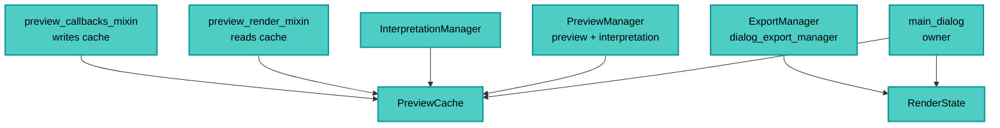

---
tags:
  - secinterp
  - code-walkthrough
  - gui
  - preview
aliases:
  - preview_state.py
  - PreviewCache
  - RenderState
cssclass: secinterp-note
---

# `gui/preview_state.py`

> [!abstract] One-line summary
> Two shared dialog state containers: `PreviewCache` (the four preview branches with dict access) and `RenderState` (live canvas + layers for export), so managers never read into each other.

**Path**: `gui/preview_state.py` (57 lines)
**Main classes**: `PreviewCache`, `RenderState`
**Layer**: GUI (Present · Shared State)
**Tags**: #secinterp #gui #preview

---

## 🎯 Why does this file exist?

`PreviewManager` and `InterpretationManager` needed the same data, and export needed the
live render. They used to read loose attributes off each other:

| Problem | Solution |
|---------|----------|
| Managers inspecting each other (coupling) | Dialog-owned `PreviewCache` shared by reference |
| Export reading loose `current_canvas`/`current_layers` off the dialog | `RenderState.update(canvas, layers)`: one coherent object |
| Cache keys invented per site (`"topo"`, `"geo"`, ...) | Canonical `_CACHE_KEYS = ("topo", "geol", "struct", "drillhole")` |
| Key-less cache → `KeyError` in strict renders | `dict.fromkeys(_CACHE_KEYS)` pre-creates all four as `None` |
| Mutable state without a clear protocol | `get / update / [get|set]item` mirroring `dict` |

> [!important] Architectural note
> **Owned shared state.** The dialog owns, managers use: neither `PreviewManager` nor
> `InterpretationManager` references the other. It is the docstring-documented antidote
> to cross-manager access.

---

## 🧬 Relationship diagram



> [!tip] How to read
> The dialog creates both objects once; each consumer receives the reference. Nobody
> builds local caches: one source of truth per state kind.

---

## 📦 Imports — architectural reading

```python
# gui/preview_state.py
from typing import Any
```

| # | Observation |
|---|-------------|
| ① | A single import (`Any` for heterogeneous values): the smallest preview module. |
| ② | No `qgis.*`, no core, no logger, not even `__future__`: pure data. |
| ③ | Module-level `_CACHE_KEYS`: the canonical tuple lives next to its classes. |

---

## 🏗️ Structure inventory

**Constant:** `_CACHE_KEYS = ("topo", "geol", "struct", "drillhole")`

**`class PreviewCache`** — 5 methods:
- `__init__()` — `self._data = dict.fromkeys(_CACHE_KEYS)` (four keys as `None`)
- `get(key, default=None)`
- `update(other=None, **kwargs)`
- `__getitem__(key)`
- `__setitem__(key, value)`

**`class RenderState`** — 2 methods:
- `__init__()` — `self.canvas = None`, `self.layers = []`
- `update(canvas, layers)` — snapshot of the latest render

---

## 📁 Files in the package

| File | Role relative to the state |
|---|---|
| `gui/main_dialog.py` | Owner: creates and distributes both instances |
| `gui/dialog_preview_manager.py` | Writes cache (sync/async) and `RenderState` via `draw_preview` |
| `gui/dialog_interpretation_manager.py` | Reads `PreviewCache` without touching `PreviewManager` |
| `gui/dialog_export_manager.py` | Reads `RenderState` for export (no loose attributes) |
| `gui/preview_render_mixin.py` | Reads `cached_data["topo"/"struct"]` on every render |
| `gui/preview_callbacks_mixin.py` | Writes `cached_data["geol"/"drillhole"]` as tasks arrive |

---

## 📖 Method-by-method walkthrough

### `_CACHE_KEYS` — the canonical vocabulary

```python
_CACHE_KEYS = ("topo", "geol", "struct", "drillhole")
```

Four branches, four keys, no synonyms: `"geol"` (not `"geo"`/`"geology"`) matches
`PreviewResult.geol`. The whole preview speaks this dialect.

### `PreviewCache.__init__` — pre-created as `None`

```python
def __init__(self) -> None:
    self._data: dict[str, Any] = dict.fromkeys(_CACHE_KEYS)
```

All four keys exist from birth as `None`: `cached_data["struct"]` never raises
`KeyError` even when the branch is uncomputed. Contrast with a bare dict, where the
mixin's strict render (`["topo"]`, `["struct"]`) would break.

### `get` / `__getitem__` / `__setitem__` — dict mirror

```python
def get(self, key: str, default: Any = None) -> Any:
    return self._data.get(key, default)

def __getitem__(self, key: str) -> Any:
    return self._data[key]

def __setitem__(self, key: str, value: Any) -> None:
    self._data[key] = value
```

| Access | Semantics |
|--------|-----------|
| `cache.get("geol")` | Tolerant (`None` when missing): used in report and optional render |
| `cache["topo"]` | Strict (`KeyError` when missing): used where the branch is mandatory |
| `cache["geol"] = ...` | Direct write from async callbacks |

The dual protocol lets each caller pick its rigor without `try/except`.

### `update` — dict + kwargs merge

```python
def update(self, other: dict[str, Any] | None = None, **kwargs: Any) -> None:
    if other:
        self._data.update(other)
    if kwargs:
        self._data.update(kwargs)
```

Mirrors `dict.update` with mapping and keywords: `cache.update({"geol": g})` or
`cache.update(geol=g, struct=s)`. Falsies are ignored (no accidental wipes via
`update(None)`).

### `RenderState` — render snapshot for export

```python
class RenderState:
    def __init__(self) -> None:
        self.canvas: Any = None
        self.layers: list = []

    def update(self, canvas: Any, layers: list) -> None:
        self.canvas = canvas
        self.layers = layers
```

Written by the plugin's `draw_preview` after each render, read by the `ExportManager`:
export no longer depends on loose dialog attributes (`current_canvas`/`current_layers`).
`canvas: Any` avoids importing `QgsMapCanvas` in a data container.

---

## 🔄 Data flow

| Phase | Input | Transformation | Output |
|-------|-------|----------------|--------|
| Sync | `generate_all` (topo+struct) | cache write | base branches |
| Async | geol/drillhole tasks | `cached_data[...] = ...` | full cache |
| Render | `cached_data` | `draw_preview` | canvas + `RenderState.update` |
| Interpretation | `PreviewCache` | direct read | overlay without crossing managers |
| Export | `RenderState` | direct read | files from the live render |
| Cleanup | close/accept | renderer `cleanup` | layers removed, cache alive |

> [!note] The cache survives `cleanup`
> `_cleanup_layers` removes QGIS layers but never empties `PreviewCache`: re-rendering
> after cleanup needs no recompute. The scratch-layer cycle (2026-09-21 fix) is about
> layers, not data.

---

## 🏛️ Design patterns present

| Pattern | Where | Purpose |
|---------|-------|---------|
| **Owned shared state** | dialog → managers | One source of truth, no cross access |
| **Facade over dict** | `PreviewCache` | `dict` protocol with pre-created keys |
| **Snapshot** | `RenderState.update` | Coherent canvas+layers picture for export |
| **Canonical keys** | `_CACHE_KEYS` | Single branch vocabulary |

---

## 🧾 API summary

| Symbol | Signature | Typical use |
|--------|-----------|-------------|
| `_CACHE_KEYS` | `("topo", "geol", "struct", "drillhole")` | Canonical keys |
| `PreviewCache` | `__init__()` no args | One per dialog |
| `PreviewCache.get` | `(key, default=None)` | Tolerant read |
| `PreviewCache.update` | `(other=None, **kwargs)` | Merge |
| `PreviewCache[key]` / `[key] =` | strict get/set | Mandatory branches / writes |
| `RenderState` | `__init__()` no args | One per dialog |
| `RenderState.update` | `(canvas, layers)` | Post-render snapshot |

---

## 🛡️ Error handling

| Situation | Behavior |
|-----------|----------|
| Uncomputed canonical key | `None` (never `KeyError`) |
| Invented key with `[]` | `KeyError` (fails loudly, like `dict`) |
| Invented key with `.get` | `default` (tolerant) |
| `update(None)` | no-op (`if` guards) |
| No render yet | `canvas=None`, `layers=[]` |

---

## 🧪 Associated tests

- `tests/gui/test_dialog_preview_manager.py` — shared cache in the manager cycle.
- `tests/gui/test_dialog_state_manager.py` — dialog state persistence.
- `tests/gui/test_multi_session_persistence.py` — state across sessions.
- `tests/gui/test_dialog_export_manager.py` — export from `RenderState`.

---

## 👀 Observations and notes

> [!success] Strengths
> - Removes cross-manager reads (coupling documented as resolved).
> - Key pre-creation: strict render never sees `KeyError` on canonical branches.
> - `RenderState` decouples export from loose dialog attributes.

> [!warning] Points of attention
> - No key validation in `__setitem__`: `cache["geo"] = x` silently creates a fifth key (invisible typo).
> - No threads: writes from UI slots; a task writing directly would race (today they write via signals — correct).
> - `RenderState.layers` uncopied: export shares the render's live list.
> - No `__contains__`/`keys`: limited introspection vs `dict`.

> [!question] Open questions
> - Validate keys in `__setitem__` against `_CACHE_KEYS` (fail fast on typos)?
> - Copy `layers` in `RenderState.update` to isolate export from re-render?

---

## 🔀 Access matrix

| Datum | Writer | Readers |
|-------|--------|---------|
| `cache["topo"]` | sync preview (`generate_all`) | render, report, interpretation |
| `cache["geol"]` | `_on_geology_finished` | render, report |
| `cache["struct"]` | sync preview | render, report |
| `cache["drillhole"]` | `_on_drillhole_finished` | render, report |
| `RenderState` | `draw_preview` | `ExportManager` |

---

## 🔗 Related notes

- [[Index]] — vault index
- [[dialog_preview_manager]] — main writer of both objects
- [[dialog_interpretation_manager]] — `PreviewCache` reader
- [[dialog_export_manager]] — `RenderState` reader
- [[preview_callbacks_mixin]] — async cache writes
- [[preview_render_mixin]] — per-render cache reads
- [[preview_renderer]] — produces the snapshotted layers
- [[dtos]] — `PreviewResult` mirroring the four keys
- [[layer_notification_manager]] — invalidation of cached content

---

*Note of the SecInterp Code Walkthrough v2 vault — v3.8.0*
