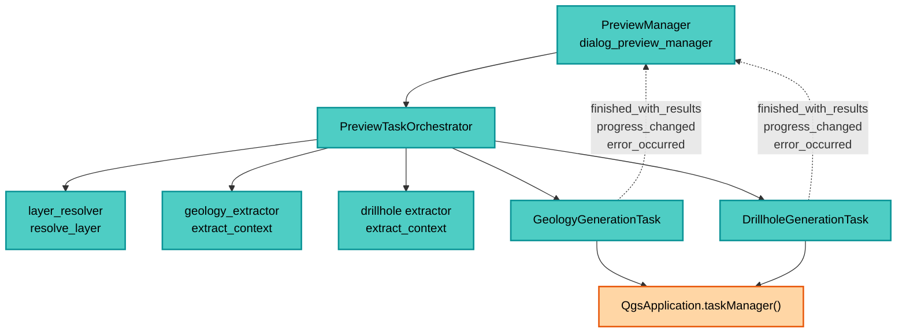

---
tags:
  - secinterp
  - code-walkthrough
  - gui
  - preview
aliases:
  - preview_task_orchestrator.py
  - PreviewTaskOrchestrator
cssclass: secinterp-note
note_lines: 700
---

# `gui/preview_task_orchestrator.py`

> [!abstract] One-line summary
> Owner of the geology and drillhole `QgsTask`s: extracts decoupled contexts on the main thread, launches each generation in the background with progress/result/error signals, and cancels or anchors tasks so Qt6 never collects them.

**Path**: `gui/preview_task_orchestrator.py` (158 lines)
**Main class**: `PreviewTaskOrchestrator`
**Layer**: GUI (Present · `QgsTask` Async Orchestration)
**Tags**: #secinterp #gui #preview

---

## 🎯 Why does this file exist?

Topography and structures generate synchronously in [[preview_service]], but geology and
drillholes are expensive and would freeze the canvas. This orchestrator moves them to `QgsTask`:

| Problem | Solution |
|---------|----------|
| Generating geology/drillholes on the UI thread freezes the dialog | `GeologyGenerationTask` and `DrillholeGenerationTask` in the task manager |
| A `QgsTask` must not touch live `QgsVectorLayer`s | Extract to a decoupled `context` **before** creating the task (main thread) |
| Relaunching preview leaves stale tasks running | `cancel_active_tasks` + pre-cancel in each `start_*` |
| QGIS 4/Qt6 collects unreferenced tasks | Anchors in `_active_tasks` until `remove_task` |
| The manager should not know `QgsApplication` or extractors | Orchestrator as the single launch and signal-wiring point |

> [!important] Architectural note
> **Extract-then-Compute thread boundary.** Everything QGIS (`resolve_layer`,
> `extract_context`) happens on the main thread; the `QgsTask` only receives DTOs +
> a stateless service. It is the literal application of the GUI rule: never live
> objects in the background.

---

## 🧬 Relationship diagram



> [!tip] How to read
> Solid arrow = creates/calls; dashed = Qt signal into the manager's `_on_*` slots
> (implemented in [[preview_callbacks_mixin]]). The orchestrator never processes results.

---

## 📦 Imports — architectural reading

```python
# gui/preview_task_orchestrator.py
from typing import TYPE_CHECKING, Any

from qgis.core import QgsApplication

from sec_interp.gui.adapters.layer_resolver import resolve_layer
from sec_interp.logger_config import get_logger

from .tasks.drillhole_task import DrillholeGenerationTask  # noqa: E402
from .tasks.geology_task import GeologyGenerationTask  # noqa: E402

if TYPE_CHECKING:
    from .dialog_preview_manager import PreviewManager
```

| # | Observation |
|---|-------------|
| ① | `QgsApplication` only for `taskManager().addTask`: the single global QGIS coupling. |
| ② | `resolve_layer` turns `PreviewParams` IDs/strings into layers **on the main thread**, before the task. |
| ③ | Tasks are imported after the logger with `noqa: E402` (non-top import after code). |
| ④ | `PreviewManager` only under `TYPE_CHECKING`: the orchestrator receives the manager by injection without a cycle. |
| ⑤ | Zero core imports: services and contexts arrive as parameters (`service`, `extractor`, `params`). |

---

## 🏗️ Structure inventory

**Class:** `class PreviewTaskOrchestrator` — 4 methods + constructor

- `__init__(manager: PreviewManager)` — `manager`, `geology_task`, `drillhole_task`, `_active_tasks`
- `cancel_active_tasks()` — cancels, disconnects signals, releases anchors
- `remove_task(task)` — drops an anchor on completion
- `start_geology_task(params, service)` — extract + launch `GeologyGenerationTask`
- `start_drillhole_task(params, service, extractor)` — extract + launch `DrillholeGenerationTask`

**Wired signals (toward the manager):**
- `finished_with_results → manager._on_geology_finished / _on_drillhole_finished`
- `progress_changed → manager._on_geology_progress / _on_drillhole_progress`
- `error_occurred → manager._on_geology_error / _on_drillhole_error`

---

## 📁 Files in the package

| File | Role relative to the orchestrator |
|---|---|
| `gui/dialog_preview_manager.py` | `PreviewManager`: owner, receives the slots |
| `gui/preview_callbacks_mixin.py` | Implements the six `_on_*` slots |
| `gui/tasks/geology_task.py` | `GeologyGenerationTask` (worker thread) |
| `gui/tasks/drillhole_task.py` | `DrillholeGenerationTask` (worker thread) |
| `gui/adapters/layer_resolver.py` | `resolve_layer`: ID → layer on the main thread |
| `gui/preview_render_mixin.py` | Re-renders cached data when results arrive |
| `gui/preview_state.py` | `PreviewCache`: where `geol`/`drillhole` land |
| `core/services/preview_service.py` | Synchronous branch (topo+struct); tasks are its async complement |

---

## 📖 Method-by-method walkthrough

### `__init__` — manager injection + anchors

```python
def __init__(self, manager: PreviewManager) -> None:
    self.manager = manager
    self.geology_task: GeologyGenerationTask | None = None
    self.drillhole_task: DrillholeGenerationTask | None = None

    # Anchor tasks to prevent GC issues in QGIS 4/Qt6
    self._active_tasks: list[Any] = []
```

Keeps each task alive in `_active_tasks`: without an anchor, the Python binding may
collect the `QgsTask` while C++ is still running it (QGIS 4 crashes).
`geology_task`/`drillhole_task` point at the current task of each kind (at most one).

### `cancel_active_tasks` — full cancel and disconnect

```python
def cancel_active_tasks(self) -> None:
    import contextlib
    for task in list(self._active_tasks):
        if task:
            with contextlib.suppress(RuntimeError):
                task.cancel()
            try:
                task.finished_with_results.disconnect()
                task.progress_changed.disconnect()
                task.error_occurred.disconnect()
            except (TypeError, RuntimeError):
                pass
    self._active_tasks.clear()
    self.geology_task = None
    self.drillhole_task = None
```

| Step | Detail |
|------|--------|
| Defensive iteration | `list(...)` in case a slot mutates the list during cancellation |
| `cancel()` | Cooperative: the service polls it via `feedback.isCanceled()`; `RuntimeError` suppressed (already-destroyed task) |
| Bare `disconnect()` | Removes **all** slots from each signal; `TypeError/RuntimeError` when already detached |
| Reset | Clears anchors and pointers: the orchestrator is pristine for the next preview |

Called on preview relaunch and dialog close: without it, a late task would write into
an already-destroyed cache.

### `remove_task` — release the anchor on completion

```python
def remove_task(self, task: Any) -> None:
    if task in self._active_tasks:
        self._active_tasks.remove(task)
        logger.debug(f"Task removed from anchors: {task}")
```

Invoked by `_on_geology_finished` and `_on_drillhole_finished` after caching. It only
drops the Python reference; the `QgsTask` already finished in C++. Without this call,
anchors would grow one entry per preview.

### `start_geology_task` — extract + launch

```python
def start_geology_task(self, params: Any, service: Any) -> None:
    if self.geology_task:
        self.geology_task.cancel()

    line_lyr = resolve_layer(params.line_layer)
    raster_lyr = resolve_layer(params.raster_layer)
    outcrop_lyr = resolve_layer(params.outcrop_layer)

    extractor = self.manager.preview_service.controller.geology_extractor
    context = extractor.extract_context(
        line_lyr, raster_lyr, outcrop_lyr,
        params.outcrop_name_field, params.band_num)

    self.geology_task = GeologyGenerationTask(
        "Geology Preview (Async)",  # no-i18n: QgsTask identifier for task manager
        context, service, params)

    self._active_tasks.append(self.geology_task)

    self.geology_task.finished_with_results.connect(self.manager._on_geology_finished)
    self.geology_task.progress_changed.connect(self.manager._on_geology_progress)
    self.geology_task.error_occurred.connect(self.manager._on_geology_error)

    QgsApplication.taskManager().addTask(self.geology_task)
```

| Phase | Where | Detail |
|-------|-------|--------|
| Pre-cancel | UI thread | Previous geology is cancelled (not awaited) |
| Resolve | UI thread | `resolve_layer` × 3: IDs → live `QgsVectorLayer`/`QgsRasterLayer` |
| Extract | UI thread | `geology_extractor.extract_context(...)` → decoupled `GeologyContext` |
| Task | background | Receives only `context` + `service` + `params` (no live layers) |
| Wiring | UI thread | Three signals to manager slots **before** `addTask` |
| Queue | Qt | `taskManager().addTask` schedules execution |

The `"Geology Preview (Async)"` id carries `no-i18n`: it is a task-manager key, not
visible text.

### `start_drillhole_task` — the largest extract

```python
def start_drillhole_task(self, params: Any, service: Any, extractor: Any) -> None:
    if self.drillhole_task:
        self.drillhole_task.cancel()

    line_lyr = resolve_layer(params.line_layer)
    collar_lyr = resolve_layer(params.collar_layer)
    survey_lyr = resolve_layer(params.survey_layer)
    interval_lyr = resolve_layer(params.interval_layer)
    raster_lyr = resolve_layer(params.raster_layer)

    survey_fields_dict = {"id": params.survey_id_field, "depth": params.survey_depth_field,
                          "azim": params.survey_azim_field, "incl": params.survey_incl_field}
    interval_fields_dict = {"id": params.interval_id_field, "from": params.interval_from_field,
                            "to": params.interval_to_field, "lith": params.interval_lith_field}

    context = extractor.extract_context(
        line_lyr, params.buffer_dist, collar_lyr, params.collar_id_field,
        params.collar_use_geometry, params.collar_x_field, params.collar_y_field,
        params.collar_z_field, params.collar_depth_field, survey_lyr,
        survey_fields_dict, interval_lyr, interval_fields_dict,
        raster_lyr, params.band_num)

    self.drillhole_task = DrillholeGenerationTask(
        "Drillhole Preview (Async)",  # no-i18n: QgsTask identifier for task manager
        context, service, params)

    self._active_tasks.append(self.drillhole_task)
    self.drillhole_task.finished_with_results.connect(self.manager._on_drillhole_finished)
    self.drillhole_task.progress_changed.connect(self.manager._on_drillhole_progress)
    self.drillhole_task.error_occurred.connect(self.manager._on_drillhole_error)
    QgsApplication.taskManager().addTask(self.drillhole_task)
```

Differences from geology: resolves **five** layers, packs survey and interval fields
into dicts, and receives the `extractor` as a parameter (geology takes it from the
controller via `manager.preview_service`). The `context` is a fully decoupled
`DrillholeContext`: the task can run without touching QGIS.

---

## 🔄 Data flow

| Phase | Input | Transformation | Output |
|-------|-------|----------------|--------|
| Params | `PreviewParams` (layer IDs + fields) | `resolve_layer` × N | live layers (UI thread) |
| Extract | layers + fields | `extract_context` | `GeologyContext` / `DrillholeContext` |
| Task | context + service | `QgsTask.run` in background | `(geol_data, drillhole_data)` |
| Signal | background result | `finished_with_results` (UI thread) | `_on_*_finished` slot caches |
| Progress | `feedback.setProgress` | `progress_changed` | progress text in dialog |
| Error | exception in `run` | `error_occurred` | `ProcessingError` via `handle_error` |
| Close | dialog accepted/closed | `cancel_active_tasks` | no live tasks, no dangling signals |

---

## 🏛️ Design patterns present

| Pattern | Where | Purpose |
|---------|-------|---------|
| **Orchestrator** | the class | Single async launch/cancel point |
| **Extract-then-Compute** | `start_*` → task | QGIS on UI, DTOs in background |
| **Anchor (GC guard)** | `_active_tasks` | Prevent premature collection on Qt6 |
| **Observer (Qt signals)** | `finished/progress/error` | Results without polling |
| **Cooperative cancellation** | `cancel()` + `feedback` | Clean stop without killing threads |

---

## 🧾 API summary

| Symbol | Signature | Typical use |
|--------|-----------|-------------|
| `PreviewTaskOrchestrator` | `__init__(manager: PreviewManager)` | One instance per `PreviewManager` |
| `start_geology_task` | `(params, service) -> None` | Async geology preview |
| `start_drillhole_task` | `(params, service, extractor) -> None` | Async drillhole preview |
| `cancel_active_tasks` | `() -> None` | Relaunch or close leak-free |
| `remove_task` | `(task) -> None` | Release anchor on completion |

---

## 🛡️ Error handling

| Situation | Behavior |
|-----------|----------|
| Previous task still running | Cooperative `cancel()` before launching |
| C++-destroyed task | `suppress(RuntimeError)` in `cancel()` |
| Already-disconnected signals | `except (TypeError, RuntimeError): pass` |
| Exception in `run()` | Task emits `error_occurred`; mixin builds `ProcessingError` |
| Close with live tasks | `cancel_active_tasks` prevents late cache writes |

> [!note] No `try` in `start_*`
> If `resolve_layer` or `extract_context` fail, the exception propagates to the manager,
> which shows it via `handle_error`. The orchestrator never masks extract failures.

---

## 🧪 Associated tests

- `tests/gui/test_preview_task_orchestrator.py` — `TestPreviewTaskOrchestrator`: cancellation, anchors and wiring with mocked `QgsApplication.taskManager`.
- `tests/gui/tasks/test_geology_task.py` — the `GeologyGenerationTask` launched here.
- `tests/gui/tasks/test_drillhole_task.py` — the `DrillholeGenerationTask` (deferred emission via `QTimer.singleShot`).
- `tests/gui/test_dialog_preview_manager.py` — manager ↔ orchestrator integration.
- `tests/core/test_geology_service.py`, `tests/core/test_drillhole_service.py` — the logic running inside each task.

---

## 👀 Observations and notes

> [!success] Strengths
> - Spotless thread boundary: no live QGIS object crosses into the background.
> - Qt6 anchors + full disconnect: no crashes, no signals to dead slots.
> - Task identifiers correctly marked `no-i18n`.

> [!warning] Points of attention
> - Asymmetry: geology takes the extractor from the controller; drillholes receive it as a parameter.
> - `start_*` anchors before `addTask` (correct), but a failure between `append` and `addTask` would leave an orphan anchor until the next `cancel_active_tasks`.
> - One task per kind: two rapid previews cancel the earlier one even if it had nearly finished.

> [!question] Open questions
> - Unify extractor sourcing (always a parameter) for testable symmetry?
> - Debounced queue instead of immediate cancellation for back-to-back previews?

---

## ⏱️ Sync vs async timeline

The full preview interleaves three temporal lanes:

| Time | UI lane (sync) | Geology lane (background) | Drillhole lane (background) |
|------|----------------|---------------------------|-----------------------------|
| T0 | `generate_all`: topo + struct → cache | — | — |
| T1 | initial `_render_cached_data` | — | — |
| T2 | `start_geology_task` (extract + queue) | queued | — |
| T3 | `start_drillhole_task` (extract + queue) | `run`: intersections | queued |
| T4 | progress in `results_text` | `finished` → `finished_with_results` | `run`: trajectories |
| T5 | `_on_geology_finished` → cache + render | anchor released | deferred `finished` (`QTimer.singleShot`) |
| T6 | `_on_drillhole_finished` → cache + render | — | anchor released |

> [!tip] Async lanes are independent
> Geology and drillholes finish in any order; each `finished` re-renders with whatever
> the cache holds. The report only paints when `topo` exists (mixin guard).

---

## 🔗 Related notes

- [[Index]] — vault index
- [[preview_service]] — complementary synchronous branch (topo+struct)
- [[dialog_preview_manager]] — orchestrator owner
- [[preview_callbacks_mixin]] — `_on_*` slots receiving the signals
- [[preview_render_mixin]] — re-render when async results arrive
- [[drillhole_task]] — `DrillholeGenerationTask` in detail
- [[geology_task]] — `GeologyGenerationTask` in detail
- [[controller]] — provides services and extractors
- [[dtos]] — `PreviewParams`, contexts and `PreviewResult`
- [[layer_notification_manager]] — invalidates and may force relaunches

---

*Note of the SecInterp Code Walkthrough v2 vault — v3.8.0*
