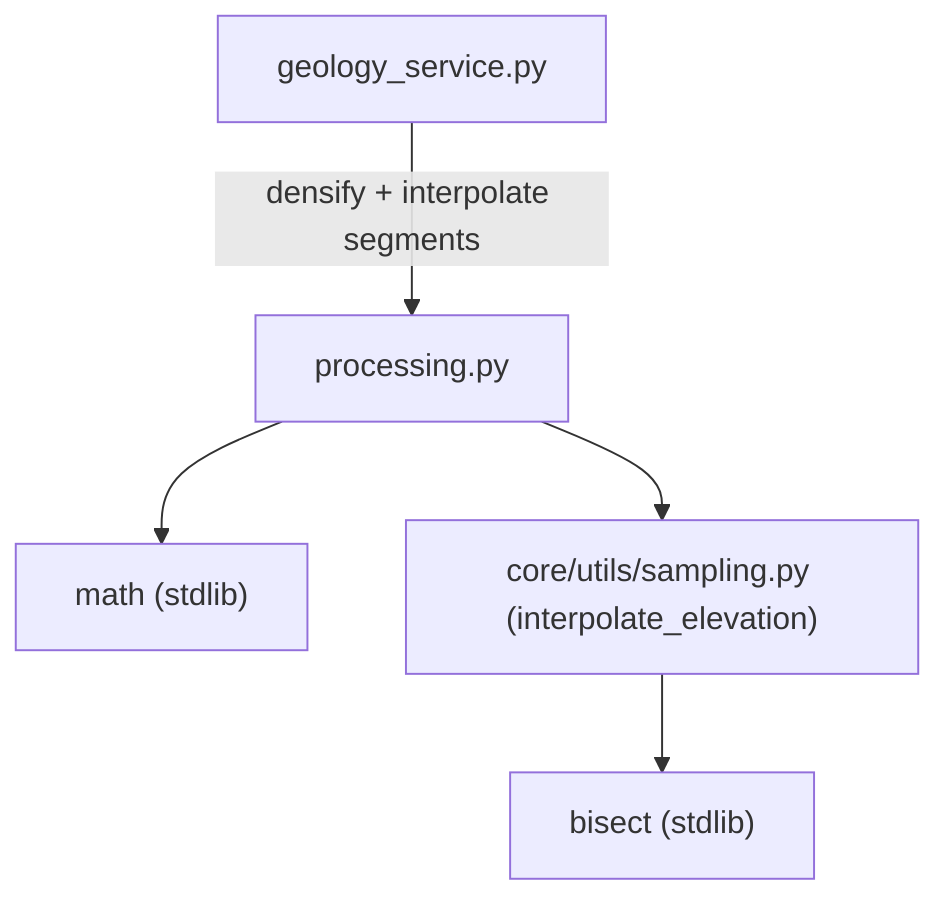

---
tags:
  - secinterp
  - code-walkthrough
  - core
  - utils
aliases:
  - processing.py
  - densify_line_points
  - interpolate_segment_points
cssclass: secinterp-note
---

# `core/utils/geometry_utils/processing.py`

> [!abstract] One-line summary
> Pure geometry **processing** for profiles: densifies polylines by inserting intermediate vertices and converts interval boundary distances into `(dist, elev)` points with sampled elevation, without touching QGIS.

**Path**: `core/utils/geometry_utils/processing.py` (80 lines)
**Main function**: `densify_line_points`, `interpolate_segment_points`
**Layer**: Core (QGIS-agnostic)
**Tags**: #secinterp #core #utils

---

## 🎯 Why does this file exist?

Profile construction needs two intermediate steps: guarantee a minimum vertex density along
the section and convert lithological interval boundaries into real profile points with their
elevation:

| Problem | Solution |
|---------|----------|
| Overly long segments between vertices break profile smoothness | `densify_line_points` inserts points every `interval` |
| A geological interval is expressed by distances, not coordinates | `interpolate_segment_points` returns `(dist, elev)` |
| Sampling elevation requires the master profile and elevation grid | delegation to `sampling.interpolate_elevation` |

> [!important] Architectural note
> QGIS-agnostic: only `math` and, **locally**, `sampling.interpolate_elevation`. The grid
> (`master_grid_dists`) enters as `list[tuple[float, Any, float]]`, not a raster.

---

## 🧬 Relationship diagram



> [!tip] How to read
> `interpolate_segment_points` imports `interpolate_elevation` **inside the function**
> (local import), avoiding coupling `sampling` at module level. The dashed arrow marks that
> deferred dependency.

---

## 📦 Imports — architectural reading

```python
# core/utils/geometry_utils/processing.py
from __future__ import annotations

import math
from typing import Any

# inside interpolate_segment_points:
from sec_interp.core.utils.sampling import interpolate_elevation
```

| # | Observation |
|---|-------------|
| ① | `math.hypot`/`math.ceil` for planar geometry. |
| ② | `typing.Any` types the grid's "point" field (`(dist, point, elev)`). |
| ③ | The `sampling` import is **local**: reduces coupling and avoids import cycles. |

> [!note] Local import as a decoupling technique
> `interpolate_elevation` is the only contact with the rest of core. Importing it inside the
> function lets `processing` load without `sampling` unless actually used.

---

## 🏗️ Structure inventory

**Functions (2 public, 0 classes):**

- `densify_line_points(points, interval) -> list[tuple[float, float]]`
- `interpolate_segment_points(dist_start, dist_end, master_grid_dists, master_profile_data, tolerance) -> list[tuple[float, float]]`

---

## 📁 Files in the package

| File | Lines | Role |
|---|--:|---|
| [[#processingpy|processing.py]] | 80 | Densification and interpolation of profile segments |

> [!note] Sub-package `geometry_utils/`
> Lives alongside [[measurement]] (measurement) and [[optimization]] (simplification). See
> [[core_utils_geometry_utils]] for the namespace role.

---

## 📖 Method-by-method walkthrough

### `densify_line_points`

```python
def densify_line_points(
    points: list[tuple[float, float]], interval: float
) -> list[tuple[float, float]]:
    if not points or interval <= 0:
        return points

    result = [points[0]]
    for i in range(len(points) - 1):
        p1 = points[i]
        p2 = points[i + 1]

        seg_len = math.hypot(p2[0] - p1[0], p2[1] - p1[1])
        if seg_len == 0:
            continue

        num_segments = max(1, math.ceil(seg_len / interval))
        for j in range(1, num_segments):
            t = j / num_segments
            result.append((p1[0] + t * (p2[0] - p1[0]), p1[1] + t * (p2[1] - p1[1])))
        result.append(p2)

    return result
```

Densifies a polyline guaranteeing no segment exceeds `interval`. For each segment it computes
`num_segments = ceil(seg_len / interval)` and emits intermediate points at fractions
`t = j / num_segments`. Edge cases:
- `points` empty or `interval <= 0` → returns the input intact.
- `seg_len == 0` (duplicated vertex) → skipped (`continue`).
- `num_segments = max(1, ...)` guarantees at least one span (`p2` is always appended).

> [!tip] Conservative density
> The subdivision count uses `ceil`, so the resulting span is **less than or equal** to
> `interval` (never greater). The result always includes the first and last vertex.

### `interpolate_segment_points`

```python
def interpolate_segment_points(
    dist_start: float,
    dist_end: float,
    master_grid_dists: list[tuple[float, Any, float]],  # (dist, point, elev)
    master_profile_data: list[tuple[float, float]],      # (dist, elev)
    tolerance: float,
) -> list[tuple[float, float]]:
    from sec_interp.core.utils.sampling import interpolate_elevation

    inner_points = [
        (d, e) for d, _, e in master_grid_dists
        if dist_start + tolerance < d < dist_end - tolerance
    ]

    elev_start = interpolate_elevation(master_profile_data, dist_start)
    elev_end = interpolate_elevation(master_profile_data, dist_end)

    return [(dist_start, elev_start), *inner_points, (dist_end, elev_end)]
```

Converts `[dist_start, dist_end]` into a list of profile points `(distance, elevation)`:
1. Filters grid points that fall **strictly inside** the interval (with a `tolerance`
   margin on both ends).
2. Interpolates elevation at the two boundaries using `interpolate_elevation`.
3. Returns `[start_boundary, *inner_points, end_boundary]`.

> [!tip] `tolerance` excludes boundary points
> Grid points within `<= tolerance` of the boundaries are omitted, because those boundaries
> are already added by interpolation. Avoids duplicates near the ends.

---

## 📐 Mathematical foundation

### Densification

Given a span `p1 → p2` with length `L`:

```
num_segments = max(1, ceil(L / interval))
p(t) = p1 + t · (p2 − p1),  with t = j / num_segments
```

- With `ceil`, the resulting span is `L / num_segments <= interval`.
- `t` runs through `1/num_segments, 2/num_segments, ...` (vertex `p2` appended separately).

### Elevation interpolation (delegated to `sampling`)

```
elev(dist) = elev1 + (elev2 − elev1) · (dist − dist1) / (dist2 − dist1)
```

- `dist1 <= dist < dist2` are the two closest sampled points (bisect search).
- Out of range returns the nearest endpoint; empty profile returns `0.0`.

### Worked example

| Input | Computation | Output |
|-------|-------------|--------|
| `[(0,0),(10,0)]`, `interval=2.0` | `ceil(10/2)=5` subdivisions | 6 points spaced 2.0 |
| grid `[(0,·,100),(10,·,110),(20,·,120)]`, `[5,15]` | interior `(10,110)` + elevations `105`,`115` | `[(5,105),(10,110),(15,115)]` |

---

## 🔄 Data flow

| Phase | Input | Transformation | Output |
|-------|-------|----------------|--------|
| Densification | polyline + `interval` | subdivision via `ceil` | densified polyline |
| Interpolation | `[dist_start, dist_end]` + grid + profile | interior filter + elevation interpolation | `[(dist, elev), ...]` |

**Real consumers:**

| Consumer | What it uses | Why |
|----------|--------------|-----|
| `geology_service.py` | both | build the geological profile segment by segment |
| `sampling.py` | `interpolate_elevation` (delegated) | sample master profile elevations |

---

## 🏛️ Design patterns present

| Pattern | Where | Purpose |
|---------|-------|---------|
| **Pure function** | both | stateless, thread-safe |
| **Local (lazy) import** | `interpolate_segment_points` | decouple `sampling` |
| **Delegation** | elevation interpolation | reuse `interpolate_elevation` |
| **Defensive early return** | `densify_line_points` | empty/invalid inputs |

---

## 🧾 API summary

| Symbol | Signature | Typical use |
|--------|-----------|-------------|
| `densify_line_points` | `(points, interval) -> list[tuple[float, float]]` | guarantee vertex density |
| `interpolate_segment_points` | `(dist_start, dist_end, master_grid_dists, master_profile_data, tolerance) -> list[tuple[float, float]]` | profile of a lithological interval |

---

## 🛡️ Error handling

| Case | Behaviour |
|------|-----------|
| `points == []` or `interval <= 0` | `densify_line_points` returns the input |
| `seg_len == 0` (duplicated vertex) | the span is skipped (`continue`) |
| Empty grid or no interior points | returns only the two interpolated boundaries |
| `master_profile_data` empty | `interpolate_elevation` returns `0.0` |

> [!note] No domain exceptions
> Like [[measurement]] and [[optimization]], this module prefers defensive returns over
> raising exceptions. Input validation is the service's responsibility.

---

## 🧪 Associated tests

`tests/core/test_geometry_utils.py` → `TestGeometryProcessing`:

- `test_densify_line_points` — `[(0,0),(10,0)]` with `interval=2.0` yields 6 points; cases
  with `interval=0.0`, empty list and single point return the input.
- `test_interpolate_segment_points` — linear grid and profile: `(5.0, 15.0)` yields 3 points
  with elevations `105.0` and `115.0` at the ends.

> [!tip] Joint coverage
> `interpolate_segment_points` indirectly exercises `sampling.interpolate_elevation`, whose
> direct test is in `tests/core/test_utils.py` / `test_utils_standalone.py`.

---

## 👀 Observations and notes

> [!success] Strengths
> - Correct densification with `ceil`, guarantees the segment upper bound.
> - Clean local import: decouples `sampling` without cycles.
> - Short, readable, fully pure code.

> [!warning] Points of attention
> - `master_grid_dists` types the point field as `Any` (no contract).
> - `interpolate_segment_points` assumes grid and profile sorted by distance.
> - Does not validate `dist_start <= dist_end`; an inverted interval yields an empty result.

> [!question] Open questions
> - Type `master_grid_dists` with a concrete alias (`GridPoint`) instead of `Any`?
> - Validate `dist_start <= dist_end` explicitly and raise `ValidationError`?

---

## 🔗 Related notes

- [[Index]] — vault index
- [[measurement]] / [[optimization]] — sibling modules in `geometry_utils/`
- [[core_utils_geometry_utils]] — sub-package namespace
- [[core_utils]] — `core/utils/` package (includes `sampling.interpolate_elevation`)
- [[geology_service]] — main consumer of segment interpolation

---

*Note of the SecInterp Code Walkthrough v2 vault — v3.9.0*
