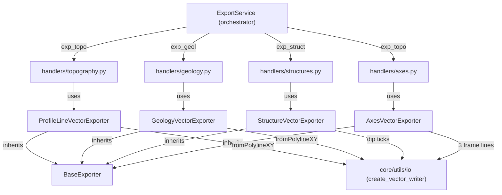

---
tags:
  - secinterp
  - code-walkthrough
  - exporters
  - profile
  - topography
  - geology
  - structures
aliases:
  - profile_exporters.py
  - ProfileLineVectorExporter
  - GeologyVectorExporter
  - StructureVectorExporter
  - AxesVectorExporter
cssclass: secinterp-note
---

# `exporters/profile_exporters.py`

> [!abstract] One-line summary
> Four 2D profile writers: topographic line, geological segments, structural dip ticks and reference axes, all in `(distance, elevation)` coordinates.

**Path**: `exporters/profile_exporters.py` (362 lines)
**Main classes**: `ProfileLineVectorExporter`, `GeologyVectorExporter`, `StructureVectorExporter`, `AxesVectorExporter`
**Layer**: Exporters (GUI · QGIS-dependent, inherits `BaseExporter`)
**Tags**: #secinterp #exporters #profile

---

## 🎯 Why does this file exist?

The core-computed profile (`profile_data`, `geol_data`, `struct_data`) must reach
SHP/GPKG/DXF entity by entity, because each has different geometry and attributes. One
monolithic exporter would mix four schemas; four small classes share the skeleton and
isolate the variation:

| Problem | Solution |
|---------|----------|
| The topographic line is a single `(d, e)` polyline | `ProfileLineVectorExporter`: 1 feature with field `id = 1` |
| Each geological segment has its own attributes | `GeologyVectorExporter`: fields derived from the first segment + 1 feature per segment |
| Structural data are points with apparent dip | `StructureVectorExporter`: trigonometric tick (`_calculate_dip_geometry`) + `app_dip/dist/elev` |
| The profile needs a reference frame | `AxesVectorExporter`: 3 lines (left, right, bottom) with 5% padding |

> [!important] Architectural note — pure section-plane writers
> All four classes write in `(dist, elev)` with no transform: "Extract" (QGIS layers →
> tuple lists/DTOs) already happened in the GUI and "Compute" in the core services (see
> [[controller]], [[geology_service]], [[structure_service]]). Only **`QgsFeature`
> adaptation** + writer remain here.

---

## 🧬 Relationship diagram



> [!tip] How to read
> Each writer is invoked by its handler (`topography`, `geology`, `structures`, `axes`;
> see [[core_services_export_handlers]]). Topography and axes share the `exp_topo` option
> (the [[orchestrator]]'s `topo_handler` calls both together).

---

## 📦 Imports — architectural reading

```python
# exporters/profile_exporters.py
from __future__ import annotations

import math
from pathlib import Path
from typing import Any

from qgis.core import (
    QgsFeature,
    QgsField,
    QgsFields,
    QgsGeometry,
    QgsPointXY,
)
from qgis.PyQt.QtCore import QMetaType

import sec_interp.core.utils.io as scu_io
from sec_interp.logger_config import get_logger

from .base_exporter import BaseExporter
```

| # | Observation |
|---|-------------|
| ① | `math` only for `_calculate_dip_geometry` (`radians/sin/cos` of the structural tick). |
| ② | `QgsPointXY` + `fromPolylineXY` in all 4 classes: the whole module is flat 2D, no Z. |
| ③ | No domain imports (`DrillholeProjection`, `InterpretationPolygon`): works with `(d, e)` tuples and DTOs via duck typing. |
| ④ | A single constant (`MIN_REQUIRED_POINTS = 2`) shared by topography and geology. |
| ⑤ | `Path` types `output_path` in all four `export` signatures (uniform contract). |

---

## 🏗️ Structure inventory

**Classes:** 4, all `(BaseExporter)` with `get_supported_extensions() -> [".shp", ".gpkg", ".dxf"]`.

| Class | `data` key | Geometry | Fields |
|---|---|---|---|
| `ProfileLineVectorExporter` | `profile_data` | 1 polyline | `id: Int` (`= 1`) |
| `GeologyVectorExporter` | `geology_data` | N polylines | keys of the 1st segment (`QString`) |
| `StructureVectorExporter` | `structural_data` (+ `dip_scale_factor`, `raster_res`) | N ticks | keys of the 1st record + `app_dip/dist/elev` (`Double`) |
| `AxesVectorExporter` | `profile_data` | 3 frame lines | `axis: QString` (`Left/Right/Bottom`) |

**Methods per class:**
- `ProfileLineVectorExporter`: `get_supported_extensions`, `export`
- `GeologyVectorExporter`: `get_supported_extensions`, `export`, `_write_geology_features`, `_create_geology_fields`, `_create_geology_feature`
- `StructureVectorExporter`: `get_supported_extensions`, `export`, `_write_structure_features`, `_create_structure_fields`, `_create_structure_feature`, `_calculate_dip_geometry`
- `AxesVectorExporter`: `get_supported_extensions`, `export`, `_write_axes_features`

---

## 📁 Files in the package `exporters/`

| File | Role relative to this note |
|---|---|
| `profile_exporters.py` | This note: the 4 2D profile writers |
| [[drillhole_exporters]] | Sibling writers: drillholes in the same `(dist, elev)` plane |
| [[interpretation_exporters]] | Sibling writer: polygons over the same profile |
| [[base_exporter]] | `BaseExporter`: shared contract |
| [[exporters]] | Package facade + `get_exporter()` by extension |

---

## 📖 Method-by-method walkthrough

### `ProfileLineVectorExporter.export` — one polyline, one feature

```python
points = [QgsPointXY(d, e) for d, e in profile_data]
geom = QgsGeometry.fromPolylineXY(points)
if not geom or geom.isNull():
    return False

fields = QgsFields()
fields.append(QgsField("id", QMetaType.Type.Int))
writer = scu_io.create_vector_writer(str(output_path), crs, fields, layer_name=layer_name)

feat = QgsFeature()
feat.setGeometry(geom)
feat.setAttributes([1])
writer.addFeature(feat)
```

The whole profile collapses into **one** feature (`id = 1`, the module's only `Int`
field), with an empty `QgsFeature()` and positional attributes. Note the `return False`
**inside** the `try` on null geometry, and the `try/except/else` certifying the flush.

### `GeologyVectorExporter.export` — schema from the first segment

Guards (`geology_data` + `crs`), `_create_geology_fields` for the schema, writer,
`_write_geology_features` (filters `None`s) and `del writer` inside the `try`; the
`else` returns `True` and exceptions collapse to `False` with `logger.exception`.

### `_create_geology_fields` / `_create_geology_feature`

```python
def _create_geology_fields(self, geology_data: list) -> QgsFields:
    """Create fields from the first segment's attributes."""
    fields = QgsFields()
    if geology_data:
        # Use attributes from first segment as template
        first_attrs = geology_data[0].attributes
        for key in first_attrs:
            fields.append(QgsField(key, QMetaType.Type.QString))
    return fields

def _create_geology_feature(self, segment: Any, fields: QgsFields) -> QgsFeature | None:
    """Create a feature for a geology segment."""
    if len(segment.points) < MIN_REQUIRED_POINTS:
        return None

    points = [QgsPointXY(d, e) for d, e in segment.points]
    geom = QgsGeometry.fromPolylineXY(points)

    feat = QgsFeature(fields)
    feat.setGeometry(geom)

    # Set attributes
    for key, val in segment.attributes.items():
        idx = fields.indexOf(key)
        if idx >= 0:
            feat.setAttribute(idx, val)
    return feat
```

The schema is **dynamic**: columns are the first segment's keys, all `QString` (even
for numeric values). Each feature maps its attributes by name (`indexOf`) and ignores
keys missing from the schema (`idx >= 0`): a segment with extra attributes does not
break the write, it just loses those columns.

> [!warning] Homogeneity assumption
> Segments with different keys only keep the first one's. It is the classic
> "schema-by-first-record" trade-off: simple and predictable, but it requires
> `GeologyService` to emit homogeneous attributes (see [[geology_service]]).

### `StructureVectorExporter.export` — tick length from the raster

```python
dip_scale_factor = data.get("dip_scale_factor", 4)
raster_res = data.get("raster_res", 1.0)
...
line_length = raster_res * dip_scale_factor
```

`line_length` scales with DEM resolution so the tick stays legible at any profile
scale. Note the `structural_data` key (with "ural"), unlike the [[orchestrator]]'s
`struct_data`: the handler renames it when building the dict (see [[structures]]).
Same `try/except/else` skeleton as the rest.

### `_create_structure_fields` — attributes + 3 computed `Double`

```python
def _create_structure_fields(self, structural_data: list) -> QgsFields:
    """Create fields for structural data."""
    fields = QgsFields()
    if structural_data:
        first_attrs = structural_data[0].attributes
        for key in first_attrs:
            fields.append(QgsField(key, QMetaType.Type.QString))

    fields.append(QgsField("app_dip", QMetaType.Type.Double))
    fields.append(QgsField("dist", QMetaType.Type.Double))
    fields.append(QgsField("elev", QMetaType.Type.Double))
    return fields
```

Same "first record" pattern as geology, plus three numeric columns certifying where
and how the tick was drawn: apparent dip, distance and elevation of the measurement.

### `_calculate_dip_geometry` — tick trigonometry

```python
def _calculate_dip_geometry(self, m: Any, line_length: float) -> QgsGeometry:
    """Calculate the line geometry for a structural dip."""
    rad_dip = math.radians(m.apparent_dip)
    dy = -line_length * math.sin(abs(rad_dip))
    dx = line_length * math.cos(abs(rad_dip))
    if m.apparent_dip < 0:
        dx = -dx

    p1 = QgsPointXY(m.distance, m.elevation)
    p2 = QgsPointXY(m.distance + dx, m.elevation + dy)
    return QgsGeometry.fromPolylineXY([p1, p2])
```

The tick starts at `(distance, elevation)` and drops `dy < 0` (downwards, like a real
dip) with horizontal length `dx`. The `apparent_dip` sign picks the side (negative `dx`
when dipping left). Edge cases: `apparent_dip = 0` → horizontal tick (`dy = 0`);
`±90` → vertical tick (`dx = 0`).

### `_create_structure_feature` — attributes by name + computed

```python
def _create_structure_feature(
    self, m: Any, fields: QgsFields, line_length: float
) -> QgsFeature:
    """Create a feature for a structural measurement."""
    geom = self._calculate_dip_geometry(m, line_length)

    feat = QgsFeature(fields)
    feat.setGeometry(geom)

    # Set attributes
    for key, val in m.attributes.items():
        idx = fields.indexOf(key)
        if idx >= 0:
            feat.setAttribute(idx, val)

    feat["app_dip"] = m.apparent_dip
    feat["dist"] = m.distance
    feat["elev"] = m.elevation
    return feat
```

Mixes two styles: inherited attributes by index (`indexOf`, tolerant to extras) and
computed ones by name (`feat["app_dip"]`, `QgsFeature.__setitem__` style). Never
returns `None`: every measurement produces its tick (a malformed `m` raises, caught by
`export`).

### `AxesVectorExporter.export` — frame with 5% padding

```python
dists = [p[0] for p in profile_data]
elevs = [p[1] for p in profile_data]
min_d, max_d = min(dists), max(dists)
min_e, max_e = min(elevs), max(elevs)

if max_d == min_d:
    max_d = min_d + 100
if max_e == min_e:
    max_e = min_e + 10

e_range = max_e - min_e
min_e_padded = min_e - e_range * 0.05
max_e_padded = max_e + e_range * 0.05

lines = [
    [QgsPointXY(min_d, min_e_padded), QgsPointXY(min_d, max_e_padded)],
    [QgsPointXY(max_d, min_e_padded), QgsPointXY(max_d, max_e_padded)],
    [QgsPointXY(min_d, min_e_padded), QgsPointXY(max_d, min_e_padded)],
]
axis_names = ["Left", "Right", "Bottom"]
```

Three lines (left, right, bottom; no top) with the vertical range padded 5% per side so
topography never touches the frame. Anti-degeneration guards (`+100` / `+10`) prevent a
collapsed frame; `_write_axes_features` labels each line with a field-less
`QgsFeature()` + `setAttributes([name])`.

### `_write_axes_features` — labels in order

Iterates `lines` with `enumerate` assigning `axis_names[i]` (`Left, Right, Bottom`): both
lists must stay in sync. No null-geometry validation (two distinct points always yield a
valid polyline).

---

## 🔄 Data flow

| Phase | Input | Transformation | Output |
|-------|-------|----------------|--------|
| Guards | `profile_data` / `geology_data` / `structural_data` + `crs` | empty → `False` | Nothing |
| Fields | first segment/record | keys → `QString`; +`Double` for structures | `QgsFields` |
| Geometry | `(d, e)` / `StructureMeasurement` / bbox | polyline / trig tick / 3 lines | `QgsGeometry` |
| Write | features | `addFeature` + `del writer` in `try` | SHP/GPKG/DXF |
| Result | — | `else: return True`; exception → `False` | `bool` |

---

## 🏛️ Design patterns present

| Pattern | Where | Purpose |
|---------|-------|---------|
| **Template Method** | `BaseExporter` → 4 classes | Same `export` skeleton, different entity |
| **Schema by example** | `_create_geology_fields`, `_create_structure_fields` | Columns from the first record |
| **Tolerant writer** | `indexOf` + `idx >= 0` | Extra attributes do not break the write |
| **Parametrized symbol** | `raster_res * dip_scale_factor` | Tick proportional to resolution |
| **Try/except/else** | all 4 `export` | `True` certifies the flush |

---

## 🧾 API summary

| Symbol | Signature / Inherits | Typical use |
|--------|----------------------|-------------|
| `ProfileLineVectorExporter` | `(BaseExporter)` | `data = {"profile_data": [(d, e)...], "crs": ...}` → 1 `id=1` feature |
| `GeologyVectorExporter` | `(BaseExporter)` | `data = {"geology_data": [...], "crs": ...}` → N segments |
| `_write_geology_features` | `(writer, geology_data, fields) -> None` | Filters `None` from `_create_geology_feature` |
| `_create_geology_fields` | `(geology_data) -> QgsFields` | Schema from the first segment |
| `StructureVectorExporter` | `(BaseExporter)` | `data = {"structural_data": [...], "dip_scale_factor": 4, "raster_res": 1.0, ...}` |
| `_calculate_dip_geometry` | `(m, line_length) -> QgsGeometry` | Tick from `(distance, elevation)` by `apparent_dip` |
| `AxesVectorExporter` | `(BaseExporter)` | `data = {"profile_data": ..., "crs": ...}` → 3 lines |
| `_write_axes_features` | `(writer, lines, axis_names) -> None` | `Left/Right/Bottom` labels |

---

## 🛡️ Error handling

| Situation | Behaviour |
|-----------|-----------|
| Empty data or `crs` | `return False` (all 4 classes) |
| Null topographic geometry | `False` inside the `try` |
| Segment with < 2 points | `None` → that segment skipped |
| Attribute missing from the schema | Ignored (`idx >= 0`) |
| Degenerate axes range | `+100` / `+10` + 5% padding |
| Exception in `export` | `logger.exception` → `False` (no `ExportError`) |

---

## 🧪 Associated tests

**Generic exporter checks** in `tests/exporters/test_exporters.py` (`export -> bool`
contract, guards and `get_setting`, applicable to all 4 classes):

- `test_export_valid_data` / `test_export_empty_data` — `try/except/else` skeleton.
- `test_export_missing_headers` / `test_export_missing_rows` — incomplete data.
- `test_get_supported_extensions` — extensions per class.

**Integration** in `tests/integration/test_export_service_e2e.py`:

- `test_export_topography_creates_csv` / `test_export_topography_creates_shp` — `exp_topo` path (topography + axes).
- `test_export_geology_creates_csv_and_shp` — `exp_geol` path.
- `test_export_geology_skips_when_no_data` — benign skip.
- `test_export_structures_with_string_fields` — `exp_struct` path with text fields.
- `test_export_nothing_when_all_options_disabled` — [[orchestrator]] guard.

> [!tip] Coverage per entity
> The e2e tests cover topography, geology and structures with real QGIS; unit tests
> cover the generic contract. The `_calculate_dip_geometry` trigonometry (`dx` sign,
> 0°/90° cases) is a natural candidate for pure tests with mocked `QgsPointXY`.

---

## 👀 Observations and notes

> [!success] Strengths
> - Four cohesive classes with identical skeleton: the module reads in one pass.
> - Tolerant `indexOf`: heterogeneous schemas do not abort the write.
> - Resolution-parametrised structural tick: legible at any scale.
> - Axes with padding and anti-degeneration guards: never a collapsed frame.

> [!warning] Points of attention
> - First-record schema: later segments' keys are silently lost.
> - Every geological/structural attribute is forced to `QString` (numbers as DBF text).
> - `_create_structure_feature` never returns `None`: a corrupt measurement aborts the file.

> [!question] Open questions
> - Union schemas from **all** segments (like `interpretation_exporters`) instead of the first?
> - Pure tests for `_calculate_dip_geometry` (signs, 0°, ±90°)?

---

## 🔗 Related notes

- [[Index]] — vault index
- [[exporters]] — `exporters/` package facade
- [[base_exporter]] — `BaseExporter`, base class of all 4
- [[drillhole_exporters]] — drillholes in the same `(dist, elev)` plane
- [[interpretation_exporters]] — polygons over the same profile
- [[topography]] / [[geology]] / [[structures]] — handlers invoking these writers
- [[orchestrator]] — `ExportService` (`exp_topo` calls topography + axes)
- [[geology_service]] / [[structure_service]] — produce the data written here

---

*Note of the SecInterp Code Walkthrough v2 vault — v3.9.1*
