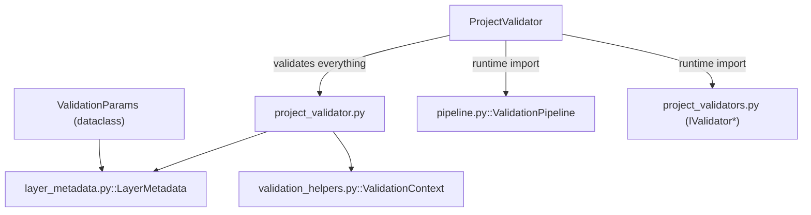

---
tags:
  - secinterp
  - code-walkthrough
  - core
  - validation
aliases:
  - project_validator.py
  - ProjectValidator
  - ValidationParams
cssclass: secinterp-note
---

# `core/validation/project_validator.py`

> [!abstract] One-line summary
> Defines the `ValidationParams` DTO (container for every layer parameter to validate) and the **orchestrator** `ProjectValidator`, which composes the specialized-validator pipeline and exposes per-domain "completeness" helpers.

**Path**: `core/validation/project_validator.py` (151 lines)
**Main classes**: `ValidationParams`, `ProjectValidator`
**Layer**: Core (QGIS-agnostic)
**Tags**: #secinterp #core #validation

---

## 🎯 Why does this file exist?

Validating a whole project (section line, DEM, geology, structures, drillholes, output)
requires **two things**: a single parameter container and one entry point that fires all
validators. This file provides both:

| Problem | Solution |
|---------|----------|
| Group ~30 layer/field parameters into one object | `@dataclass ValidationParams` |
| Run all validators with a single call | `ProjectValidator.validate_all` |
| Validate only the minimum for a preview | `ProjectValidator.validate_preview_requirements` |
| Ask "is this domain complete?" from the GUI | `is_*_complete` (drillhole/dem/geology/structure) |

> [!important] Architectural note
> **QGIS-agnostic.** `ValidationParams` only holds `LayerMetadata` (a detached DTO) and
> primitives. `ProjectValidator` is Level 2 (Business Logic Validation): it composes the
> `IValidator` implementations from `project_validators.py` and uses `ValidationContext`
> to accumulate errors before raising a single `ValidationError`.

---

## 🧬 Relationship diagram



> [!tip] How to read
> The imports of `ValidationPipeline` and the specialized validators are **local to each
> method** (deferred imports) to avoid import cycles at module load time.

---

## 📦 Imports — architectural reading

```python
# core/validation/project_validator.py
from __future__ import annotations

from dataclasses import dataclass

from sec_interp.core.validation.layer_metadata import LayerMetadata

from .validation_helpers import ValidationContext

# validate_reasonable_ranges moved to validation_helpers.py
MIN_FLOAT_THRESHOLD = 0.1
```

| # | Observation |
|---|-------------|
| ① | `dataclass` — `ValidationParams` is a dataclass with defaults. |
| ② | `LayerMetadata` — layers are typed as a detached DTO, never `QgsVectorLayer`. |
| ③ | `ValidationContext` imported at module level (actually used by the methods). |
| ④ | Heavy imports (`ValidationPipeline`, `*Validator`) are **deferred** inside each `@classmethod`. |
| ⑤ | `MIN_FLOAT_THRESHOLD = 0.1` — declared but **unused** here; the real threshold is redefined in `project_validators.py`. |

> [!warning] Duplicated/orphan `MIN_FLOAT_THRESHOLD`
> The comment `# validate_reasonable_ranges moved to validation_helpers.py` explains a
> past refactor: the constant was left behind as a remnant. `project_validators.py`
> defines its **own** local `MIN_FLOAT_THRESHOLD = 0.1` in `OutputValidator.validate`.

---

## 🏗️ Structure inventory

**Classes (2):**

- `@dataclass ValidationParams` — parameter container (no methods).
- `class ProjectValidator` — orchestrator with 6 `@classmethod`s.

**`ProjectValidator` methods:**

- `validate_all(params) -> bool` — full validation (6 validators).
- `validate_preview_requirements(params) -> bool` — only Section + DEM.
- `is_drillhole_complete(params) -> bool`
- `is_dem_complete(params) -> bool`
- `is_geology_complete(params) -> bool`
- `is_structure_complete(params) -> bool`

---

## 📁 Files in the package

`project_validator.py` is the central orchestrator of the `core/validation/` package:

| File | Role |
|------|------|
| `project_validator.py` | `ValidationParams` + `ProjectValidator` (this file) |
| `project_validators.py` | Specialized `IValidator` validators (Section/DEM/…) |
| `pipeline.py` | `ValidationPipeline` that runs the validators in order |
| `validation_helpers.py` | `ValidationContext`, `RichValidationError`, `DependencyRule` |
| `field_validator.py` | Atomic field validation |
| `layer_validator.py` | Spatial layer validation |
| `path_validator.py` | Output path validation |
| `validators.py` | Dataclass field validator factories |
| `layer_metadata.py` | `LayerMetadata` + constants |
| `base_validator.py` | `IValidator` (ABC) |

---

## 📖 Method-by-method walkthrough

### `ValidationParams` — the container

```python
@dataclass
class ValidationParams:
    raster_layer: LayerMetadata | None = None
    band_number: int | None = None
    line_layer: LayerMetadata | None = None
    output_path: str = ""
    scale: float = 1.0
    vert_exag: float = 1.0
    buffer_dist: float = 0.0
    outcrop_layer: LayerMetadata | None = None
    outcrop_field: str | None = None
    struct_layer: LayerMetadata | None = None
    struct_dip_field: str | None = None
    struct_strike_field: str | None = None
    dip_scale_factor: float = 1.0

    # Drillhole params
    collar_layer: LayerMetadata | None = None
    collar_id: str | None = None
    collar_use_geom: bool = True
    collar_x: str | None = None
    collar_y: str | None = None
    survey_layer: LayerMetadata | None = None
    survey_id: str | None = None
    survey_depth: str | None = None
    survey_azim: str | None = None
    survey_incl: str | None = None
    interval_layer: LayerMetadata | None = None
    interval_id: str | None = None
    interval_from: str | None = None
    interval_to: str | None = None
    interval_lith: str | None = None
```

Groups every parameter that needs cross-layer validation. Layers are `LayerMetadata |
None` (produced by the GUI `ValidationExtractor`); fields are `str | None`; numerics
have sensible defaults (`scale=1.0`, `vert_exag=1.0`).

| Block | Key fields |
|-------|------------|
| Core | `raster_layer`, `band_number`, `line_layer`, `output_path`, `scale`, `vert_exag`, `buffer_dist` |
| Geology | `outcrop_layer`, `outcrop_field` |
| Structure | `struct_layer`, `struct_dip_field`, `struct_strike_field`, `dip_scale_factor` |
| Collar | `collar_layer`, `collar_id`, `collar_use_geom`, `collar_x/y` |
| Survey | `survey_layer`, `survey_id/depth/azim/incl` |
| Interval | `interval_layer`, `interval_id/from/to/lith` |

### `validate_all` — full validation

```python
@classmethod
def validate_all(cls, params: ValidationParams) -> bool:
    from .pipeline import ValidationPipeline
    from .project_validators import (
        DEMValidator, DrillholeValidator, GeologyValidator,
        OutputValidator, SectionValidator, StructureValidator,
    )
    context = ValidationContext()
    pipeline = ValidationPipeline([
        SectionValidator(), DEMValidator(), GeologyValidator(),
        StructureValidator(), DrillholeValidator(), OutputValidator(),
    ])
    pipeline.execute(params, context)
    context.raise_if_errors()
    return True
```

Builds the pipeline with the **6 validators** in a fixed order (Section → DEM →
Geology → Structure → Drillhole → Output), runs it over a fresh `ValidationContext`,
and if there are errors `raise_if_errors()` raises a single `ValidationError` with all
messages joined by newlines.

### `validate_preview_requirements` — the minimum

```python
@classmethod
def validate_preview_requirements(cls, params: ValidationParams) -> bool:
    from .pipeline import ValidationPipeline
    from .project_validators import DEMValidator, SectionValidator
    context = ValidationContext()
    pipeline = ValidationPipeline([SectionValidator(), DEMValidator()])
    pipeline.execute(params, context)
    context.raise_if_errors()
    return True
```

Lightweight version for generating a preview: only requires a section line + DEM. This
is the entry point the `controller` uses before running the computation, avoiding
validation of optional domains (geology, structures, drillholes, output) not yet configured.

### `is_drillhole_complete`

```python
@classmethod
def is_drillhole_complete(cls, params: ValidationParams) -> bool:
    if not params.collar_layer or not params.collar_id:
        return False
    from .project_validators import DrillholeValidator
    context = ValidationContext()
    DrillholeValidator().validate(params, context)
    return not context.has_errors
```

"Legacy/proxy" helper. First a cheap **short-circuit** (collar and id present?) and, if
it passes, runs only `DrillholeValidator` over a local context. Returns `True` if no
errors were accumulated.

### `is_dem_complete`

```python
@classmethod
def is_dem_complete(cls, params: ValidationParams) -> bool:
    if not params.raster_layer:
        return False
    from .project_validators import DEMValidator
    context = ValidationContext()
    DEMValidator().validate(params, context)
    return not context.has_errors
```

Analogous for the DEM: no `raster_layer` → immediate `False`; otherwise delegate to
`DEMValidator`.

### `is_geology_complete` / `is_structure_complete`

```python
@classmethod
def is_geology_complete(cls, params: ValidationParams) -> bool:
    if not params.outcrop_layer or not params.outcrop_field:
        return False
    from .project_validators import GeologyValidator
    context = ValidationContext()
    GeologyValidator().validate(params, context)
    return not context.has_errors


@classmethod
def is_structure_complete(cls, params: ValidationParams) -> bool:
    if not params.struct_layer or not params.struct_dip_field or not params.struct_strike_field:
        return False
    from .project_validators import StructureValidator
    context = ValidationContext()
    StructureValidator().validate(params, context)
    return not context.has_errors
```

Same "completeness checks" for geology (layer + unit field) and structures (layer + dip
+ strike). They let the GUI enable/disable buttons or show a "domain ready" check
without raising exceptions.

---

## 🔄 Data flow

| Phase | Input | Transformation | Output |
|-------|-------|----------------|--------|
| Packing | GUI layers/fields → `ValidationExtractor` | `LayerMetadata` + primitives | `ValidationParams` |
| Execution | `ValidationParams` | `ValidationPipeline.execute` (6 validators) | errors in `ValidationContext` |
| Result | `ValidationContext` | `raise_if_errors()` | `bool` or `ValidationError` |
| Completeness | `ValidationParams` | `is_*_complete` (short-circuit + validator) | `bool` |

---

## 🏛️ Design patterns present

| Pattern | Where | Purpose |
|---------|-------|---------|
| **Orchestrator / Facade** | `ProjectValidator` | One entry point for all validation |
| **DTO container** | `ValidationParams` | Group parameters without QGIS |
| **Pipeline / Chain** | `ValidationPipeline([...])` | Run validators in a fixed order |
| **Accumulator** | `ValidationContext` | Gather errors before failing |
| **Deferred imports** | `from .pipeline import ...` in methods | Break import cycles |
| **Template method (class)** | `@classmethod` + validators | Uniform `validate_all` vs `validate_preview_requirements` |

---

## 🧾 API summary

| Symbol | Signature / Inherits | Typical use |
|--------|----------------------|-------------|
| `ValidationParams` | `@dataclass` | Validation parameter container |
| `validate_all` | `(params) -> bool` | Full validation before generating |
| `validate_preview_requirements` | `(params) -> bool` | Minimum for the preview |
| `is_drillhole_complete` | `(params) -> bool` | Are drillholes ready? |
| `is_dem_complete` | `(params) -> bool` | Is the DEM ready? |
| `is_geology_complete` | `(params) -> bool` | Is geology ready? |
| `is_structure_complete` | `(params) -> bool` | Are structures ready? |

---

## 🛡️ Error handling

`validate_all` and `validate_preview_requirements` are the only ones that **raise**: at
the end they call `context.raise_if_errors()`, which raises `ValidationError` with
`details` including `errors` and `warnings`. The `is_*_complete` helpers **do not raise**
(they return `bool`).

| Situation | Behaviour |
|-----------|-----------|
| Valid parameters | `validate_all` → `True` |
| Accumulated errors | `raise_if_errors()` → `ValidationError` with all messages |
| `is_*_complete` without a configured layer | immediate `False` (short-circuit) |
| `is_*_complete` with a layer but incomplete | `False` (errors in a local context) |

> [!note] One exception, many errors
> `ValidationContext.raise_if_errors()` joins all errors with `"\n"` and raises **one**
> `ValidationError`. The GUI catches it and shows all messages at once, instead of
> failing with the first.

---

## 🧪 Associated tests

Cases mapped to `tests/core/test_project_validator.py`:

- `test_validate_reasonable_ranges` — extremes/warnings (uses `validate_reasonable_ranges`).
- `test_validate_preview_requirements` — no data → `ValidationError`; DEM+line → `True`.
- `test_validate_all_success` — valid setup → `True` (with `patch` of path and geometry).
- `test_validate_all_numeric_failures` — `scale=0.5`, `vert_exag=0.05` → `ValidationError` with `"Scale must be >= 1"`.
- `test_is_drillhole_complete` — progression collar → collar+survey complete.
- `test_is_geology_complete` — no layer `False`; layer+field `True`.
- `test_is_structure_complete` — no layer `False`; layer+dip+strike `True`.

> [!tip] QGIS patches in tests
> Although the core is QGIS-agnostic, the tests patch `qgis.core.QgsProject.instance`
> and the layer validators because the code under test composes `project_validators`,
> which in turn imports `TranslatableMixin` (Qt). See [[project_validators]].

---

## 👀 Observations and notes

> [!success] Strengths
> - A single entry point (`validate_all`) plus a lightweight variant (`validate_preview_requirements`).
> - `ValidationParams` decouples validation from QGIS via `LayerMetadata`.
> - The `is_*_complete` helpers offer cheap, exception-free queries for the GUI.

> [!warning] Points of attention
> - `MIN_FLOAT_THRESHOLD = 0.1` declared here is **orphaned** (unused; the threshold is redefined in `project_validators.py`).
> - The `ValidationPipeline`/`*Validator` imports are repeated inside each method (deferred imports) → slight boilerplate.
> - `validate_all` returns `True` or raises; never `False`, forcing callers to catch the exception.

> [!question] Open questions
> - Remove the orphaned `MIN_FLOAT_THRESHOLD` and centralize thresholds in `validation_helpers`?
> - Return `(bool, errors)` instead of raising, for callers that prefer no exceptions?

---

## 🔗 Related notes

- [[Index]] — vault index
- [[core_validation]] — package note for the `validation/` directory
- [[project_validators]] — the specialized validators this orchestrates
- [[core_validation]] — package that includes `pipeline.py` (`ValidationPipeline`)
- [[validation_helpers]] — `ValidationContext` and `DependencyRule`
- [[core_validation]] — package that includes `layer_metadata.py` (the DTO that populates `ValidationParams`)
- [[controller]] — consumer of `validate_preview_requirements`
- [[exceptions]] — `ValidationError` raised by `raise_if_errors`

---

*Note of the SecInterp Code Walkthrough v2 vault — v3.9.0*
