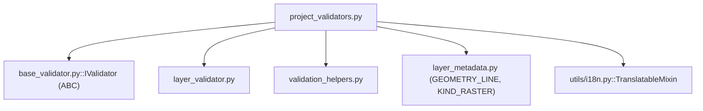

---
tags:
  - secinterp
  - code-walkthrough
  - core
  - validation
aliases:
  - project_validators.py
  - SectionValidator
  - DEMValidator
  - GeologyValidator
  - StructureValidator
  - DrillholeValidator
  - OutputValidator
cssclass: secinterp-note
---

# `core/validation/project_validators.py`

> [!abstract] One-line summary
> **Per-component specialized** project validators (section, DEM, geology, structures, drillholes, output), each implementing `IValidator.validate(params, context)` to accumulate business errors over `ValidationParams`.

**Path**: `core/validation/project_validators.py` (240 lines)
**Main classes**: `SectionValidator`, `DEMValidator`, `GeologyValidator`, `StructureValidator`, `DrillholeValidator`, `OutputValidator`
**Layer**: Core (QGIS-agnostic, with one i18n exception)
**Tags**: #secinterp #core #validation

---

## 🎯 Why does this file exist?

`ProjectValidator` orchestrates, but **someone must know what to validate in each
domain**. This file holds the specialized validators, one per project component,
following the common `IValidator` interface:

| Problem | Solution |
|---------|----------|
| Each domain has distinct rules | One `IValidator` per domain |
| Validate the section line (geometry + features) | `SectionValidator` |
| Validate the raster DEM and band | `DEMValidator` |
| Validate geology (polygon + unit field) | `GeologyValidator` |
| Validate structures (points + dip/strike) | `StructureValidator` |
| Validate complex drillhole dependencies | `DrillholeValidator` with `DependencyRule` |
| Validate output path and numeric ranges | `OutputValidator` |

> [!important] Architectural note
> **99% QGIS-agnostic** — the validators operate on `LayerMetadata` and primitives. The
> single exception: `OutputValidator` inherits `TranslatableMixin`, which imports
> `qgis.PyQt.QtCore.QCoreApplication` (gray area, see below). The design is
> Strategy/Template: each `IValidator` implements `validate(params, context)`.

---

## 🧬 Relationship diagram



> [!tip] How to read
> Solid = imports. The 6 validators inherit from `IValidator`; only `OutputValidator`
> adds `TranslatableMixin`. All delegate fine-grained validation to `layer_validator`
> and accumulate errors via `validation_helpers`.

---

## 📦 Imports — architectural reading

```python
# core/validation/project_validators.py
from __future__ import annotations

from typing import TYPE_CHECKING

from sec_interp.core.utils.i18n import TranslatableMixin
from sec_interp.core.validation.layer_metadata import GEOMETRY_LINE, KIND_RASTER

from .base_validator import IValidator
from .layer_validator import (
    validate_layer_geometry,
    validate_layer_has_features,
    validate_raster_band,
    validate_structural_requirements,
)
from .validation_helpers import (
    DependencyRule,
    validate_dependencies,
    validate_reasonable_ranges,
)

if TYPE_CHECKING:
    from .project_validator import ValidationParams
    from .validation_helpers import ValidationContext
```

| # | Observation |
|---|-------------|
| ① | `TranslatableMixin` (from `utils.i18n`) — the **only Qt/QGIS dependency** in the package, used by `OutputValidator` for `self.tr(...)`. |
| ② | Imports `GEOMETRY_LINE` and `KIND_RASTER` constants from `layer_metadata` (not QGIS enums). |
| ③ | Reuses the `layer_validator` validators (geometry, features, band, structures). |
| ④ | `DependencyRule` + `validate_dependencies` — conditional rules for drillholes. |
| ⑤ | `TYPE_CHECKING` for `ValidationParams`/`ValidationContext` — avoids import cycles. |

> [!warning] Gray area: `TranslatableMixin` imports Qt
> `OutputValidator(IValidator, TranslatableMixin)` needs `self.tr(...)` for i18n.
> `TranslatableMixin` imports `qgis.PyQt.QtCore.QCoreApplication`. This is a **minor
> violation** of the "core 100% QGIS-agnostic" rule, mitigated because it only
> translates strings (not layer/geometry objects) and tests patch `QgsProject`.

---

## 🏗️ Structure inventory

**Classes (6, all `IValidator`):**

- `SectionValidator` — section line.
- `DEMValidator` — raster DEM + band.
- `GeologyValidator` — geology + unit field.
- `StructureValidator` — structures + dip/strike.
- `DrillholeValidator` — collar/survey/interval dependencies.
- `OutputValidator(IValidator, TranslatableMixin)` — path + numeric ranges.

**Methods (1 per class):**

- `validate(self, params, context) -> None` — all.

---

## 📁 Files in the package

`project_validators.py` is the set of validation strategies of the package:

| File | Role |
|------|------|
| `project_validators.py` | Specialized validators (this file) |
| `project_validator.py` | `ProjectValidator` + `ValidationParams` (orchestrates) |
| `pipeline.py` | `ValidationPipeline` (runs in order) |
| `validation_helpers.py` | `ValidationContext`, `DependencyRule`, `validate_reasonable_ranges` |
| `base_validator.py` | `IValidator` (ABC) |
| `field_validator.py` | Field validation |
| `layer_validator.py` | Spatial validation |
| `path_validator.py` | Path validation |
| `validators.py` | Dataclass validator factories |
| `layer_metadata.py` | `LayerMetadata` + constants |

---

## 📖 Method-by-method walkthrough

### `SectionValidator`

```python
class SectionValidator(IValidator):
    def validate(self, params: ValidationParams, context: ValidationContext) -> None:
        if not params.line_layer:
            context.add_error("Cross-section line layer is required", "line_layer")
            return
        metadata = params.line_layer
        if not metadata.is_valid:
            context.add_error("Cross-section line layer not found in project", "line_layer")
            return
        is_valid, error = validate_layer_geometry(metadata, GEOMETRY_LINE)
        if not is_valid:
            context.add_error(error, "line_layer")
        is_valid, error = validate_layer_has_features(metadata)
        if not is_valid:
            context.add_error(error, "line_layer")
```

Requires a section line layer of **line type** and **with features**. Each failure is
accumulated with the `"line_layer"` key so the GUI can highlight the exact control. The
early `return` only guards the precondition (layer present and valid).

### `DEMValidator`

```python
class DEMValidator(IValidator):
    def validate(self, params: ValidationParams, context: ValidationContext) -> None:
        if not params.raster_layer:
            context.add_error("Raster DEM layer is required", "raster_layer")
            return
        metadata = params.raster_layer
        if not metadata.is_valid:
            context.add_error("Raster DEM layer not found in project", "raster_layer")
            return
        if metadata.kind != KIND_RASTER:
            context.add_error("Raster DEM layer must be a raster layer", "raster_layer")
            return
        if params.band_number is not None:
            is_valid, error = validate_raster_band(metadata, params.band_number)
            if not is_valid:
                context.add_error(error, "band_number")
```

Validates that the DEM is raster, exists, and (if a band was specified) that the band is
valid. Note: `band_number is None` is **not** flagged here (omitting it is allowed; the
rest of the chain decides its default value).

### `GeologyValidator`

```python
class GeologyValidator(IValidator):
    def validate(self, params: ValidationParams, context: ValidationContext) -> None:
        if not params.outcrop_layer:
            return
        metadata = params.outcrop_layer
        if not metadata.is_valid:
            context.add_error("Geology layer not found in project", "outcrop_layer")
            return
        from .layer_validator import validate_geology_requirements
        validate_geology_requirements(metadata, params.outcrop_field, context)
```

**Optional** (no outcrop layer → nothing validated). If present, checks it exists and
delegates to `validate_geology_requirements` (polygon + features + unit field). The
`validate_geology_requirements` import is deferred (not in the top import block).

### `StructureValidator`

```python
class StructureValidator(IValidator):
    def validate(self, params: ValidationParams, context: ValidationContext) -> None:
        if not params.struct_layer:
            return
        metadata = params.struct_layer
        if not metadata.is_valid:
            context.add_error("Structural layer not found in project", "struct_layer")
            return
        validate_structural_requirements(
            metadata, params.struct_dip_field, params.struct_strike_field, context,
        )
```

Also optional. If a structural layer exists, validates it (points + dip/strike fields)
via `validate_structural_requirements`, which already accepts `context` to accumulate errors.

### `DrillholeValidator`

```python
class DrillholeValidator(IValidator):
    def validate(self, params: ValidationParams, context: ValidationContext) -> None:
        has_collar = bool(params.collar_layer)
        has_survey = bool(params.survey_layer)
        has_interval = bool(params.interval_layer)

        if not (has_collar or has_survey or has_interval):
            return

        # Collar Rules
        if has_collar:
            if not params.collar_id:
                context.add_error("Collar ID field is required", "collar_id")
            if not params.collar_use_geom:
                if not params.collar_x:
                    context.add_error("Collar X field is required (when not using geometry)", "collar_x")
                if not params.collar_y:
                    context.add_error("Collar Y field is required (when not using geometry)", "collar_y")

        # Survey Rules
        if has_survey:
            rules = [
                DependencyRule(lambda: True, lambda: bool(params.survey_id), "Survey ID field is required", "survey_id"),
                DependencyRule(lambda: True, lambda: bool(params.survey_depth), "Survey Depth field is required", "survey_depth"),
                DependencyRule(lambda: True, lambda: bool(params.survey_azim), "Survey Azimuth field is required", "survey_azim"),
                DependencyRule(lambda: True, lambda: bool(params.survey_incl), "Survey Inclination field is required", "survey_incl"),
            ]
            validate_dependencies(rules, context)

        # Interval Rules
        if has_interval:
            rules = [
                DependencyRule(lambda: True, lambda: bool(params.interval_id), "Interval ID field is required", "interval_id"),
                DependencyRule(lambda: True, lambda: bool(params.interval_from), "Interval From field is required", "interval_from"),
                DependencyRule(lambda: True, lambda: bool(params.interval_to), "Interval To field is required", "interval_to"),
                DependencyRule(lambda: True, lambda: bool(params.interval_lith), "Interval Lithology field is required", "interval_lith"),
            ]
            validate_dependencies(rules, context)
```

The most complex validator. Models drillhole dependencies (collar → survey → interval)
in three blocks. Collar rules use `if`; survey and interval rules use lists of
`DependencyRule` (condition `lambda: True` = always active; check `bool(field)`).
`validate_dependencies` evaluates them in batch.

### `OutputValidator`

```python
class OutputValidator(IValidator, TranslatableMixin):
    def validate(self, params: ValidationParams, context: ValidationContext) -> None:
        if params.output_path:
            from .path_validator import validate_safe_output_path
            is_valid, error, _ = validate_safe_output_path(params.output_path, must_exist=False)
            if not is_valid:
                context.add_error(error, "output_path")

        warnings = validate_reasonable_ranges({
            "vert_exag": params.vert_exag,
            "scale": params.scale,
            "buffer": params.buffer_dist,
            "dip_scale": params.dip_scale_factor,
        })
        for warn in warnings:
            context.add_warning(warn)

        MIN_FLOAT_THRESHOLD = 0.1
        if params.scale < 1:
            context.add_error(self.tr("Scale must be >= 1"), "scale")
        if params.vert_exag < MIN_FLOAT_THRESHOLD:
            context.add_error(self.tr("Vertical exaggeration must be >= 0.1"), "vert_exag")
        if params.buffer_dist < 0:
            context.add_error(self.tr("Buffer distance must be >= 0"), "buffer_dist")
        if params.dip_scale_factor < MIN_FLOAT_THRESHOLD:
            context.add_error(self.tr("Dip scale factor must be >= 0.1"), "dip_scale_factor")
```

Validates the path (if given) and the numeric ranges. Uses `self.tr(...)` (i18n) for
the hard messages and adds **warnings** for extreme values via `validate_reasonable_ranges`
(not errors, advisories). `MIN_FLOAT_THRESHOLD = 0.1` is redefined locally here.

| Check | Rule | Type |
|-------|------|------|
| `output_path` | `validate_safe_output_path(must_exist=False)` | error |
| `scale` | `>= 1` | error |
| `vert_exag` | `>= 0.1` | error |
| `buffer_dist` | `>= 0` | error |
| `dip_scale_factor` | `>= 0.1` | error |
| extreme values | `validate_reasonable_ranges` | warning |

---

## 🔄 Data flow

| Phase | Input | Transformation | Output |
|-------|-------|----------------|--------|
| Pipeline | `ValidationParams` | `ValidationPipeline.execute` | calls each `validate()` |
| Each domain | `params` + `context` | checks + `context.add_error/add_warning` | accumulated errors |
| Close | `context` | `ProjectValidator` calls `raise_if_errors()` | `ValidationError` or `True` |

---

## 🏛️ Design patterns present

| Pattern | Where | Purpose |
|---------|-------|---------|
| **Strategy** | 6 `IValidator` | One validation strategy per domain |
| **Template method** | `IValidator.validate` | Common signature `(params, context) -> None` |
| **Accumulator** | `context.add_error/add_warning` | Gather errors without failing fast |
| **Rule object** | `DependencyRule` | Encapsulate condition/check/message |
| **Optional domain** | `if not params.x_layer: return` | Validate only what is configured |
| **i18n mixin** | `TranslatableMixin` | Translate messages without inheriting QObject |

---

## 🧾 API summary

| Symbol | Signature / Inherits | Typical use |
|--------|----------------------|-------------|
| `SectionValidator` | `IValidator` | Section line |
| `DEMValidator` | `IValidator` | Raster DEM + band |
| `GeologyValidator` | `IValidator` | Geology + field |
| `StructureValidator` | `IValidator` | Structures + dip/strike |
| `DrillholeValidator` | `IValidator` | Drillhole dependencies |
| `OutputValidator` | `IValidator, TranslatableMixin` | Path + ranges |

---

## 🛡️ Error handling

The validators **do not raise**: they accumulate into `context`. The exception is raised
once in `ProjectValidator` via `context.raise_if_errors()`:

| Situation | Behaviour |
|-----------|-----------|
| Optional domain not configured | `return` with no errors |
| Required layer missing | `context.add_error(..., "field")` + `return` |
| Layer not found / invalid | `context.add_error(...)` |
| Invalid band | `context.add_error(error, "band_number")` |
| Extreme values | `context.add_warning(warn)` (non-blocking) |
| Broken numeric range | `context.add_error(self.tr(...), "field")` |

> [!important] Field-keyed errors
> Each `add_error(msg, field)` associates the error with a **field** (`"line_layer"`,
> `"scale"`, `"output_path"`, …). The GUI uses that key to visually highlight the
> faulty control, instead of showing only a flat message.

---

## 🧪 Associated tests

The specialized validators are tested **indirectly** via
`tests/core/test_project_validator.py` (through `ProjectValidator`), with `patch` of the
layer/geometry validators:

- `test_validate_preview_requirements` — Section + DEM (geometry/features patched).
- `test_validate_all_success` — full pipeline with path/geometry patched.
- `test_validate_all_numeric_failures` — `OutputValidator` → `"Scale must be >= 1"`.
- `test_is_drillhole_complete` — `DrillholeValidator` (collar → survey complete).
- `test_is_geology_complete` — `GeologyValidator` with `patch` of `validate_field_exists`.
- `test_is_structure_complete` — `StructureValidator` with `patch` of `validate_structural_requirements`.

> [!tip] Patches needed because of `TranslatableMixin`
> Since `OutputValidator` imports Qt via `TranslatableMixin`, the tests patch
> `qgis.core.QgsProject.instance` so module loading does not depend on a real QGIS.

---

## 👀 Observations and notes

> [!success] Strengths
> - Clean per-domain separation (one validator per component).
> - Optional domains validated non-intrusively (`if not layer: return`).
> - `DependencyRule` models dependencies declaratively.

> [!warning] Points of attention
> - `TranslatableMixin` introduces Qt into the core (gray area of the QGIS-agnostic rule).
> - Collar rules use imperative `if`, while survey/interval use `DependencyRule`: stylistic inconsistency.
> - `band_number is None` is not validated in `DEMValidator` (depends on the downstream default).
> - `MIN_FLOAT_THRESHOLD` is redefined locally (duplicated with `project_validator.py`).

> [!question] Open questions
> - Migrate the collar rules to `DependencyRule` for uniformity?
> - Replace `TranslatableMixin` with a `tr` injection to keep the core 100% Qt-free?

---

## 🔗 Related notes

- [[Index]] — vault index
- [[core_validation]] — package note for the `validation/` directory
- [[project_validator]] — orchestrator that instantiates these validators
- [[core_validation]] — package that includes `pipeline.py` (`ValidationPipeline`)
- [[validation_helpers]] — `DependencyRule`, `ValidationContext`, `validate_reasonable_ranges`
- [[core_validation]] — package that includes `base_validator.py` (`IValidator`)
- [[layer_validator]] — reused layer functions
- [[exceptions]] — `ValidationError` raised at the end
- [[core_utils]] — `TranslatableMixin` in `core/utils` (gray area)

---

*Note of the SecInterp Code Walkthrough v2 vault — v3.9.0*
