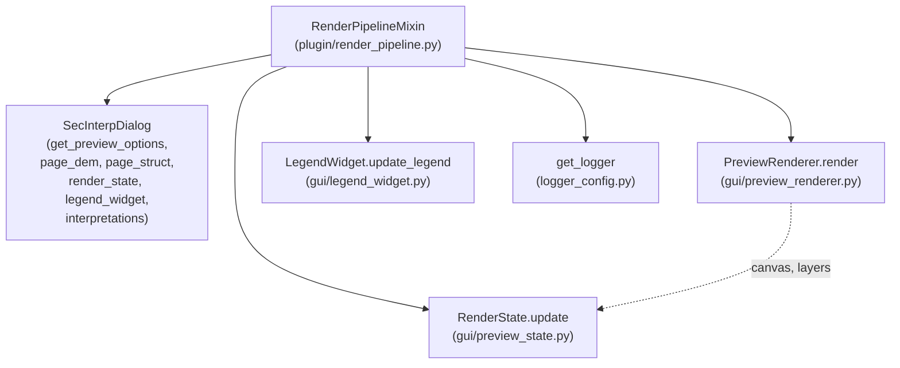
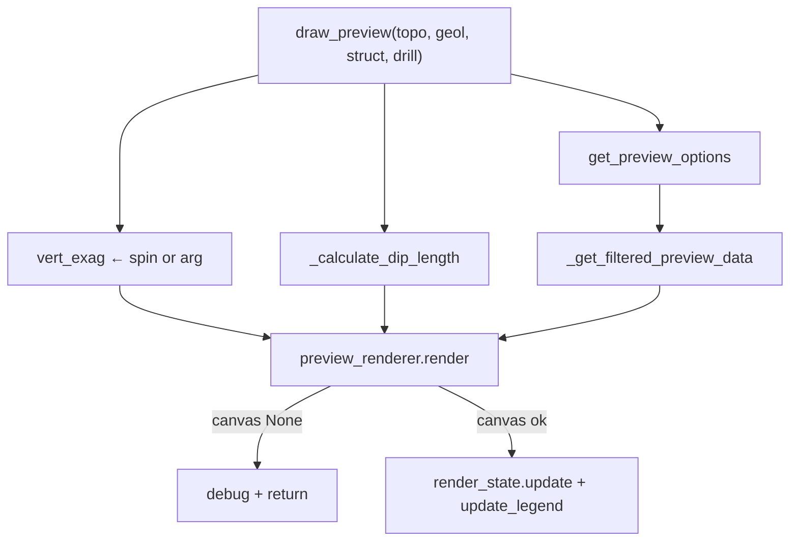

---
tags:
  - secinterp
  - code-walkthrough
  - plugin
aliases:
  - render_pipeline.py
  - RenderPipelineMixin
cssclass: secinterp-note
---

# `plugin/render_pipeline.py`

> [!abstract] One-line summary
> Mixin turning already-computed preview data into a visible QGIS scene: it filters by visibility options, derives vertical exaggeration and dip-line length, invokes the `PreviewRenderer`, and publishes the result to render state and legend.

**Path**: `plugin/render_pipeline.py` (110 lines)
**Main class**: `RenderPipelineMixin`
**Layer**: Plugin / GUI (orchestrates renderer, canvas and dialog widgets)
**Tags**: #secinterp #plugin

---

## 🎯 Why does this file exist?

Between "computed data" and "visible section" lies a chain of presentation
decisions (which layers show, with what exaggeration, at which dip scale) that
belongs neither to computation nor to the low-level renderer:

| Problem | Solution |
|---------|----------|
| The renderer draws whatever it receives; someone must decide what it receives | `_get_filtered_preview_data` applies the `show_*` flags before rendering |
| Vertical exaggeration lives in a dialog spin, not in the data | `draw_preview` reads it from `page_dem.vertexag_spin` unless passed explicitly |
| Dip-line length must scale with the raster | `_calculate_dip_length` multiplies pixel resolution by the scale factor |
| Drawing twice at once corrupts the scene | If `render()` returns `canvas=None` (lock active or no data), abort with `debug` |

> [!important] Architectural note
> It is the **Present** phase of Extract → Compute → Present: computation already
> happened in `PreviewManager`/`ProfileController`; here data is only filtered,
> scaled and drawn. No coordinate transforms, no input validation (see
> [[input_validator]]).

---

## 🧬 Relationship diagram



> [!tip] How to read
> Solid arrow = calls/reads; dashed = the `(canvas, layers)` pair the renderer
> returns and the mixin publishes to state. `RenderState` is what the rest of the
> GUI queries to know what is on screen.

---

## 📦 Imports — architectural reading

```python
# plugin/render_pipeline.py
from __future__ import annotations

from typing import Any

from sec_interp.logger_config import get_logger
```

| # | Observation |
|---|-------------|
| ① | **Zero `qgis.*` imports**: although it orchestrates canvas and layers, it only touches objects others created (`self.dlg`, `self.preview_renderer`). Duck-typed coupling. |
| ② | `Any` appears only in `_get_filtered_preview_data` (the four data blocks): the mixin is agnostic to each domain's type (profile, segments, measurements, drillholes). |
| ③ | Single internal import: `get_logger`. It does not even import the renderer: that arrives injected as `self.preview_renderer` from `SecInterp.__init__`. |
| ④ | No deferred imports: the module cannot cycle because it imports nothing from the GUI or the core. The most decoupled mixin in the package. |

---

## 🏗️ Structure inventory

**Classes:** `class RenderPipelineMixin` — 3 methods, no `__init__`, no own state.

**Functions/Methods:**

- `draw_preview(topo_data, geol_data=None, struct_data=None, drillhole_data=None, max_points=1000, vert_exag=None, **kwargs) -> None` — full drawing pipeline.
- `_get_filtered_preview_data(topo, geol, struct, drill, options) -> dict` — visibility-flag filtering.
- `_calculate_dip_length(struct_data) -> float | None` — dip-line length in map units.

---

## 📁 Files in the package

This module is one of the three mixins documented in the [[plugin]] group note.
See the package file table there; here only this file's walkthrough.

---

## 📖 Method-by-method walkthrough

### `draw_preview` — the drawing pipeline

```python
def draw_preview(
    self,
    topo_data: list,
    geol_data: list | None = None,
    struct_data: list | None = None,
    drillhole_data: list | None = None,
    max_points: int = 1000,
    vert_exag: float | None = None,
    **kwargs,
) -> None:
    """Draw enhanced interactive preview using native PyQGIS renderer."""
    if not self.dlg or not self.preview_renderer:
        logger.warning("Cannot draw preview: dialog or renderer missing.")
        return
```

Orphaned-presenter guard: with no dialog or renderer there is nowhere to draw.
`warning` (not `debug`) because it signals incomplete wiring, not a normal
condition. Note `topo_data` is the only required parameter: without topography
there is no section.

```python
    options = self.dlg.get_preview_options()
    if vert_exag is None:
        vert_exag = self.dlg.page_dem.vertexag_spin.value()
    dip_length = self._calculate_dip_length(struct_data)
```

Presentation-parameter resolution with clear precedence:

| Parameter | When passed explicitly | When `None` / missing |
|-----------|----------------------|----------------------|
| `vert_exag` | used as-is (programmatic calls, export) | read from `page_dem.vertexag_spin` (UI spin) |
| `dip_length` | — (always derived) | `_calculate_dip_length(struct_data)` |
| `max_points` | forwarded to the renderer (LOD) | default `1000` |
| `preserve_extent` | `kwargs.get("preserve_extent", False)` | extent not preserved (reframe) |

```python
    filtered = self._get_filtered_preview_data(
        topo_data, geol_data, struct_data, drillhole_data, options
    )

    canvas, layers = self.preview_renderer.render(
        topo_data=filtered["topo"],
        geol_data=filtered["geol"],
        struct_data=filtered["struct"],
        vert_exag=vert_exag,
        dip_line_length=dip_length,
        max_points=max_points,
        preserve_extent=kwargs.get("preserve_extent", False),
        drillhole_data=filtered["drill"],
        interp_data=filtered["interp"],
    )

    if canvas is None:
        logger.debug("draw_preview: Render skipped (lock active or no data)")
        return
```

The `PreviewRenderer.render()` call (see [[preview_renderer]]) uses keyword-only
arguments: each filtered block goes to its parameter and `preserve_extent` rides
inside `**kwargs` to keep the signature clean. If the renderer returns
`canvas=None` — its `is_rendering` lock was held or no valid layers existed — the
mixin aborts with `debug`: a normal operating condition (e.g. two chained
refreshes), not an error.

```python
    self.dlg.render_state.update(canvas, layers)

    if hasattr(self.dlg, "legend_widget"):
        self.dlg.legend_widget.update_legend(
            self.preview_renderer, options.get("show_legend", True)
        )
```

Result publication to two consumers:

1. `render_state.update(canvas, layers)` — the `RenderState` (see
   [[preview_state]]) records which canvas and layers form the current scene;
   exporters and tools query it afterwards.
2. `legend_widget.update_legend(...)` — the legend syncs with what was drawn,
   honoring `show_legend` (default `True`). The `hasattr` covers dialogs without
   a legend (tests, reduced builds).

### `_get_filtered_preview_data` — visibility filtering

```python
def _get_filtered_preview_data(
    self, topo: Any, geol: Any, struct: Any, drill: Any, options: dict
) -> dict:
    return {
        "topo": topo if options.get("show_topo", True) else None,
        "geol": geol if options.get("show_geol", True) else None,
        "struct": struct if options.get("show_struct", True) else None,
        "drill": drill if options.get("show_drillholes", True) else None,
        "interp": (
            self.dlg.interpretations if options.get("show_interpretations", True) else None
        ),
    }
```

| Key | Flag | Source when visible |
|-----|------|---------------------|
| `topo` | `show_topo` (default `True`) | the received `topo` |
| `geol` | `show_geol` | the received `geol` |
| `struct` | `show_struct` | the received `struct` |
| `drill` | `show_drillholes` (note the different name) | the received `drill` |
| `interp` | `show_interpretations` | `self.dlg.interpretations` (interpretations do **not** arrive as an argument: they live in the dialog) |

Every default is `True`: hiding is opt-in. Passing `None` to the renderer means
"do not draw this domain", a convention `render()` already understands. The
`interp` asymmetry (read from the dialog instead of a parameter) reflects its
nature: interpretations are interactive user state, not computation output.

### `_calculate_dip_length` — visual scale of dips

```python
def _calculate_dip_length(self, struct_data: list | None) -> float | None:
    if not struct_data:
        return None

    dip_scale = self.dlg.page_struct.scale_spin.value()
    if dip_scale <= 0:
        return None

    raster_layer = self.dlg.page_dem.raster_combo.currentLayer()
    if raster_layer and raster_layer.isValid():
        res = raster_layer.rasterUnitsPerPixelX()
        if res > 0:
            return res * dip_scale
    return None
```

Guard chain, each with its reason:

| Guard | Reason |
|-------|--------|
| `if not struct_data` | no measurements, nothing to scale; also avoids touching the UI in vain |
| `dip_scale <= 0` | a null or negative factor would produce degenerate lines in the renderer |
| `raster_layer and raster_layer.isValid()` | the combo may hold no layer or a broken one |
| `res > 0` | invalid resolution (raster without usable georeference) |

The result (`resolution × factor`) is in **map units**, which is what the renderer
expects in `dip_line_length`. If any link fails, `None`: the renderer then draws
its default length.

---

## 🔄 Data flow

| Phase | Input | Transformation | Output |
|-------|-------|----------------|--------|
| Guard | `self.dlg`, `self.preview_renderer` | if either missing, `warning` + `return` | — |
| Options | dialog | `get_preview_options()` | `show_*` + `show_legend` dict |
| Scale | spins + raster + struct | `vertexag_spin`, `_calculate_dip_length` | `vert_exag`, `dip_length` |
| Filter | 4 blocks + `interpretations` | `show_*` flags | `filtered` dict with `None` where hidden |
| Render | filtered blocks + scales | `preview_renderer.render(...)` | `(canvas, layers)` or `(None, [])` |
| Publish | canvas + layers | `render_state.update` + `update_legend` | visible scene and synced legend |



---

## 🧭 CRS and vertical exaggeration

The pipeline **does not transform coordinates**: it receives data already
projected onto the section and draws it on a flat canvas (distance vs.
elevation). The project CRS and the `QgsCoordinateTransformContext` are resolved
downstream: `PreviewManager._get_transform_context()` supplies them to the
computation and the renderer uses them when creating memory layers. The only
"transformation" here is visual and single-axis: `vert_exag` stretches the
elevation axis, and `dip_line_length` scales symbols in map units. Both are
presentation, not geodesy.

---

## 🏛️ Design patterns present

| Pattern | Where | Purpose |
|---------|-------|---------|
| **Presenter** | `draw_preview` | Separate presentation from computation and renderer |
| **Null-object (`None`)** | filtered blocks | "Hidden" and "absent" look the same downstream |
| **Parameter precedence** | explicit `vert_exag` vs. spin | Programmatic API without breaking the UI |
| **Guard chain** | `_calculate_dip_length` | Each precondition returns `None` early |
| **Cooperative render lock** | `canvas is None` → abort | Never stomp an in-flight render |

---

## 🧾 API summary

| Symbol | Signature | Typical use |
|--------|-----------|-------------|
| `RenderPipelineMixin` | mixin without `__init__` | inherited by `SecInterp` |
| `draw_preview` | `(topo, geol=None, struct=None, drill=None, max_points=1000, vert_exag=None, **kwargs) -> None` | after every successful `generate_preview` |
| `_get_filtered_preview_data` | `(topo, geol, struct, drill, options) -> dict` | apply visibility before rendering |
| `_calculate_dip_length` | `(struct_data) -> float \| None` | structural symbol scale |

---

## 🛡️ Error handling

| Situation | Behaviour |
|-----------|-----------|
| No dialog or no renderer | `logger.warning` + `return` |
| Overlapping render or no data | `logger.debug` + `return` (normal condition) |
| No `struct_data` / scale ≤ 0 / invalid raster | `dip_length = None` (renderer default) |
| Dialog without `legend_widget` | legend skipped (`hasattr`) |
| Missing `show_*` flag | default `True` (visible) |

> [!note] No own `try/except`
> The module catches no exceptions: if the renderer raises, the exception
> propagates to the caller (`PreviewManager`/tasks), which do handle errors. A
> coherent choice: this level would not know how to recover from a drawing
> failure.

---

## 🧪 Associated tests

There is no dedicated `tests/plugin/test_render_pipeline.py`; coverage is indirect:

- `tests/gui/renderers/test_renderers.py` — domain renderers the `PreviewRenderer` uses downstream.
- `tests/gui/test_dialog_preview_manager.py` — the caller invoking `draw_preview` after generating.
- `tests/integration/test_preview_pipeline.py` — end-to-end preview → render pipeline.
- `tests/integration/test_qgis_smoke.py` — smoke test with live QGIS, the only environment where the canvas exists.

> [!note] Honest coverage gap
> `_get_filtered_preview_data` is pure logic (dicts in, dict out) and would be
> testable with dialog mocks and no QGIS. `_calculate_dip_length` needs mocked
> spins and combo (`page_struct.scale_spin`, `page_dem.raster_combo`).

---

## 🧪 How to test the filter without QGIS

`_get_filtered_preview_data` touches no QGIS object: it only reads an options dict
and (for `interp`) the dialog's `interpretations` attribute. A `unittest.mock`
test would suffice:

```python
mixin = RenderPipelineMixin()
mixin.dlg = SimpleNamespace(interpretations=["poly-1"])
options = {"show_topo": True, "show_geol": False, "show_struct": True,
           "show_drillholes": True, "show_interpretations": False}

out = mixin._get_filtered_preview_data(["p"], ["g"], ["s"], ["d"], options)

assert out["topo"] == ["p"]
assert out["geol"] is None
assert out["interp"] is None
```

| Case | Options | Expected |
|------|---------|----------|
| All visible | empty dict `{}` (defaults `True`) | the four blocks + `interpretations` |
| All hidden | all five `show_*` set to `False` | dict of `None`s |
| No `dlg.interpretations` | `show_interpretations: True` | `AttributeError` (real limit: the method assumes the attribute) |

> [!warning] Limit of the example
> With `show_interpretations: True` and a dialog lacking the `interpretations`
> attribute, the method raises `AttributeError` instead of returning `None`. It is
> the only non-total path in the filter: documented here so a future test pins it.

---

## 👀 Observations and notes

> [!success] Strengths
> - Zero QGIS imports: the most decoupled mixin in `plugin/`.
> - Centralized visibility filter with visible defaults (`True`).
> - Explicit precedence for `vert_exag` (argument > spin).
> - Honors the renderer lock instead of racing it.

> [!warning] Points of attention
> - `interp` is read from `self.dlg.interpretations` while the rest arrives via parameters: an asymmetry to know when reusing the method.
> - The flag is named `show_drillholes` but the block is `drill`: the mapping lives only in this method.
> - `draw_preview` returns nothing: the result is only observable via `render_state` (hard to test without spies).

> [!question] Open questions
> - Pass `interp_data` as a parameter (like the rest) instead of reading it from the dialog?
> - Return `(canvas, layers)` to make the method testable and composable?

---

## 🔗 Related notes

- [[Index]] — vault index
- [[plugin]] — `plugin/` group note
- [[sec_interp_plugin]] — host class `SecInterp`
- [[input_validator]] — validation before computation
- [[lifecycle]] — `run`/`process_data`, the other side of the cycle
- [[main_dialog]] — spins, combos, `render_state`, `interpretations`
- [[preview_renderer]] — `render()` and its `is_rendering` lock
- [[preview_state]] — `RenderState.update`
- [[legend_widget]] — `update_legend`
- [[dialog_preview_manager]] — caller of `draw_preview`
- [[preview_task_orchestrator]] — LOD and `max_points`
- [[controller]] — `ProfileController`, source of the drawn data
- [[logger_config]] — `get_logger`

---

*Note of the SecInterp Code Walkthrough v2 vault — v3.9.0*
