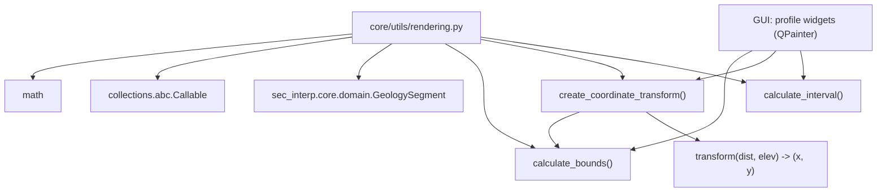

---
tags:
  - secinterp
  - code-walkthrough
  - core
  - utils
  - rendering
aliases:
  - rendering.py
  - calculate_bounds
  - create_coordinate_transform
  - calculate_interval
cssclass: secinterp-note
---

# `core/utils/rendering.py`

> [!abstract] One-line summary
> Pure visualization utilities: computes the *bounding box* with padding, builds a **data→pixel transform function** (with vertical exaggeration) and generates "nice" axis intervals.

**Path**: `core/utils/rendering.py` (129 lines)
**Main functions**: `calculate_bounds`, `create_coordinate_transform`, `calculate_interval`
**Layer**: Core · Utilities (QGIS-agnostic)
**Tags**: #secinterp #core #utils #rendering

---

## 🎯 Why does this file exist?

Drawing a geological profile requires mapping data coordinates (distance, elevation) to
canvas pixels while preserving proportions and a legible scale. Repeating these
operations in every widget would be fragile.

| Problem | Solution |
|---------|----------|
| Knowing the total range of all profile data | `calculate_bounds` aggregates topography + geological segments with 5% padding |
| Mapping (dist, elev) to (x, y) while keeping the aspect ratio | `create_coordinate_transform` returns a closure with a uniform scale |
| Legible axis labels (1, 2, 5, 10...) | `calculate_interval` produces "nice" intervals by powers of 10 |

> [!important] Architectural note — pure QGIS-agnostic
> It only imports `math`, `Callable` and the domain's `GeologySegment`. **No `qgis.*`**
> nor `PyQt`: the transformation is pure arithmetic, making it testable without QGIS and
> reusable in any rendering backend (QPainter, Matplotlib, etc.).

---

## 🧬 Relationship diagram



> [!tip] How to read
> The GUI computes `bounds` with `calculate_bounds`, obtains the closure with
> `create_coordinate_transform`, and uses `calculate_interval` for the grid. The returned
> closure is the central piece reused on every repaint.

---

## 📦 Imports — architectural reading

```python
# core/utils/rendering.py
from __future__ import annotations

import math
from collections.abc import Callable

from sec_interp.core.domain import GeologySegment
```

| # | Observation |
|---|-------------|
| ① | `math` for `log10`, `floor` ("nice" intervals). |
| ② | `Callable` to type the closure returned by `create_coordinate_transform`. |
| ③ | `GeologySegment` (domain DTO) is used **only as an annotation** in `geol_data`. |
| ④ | **Zero QGIS/PyQt imports** ⇒ pure arithmetic, testable without QGIS. |

---

## 🏗️ Structure inventory

**Functions (3):**

- `calculate_bounds(topo_data, geol_data=None) -> dict[str, float]`
- `create_coordinate_transform(bounds, view_w, view_h, margin, vert_exag=1.0) -> Callable[[float, float], tuple[float, float]]`
- `calculate_interval(data_range: float) -> float`

**Inner closure (1):**

- `transform(dist, elev) -> (x, y)` (defined inside `create_coordinate_transform`)

**No classes or global state.**

---

## 📁 Files in the package

`rendering.py` lives in `core/utils/`:

| File | Lines | Role |
|---|--:|---|
| [[rendering]] | 129 | Bounds, coordinate transform, intervals |
| [[io]] | 101 | Vector writing |
| [[metadata_reader]] | 129 | Reads `metadata.txt` |
| [[parsing]] | 222 | Strike/dip parsing, azimuth, attributes |
| [[safe_loader]] | 79 | Safe/lazy import loading |
| [[drillhole]] | 298 | Drillhole trajectory and projection |

> [!note] `rendering.py` is "visualization without GUI"
> Despite the name, it draws nothing: it only computes projection math. The actual
> drawing happens in the GUI layer. See [[core_utils]].

---

## 📖 Method-by-method walkthrough

### `calculate_bounds`

```python
def calculate_bounds(
    topo_data: list[tuple[float, float]],
    geol_data: list[GeologySegment] | None = None,
) -> dict[str, float]:
    dists = [p[0] for p in topo_data]
    elevs = [p[1] for p in topo_data]

    if geol_data:
        for segment in geol_data:
            dists.extend([p[0] for p in segment.points])
            elevs.extend([p[1] for p in segment.points])

    min_d, max_d = min(dists), max(dists)
    min_e, max_e = min(elevs), max(elevs)

    if max_d == min_d:
        max_d = min_d + 100
    if max_e == min_e:
        max_e = min_e + 10

    d_range = max_d - min_d
    e_range = max_e - min_e

    return {
        "min_d": min_d - d_range * 0.05,
        "max_d": max_d + d_range * 0.05,
        "min_e": min_e - e_range * 0.05,
        "max_e": max_e + e_range * 0.05,
    }
```

Aggregates distances and elevations from topography and, optionally, from geological
segments (`segment.points` are `(distance, elevation)`). Applies **5% padding** and
protects against **division by zero** by widening degenerate ranges.

### `create_coordinate_transform`

```python
def create_coordinate_transform(
    bounds: dict[str, float],
    view_w: int,
    view_h: int,
    margin: int,
    vert_exag: float = 1.0,
) -> Callable[[float, float], tuple[float, float]]:
    data_w = bounds["max_d"] - bounds["min_d"]
    data_h = bounds["max_e"] - bounds["min_e"]

    potential_scale_x = (view_w - 2 * margin) / data_w
    potential_scale_y = (view_h - 2 * margin) / data_h

    base_scale = min(potential_scale_x, potential_scale_y)

    scale_x = base_scale
    scale_y = base_scale * vert_exag

    def transform(dist: float, elev: float) -> tuple[float, float]:
        x = margin + (dist - bounds["min_d"]) * scale_x
        y = view_h - margin - (elev - bounds["min_e"]) * scale_y
        return x, y

    return transform
```

Returns a **closure** that converts data coordinates to pixels. It uses the **smaller
scale** of both axes to preserve a 1:1 aspect ratio (when `vert_exag=1.0`), and applies
vertical exaggeration only to the Y axis. The Y coordinate is inverted (`view_h - ...`)
because on screen the origin is at the top.

### `calculate_interval`

```python
def calculate_interval(data_range: float) -> float:
    magnitude = 10 ** math.floor(math.log10(data_range))
    normalized = data_range / magnitude

    THRESHOLD_SMALL = 2
    THRESHOLD_LARGE = 5

    if normalized < THRESHOLD_SMALL:
        return magnitude * 0.5
    if normalized < THRESHOLD_LARGE:
        return magnitude
    return magnitude * 2
```

Generates a "nice" interval based on the 1-2-5 scale: for a given range it chooses
between `0.5×`, `1×` or `2×` of the lower power of 10. Typical result: a range of `100`
yields interval `50`, `100` or `200`, human-readable.

---

## 🔄 Data flow

| Phase | Input | Transformation | Output |
|-------|-------|----------------|--------|
| Bounds | `topo_data` (+ `geol_data`) | min/max + 5% padding | `{min_d, max_d, min_e, max_e}` |
| Scale | `bounds`, `view_w`, `view_h`, `margin` | `min(scale_x, scale_y)` | `base_scale` |
| Transform | `(dist, elev)` | closure `transform` | `(x, y)` in pixels |
| Interval | `data_range` | `10 ** floor(log10)` + 1-2-5 | legible interval |

---

## 🏛️ Design patterns present

| Pattern | Where | Purpose |
|---------|-------|---------|
| **Closure / Factory function** | `create_coordinate_transform` | Capture `bounds`/`scale` in a reusable function |
| **Guard clause** | anti-division-by-zero in `calculate_bounds` | Avoid degenerate ranges |
| **Strategy (nice-number)** | `calculate_interval` | 1-2-5 scale for legible labels |
| **Pure function** | the whole module | Deterministic, no state or side effects |

---

## 🧾 API summary

| Symbol | Signature / Inherits | Typical use |
|--------|----------------------|-------------|
| `calculate_bounds` | `(topo_data, geol_data=None) -> dict[str, float]` | Total range with padding |
| `create_coordinate_transform` | `(bounds, view_w, view_h, margin, vert_exag=1.0) -> Callable` | Map data→pixels |
| `calculate_interval` | `(data_range: float) -> float` | Interval for grid/axes |

---

## 📐 Aspect ratio and vertical exaggeration

The key trick of `create_coordinate_transform` is choosing `base_scale` as the **smaller**
of the two potential scales:

```python
potential_scale_x = (view_w - 2 * margin) / data_w
potential_scale_y = (view_h - 2 * margin) / data_h
base_scale = min(potential_scale_x, potential_scale_y)

scale_x = base_scale
scale_y = base_scale * vert_exag
```

| Situation | Effect |
|-----------|--------|
| `vert_exag = 1.0` | `scale_x == scale_y` ⇒ 1:1 proportions (no distortion) |
| `vert_exag = 5.0` | the Y axis is stretched 5× ⇒ geological vertical exaggeration |
| Narrow canvas | `scale_x` is the smaller ⇒ the content fits horizontally |

> [!note] Why the *smaller* scale
> Taking `min(...)` guarantees **everything** fits on the canvas along both axes; the
> leftover axis gets extra margin. The alternative (`max`) would crop the profile.

### Numeric example of the transform

With `bounds={min_d:0, max_d:100, min_e:0, max_e:50}`, `view_w=400`, `view_h=300`,
`margin=20`, `vert_exag=1.0`:

| Step | Computation | Result |
|------|-------------|--------|
| `data_w` | `100 - 0` | `100` |
| `data_h` | `50 - 0` | `50` |
| `potential_scale_x` | `(400 - 40) / 100` | `3.6` |
| `potential_scale_y` | `(300 - 40) / 50` | `5.2` |
| `base_scale` | `min(3.6, 5.2)` | `3.6` |
| `transform(0, 0)` | `(20 + 0, 280 - 0)` | `(20, 280)` (bottom-left corner) |
| `transform(100, 50)` | `(20 + 360, 280 - 180)` | `(380, 100)` (top-right corner) |

---

## 🧮 The 1-2-5 scale of `calculate_interval`

| `data_range` | `magnitude` | `normalized` | Returned interval |
|--------------|-------------|--------------|-------------------|
| `0.8` | `0.1` | `8` | `0.2` |
| `3.0` | `1` | `3` | `1` |
| `45` | `10` | `4.5` | `10` |
| `90` | `10` | `9` | `20` |

> [!tip] Mnemonic rule
> `normalized < 2` → half; `2 ≤ normalized < 5` → unit; `≥ 5` → double. Produces the
> "nice" sequences `0.5, 1, 2, 5, 10, 20, 50...` that humans expect on an axis.

---

## 🛡️ Error handling

No exceptions: the three functions are **total** (never fail for valid numeric inputs).

| Risk | Defense |
|------|---------|
| Empty `topo_data` → `min()` fails | the contract requires at least one point (guaranteed by the caller) |
| `max_d == min_d` → division by zero | `max_d = min_d + 100` |
| `max_e == min_e` → division by zero | `max_e = min_e + 10` |
| `data_range` ≤ 0 in `calculate_interval` | `log10` of non-positives would fail; contract: range > 0 |

> [!warning] `calculate_bounds` with an empty list would raise `ValueError`
> `min([])`/`max([])` raise `ValueError`. The module **does not** validate empty
> `topo_data`; the GUI is responsible for not invoking it without data.

---

## 🔗 Relationship with the domain

`create_coordinate_transform` depends on `calculate_bounds`, and `calculate_bounds`
consumes `GeologySegment` ([[entities]]). In the real preview flow:

1. `PreviewResult.get_elevation_range()` ([[dtos]]) provides the vertical bounds.
2. `calculate_bounds` widens those bounds with 5% padding.
3. The profile widget obtains the closure and repaints every `(dist, elev)`.

> [!note] The module does not receive `PreviewResult` directly
> It works with `topo_data` (list of tuples) and `geol_data` (list of segments), not
> with the aggregate DTO. That decomposition keeps `rendering.py` decoupled from the
> results container.

> [!tip] Purity = portability
> With no GUI dependencies, these three functions could be reused in an image export
> (Matplotlib/PIL) unchanged.

---

## 🧪 Associated tests

`tests/core/test_rendering_utils.py` (BaseTestCase, Mock-first):

- `test_calculate_bounds_topo_only` — verifies exact padding (`min_d=-10`, `max_d=210`, etc.).
- `test_calculate_bounds_with_geol` — includes a (mocked) `GeologySegment` in the range.
- `test_calculate_bounds_division_by_zero` — degenerate ranges do not divide by zero.
- `test_transform_linear` — verifies `transform`'s linear projection.
- `test_transform_vertical_exaggeration` — `vert_exag` affects only the Y axis.
- `test_calculate_interval_various_ranges` — 1-2-5 intervals for various ranges.

---

## 👀 Observations and notes

> [!success] Strengths
> - Pure, deterministic arithmetic with no GUI dependencies.
> - The transform closure is an elegant, reusable abstraction.
> - Explicit and documented anti-division-by-zero.

> [!warning] Points of attention
> - `calculate_bounds` does not validate empty `topo_data` (implicit contract with the caller).
> - `calculate_interval` would fail with `data_range <= 0` (no guard).
> - `transform` closes over `bounds`/`scale` by reference: if `bounds` mutates later, the closure reflects it.

> [!question] Open questions
> - Move `margin` and `view_w/h` computation into a view-config DTO?
> - Add guards for empty `topo_data` and `data_range <= 0`?
> - Freeze the values captured by the closure to avoid unexpected mutation?

---

## 🔗 Related notes

- [[Index]] — vault index
- [[core_utils]] — the `core/utils/` package and its pure utilities
- [[parsing]] — structural data that feeds the rendered profile
- [[drillhole]] — trajectories projected onto the profile
- [[entities]] / [[dtos]] — `GeologySegment` and `PreviewResult` being drawn
- [[controller]] — orchestrates bounds + transform in the preview flow

---

*Note of the SecInterp Code Walkthrough v2 vault — v3.9.1*
