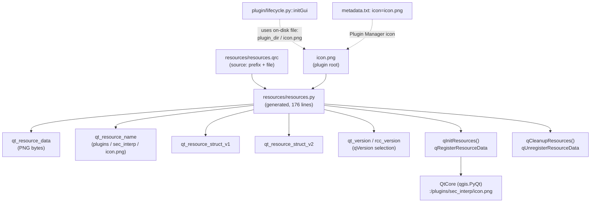

---
tags:
  - secinterp
  - code-walkthrough
  - resources
  - icons
aliases:
  - resources.py
  - qInitResources
cssclass: secinterp-note
---

# `resources/resources.py`

> [!abstract] One-line summary
> **Generated** module from the PyQt5 Resource Compiler embedding `icon.png` as a binary blob and registering it with Qt under the `:/plugins/sec_interp/` prefix via `qInitResources()`.

**Path**: `resources/resources.py` (176 lines)
**Main function**: `qInitResources` / `qCleanupResources`
**Layer**: Resources / GUI (compiled binary, no logic)
**Tags**: #secinterp #resources #icons

---

## 🎯 Why does this file exist?

Qt can embed icons in code itself instead of relying on disk paths. This file is the
`pyrcc5` compiler output over `resources.qrc`:

| Problem | Solution |
|---------|----------|
| The icon must ship with the plugin without fragile paths | PNG embedded as `qt_resource_data` (bytes) |
| Qt needs a name → bytes index | `qt_resource_name` + `qt_resource_struct_v1/v2` |
| The resource must be available on import | `qInitResources()` run at module bottom |
| Different Qt versions use different index formats | `rcc_version` selection via `QtCore.qVersion()` |

> [!important] Architectural note
> **Do not hand-edit**: the header warns any change is lost on rebuild. The source of
> truth is `resources.qrc` + `icon.png`; this `.py` is a generated artifact. See
> [[resources_pkg]] for the package role.

---

## 🧬 Relationship diagram



> [!tip] How to read
> Solid arrow = generation/containment; dashed = external reference. Note `initGui`
> loads the icon **from disk**, not from the registered `:/` prefix.

---

## 📦 Imports — architectural reading

```python
# resources/resources.py
# -*- coding: utf-8 -*-

# Resource object code
#
# Created by: The Resource Compiler for PyQt5 (Qt v5.15.18)
#
# WARNING! All changes made in this file will be lost!

from qgis.PyQt import QtCore
```

| # | Observation |
|---|-------------|
| ① | **A single import** in the whole module: the rest is `bytes` literals and two functions. |
| ② | `from qgis.PyQt import QtCore` (not `PyQt5` directly): agnostic import, consistent with the project's QGIS 4.x guide. |
| ③ | The header documents the generator (`PyQt5`, Qt v5.15.18): pins the artifact's provenance. |
| ④ | `WARNING! ... will be lost!`: a read-only contract for humans and agents. |
| ⑤ | No `logger_config` or plugin imports: the module is self-contained on purpose (must load even if everything else fails). |

---

## 🏗️ Structure inventory

**Module data (5):**

- `qt_resource_data: bytes` — PNG content (lines 11–120).
- `qt_resource_name: bytes` — name tree (`plugins` → `sec_interp` → `icon.png`, lines 122–135).
- `qt_resource_struct_v1: bytes` — index for Qt < 5.8 (lines 137–142).
- `qt_resource_struct_v2: bytes` — index for Qt ≥ 5.8 (lines 144–153).
- `qt_version: list[int]` + `rcc_version: int` + `qt_resource_struct` — import-time selection (lines 155–161).

**Functions (2):**

- `qInitResources() -> None` — `QtCore.qRegisterResourceData(...)`.
- `qCleanupResources() -> None` — `QtCore.qUnregisterResourceData(...)`.

**Import side effect:**

- `qInitResources()` called at line 176: importing the module registers the resource.

---

## 📁 Files in the package

The generated module lives with its source and uncompiled neighbours:

| File | Lines | Role |
|---|--:|---|
| [[resources]] | 176 | Compiled module (this note) |
| [[resources_pkg]] | 4 | `resources/__init__.py`: package docstring |
| `resources.qrc` | 5 | XML source: `<qresource prefix="/plugins/sec_interp"><file>../icon.png</file>` |
| `symbology-style.db` | — | Style database (uncompiled, outside the `.qrc`) |
| `../icon.png` | — | Root PNG: plugin and Plugin Manager icon |

---

## 📖 Block-by-block walkthrough

### Generated header — read-only contract

```python
# -*- coding: utf-8 -*-

# Resource object code
#
# Created by: The Resource Compiler for PyQt5 (Qt v5.15.18)
#
# WARNING! All changes made in this file will be lost!
```

It identifies tool and version (Qt v5.15.18). Any rebuild with another `pyrcc5`/`pyrcc6`
would rewrite blobs and structs: hence this file's git diff should only change when the
icon or the `.qrc` changes.

### `qt_resource_data` — the embedded PNG

```python
qt_resource_data = b"\
\x00\x00\x06\x97\
\x89\
\x50\x4e\x47\x0d\x0a\x1a\x0a\x00\x00\x00\x0d\x49\x48\x44\x52\x00\
...
\x4e\x44\xae\x42\x60\x82\
"
```

~110 lines of hex escapes. The format signatures are recognizable:

| Bytes | Meaning |
|-------|---------|
| `\x89PNG\r\n\x1a\n` (`\x50\x4e\x47...`) | PNG magic signature |
| `IHDR` (`\x49\x48\x44\x52`) | Header: `0x17 × 0x18` (23×24 px), RGBA colour |
| `sRGB`, `gAMA`, `cHRM`, `bKGD`, `pHYs`, `tIME` | Auxiliary colour/editing chunks |
| `IDAT` (`\x49\x44\x41\x54`) | Compressed image data (the bulk of the blob) |
| `IEND` (`\x49\x45\x4e\x44`) | PNG end |

> [!note] No need to read the blob
> The content is opaque by design: all that matters is it starts at `PNG` and ends at
> `IEND`. A corrupted icon is regenerated from `icon.png`, never patched here.

### `qt_resource_name` — the name tree

```python
qt_resource_name = b"\
\x00\x07\
\x07\x3b\xe0\xb3\
\x00\x70\
\x00\x6c\x00\x75\x00\x67\x00\x69\x00\x6e\x00\x73\
\x00\x0a\
\x06\x0a\x9b\xb0\
\x00\x73\
\x00\x65\x00\x63\x00\x5f\x00\x69\x00\x6e\x00\x74\x00\x65\x00\x72\x00\x70\
\x00\x08\
\x0a\x61\x5a\xa7\
\x00\x69\
\x00\x63\x00\x6f\x00\x6e\x00\x2e\x00\x70\x00\x6e\x00\x67\
"
```

It encodes the resource virtual path as hashed UTF-16 segments:

| Segment | Length | Text |
|---------|--------|------|
| `\x00\x07` + `\x00p...` | 7 | `plugins` |
| `\x00\x0a` + `\x00s...` | 10 | `sec_interp` |
| `\x00\x08` + `\x00i...` | 8 | `icon.png` |

Combined with the `.qrc` `prefix="/plugins/sec_interp"`, the Qt-accessible resource is
`:/plugins/sec_interp/icon.png`.

### `v1` / `v2` structs + version selection

```python
qt_resource_struct_v1 = b"\
\x00\x00\x00\x00\x00\x02\x00\x00\x00\x01\x00\x00\x00\x01\
...
"

qt_resource_struct_v2 = b"\
\x00\x00\x00\x00\x00\x02\x00\x00\x00\x01\x00\x00\x00\x01\
\x00\x00\x00\x00\x00\x00\x00\x00\
...
\x00\x00\x01\x9b\x1e\x90\xab\x79\
"

qt_version = [int(v) for v in QtCore.qVersion().split(".")]
if qt_version < [5, 8, 0]:
    rcc_version = 1
    qt_resource_struct = qt_resource_struct_v1
else:
    rcc_version = 2
    qt_resource_struct = qt_resource_struct_v2
```

The index format changed in Qt 5.8; the module ships both and picks at import time by
comparing int lists (`[5, 15, 18] < [5, 8, 0]` → `False` → v2 on modern QGIS 3.x). v2 adds
a zero row per node and a trailing hash (`\x1e\x90\xab\x79`).

### `qInitResources` / `qCleanupResources` + self-registration

```python
def qInitResources():
    QtCore.qRegisterResourceData(
        rcc_version, qt_resource_struct, qt_resource_name, qt_resource_data
    )


def qCleanupResources():
    QtCore.qUnregisterResourceData(
        rcc_version, qt_resource_struct, qt_resource_name, qt_resource_data
    )


qInitResources()
```

Symmetric registration: `qRegisterResourceData` exposes `:/plugins/sec_interp/icon.png`
to the whole Qt app; `qUnregisterResourceData` would remove it (nobody calls it today:
no explicit resource teardown in `unload`). The trailing call makes **import enough**:
whoever imports `resources.resources` leaves the icon available.

---

## 🪟 Registered resource vs icon in use

Important honesty: the registered resource is **not** what current code uses.

| Aspect | `:/` resource | On-disk file |
|--------|---------------|--------------|
| Origin | `resources.py` (compiled) | root `icon.png` |
| Path | `:/plugins/sec_interp/icon.png` | `self.plugin_dir / "icon.png"` |
| Consumer | none directly today | `plugin/lifecycle.py::initGui` (`add_action`) |
| Plugin Manager | — | `metadata.txt` → `icon=icon.png` |

> [!warning] Registration without direct consumption
> The `.qrc` declares `../icon.png` and registration works, but `initGui` builds the
> `QIcon` from the disk path. The compiled resource acts as classic Plugin Builder
> packaging fallback, not the main route. Do not invent `:/` usages that do not exist.

---

## 🧭 The virtual `:/plugins/sec_interp` prefix

Once registered, Qt resolves `:/plugins/sec_interp/icon.png` like any file, with no
disk access. The prefix has three segments with distinct roles:

| Segment | Origin | Role |
|---------|--------|------|
| `:/` | Qt syntax | Marks "compiled resource", not a file |
| `plugins/sec_interp` | `.qrc` `prefix` + `qt_resource_name` tree | Plugin namespace inside the app |
| `icon.png` | `<file>../icon.png</file>` | Resource name |

```python
# Canonical Qt usage (not used in today's code: loading is from disk)
icon = QIcon(":/plugins/sec_interp/icon.png")
```

> [!note] Plugin Builder convention
> The `prefix="/plugins/sec_interp"` is Plugin Builder's default (`plugins` + module
> name). Keeping it avoids collisions with other plugins' resources loaded in the same
> QGIS process.

---

## 🔄 Data flow

| Phase | Input | Transformation | Output |
|-------|-------|----------------|--------|
| Compile | `resources.qrc` + `../icon.png` | `pyrcc5` (Qt v5.15.18) | `resources.py` with blobs |
| Import | `import resources.resources` | v1/v2 selection + `qRegisterResourceData` | `:/plugins/sec_interp/icon.png` available |
| Actual icon use | `plugin_dir / "icon.png"` | `QIcon(icon_path)` in `add_action` | menu + toolbar icon |
| Cleanup | `qCleanupResources()` | `qUnregisterResourceData` | resource removed (no callers today) |

---

## 🛠️ How to regenerate

```bash
# From the plugin root (needs pyrcc5 from the QGIS/Qt5 environment)
pyrcc5 -o resources/resources.py resources/resources.qrc
```

| Rule | Detail |
|------|--------|
| Edit | Only `resources.qrc` and `icon.png`; never this `.py` |
| Verify | After rebuilding, check the `PNG`/`IEND` signature and a blob-scoped diff |
| Qt6 / QGIS 4 | `pyrcc6` would change the header and import; keep `qgis.PyQt` when migrating |

---

## 🏛️ Design patterns present

| Pattern | Where | Purpose |
|---------|-------|---------|
| **Code generation** | Whole module | Binary → importable code |
| **Registry** | `qRegister/qUnregisterResourceData` | Global name → bytes index in Qt |
| **Version dispatch** | `rcc_version` via `qVersion()` | One artifact valid on old and new Qt |
| **Self-registration** | Trailing `qInitResources()` | Importing equals activating |

---

## 🧾 API summary

| Symbol | Signature / Type | Typical use |
|--------|------------------|-------------|
| `qt_resource_data` | `bytes` | PNG blob (opaque) |
| `qt_resource_name` | `bytes` | `plugins/sec_interp/icon.png` tree |
| `qt_resource_struct_v1/v2` | `bytes` | Indexes per Qt version |
| `qInitResources` | `() -> None` | Register (auto on import) |
| `qCleanupResources` | `() -> None` | Remove (no current callers) |
| Virtual resource | `:/plugins/sec_interp/icon.png` | Registered Qt path |

---

## 🛡️ Error handling

| Case | Behaviour |
|------|-----------|
| Qt < 5.8 | `v1` branch picked by version comparison |
| Unexpected `qVersion()` format | `int(v)` would raise `ValueError` at import (unguarded: early visible failure) |
| Double import | Python caches the module: `qInitResources()` runs once |
| Corrupt PNG in blob | Qt fails to resolve the icon; regenerate from `icon.png`, never patch |

---

## 🧪 Associated tests

No tests under `tests/` cover this module (nor the `resources/` package):

- No `tests/**/test_resource*.py` exists; `grep resources tests/` returns no dedicated cases.
- Icon loading is exercised indirectly in GUI suites building actions with on-disk `icon.png` (mocked).
- The `qInitResources()` registration would need real Qt or the `tests/mocks/` doubles (`qt_mocks.py`, `qgis_core.py`).

> [!note] Honest coverage proposal
> A pure test could import the module with mocked `QtCore` and assert
> `qRegisterResourceData` was called with `rcc_version == 2` and that
> `qt_resource_data` starts with the PNG signature. No real QGIS, via `tests/base_test.py`.

---

## 👀 Observations and notes

> [!success] Strengths
> - Self-contained: one import and it works, no plugin dependencies.
> - Qt < 5.8 and ≥ 5.8 compatible with a single artifact.
> - Agnostic import (`qgis.PyQt`) aligned with the QGIS 4.x guide.

> [!warning] Points of attention
> - Generated with Qt v5.15.18: moving to `pyrcc6` requires rebuilding for QGIS 4/Qt6.
> - `qCleanupResources` uncalled: the resource lives until the process dies.
> - Code loads the icon from disk, not the registered `:/`: two routes to keep consistent.
> - `int(v)` over `qVersion()` does not tolerate non-numeric suffixes.

> [!question] Open questions
> - Unify icon loading in `initGui` towards the `:/` prefix, or drop the `.qrc`?
> - Rebuild with `pyrcc6`/`qgis.PyQt` when migrating to QGIS 4?
> - Add a registration test with mocked `QtCore`?

---

## 🔗 Related notes

- [[Index]] — vault index
- [[resources_pkg]] — `resources/` package and its namespace role
- [[lifecycle]] — `initGui` loads on-disk `icon.png` via `add_action`
- [[sec_interp_plugin]] — `plugin_dir` as the icon path base
- [[main_dialog]] — dialog whose menu action uses this icon

---

*Note of the SecInterp Code Walkthrough v2 vault — v3.8.0*
