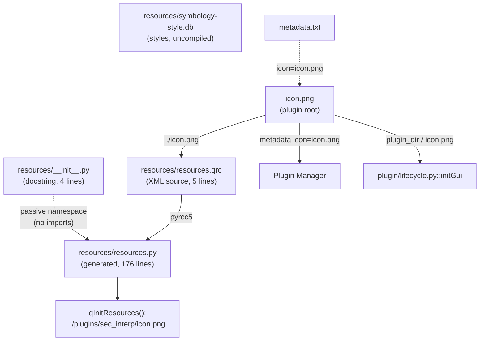
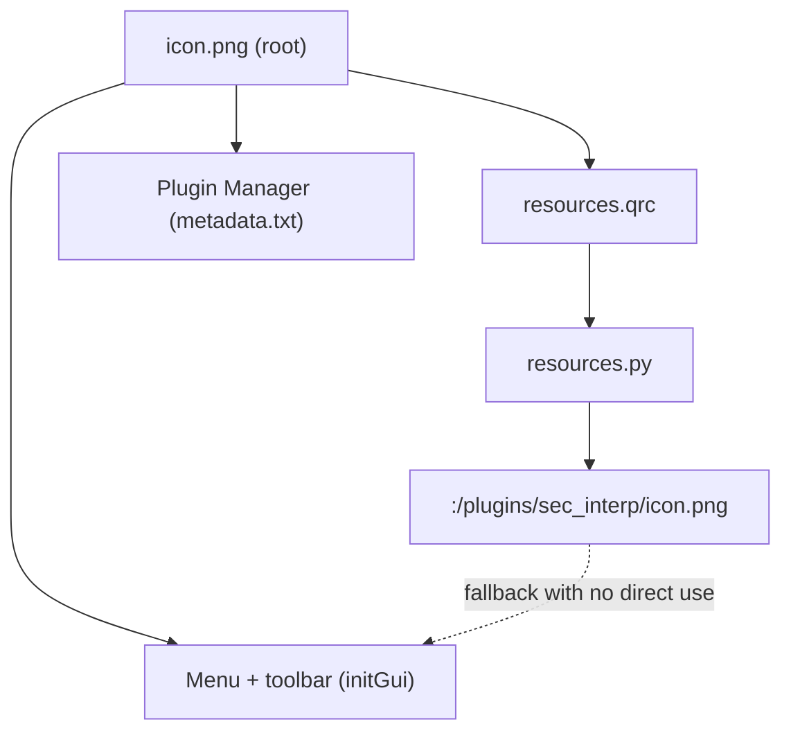

---
tags:
  - secinterp
  - code-walkthrough
  - resources
  - package
aliases:
  - resources/
  - __init__.py
cssclass: secinterp-note
---

# `resources/` — Plugin resources package

> [!abstract] One-line summary
> Package `resources/` (4 files): a minimal namespace (`__init__.py` with only a docstring) hosting the compiled `resources.py` icon, its `resources.qrc` source, and the uncompiled `symbology-style.db`.

**Path**: `resources/` (2 Python files: 4 + 176 lines, plus `.qrc` and `.db`)
**Main symbol**: `resources.resources.qInitResources` (via [[resources]])
**Layer**: Resources / GUI (container, no logic of its own)
**Tags**: #secinterp #resources #package

---

## 🎯 Why does this package exist?

Plugin Builder–generated QGIS plugins isolate binary artifacts in `resources/`. Here the
package serves three container duties:

| Problem | Solution |
|---------|----------|
| The compiled icon needs an importable home | `resources/resources.py` under the `resources` package |
| The resource source must live next to the generated file | `resources.qrc` next to the `.py` it produces |
| Auxiliary styles must not mix with code | `symbology-style.db` isolated in the same directory |

> [!important] Architectural note
> The package **has no logic**: its `__init__.py` is a docstring only, with no imports,
> no `__all__`, no re-exports. It is a passive namespace; all behaviour lives in
> [[resources]] (`resources.py`). Do not attribute symbols that do not exist.

---

## 🧬 Relationship diagram



> [!tip] How to read
> Solid arrow = generation/real use; dashed = containment or declarative reference.
> The package imports nothing: it only groups.

---

## 📦 Imports — architectural reading

```python
# resources/__init__.py (entire content, 4 lines)
"""Resources module for SecInterp plugin.

Contains icons, QRC files, and compiled resources.
"""
```

| # | Observation |
|---|-------------|
| ① | **Zero imports**: the `__init__` loads neither `resources.py` nor registers anything. |
| ② | A single module docstring: describes icons, QRC and compiled assets. |
| ③ | No `__all__`, no version, no symbols: the namespace is deliberately empty. |
| ④ | [[resources]] (`resources.py`) has its own single import (`qgis.PyQt.QtCore`) and is imported by full path when needed, never through the package. |
| ⑤ | Contrast with `plugin/__init__.py` (see [[plugin]]), which does re-export mixins: here there is nothing to re-export. |

---

## 🏗️ Structure inventory

**Python symbols in the package: none of its own.**

- `resources/__init__.py` — 0 classes, 0 functions, 0 constants. Docstring only.
- `resources/resources.py` — documented in [[resources]]: 2 functions (`qInitResources`, `qCleanupResources`) + 5 data blobs. **Not repeated here**: this note describes the container, not the content.

---

## 📁 Files in the package

| File | Lines | Role |
|---|--:|---|
| [[#__init__.py\|__init__.py]] | 4 | Package docstring; no imports or re-exports |
| [[#resources.py\|resources.py]] | 176 | Compiled icon; detail in [[resources]] |
| [[#resources.qrc\|resources.qrc]] | 5 | XML resource source (`prefix` + `file`) |
| [[#symbology-style.db\|symbology-style.db]] | — | Style database; outside the `.qrc`, uncompiled |

---

## 📖 File-by-file walkthrough

### `__init__.py`

```python
"""Resources module for SecInterp plugin.

Contains icons, QRC files, and compiled resources.
"""
```

The entire file, not one line more. Its only job is turning the directory into an
importable package (`import resources.resources` works because of it). It does not
register the resource, declare a version, or expose any API.

| Question | Honest answer |
|----------|---------------|
| Does it import `resources.py`? | No |
| Does it call `qInitResources()`? | No (`resources.py` self-registers on import) |
| Does it declare `__all__`? | No |
| Must it change when adding an icon? | No; only the `.qrc` changes and `resources.py` is rebuilt |

### `resources.py`

Compiler-generated module (Qt v5.15.18) embedding `icon.png` and registering it as
`:/plugins/sec_interp/icon.png`. Full content in [[resources]]; only its container card
here:

| Aspect | Detail |
|--------|--------|
| Nature | Generated artifact, read-only (`WARNING! ... will be lost!`) |
| Import | `from qgis.PyQt import QtCore` (single) |
| API | `qInitResources()` (auto on import), `qCleanupResources()` (uncalled) |
| Rule | Edit `resources.qrc` + `icon.png`, rebuild with `pyrcc5` |

### `resources.qrc`

```xml
<RCC>
    <qresource prefix="/plugins/sec_interp" >
        <file>../icon.png</file>
    </qresource>
</RCC>
```

The 5-line resource source: a single `<qresource>` with `prefix="/plugins/sec_interp"`
and a single relative `<file>` (`../icon.png`, i.e. the plugin-root PNG). This yields
the virtual path `:/plugins/sec_interp/icon.png`.

| Element | Detail |
|---------|--------|
| `prefix` | `/plugins/sec_interp` — virtual Qt namespace |
| `file` | `../icon.png` — relative to the `.qrc`, resolves to the root |
| Resources | 1 (icon only; `symbology-style.db` is not included) |

### `symbology-style.db`

A QGIS style SQLite database shipping with the plugin but **outside** the Qt resource
system: it appears in neither the `.qrc` nor `resources.py`.

| Aspect | Detail |
|--------|--------|
| Format | SQLite (QGIS `style.db`: symbols, ramps, labels) |
| Compiled into `resources.py` | No |
| Referenced in code | No direct imports or paths found in current code |
| Role | Plugin style reserve, isolated from code |

> [!note] No invented symbols
> This note attributes no functions, classes or readers to `symbology-style.db`: the
> repository shows no direct consumer. It is documented as a contained artifact, not an
> API.

---

## ⚖️ Comparison: two `__init__.py`, two philosophies

The project has several `__init__.py` files with opposite roles. Contrasting them keeps
you from copying the wrong pattern:

| Aspect | `resources/__init__.py` (this one) | `plugin/__init__.py` (see [[plugin]]) |
|--------|-----------------------------------|--------------------------------------|
| Lines | 4 | 9 |
| Imports | 0 | 3 re-exported mixins |
| `__all__` | No | Yes (`InputValidationMixin`, `PluginLifecycleMixin`, `RenderPipelineMixin`) |
| Docstring | Content description | One purpose line |
| Philosophy | Passive namespace | Facade aggregating an API |

| Practical rule | Detail |
|----------------|--------|
| Re-export when the package is a **facade** | `plugin/` aggregates three mixins under one import |
| Keep empty when the package is a **container** | `resources/` holds artifacts; re-exporting `qInitResources` would add nothing |
| Never import the heavy bits in `__init__` | Neither `plugin/` nor `resources/` import Qt/GUI in their header |

> [!tip] The empty `__init__` is a reviewed decision
> If a future icon ever needed eager registration, the place would still be the
> explicit import (`import resources.resources`), not the `__init__`: the trailing
> self-registration in `resources.py` already covers that without coupling the namespace.

---

## 🗺️ The virtual prefix and the icon map

The plugin icon leads three parallel lives; only one goes through this package:

| Life | Path | Defined in | Consumed in |
|------|------|------------|-------------|
| Qt resource | `:/plugins/sec_interp/icon.png` | [[resources]] (`qRegisterResourceData`) | no direct consumer today |
| Menu file | `plugin_dir / "icon.png"` | root `icon.png` | `plugin/lifecycle.py::initGui` |
| Manager file | `icon=icon.png` | `metadata.txt` | QGIS Plugin Manager |



> [!note] Why two routes coexist
> The `:/` route is Plugin Builder heritage (classic self-sufficient packaging); the
> disk route is what the code actually uses (`QIcon(icon_path)`). Removing one of them
> is the open question in [[resources]]; this package takes no side, it hosts both.

---

## 🔁 Compiled-resource lifecycle

| Phase | Action | File touched |
|-------|--------|--------------|
| Design | Edit the root PNG or add a `<file>` | `icon.png`, `resources.qrc` |
| Compile | `pyrcc5 -o resources/resources.py resources/resources.qrc` | `resources.py` (rebuilt) |
| Review | Diff scoped to the blob + version header | `resources.py` in git |
| Load | `import resources.resources` → `qInitResources()` | runtime (auto) |
| Use | `QIcon(":/plugins/sec_interp/icon.png")` (potential) | client code |
| Teardown | `qCleanupResources()` (uncalled today) | process end |

| What the package does NOT hold | Why it matters |
|-------------------------------|----------------|
| Translations (`.qm`/`.ts`) | They live in `i18n/`, loaded by [[sec_interp_plugin]] |
| Qt stylesheets (`.qss`) | None; the UI is programmatic (see `gui/`) |
| Extra icons | Only `icon.png`; new icons require editing the `.qrc` |
| Lazy-loading logic | That is [[safe_loader]]; here registration is eager on import |
| Resource tests | None exist; proposal in [[resources]] |

---

## 🔄 Data flow

| Phase | Input | Transformation | Output |
|-------|-------|----------------|--------|
| Packaging | root `icon.png` | `pyrcc5 resources.qrc` | rebuilt `resources.py` |
| Import | `import resources.resources` | `qInitResources()` | `:/plugins/sec_interp/icon.png` in Qt |
| Menu icon | `plugin_dir / "icon.png"` | `QIcon` in `add_action` | `initGui` icon (via disk) |
| Plugin Manager | `metadata.txt: icon=icon.png` | QGIS reads the root PNG | manager icon |
| Styles | `symbology-style.db` | — (no compiled route) | artifact available on disk |

---

## 🏛️ Design patterns present

| Pattern | Where | Purpose |
|---------|-------|---------|
| **Package as namespace** | Minimal `__init__.py` | Group without coupling |
| **Code generation** | `resources.py` via `pyrcc5` | Binary → code (detail in [[resources]]) |
| **Source alongside artifact** | `.qrc` next to the `.py` | Traceable rebuilds |
| **Uncompiled sidecar** | `symbology-style.db` | Styles outside the Qt pipeline |

---

## 📥 Who imports the package (import map)

A `grep`-verified fact: **no Python module in the plugin imports `resources.resources`
today**.

| Search | Result |
|--------|--------|
| `import resources` / `from resources` in `*.py` (no `.venv`, no `docs/`) | 0 importers |
| `qInitResources` outside `resources.py` | 0 calls |
| `:/plugins/sec_interp` outside `resources.py` | 0 uses |
| `icon.png` referenced | `plugin/lifecycle.py` (disk) and `metadata.txt` (manager) |

> [!note] Orphaned module, not a broken one
> Registration works (import self-registers), but nobody imports it: the icon travels
> via disk. It is the classic Plugin Builder pattern kept as fallback. Changing that
> (importing the resource in `initGui`, or dropping the `.qrc`) is a product decision,
> not a bug.

The only automated reader of the directory is the vault generator:

| Reader | Detail |
|--------|--------|
| `scripts/generate_vault_v2.py` (`SCAN_DIRS`) | Lists `"resources"` among scanned dirs (with `core`, `gui`, `exporters`, `plugin`) |
| Generator slug rule | `resources` → `resources_pkg` for the group note, freeing `resources` for `resources.py` |
| Origin of the canonical slug | Why this note is `resources_pkg` and not `resources` (see [[resources]]) |

---

## 🧾 API summary

| Symbol | Signature / Inherits | Typical use |
|--------|----------------------|-------------|
| (package) | no symbols of its own | `import resources.resources` |
| `qInitResources` | `() -> None` (in [[resources]]) | self-registration on import |
| `qCleanupResources` | `() -> None` (in [[resources]]) | teardown (uncalled) |

---

## 🛡️ Error handling

The package executes nothing, so it has no errors of its own. Relevant cases live in
the content:

| Case | Where handled |
|------|---------------|
| Qt < 5.8 (v1 index) | `resources.py`, `qVersion()` selection |
| Corrupt PNG | rebuild from `icon.png`, never patch the blob |
| `.qrc` out of sync with `.py` | rebuild with `pyrcc5`; diff should stay blob-scoped |
| Missing `symbology-style.db` | no direct consumer: no code failure |

---

## 🧪 Associated tests

No dedicated package tests (same as [[resources]]):

- No `tests/**/test_resource*.py` exists; `grep resources tests/` returns no dedicated cases.
- The menu-icon route (on-disk `icon.png`) is exercised indirectly in GUI suites with mocked actions.
- A future test with mocked `QtCore` would cover `qRegisterResourceData` with no real QGIS (via `tests/base_test.py`).

---

## 👀 Observations and notes

> [!success] Strengths
> - Clear separation: source (`.qrc`), generated (`.py`) and sidecar (`.db`) in one place.
> - Minimal `__init__`: importing the package cannot break anything.
> - Honest `__init__` documentation: its smallness is a decision, not an omission.

> [!warning] Points of attention
> - `symbology-style.db` with no visible consumer: risk of an orphan artifact shipped in the ZIP.
> - Dual icon route (registered `:/` vs disk used) documented in [[resources]].
> - Generated with Qt 5.15: QGIS 4/Qt6 migration will require rebuilding.

> [!question] Open questions
> - Is `symbology-style.db` used in any flow, or can it leave the package?
> - Unify the `initGui` icon towards the `:/` prefix?
> - Add the `pyrcc` rebuild to the `Makefile` (`make compile`)?

---

## 🏷️ Canonical slug and coexistence with `resources.md`

Two notes cover this directory; the split is explicit so nothing is duplicated or
invented:

| Note | Slug | Covers | Does not cover |
|------|------|--------|----------------|
| Group (this one) | `resources_pkg` | `__init__.py`, `.qrc`, `.db`, container role | binary blobs, `qInitResources` in detail |
| Module | [[resources]] | `resources.py` line by line (176) | `symbology-style.db`, the `__init__` |

| Vault rule | Detail |
|------------|--------|
| One slug per documentable symbol | `resources` = the compiled module; `resources_pkg` = the package |
| Honest cross-links | This note links [[resources]] for content; [[resources]] links back for the container |
| No fabricated symbols | No `__all__`, no `.db` readers, no nonexistent `:/` uses in either |

> [!tip] How to cite from other notes
> Link [[resources]] when discussing the registered icon (`qInitResources`, blobs,
> `rcc_version`); link `resources_pkg` (this note) when discussing the directory as an
> artifact (`.qrc`, `.db`, packaging, namespace).

---

## 🔗 Related notes

- [[Index]] — vault index
- [[resources]] — compiled `resources.py` (package content)
- [[lifecycle]] — `initGui` consumes on-disk `icon.png`
- [[plugin]] — sibling package that does re-export (design contrast)
- [[sec_interp_plugin]] — `plugin_dir` as the plugin path base

---

*Note of the SecInterp Code Walkthrough v2 vault — v3.9.0*
