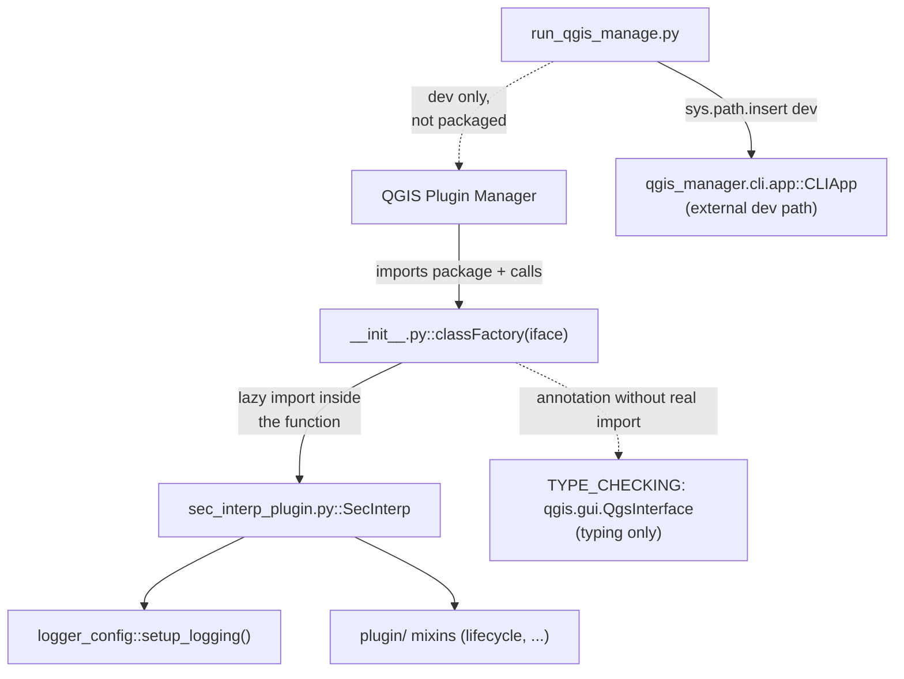

---
tags:
  - secinterp
  - code-walkthrough
  - root
  - package
aliases:
  - __init__.py
  - classFactory
  - run_qgis_manage.py
cssclass: secinterp-note
---

# Plugin root — `__init__.py` + `run_qgis_manage.py`

> [!abstract] One-line summary
> Package `root` (2 files): `__init__.py` exposes the QGIS-mandated `classFactory(iface)` with a lazy `SecInterp` import, and `run_qgis_manage.py` is a dev-only bootstrap for the `qgis-manage` CLI.

**Path**: `/` (root: 49 + 11 lines)
**Main symbol**: `classFactory`
**Layer**: Root / bootstrap (QGIS loading boundary)
**Tags**: #secinterp #root #package

---

## 🎯 Why does this group exist?

QGIS discovers the plugin by importing the root package and calling `classFactory`.
These two files cover production loading and development tooling:

| Problem | Solution |
|---------|----------|
| QGIS requires `classFactory(iface)` in the root package | `__init__.py` with a lazy `SecInterp` import |
| Annotate QGIS types without importing QGIS at load | `TYPE_CHECKING` + `QgsInterface` import for typing only |
| `qgis-manage` tooling lives outside the plugin | `run_qgis_manage.py` adjusts `sys.path` and launches `CLIApp` |

> [!important] Architectural note
> The root is **entry point only**: a 49-line loader + an 11-line dev script. All logic
> lives in [[sec_interp_plugin]] and [[plugin]]. The lazy import (`from
> .sec_interp_plugin import SecInterp` inside the function) keeps Qt/GUI unloaded until
> QGIS actually instantiates the plugin.

---

## 🧬 Relationship diagram



> [!tip] How to read
> Solid arrow = real call/import; dashed = typing or dev route. `run_qgis_manage.py`
> never touches the plugin: it is an external launcher.

---

## 📦 Imports — architectural reading

```python
# __init__.py
from __future__ import annotations

"""SecInterp QGIS Plugin.

This plugin provides tools for cross-section generation and geological interpretation
data extraction from QGIS layers.
"""

from typing import TYPE_CHECKING

if TYPE_CHECKING:
    from qgis.gui import QgsInterface
```

```python
# run_qgis_manage.py
"""Script to run qgis-manage CLI locally."""

import sys

sys.path.insert(0, "/home/jmbernales/qgispluginsdev/qgis-plugin-manager/src")

from qgis_manager.cli.app import CLIApp  # noqa: E402
```

| # | Observation |
|---|-------------|
| ① | `from __future__ import annotations` in `__init__.py`: annotations are never evaluated at runtime, consistent with `TYPE_CHECKING`. |
| ② | `if TYPE_CHECKING: from qgis.gui import QgsInterface` — QGIS exists for the type-checker only; importing `qgis.gui` at runtime while QGIS loads the plugin would be premature and heavy. |
| ③ | `run_qgis_manage.py` inserts an **absolute development path** into `sys.path`: an unmistakable mark of a local script, not shipped code. |
| ④ | `# noqa: E402` after the post-`sys.path.insert` import: declared silencing of E402 (non-top import). |
| ⑤ | Neither file imports `sec_interp.*` in its header: the root preloads nothing. |

---

## 🏗️ Structure inventory

**`__init__.py` (49 lines):**

- Plugin docstring + GPL / Plugin Builder header (lines 1–29, historical).
- `from typing import TYPE_CHECKING` + typing block (lines 30–33).
- `def classFactory(iface: QgsInterface)` → `SecInterp` (lines 36–49).

**`run_qgis_manage.py` (11 lines):**

- Docstring + `import sys` + `sys.path.insert(0, ...)` + `CLIApp` import + `if __name__ == "__main__"` block.

**Group symbol total: 1 public function (`classFactory`) + 0 classes.**

---

## 📁 Files in the package

| File | Lines | Role |
|---|--:|---|
| [[#__init__.py\|__init__.py]] | 49 | `classFactory(iface)`: QGIS entry point |
| [[#run_qgis_manage.py\|run_qgis_manage.py]] | 11 | Dev bootstrap for the `qgis-manage` CLI |

---

## 📖 File-by-file walkthrough

### `__init__.py`

Docstring and historical header (lines 1–29):

```python
"""SecInterp QGIS Plugin.

This plugin provides tools for cross-section generation and geological interpretation
data extraction from QGIS layers.
"""

# /***************************************************************************
#  SecInterp
#                                  A QGIS plugin
#  Data extraction for geological interpretation
#  Generated by Plugin Builder: http://g-sherman.github.io/Qgis-Plugin-Builder/.
#                              -------------------
#         begin                : 2025-11-15
#         copyright            : (C) 2025 by Juan M Bernales
#         email                : juanbernales@gmail.com
#         git sha              : $Format:%H$
#  ***************************************************************************/
#
# /***************************************************************************
#  *                                                                         *
#  *   This program is free software; you can redistribute it and/or modify  *
#  *   it under the terms of the GNU General Public License as published by  *
#  *   the Free Software Foundation; either version 2 of the License, or     *
#  *   (at your option) any later version.                                   *
#  *                                                                         *
#  ***************************************************************************/
```

Intact Plugin Builder template: start date, author, GPL license. Historical metadata
with no runtime effect, but QGIS and reviewers expect it at the root.

Typing block (lines 30–33):

```python
from typing import TYPE_CHECKING

if TYPE_CHECKING:
    from qgis.gui import QgsInterface
```

`QgsInterface` exists for static analysis only: `classFactory` can be annotated without
paying the cost (or risk) of importing `qgis.gui` while QGIS loads the plugin.

The factory (lines 36–49):

```python
# noinspection PyPep8Naming
def classFactory(iface: QgsInterface):  # pylint: disable=invalid-name
    """Load SecInterp class from file SecInterp.

    Args:
        iface: A QGIS interface instance.

    Returns:
        SecInterp: An instance of the plugin.

    """
    from .sec_interp_plugin import SecInterp

    return SecInterp(iface)
```

Three decisions in 6 effective lines:

| Decision | Detail |
|----------|--------|
| Non-PEP8 name kept | `classFactory` is the QGIS contract; `# noinspection` + `pylint: disable=invalid-name` shield it from the linter |
| Import **inside** the function | `SecInterp` (and with it Qt, GUI, core) loads only on instantiation, not on plugin discovery |
| Direct return | `SecInterp(iface)`: from here [[sec_interp_plugin]] takes over (`setup_logging` first) |

> [!tip] Why the lazy import matters
> QGIS imports every plugin package at startup to read its factory. A header import of
> `sec_interp_plugin` would drag `qgis.PyQt`, extractors and the dialog into every
> startup, even with the plugin disabled. Inside the function, the cost is only paid on
> activation.

### `run_qgis_manage.py`

```python
"""Script to run qgis-manage CLI locally."""

import sys

sys.path.insert(0, "/home/jmbernales/qgispluginsdev/qgis-plugin-manager/src")

from qgis_manager.cli.app import CLIApp  # noqa: E402

if __name__ == "__main__":
    app = CLIApp()
    sys.exit(app.run())
```

Local launcher for the external `qgis-manage` tool (deployment with multi-version
profile support, see `metadata.txt` v3.6.0):

| Line | Role |
|------|------|
| `sys.path.insert(0, ".../qgis-plugin-manager/src")` | Puts the tool's local checkout at the path head |
| `from qgis_manager.cli.app import CLIApp` | Imports the CLI app (after the path tweak, hence `noqa: E402`) |
| `app = CLIApp(); sys.exit(app.run())` | Runs and propagates the exit code |

> [!warning] Absolute dev-machine path
> The `sys.path` points at `/home/jmbernales/...`: it only works on the author's
> workstation. It is a personal convenience script, not portable infrastructure; it must
> never be imported or packaged (see `.qgisignore` and `make zip`).

---

## 🗂️ What lives at the root (and what does not)

| At the root | Why |
|-------------|-----|
| `__init__.py` | Required by QGIS (`classFactory`) |
| `sec_interp_plugin.py` | Plugin class (see [[sec_interp_plugin]]) |
| `logger_config.py` | Logging before everything (see [[logger_config]]) |
| `run_qgis_manage.py` | Dev only; excluded from the ZIP |
| `metadata.txt` | QGIS metadata (name, version 3.8.0, languages) |
| `icon.png` | Icon (disk + compiled in [[resources]]) |

| Outside the root | Where |
|------------------|-------|
| Lifecycle (`initGui`/`run`/`unload`) | `plugin/lifecycle.py` (see [[lifecycle]]) |
| Business logic | QGIS-agnostic `core/` (see [[core]]) |
| Dialog and adapters | `gui/` (see [[main_dialog]]) |
| Programmatic version/author | `core/utils/metadata_reader.py` reads `metadata.txt` (see [[metadata_reader]]) |

---

## 🏗️ `classFactory` in the QGIS ecosystem

QGIS treats `classFactory` as the single construction point. The full flow:

| Step | Actor | Detail |
|------|-------|--------|
| 1. Discovery | Plugin Manager | Imports every installed plugin's root package |
| 2. Resolution | `__init__.py` | Defines `classFactory` without loading Qt (lazy import) |
| 3. Activation | User or `qgis-manage` | QGIS calls `classFactory(iface)` with the interface |
| 4. Build | `classFactory` | `from .sec_interp_plugin import SecInterp; return SecInterp(iface)` |
| 5. Integration | QGIS | Calls `initGui()` (see [[lifecycle]]) for menu and toolbar |
| 6. Teardown | QGIS | Calls `unload()` on deactivation (see [[lifecycle]]) |

> [!note] The name is non-negotiable
> QGIS literally looks up `classFactory` in the package namespace. Renaming it to
> `class_factory` (PEP8) would break loading: hence `disable=invalid-name`.

---

## 📦 Packaging: what goes into the ZIP

`make zip` / `.qgisignore` decide what ships to the plugin repository. The root seen
from packaging:

| Root file | In ZIP | Reason |
|-----------|--------|--------|
| `__init__.py` | Yes | Mandatory QGIS gate |
| `sec_interp_plugin.py` | Yes | Plugin class |
| `logger_config.py` | Yes | Operational logging |
| `metadata.txt` | Yes | Read by the Plugin Manager |
| `icon.png` | Yes | Manager and menu icons |
| `run_qgis_manage.py` | No | Dev script with a local absolute path |
| `resources/symbology-style.db` | Per `.qgisignore` | Style sidecar |
| `logs/` | No | Generated at runtime by `setup_logging` |

> [!warning] `logs/` is born at destination
> The `log_dir.mkdir(exist_ok=True)` in [[logger_config]] creates `logs/` next to the
> **installed** plugin, not in the ZIP. On write-protected Windows profiles the plugin
> degrades to the QGIS panel only without breaking startup.

---

## 🔄 Data flow

| Phase | Input | Transformation | Output |
|-------|-------|----------------|--------|
| Discovery | QGIS imports the package | `__init__` defines `classFactory` (no Qt loaded) | factory available |
| Instantiation | `classFactory(iface)` | lazy import + `SecInterp(iface)` | built plugin |
| Startup | `SecInterp.__init__` | `setup_logging()` → services → dialog | operational plugin |
| Development | `python run_qgis_manage.py` | `sys.path` + `CLIApp().run()` | deploy to QGIS profile |

---

## 🏛️ Design patterns present

| Pattern | Where | Purpose |
|---------|-------|---------|
| **Factory function** | `classFactory` | QGIS-mandated creation contract |
| **Lazy import** | import inside `classFactory` | Cost-free QGIS startup |
| **TYPE_CHECKING guard** | `QgsInterface` | Typing without runtime dependency |
| **Launcher script** | `run_qgis_manage.py` | Dev bridge to an external tool |

---

## 🧾 API summary

| Symbol | Signature / Inherits | Typical use |
|--------|----------------------|-------------|
| `classFactory` | `(iface: QgsInterface) -> SecInterp` | Called by QGIS on plugin activation |
| `run_qgis_manage` | `__main__` script | `python run_qgis_manage.py` on the dev box |
| `CLIApp().run()` | `(external: qgis_manager)` | Deploy to QGIS profiles |

---

## 🛡️ Error handling

| Case | Behaviour |
|------|-----------|
| `SecInterp` import fails in `classFactory` | Exception propagates to QGIS: Plugin Manager flags the plugin broken (unmasked) |
| `qgis.gui` unimportable at runtime | Impossible by design: only imported under `TYPE_CHECKING` |
| Missing `qgis-plugin-manager` in dev | Immediate `ImportError` in the script (visible failure, local scope) |
| `CLIApp().run()` return code | `sys.exit(...)` propagates it to the shell |

> [!note] Deliberately no `try/except`
> Both files let errors propagate: in `classFactory` because QGIS must see the real
> failure, and in the script because the developer runs it in a terminal.

---

## 🧪 Associated tests

- `tests/test_translation_loading.py` — imports `SecInterp` from `sec_interp_plugin` (via `from sec_interp_plugin import SecInterp`) and instantiates the class `classFactory` would return, with a mocked `iface`: the closest coverage to the factory.
- No test invokes `classFactory` directly or runs `run_qgis_manage.py` (local script with an absolute path: untestable in CI by design).

> [!note] Honest gaps
> A pure `classFactory` test (mock `sec_interp_plugin.SecInterp`, assert it is built
> with the given `iface`) would be trivial and needs no QGIS. The dev script stays out
> of coverage intentionally.

---

## 👀 Observations and notes

> [!success] Strengths
> - Minimal gate: QGIS discovers the plugin without paying its cost until activation.
> - Typing without runtime dependency (`TYPE_CHECKING`).
> - Clean split: loader at root, logic in `plugin/` + `core/` + `gui/`.
> - Tamed linter (`noinspection` + `disable=invalid-name`) instead of renaming the contract.

> [!warning] Points of attention
> - `run_qgis_manage.py` with an absolute path: useless off the author's machine; document or parameterize via env.
> - The GPL/Plugin Builder header is historical: the unexpanded `git sha : $Format:%H$` shows it never goes through `git archive`.
> - `classFactory` with no direct test although trivial to cover.

> [!question] Open questions
> - Parameterize the `qgis-plugin-manager` path via environment variable with fallback?
> - Add `test_class_factory.py` mocking `SecInterp`?
> - Move `run_qgis_manage.py` to `scripts/` leaving only packagable files at root?

---

## 🔗 Related notes

- [[Index]] — vault index
- [[sec_interp_plugin]] — class built by `classFactory`
- [[plugin]] — mixin package with the real lifecycle
- [[lifecycle]] — `initGui`/`run`/`unload` QGIS calls after the factory
- [[logger_config]] — first step after instantiation (`setup_logging`)
- [[metadata_reader]] — programmatic access to `metadata.txt`
- [[controller]] — orchestrator wired by the plugin

---

*Note of the SecInterp Code Walkthrough v2 vault — v3.9.0*
