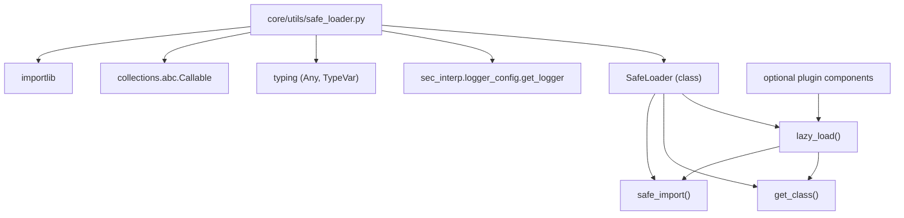

---
tags:
  - secinterp
  - code-walkthrough
  - core
  - utils
  - safe-loader
aliases:
  - safe_loader.py
  - SafeLoader
  - safe_import
  - lazy_load
cssclass: secinterp-note
---

# `core/utils/safe_loader.py`

> [!abstract] One-line summary
> Loads modules and classes **lazily and safely**, catching import/instantiation errors and returning `None` (or a *fallback*) so the plugin stays functional even when an optional component fails.

**Path**: `core/utils/safe_loader.py` (79 lines)
**Main class**: `SafeLoader`
**Layer**: Core · Utilities (QGIS-agnostic)
**Tags**: #secinterp #core #utils #safe-loader

---

## 🎯 Why does this file exist?

A plugin may depend on optional components (drivers, services, libraries) that are not
always available. A direct `import` that fails **crashes the whole plugin**. A way to
degrade gracefully is needed.

| Problem | Solution |
|---------|----------|
| An absent optional module crashes startup | `safe_import` catches the error and returns `None` |
| Instantiating a class may fail with arbitrary arguments | `lazy_load` isolates `__init__` and applies a `fallback_factory` |
| Composing import + getattr + instantiation in every caller | `SafeLoader` centralizes the three stages as `staticmethod`s |

> [!important] Architectural note — QGIS-agnostic and stateless
> It only imports `importlib`, `typing` and the project logger. It is a set of stateless
> `staticmethod`s: a minimal *service locator* pattern that enables lazy component
> loading (manual DI) without coupling QGIS.

---

## 🧬 Relationship diagram



> [!tip] How to read
> `lazy_load` composes `safe_import` and `get_class`, and adds protected
> instantiation. Consumers only call `lazy_load`; they do not touch `importlib` directly.

---

## 📦 Imports — architectural reading

```python
# core/utils/safe_loader.py
import importlib
from collections.abc import Callable
from typing import Any, TypeVar

from sec_interp.logger_config import get_logger

logger = get_logger(__name__)

T = TypeVar("T")
```

| # | Observation |
|---|-------------|
| ① | `importlib.import_module` is the standard API for dynamic loading by module name. |
| ② | `TypeVar("T")` types the generic return of `lazy_load` (instance of the loaded type or `None`). |
| ③ | `Callable[[], T]` types the `fallback_factory` (a no-arg factory). |
| ④ | `get_logger(__name__)` → centralized project logging. |
| ⑤ | **Zero QGIS/PyQt imports** ⇒ pure infrastructure utility. |

---

## 🏗️ Structure inventory

**Class (1):**

- `class SafeLoader` — three safe-loading `staticmethod`s.

**Static methods (3):**

- `safe_import(module_name, error_message=None) -> Any`
- `get_class(module, class_name) -> type | None`
- `lazy_load(module_name, class_name, fallback_factory=None, *args, **kwargs) -> T | None`

**Module-level (1):**

- `logger` and `T = TypeVar("T")`.

---

## 📁 Files in the package

`safe_loader.py` lives in `core/utils/`:

| File | Lines | Role |
|---|--:|---|
| [[safe_loader]] | 79 | Safe/lazy import loading |
| [[io]] | 101 | Vector writing |
| [[metadata_reader]] | 129 | Reads `metadata.txt` |
| [[parsing]] | 222 | Strike/dip parsing, azimuth, attributes |
| [[rendering]] | 129 | Bounds, coordinate transform, intervals |
| [[drillhole]] | 298 | Drillhole trajectory and projection |

> [!note] `safe_loader` and `metadata_reader` share logging infrastructure
> Both use `from sec_interp.logger_config import get_logger`; the other pure utilities
> do not log. See [[metadata_reader]].

---

## 📖 Method-by-method walkthrough

### `safe_import`

```python
@staticmethod
def safe_import(module_name: str, error_message: str | None = None) -> Any:
    try:
        return importlib.import_module(module_name)
    except (ImportError, Exception):
        msg = error_message or f"Failed to load optional module: {module_name}"
        logger.exception(msg)
        return None
```

Imports a module by name, logging the error instead of crashing. The message is
customizable; by default it says "optional module".

### `get_class`

```python
@staticmethod
def get_class(module: Any, class_name: str) -> type | None:
    if not module:
        return None
    return getattr(module, class_name, None)
```

Safe access to a class attribute: `getattr` with a `None` default avoids
`AttributeError`, and the `if not module` guard avoids operating on a `None` module (the
result of a failed `safe_import`).

### `lazy_load`

```python
@staticmethod
def lazy_load(
    module_name: str,
    class_name: str,
    fallback_factory: Callable[[], T] | None = None,
    *args: Any,
    **kwargs: Any,
) -> T | None:
    module = SafeLoader.safe_import(module_name)
    klass = SafeLoader.get_class(module, class_name)
    if klass:
        try:
            return klass(*args, **kwargs)
        except Exception:
            logger.exception(
                f"Failed to instantiate {class_name} from {module_name} "
                f"with args={args}, kwargs={kwargs}"
            )

    return fallback_factory() if fallback_factory else None
```

Orchestrates the three stages: import, get the class and instantiate. If **any** stage
fails, it returns the `fallback_factory`'s result (or `None`). Positional/keyword
arguments are forwarded to the class constructor.

> [!important] `fallback_factory` = injection of a substitute
> Allows degrading to a default implementation (a "no-op", an alternative class) when the
> real component is unavailable. A manual form of *dependency injection* with fallback.

---

## 🔄 Data flow

| Phase | Input | Transformation | Output |
|-------|-------|----------------|--------|
| Import | `module_name` | `importlib.import_module` | module or `None` |
| Resolution | `module`, `class_name` | `getattr(..., None)` | class or `None` |
| Instantiation | `klass`, `*args`, `**kwargs` | `klass(*args, **kwargs)` | instance or exception |
| Fallback | `fallback_factory` | `fallback_factory()` | substitute or `None` |

---

## 🏛️ Design patterns present

| Pattern | Where | Purpose |
|---------|-------|---------|
| **Null Object** | `None` return in all three methods | Represent "unavailable" without an exception |
| **Factory fallback** | `fallback_factory` in `lazy_load` | Replace the real component with a default one |
| **Service locator (minimal)** | `safe_import` by module name | Resolve components at runtime |
| **Static methods** | the whole `SafeLoader` class | Stateless utility functions |
| **Guard clause** | `if not module: return None` | Fail softly on an absent module |

---

## 🧾 API summary

| Symbol | Signature / Inherits | Typical use |
|--------|----------------------|-------------|
| `SafeLoader.safe_import` | `(module_name, error_message=None) -> Any` | Import an optional module without crashing |
| `SafeLoader.get_class` | `(module, class_name) -> type \| None` | Safely get a class from a module |
| `SafeLoader.lazy_load` | `(module_name, class_name, fallback_factory=None, *args, **kwargs) -> T \| None` | Load and instantiate with fallback |

---

## 🛡️ Error handling

The philosophy is **never propagate**: all errors are logged and `None` is returned.

| Case | Caught by | Result |
|------|-----------|--------|
| Non-existent module | `except (ImportError, Exception)` | `None` + `logger.exception` |
| Missing class | `getattr(..., None)` | `None` (no exception) |
| `__init__` fails | `except Exception` | `None` (or `fallback_factory()`) |

```python
except (ImportError, Exception):
    msg = error_message or f"Failed to load optional module: {module_name}"
    logger.exception(msg)
    return None
```

> [!warning] `except (ImportError, Exception)` is redundant
> `ImportError` is a subclass of `Exception`, so catching both is equivalent to catching
> only `Exception`. Not a bug, but a redundancy that can mislead the reader.

> [!tip] `logger.exception` records the full traceback
> Although the flow does not crash, the traceback stays in the log for diagnosis. It is
> the "degrade without silencing" balance.

---

## 🧪 Associated tests

`tests/core/utils/test_safe_loader_di.py` (Mock-first, no QGIS):

- `test_lazy_load_with_args` — `lazy_load("...test_safe_loader_di", "TestComponent", arg1="hello", arg2=123)` verifies arguments reach the constructor.
- `test_lazy_load_failure_returns_none` — non-existent module/class ⇒ `None`.

> [!note] Also covers granular `DataCache`
> The same file includes `TestDataCacheGranular` (per-bucket invalidation), because the
> test targets DI and cache granularity, not just `SafeLoader`.

---

## 👀 Observations and notes

> [!success] Strengths
> - Minimal, clear API (3 composable `staticmethod`s).
> - Graceful degradation: the plugin does not die from an optional component.
> - `fallback_factory` enables manual DI without a framework.

> [!warning] Points of attention
> - `except (ImportError, Exception)` is redundant.
> - The `Any` return in `safe_import` dilutes typing (could be `ModuleType | None`).
> - No timeout nor retry: a slow import blocks the calling thread.

> [!question] Open questions
> - Turn `lazy_load` into a reusable `@lazy` decorator?
> - Cache already-imported modules to avoid repeated `import_module`?
> - Type `safe_import` as `types.ModuleType | None`?

---

## 🔗 Related notes

- [[Index]] — vault index
- [[core_utils]] — the `core/utils/` package and its pure utilities
- [[metadata_reader]] — shares the `logger_config` logger
- [[controller]] — may use `lazy_load` for optional components
- [[io]] — vector writing that sometimes depends on lazily loaded components

---

*Note of the SecInterp Code Walkthrough v2 vault — v3.9.1*
