---
tags:
  - secinterp
  - code-walkthrough
  - plugin
  - lifecycle
aliases:
  - sec_interp_plugin.py
  - SecInterp
cssclass: secinterp-note
note_lines: 700
---

# `sec_interp_plugin.py`

> [!abstract] One-line summary
> `SecInterp` class: the QGIS plugin entry point composing four mixins (`TranslatableMixin`, lifecycle, validation, render), wiring services/extractors via `SafeLoader`, and loading the translation for the user locale.

**Path**: `sec_interp_plugin.py` (129 lines)
**Main class**: `SecInterp`
**Layer**: Plugin / GUI (QGIS boundary: `iface`, `QTranslator`, toolbar)
**Tags**: #secinterp #plugin #lifecycle

---

## 🎯 Why does this file exist?

QGIS instantiates the plugin through `classFactory(iface)` (see [[root]]) and expects a
class exposing `initGui`/`unload`. This module concentrates that boundary in a single thin
class that **orchestrates without computing**:

| Problem | Solution |
|---------|----------|
| QGIS requires `initGui`/`unload`/`run` on the plugin class | `SecInterp` + `PluginLifecycleMixin` (see [[lifecycle]]) |
| Importing all of QGIS at startup slows down and may break loading | `SafeLoader.lazy_load` / `safe_import` with graceful degradation |
| The dialog needs services already built (`PreviewManager`) | `__init__` prepares extractors → `controller` → dialog, in order |
| The UI must speak the user's language | `_load_translator()` with `.qm` + short-locale fallback |

> [!important] Architectural note
> `SecInterp` is **composition, not logic inheritance**: it inherits four mixins and
> delegates computation to the `controller` (core) and the dialog managers. It only
> extracts (`iface`, settings, locale) and connects. Extract-then-Compute at the boundary.

---

## 🧬 Relationship diagram

```mermaid
graph TD
    ROOT["__init__.py::classFactory(iface)"]
    SIP["sec_interp_plugin.py::SecInterp<br/>(TranslatableMixin + 3 mixins)"]
    TM["TranslatableMixin<br/>(core/utils/i18n)"]
    LCM["PluginLifecycleMixin<br/>(plugin/lifecycle)"]
    IVM["InputValidationMixin<br/>(plugin/input_validator)"]
    RPM["RenderPipelineMixin<br/>(plugin/render_pipeline)"]

    ROOT --> SIP
    SIP --> TM
    SIP --> LCM
    SIP --> IVM
    SIP --> RPM

    SIP --> SL["SafeLoader<br/>(core/utils/safe_loader)"]
    SIP --> LOG["setup_logging / get_logger<br/>(logger_config)"]

    SL -.->|"lazy_load"| PR["gui/preview_renderer::PreviewRenderer"]
    SL -.->|"lazy_load"| DF["gui/adapters/feature_fetcher::DataFetcher"]
    SL -.->|"lazy_load"| SE["gui/adapters/structure_extractor::StructureExtractor"]
    SL -.->|"lazy_load"| GE["gui/adapters/geology_extractor::GeologyExtractor"]
    SL -.->|"lazy_load"| PE["gui/adapters/profile_extractor::ProfileExtractor"]
    SL -.->|"lazy_load"| DE["gui/adapters/drillhole_extractor::DrillholeExtractor"]
    SL -.->|"lazy_load"| CT["core/controller::ProfileController"]
    SL -.->|"lazy_load"| LN["gui/layer_notification_manager::LayerNotificationManager"]
    SL -.->|"safe_import + get_class"| ES["core/services/export_service::ExportService"]
    SL -.->|"safe_import + get_class"| DLG["gui/main_dialog::SecInterpDialog"]

    CT --> DC["controller.data_cache"]
    LN -.->|"data_cache=..."| DC
    DLG -.->|"dlg.plugin_instance = self"| SIP
```



> [!tip] How to read
> Solid arrow = inheritance/direct import; dashed = lazy loading or injection.
> `SecInterp` never imports `gui.main_dialog` directly: always via `SafeLoader`.

---

## 📦 Imports — architectural reading

```python
# sec_interp_plugin.py
from __future__ import annotations

from pathlib import Path
from typing import Any

from qgis.PyQt.QtCore import (
    QCoreApplication,
    QSettings,
    QTranslator,
)

from sec_interp.core.utils.i18n import TranslatableMixin
from sec_interp.core.utils.safe_loader import SafeLoader
from sec_interp.logger_config import get_logger, setup_logging
from sec_interp.plugin import (
    InputValidationMixin,
    PluginLifecycleMixin,
    RenderPipelineMixin,
)
```

| # | Observation |
|---|-------------|
| ① | `qgis.PyQt.QtCore` (not `PyQt5` directly): the agnostic import required by the QGIS 4.x guide. |
| ② | Only three Qt symbols (`QCoreApplication`, `QSettings`, `QTranslator`): purely for translating the UI, never for logic. |
| ③ | `TranslatableMixin` comes from `core/utils/i18n`: `tr()` available without coupling to widgets. |
| ④ | `SafeLoader` is the only route to heavy GUI/core code: not one direct import of `gui.*` or `core.controller` in the header. |
| ⑤ | `setup_logging` runs first in `__init__`; `get_logger(__name__)` provides the module logger. |
| ⑥ | The three `sec_interp.plugin` mixins contribute `initGui`/`run`/`unload`, validation and rendering without fattening this class. |

---

## 🏗️ Structure inventory

**Classes (1):**

- `class SecInterp(TranslatableMixin, PluginLifecycleMixin, InputValidationMixin, RenderPipelineMixin)` — QGIS plugin implementation.

**Own methods (3):**

- `__init__(self, iface: Any) -> None` — logging, locale, service/dialog wiring, menu/toolbar.
- `_load_translator(self) -> None` — installs the best-matching `.qm` for the locale.
- `save_profile_line(self) -> None` — delegates to `dlg.export_manager.export_data()`.

**Inherited methods (mixins, see [[lifecycle]] and [[plugin]]):**

- `PluginLifecycleMixin`: `add_action(...)`, `initGui()`, `run()`, `process_data(inputs=None)`, `unload()`, `disconnect_signals()`, `_disconnect_actions()`, `_disconnect_dialog()`.
- `InputValidationMixin`: `_get_and_validate_inputs() -> PreviewParams | None`.
- `RenderPipelineMixin`: `draw_preview(topo_data, geol_data, struct_data, drillhole_data, ...)`.
- `TranslatableMixin`: `tr(...)` for translatable strings.

**Instance attributes:**

- `iface`, `plugin_dir: Path`, `translator` (if a `.qm` matched), `preview_renderer`, `controller`, `layer_notification_manager`, `export_service`, `dlg`, `first_start`, `actions: list`, `menu: str`, `toolbar`.

---

## 📁 Files in the package

The module lives at the **root**, between the QGIS loader and the mixin package:

| File | Lines | Role |
|---|--:|---|
| `__init__.py` | 49 | `classFactory(iface)` → `SecInterp(iface)` |
| [[sec_interp_plugin]] | 129 | `SecInterp` class (this note) |
| [[plugin]] | 9 | `plugin/` package: re-exports the 3 mixins |
| [[lifecycle]] | 167 | `PluginLifecycleMixin`: `initGui`/`run`/`unload` |
| [[input_validator]] | — | `InputValidationMixin`: input validation |
| [[render_pipeline]] | — | `RenderPipelineMixin`: preview drawing |
| [[logger_config]] | 220 | `setup_logging()` called at startup |

---

## 📖 Method-by-method walkthrough

### `__init__` — ordered plugin wiring

```python
def __init__(self, iface: Any) -> None:
    setup_logging()

    self.iface = iface
    self.plugin_dir = Path(__file__).resolve().parent
    self._load_translator()

    # Prepare core services BEFORE the dialog (required by PreviewManager)
    self.preview_renderer = SafeLoader.lazy_load(
        "sec_interp.gui.preview_renderer", "PreviewRenderer"
    )
    data_fetcher = SafeLoader.lazy_load(
        "sec_interp.gui.adapters.feature_fetcher", "DataFetcher"
    )
    structure_extractor = SafeLoader.lazy_load(
        "sec_interp.gui.adapters.structure_extractor", "StructureExtractor"
    )
    geology_extractor = SafeLoader.lazy_load(
        "sec_interp.gui.adapters.geology_extractor", "GeologyExtractor"
    )
    profile_extractor = SafeLoader.lazy_load(
        "sec_interp.gui.adapters.profile_extractor", "ProfileExtractor"
    )
    drillhole_extractor = SafeLoader.lazy_load(
        "sec_interp.gui.adapters.drillhole_extractor",
        "DrillholeExtractor",
        data_fetcher=data_fetcher,
    )
    self.controller = SafeLoader.lazy_load(
        "sec_interp.core.controller",
        "ProfileController",
        data_fetcher=data_fetcher,
        structure_extractor=structure_extractor,
        geology_extractor=geology_extractor,
        profile_extractor=profile_extractor,
        drillhole_extractor=drillhole_extractor,
    )

    self.layer_notification_manager = SafeLoader.lazy_load(
        "sec_interp.gui.layer_notification_manager",
        "LayerNotificationManager",
        data_cache=self.controller.data_cache,
    )

    export_mod = SafeLoader.safe_import("sec_interp.core.services.export_service")
    export_klass = SafeLoader.get_class(export_mod, "ExportService")
    self.export_service = export_klass(self.controller) if export_klass else None

    dialog_mod = SafeLoader.safe_import("sec_interp.gui.main_dialog")
    dialog_klass = SafeLoader.get_class(dialog_mod, "SecInterpDialog")
    self.dlg = dialog_klass(self.iface, self) if dialog_klass else None

    if self.dlg:
        self.dlg.plugin_instance = self
    else:
        logger.error("Failed to initialize main dialog. Plugin functionality will be limited.")

    self.first_start = True

    self.actions = []
    self.menu = self.tr("&Sec Interp")
    self.toolbar = self.iface.addToolBar(self.tr("Sec Interp"))
    self.toolbar.setObjectName("SecInterp")
    self.toolbar.setVisible(True)
```

The order is an **explicit dependency graph**:

| Step | What is built | Depends on |
|------|---------------|------------|
| 1 | `setup_logging()` | nothing (always first) |
| 2 | `plugin_dir`, translator | `__file__`, `QSettings` |
| 3 | `preview_renderer` | `SafeLoader` |
| 4 | `data_fetcher`, `structure/geology/profile_extractor` | `SafeLoader` |
| 5 | `drillhole_extractor` | `data_fetcher` (injection) |
| 6 | `controller` (`ProfileController`) | the 5 extractors (DI) |
| 7 | `layer_notification_manager` | `controller.data_cache` |
| 8 | `export_service` | `controller` (or `None` on failure) |
| 9 | `dlg` (`SecInterpDialog`) | `iface` + `self` (or `None` on failure) |
| 10 | menu + toolbar | `iface`, `tr()` |

> [!note] Graceful degradation, not a crash
> If the dialog or the exporter fail to load, the plugin **stays alive** with `None` and
> a `logger.error` instead of breaking all of QGIS. `run()` (in [[lifecycle]]) shows a
> critical `QMessageBox` when `self.dlg` is `None`. See [[safe_loader]].

### `_load_translator` — locale with fallback

```python
def _load_translator(self) -> None:
    """Install the best matching translation file for the user locale."""
    user_locale = QSettings().value("locale/userLocale", "en")
    locale_path = self.plugin_dir / f"i18n/SecInterp_{user_locale}.qm"

    MIN_LOCALE_LENGTH = 2
    if not locale_path.exists() and user_locale and len(user_locale) > MIN_LOCALE_LENGTH:
        locale_short = user_locale[0:2]
        locale_path = self.plugin_dir / f"i18n/SecInterp_{locale_short}.qm"

    if locale_path.exists():
        self.translator = QTranslator()
        self.translator.load(str(locale_path))
        QCoreApplication.installTranslator(self.translator)
```

1. Reads `locale/userLocale` from `QSettings` (e.g. `es`, `pt_BR`); default `"en"`.
2. Looks for `i18n/SecInterp_<locale>.qm` next to the plugin.
3. If missing and the locale is longer than 2 letters, retries with the first 2 (`pt_BR` → `pt`).
4. Only if the file exists, creates a `QTranslator`, loads it and installs it on the app.

> [!tip] No `.qm`, no problem
> With no matching file (e.g. `en`, untranslated), no translator is installed and the UI
> stays in the base language. `self.translator` only exists on a match: the attribute is
> conditional by design.

### `save_profile_line` — delegation to the dialog

```python
def save_profile_line(self) -> None:
    """Save profile data by delegating to the dialog's export manager."""
    if hasattr(self, "dlg") and self.dlg:
        self.dlg.export_manager.export_data()
```

A thin bridge to `dialog_export_manager` (see [[dialog_export_manager]]): the plugin does
not know how to export, it only forwards. The `hasattr + truthiness` guard covers the
degraded case (`dlg is None`).

---

## 🔄 Full startup sequence

| Phase | Actor | Action |
|-------|-------|--------|
| QGIS load | `__init__.py::classFactory` | `from .sec_interp_plugin import SecInterp; return SecInterp(iface)` |
| `__init__` | this class | logging → locale → extractors → controller → managers → dialog → menu/toolbar |
| `initGui` | [[lifecycle]] | `add_action(icon.png, "Geological data extraction", self.run)` |
| `run` | [[lifecycle]] | first run: wires `preview_renderer.canvas` and `dlg.accepted → process_data`; shows the dialog |
| `process_data` | [[lifecycle]] | `dlg.preview_manager.generate_preview()` → `(topo, geol, struct)` |
| `unload` | [[lifecycle]] | disconnects signals, cleans renderer, removes menu/toolbar |

---

## 🔀 Lazy loading with `SafeLoader`

| Call | Target module | Injected arguments |
|------|---------------|-------------------|
| `lazy_load` | `gui.preview_renderer.PreviewRenderer` | — |
| `lazy_load` | `gui.adapters.feature_fetcher.DataFetcher` | — |
| `lazy_load` | `gui.adapters.structure_extractor.StructureExtractor` | — |
| `lazy_load` | `gui.adapters.geology_extractor.GeologyExtractor` | — |
| `lazy_load` | `gui.adapters.profile_extractor.ProfileExtractor` | — |
| `lazy_load` | `gui.adapters.drillhole_extractor.DrillholeExtractor` | `data_fetcher=...` |
| `lazy_load` | `core.controller.ProfileController` | 5 extractors (DI) |
| `lazy_load` | `gui.layer_notification_manager.LayerNotificationManager` | `data_cache=controller.data_cache` |
| `safe_import` + `get_class` | `core.services.export_service.ExportService` | `controller` at instantiation |
| `safe_import` + `get_class` | `gui.main_dialog.SecInterpDialog` | `(iface, self)` at instantiation |

> [!note] Two flavours of loading
> `lazy_load(mod, cls, **kwargs)` imports **and instantiates** in one go (DI services);
> `safe_import` + `get_class` separate importing from instantiating so the `None` case is
> decided with an explicit `if` (exporter and dialog). See [[safe_loader]].

---

## 🌐 Translations: how the locale flows

| Element | Detail |
|---------|--------|
| Locale source | `QSettings().value("locale/userLocale", "en")` |
| Catalogue | `i18n/SecInterp_<locale>.qm` (14 languages per `metadata.txt`) |
| Fallback | long locale → 2 letters (`pt_BR` → `pt`) → no translator (base English) |
| Install | `QCoreApplication.installTranslator(self.translator)` |
| Strings translated here | `self.tr("&Sec Interp")`, `self.tr("Sec Interp")` (via `TranslatableMixin`) |
| Test | `tests/test_translation_loading.py::test_translation_loads_es` (mocks `QSettings`, `QTranslator`, `installTranslator`) |

---

## 🔄 Data flow

| Phase | Input | Transformation | Output |
|-------|-------|----------------|--------|
| Construction | `iface` (QGIS) | `setup_logging` + DI wiring | `SecInterp` with ready services |
| Translation | `locale/userLocale` | `.qm` + short fallback | translator installed (or nothing) |
| GUI | `initGui()` | `add_action(icon.png → run)` | menu entry + toolbar icon |
| Run | `run()` | modal dialog + `accepted → process_data` | `(topo, geol, struct)` or `None` |
| Save | `save_profile_line()` | delegation | `export_manager.export_data()` |
| Unload | `unload()` | disconnect + removal | clean QGIS, no orphan actions |

---

## 🏛️ Design patterns present

| Pattern | Where | Purpose |
|---------|-------|---------|
| **Mixin composition** | 4 base classes | Separate lifecycle, validation, render and `tr()` |
| **Dependency Injection** | extractors → `controller` | `ProfileController` receives collaborators, never creates them |
| **Lazy loading** | `SafeLoader` | Fast, failure-tolerant startup |
| **Null-object-ish** | `export_service`/`dlg` as `None` | Degradation without exceptions |
| **Template (hook)** | `run`/`process_data` in mixin | Dialog hooks `accepted` exactly once (`first_start`) |

---

## 🧾 API summary

| Symbol | Signature / Inherits | Typical use |
|--------|----------------------|-------------|
| `SecInterp` | `(TranslatableMixin, PluginLifecycleMixin, InputValidationMixin, RenderPipelineMixin)` | Instantiated by `classFactory` |
| `__init__` | `(iface: Any) -> None` | Full plugin wiring |
| `_load_translator` | `() -> None` | Installs the best available `.qm` |
| `save_profile_line` | `() -> None` | Delegates to `export_manager.export_data()` |
| `initGui` / `run` / `unload` | inherited from `PluginLifecycleMixin` | QGIS lifecycle |
| `process_data` | `(inputs=None) -> tuple \| None` | `(topo, geol, struct)` via preview manager |

---

## 🛡️ Error handling

| Case | Behaviour |
|------|-----------|
| Dialog import fails | `dlg = None` + `logger.error`; `run()` shows a critical `QMessageBox` |
| Exporter fails | `export_service = None`; the rest of the plugin works |
| No `.qm` for the locale | No translator; base-language UI, no error |
| Partial failures in `unload` | `contextlib.suppress(Exception)` per block (see [[lifecycle]]) |
| Logging not initialized | Impossible: `setup_logging()` is the first line of `__init__` |

---

## 🧪 Associated tests

- `tests/test_translation_loading.py::TestTranslationLoading::test_translation_loads_es` — instantiates `SecInterp` with a mocked `iface` and patched `SecInterpDialog`/`PreviewRenderer`/`ProfileController`/`ExportService`; verifies the translator loads for locale `"es"` (mocked `QTranslator`, `installTranslator`, patched `Path.exists`).
- `tests/gui/test_main_dialog_*.py` suites — exercise the `dlg` this class builds (core, signals, settings, validation, tools).
- `tests/core/test_controller_orchestration.py`, `tests/core/test_controller_di.py` — cover the `ProfileController` injected here with its extractors.

> [!note] Mock-first strategy
> The translation test never touches real QGIS: `iface` is a `MagicMock` and heavy
> classes are patched, so the full `__init__` runs in CI with no QGIS installed.

---

## 👀 Observations and notes

> [!success] Strengths
> - Thin class: 129 lines that only compose; logic lives in mixins, controller and managers.
> - Failure-tolerant startup: no broken import takes QGIS down.
> - Correct build order: services before the dialog consuming them.
> - Translation with fallback and a dedicated test (`test_translation_loads_es`).

> [!warning] Points of attention
> - `self.translator` is conditional: accessing it unchecked may raise `AttributeError` (nobody does today outside this method).
> - `MIN_LOCALE_LENGTH = 2` is an UPPER_CASE local inside the method; not configurable.
> - `save_profile_line` assumes `export_manager` on the dialog without checking (only `dlg` is checked).
> - The `toolbar` is created in `__init__`, not `initGui`: unusual against the classic Plugin Builder pattern.

> [!question] Open questions
> - Move toolbar creation into `initGui` to follow the standard lifecycle?
> - Default `self.translator = None` to make the no-`.qm` case explicit?
> - Check `export_manager` in `save_profile_line` for the degraded mode?

---

## 🔗 Related notes

- [[Index]] — vault index
- [[root]] — `classFactory` instantiating this class
- [[lifecycle]] — `initGui`/`run`/`unload` inherited from `PluginLifecycleMixin`
- [[plugin]] — package grouping the three mixins
- [[main_dialog]] — `SecInterpDialog` built here via `SafeLoader`
- [[controller]] — `ProfileController` injected with the five extractors
- [[metadata_reader]] — reads `metadata.txt` (name, version) shown in the UI

---

*Note of the SecInterp Code Walkthrough v2 vault — v3.9.0*
