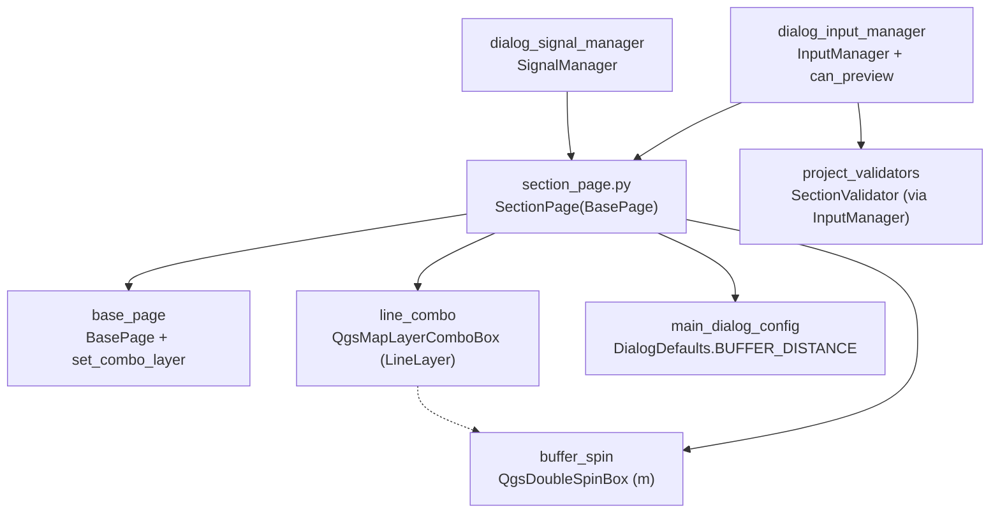

---
tags:
  - secinterp
  - code-walkthrough
  - gui
  - pages
aliases:
  - section_page.py
  - SectionPage
cssclass: secinterp-note
---

# `gui/ui/pages/section_page.py`

> [!abstract] One-line summary
> Section-line page: linear-layer combo with modern/classic filter, status indicator, and buffer distance for including nearby structures, with mandatory `validate` and a direct `is_complete`.

**Path**: `gui/ui/pages/section_page.py` (117 lines)
**Main class**: `SectionPage(BasePage)`
**Layer**: GUI (programmatic presentation · minimal Extract)
**Tags**: #secinterp #gui #pages

---

## 🎯 Why does this file exist?

The section line defines the cut: sample points, azimuth, and the projection of
structures and drillholes all derive from its geometry. With no line no profile is
possible, so this page is — together with [[dem_page]] — one of the two mandatory
preview gates.

| Problem | Solution |
|---------|----------|
| Users must choose which project line defines the cut | `line_combo` filtered to line layers, empty allowed |
| Nearby but non-intersecting structures should enter the section | `buffer_spin` (0–10000 m, default 100) for the inclusion area |
| The dialog must block previewing without a line | `validate()` requires a layer + direct `is_complete()` |

> [!important] Architectural note
> Minimal Extract with one quirk: `is_complete()` tests `bool(currentLayer())`
> **without** going through `ProjectValidator` (the only page not using it).
> Business validation of the line lives in `SectionValidator` via
> [[dialog_input_manager]].

---

## 🧬 Relationship diagram



> [!tip] How to read
> Solid arrow = imports/delegates; dashed = the buffer only matters with a chosen line.

---

## 📦 Imports — architectural reading

```python
# gui/ui/pages/section_page.py
from __future__ import annotations

import contextlib
from typing import Any

from qgis.core import QgsMapLayerProxyModel
from qgis.gui import QgsDoubleSpinBox, QgsMapLayerComboBox
from qgis.PyQt.QtCore import QCoreApplication
from qgis.PyQt.QtWidgets import QGridLayout, QLabel

from sec_interp.gui.main_dialog_config import DialogDefaults

from .base_page import BasePage, set_combo_layer
```

| # | Observation |
|---|-------------|
| ① | `QgsMapLayerProxyModel` as the line-filter fallback (same idiom as [[geology_page]] and [[structure_page]]). |
| ② | `QgsDoubleSpinBox` with an `" m"` suffix: the buffer is always expressed in project metres. |
| ③ | No `ProjectValidator`, no `ValidationParams`, no `resolve_layer_metadata`: the only page without validation-core imports. |
| ④ | `DialogDefaults.BUFFER_DISTANCE` (100) as the buffer default: the page does not hardcode the `reset` 100… except in `_setup_ui` (see observations). |
| ⑤ | `contextlib` only for `disconnect_signals`: there is no `connect_signals` to revert (inherits the base `pass`). |

---

## 🏗️ Structure inventory

**`SectionPage(BasePage)` class** — `layer_keys = frozenset({"section_layer"})`:

- `__init__(self, parent: Any = None) -> None`
- `_setup_ui(self) -> None` — 2-row grid (line + buffer)
- `get_data(self) -> dict[str, Any]` — `crossline_layer / buffer_distance`
- `dump(self) -> dict[str, Any]` — `section_layer / buffer_dist`
- `load(self, data: dict[str, Any]) -> None`
- `reset(self) -> None`
- `validate(self) -> tuple[bool, str]` — line mandatory
- `is_complete(self) -> bool` — direct `bool(currentLayer())`
- `disconnect_signals(self) -> None` (no custom `connect_signals`)

**Widgets:**

| Widget | Type | Role |
|--------|------|------|
| `line_combo` | `QgsMapLayerComboBox` | Section line (`LineLayer` filter, empty allowed) |
| `lbl_section_status` | `QLabel` 16×16 | Status indicator (managed from outside) |
| `buffer_spin` | `QgsDoubleSpinBox` 0–10000, `" m"` suffix | Structure-inclusion distance |
| `group_layout` | `QGridLayout` (spacing 6) | 2-row grid |

---

## 📖 Method-by-method walkthrough

### `__init__` — cut-line title

```python
def __init__(self, parent: Any = None) -> None:
    super().__init__(QCoreApplication.translate("SectionPage", "Cross Section Line"), parent)
```

No `iface`, no state: the buffer and the line live in the `_setup_ui` widgets.

### `_setup_ui` — line filter and suffixed buffer

```python
def _setup_ui(self) -> None:
    super()._setup_ui()

    self.group_layout = QGridLayout(self.group_box)
    self.group_layout.setSpacing(6)

    # Row 0: Section Line Layer
    self.group_layout.addWidget(QLabel(self.tr("Section Line *")), 0, 0)

    self.line_combo = QgsMapLayerComboBox()

    # Use modern flags if available (QGIS 3.32+)
    try:
        from qgis.core import Qgis  # noqa: PLC0415

        self.line_combo.setFilters(Qgis.LayerFilters(Qgis.LayerFilter.LineLayer))
    except (ImportError, AttributeError, TypeError):
        self.line_combo.setFilters(QgsMapLayerProxyModel.Filter.LineLayer)

    self.line_combo.setAllowEmptyLayer(True)
    # ... tooltip, index 0, 16x16 lbl_section_status ...

    # Row 1: Buffer Distance
    self.group_layout.addWidget(QLabel(self.tr("Buffer Dist. (m)")), 1, 0)

    self.buffer_spin = QgsDoubleSpinBox()
    self.buffer_spin.setRange(0.0, 10000.0)
    self.buffer_spin.setValue(100.0)  # Default
    self.buffer_spin.setSuffix(self.tr(" m"))
    # ... tooltip "Distance to include structures around the section line" ...
```

The asterisk in `"Section Line *"` marks the mandatory field (same convention as
`"Raster Layer *"` in [[dem_page]]). The buffer starts at a hardcoded `100.0`
with a `# Default` comment, while `reset()` uses `DialogDefaults.BUFFER_DISTANCE`
(also 100): a duplication to unify (see observations). The translatable `" m"`
suffix rides along inside the spin.

### `get_data` — two keys

```python
def get_data(self) -> dict[str, Any]:
    return {
        "crossline_layer": self.line_combo.currentLayer(),
        "buffer_distance": self.buffer_spin.value(),
    }
```

The smallest `get_data` alongside [[geology_page]]. `InputManager` maps it to the
`ValidationParams` `line_layer` (detached to `LayerMetadata`) and `buffer_dist`.

### `dump` / `load` — `crossline_`/`buffer_distance` → `section_`/`buffer_dist`

```python
def dump(self) -> dict[str, Any]:
    return {
        "section_layer": self.line_combo.currentLayer(),
        "buffer_dist": self.buffer_spin.value(),
    }

def load(self, data: dict[str, Any]) -> None:
    if "section_layer" in data and data["section_layer"] is not None:
        set_combo_layer(self.line_combo, data["section_layer"])
    buffer_dist = data.get("buffer_dist")
    if buffer_dist is not None:
        self.buffer_spin.setValue(float(buffer_dist))
```

`load` uses a double guard (`in` + `is not None`) for the layer — the most
defensive style among pages — and a plain `.get()` for the buffer. It propagates
to no field combo (there is none): restoring just pins two widgets.

### `reset` — empty line, default buffer

```python
def reset(self) -> None:
    self.line_combo.setLayer(None)
    self.buffer_spin.setValue(float(DialogDefaults.BUFFER_DISTANCE))
```

Empties the line and restores the centralised buffer default. `DialogDefaults` is
used here (unlike the `100.0` in `_setup_ui`).

### `validate` / `is_complete` — double gate, one without core

```python
def validate(self) -> tuple[bool, str]:
    if not self.line_combo.currentLayer():
        return False, self.tr("Section line layer is required")
    return True, ""

def is_complete(self) -> bool:
    """Check if required fields are filled."""
    return bool(self.line_combo.currentLayer())
```

`validate` (Level 1, i18n message) feeds `InputManager.rules["section"]`, and
`can_preview()` requires `dem + section`: no line means no preview or export.
`is_complete` is a direct `bool()` with no `ProjectValidator`: enough, because the
line has no associated fields to keep coherent (contrast geology or structure,
where layer and field must match).

### `disconnect_signals` — no `connect` to revert

```python
def disconnect_signals(self) -> None:
    """Disconnect all signals to prevent memory leaks."""
    with contextlib.suppress(TypeError, RuntimeError):
        self.line_combo.layerChanged.disconnect()
```

The only page without a custom `connect_signals`: it connects nothing internally
(not even `layerChanged → dataChanged`, since it declares no `dataChanged`). The
argument-less disconnect cuts whatever external connections `SignalManager` made
on `layerChanged`. It inherits the empty `connect_signals` from the base.

---

## 🗂️ Read keys vs session keys

| Source | Line | Buffer |
|--------|------|--------|
| `get_data` | `crossline_layer` (live) | `buffer_distance` |
| `dump` / `load` | `section_layer` | `buffer_dist` |
| `layer_keys` | `{"section_layer"}` | — (primitive) |
| `InputManager` | `line_layer` (`LayerMetadata`) | `buffer_dist` |

The buffer travels under different read (`buffer_distance`) and session
(`buffer_dist`) names: the mapping lives in `InputManager.get_all_values()` and
`get_validation_params()`, not in the page.

---

## 🧩 Dialog lifecycle

| Moment | Who | What it does with the page |
|--------|-----|----------------------------|
| Construction | [[main_window]] / dialog | `SectionPage()` in the `QStackedWidget`, "Section Line" entry in [[sidebar]] |
| Wiring | `SignalManager` | subscribes `line_combo.layerChanged` from outside (the page never self-wires) |
| Editing | user | line or buffer change → dialog revalidates preview/export |
| Preview | `InputManager.can_preview` | requires `section` (line) plus `dem` |
| Full validation | `validate_inputs` | `line_layer/buffer_dist` to the core `SectionValidator` |
| Session | persistence | `dump()` stores `section_layer/buffer_dist`; doubly-guarded `load()` |
| Teardown | `SignalManager` | `disconnect_signals()` cuts `layerChanged` |

---

## 🔄 Data flow

| Phase | Input | Transformation | Output |
|-------|-------|----------------|--------|
| Selection | QGIS project | line filter + empty allowed | `line_combo.currentLayer()` |
| Buffer | user | 0–10000 m spin | `buffer_spin.value()` |
| Reading | widgets | `get_data()` | `crossline_layer/buffer_distance` |
| Gate | live layer | `validate` + `bool()` | preview/export allowed or not |
| Business | detached `line_layer` | `SectionValidator` via `InputManager` | geometry/type errors |
| Persistence | widgets | `dump()` | `section_layer/buffer_dist` |
| Restoration | dict + resolved layer | `set_combo_layer` + `setValue` | restored widgets |

---

## 🏛️ Design patterns present

| Pattern | Where | Purpose |
|---------|-------|---------|
| **Gate** | `validate` + `can_preview` | No line means no preview or export |
| **Compat / fallback** | modern → classic filter | QGIS < 3.32 without forking |
| **Defensive load** | double `in` + `is not None` guard | Partial sessions never break |
| **Explicit unit** | `" m"` suffix + `"(m)"` label | Buffer always in metres |

---

## 🧾 API summary

| Symbol | Signature / Inherits | Typical use |
|--------|----------------------|-------------|
| `SectionPage` | `(BasePage)` | "Section Line" tab of the `QStackedWidget` |
| No `dataChanged` | — | dialog subscribes `line_combo` from outside |
| `layer_keys` | `frozenset({"section_layer"})` | persistence namespace |
| `get_data` | `crossline_layer/buffer_distance` | reading for `InputManager` |
| `dump` | `section_layer/buffer_dist` | session |
| `validate/is_complete` | mandatory line / `bool()` | preview gate |

---

## 🛡️ Error handling

- No line: `validate` → `(False, "Section line layer is required")`; `can_preview()` and `can_export()` are `False`; the buffer is irrelevant.
- `load` without `section_layer` (no key or null value): never touches the combo; without `buffer_dist`: keeps the current one.
- `buffer_spin` clamped to 0–10000: no negative or absurd buffers.
- Argument-less `disconnect()` under `suppress`: cuts unknown external connections.

---

## 🧪 Associated tests

No dedicated `tests/gui/test_section_page.py` exists; coverage is indirect:

- `tests/gui/test_dialog_input_manager.py` — `get_validation_params()` includes `line_layer/buffer_dist`; `section` rule and `can_preview()` (`dem + section`).
- `tests/gui/test_main_dialog_validation_manager.py` — `"Cross-section line layer is required"` message.
- `tests/gui/test_main_dialog_core.py` — dialog construction with the section page.
- `tests/gui/test_multi_session_persistence.py` — round-trip with `section_layer/buffer_dist`.
- `tests/gui/test_signal_restoration.py` — external `line_combo` connections survive rewires.

| Aspect to test | Status |
|----------------|--------|
| `get_data/dump/load/reset` | no dedicated test; covered via dialog |
| `validate` without line | covered via the input-manager `section` rule |
| Direct `is_complete` (no core) | no test pinning the `bool()` as contract |
| Classic-filter fallback | untested (as in [[geology_page]]) |
| Translatable `" m"` suffix | untested; low-risk visual formatting |

---

## 🌐 i18n and migration notes

- Labels with `self.tr("Section Line *"/"Buffer Dist. (m)")`, suffix `self.tr(" m")` and tooltips; `"SectionPage"`-context title.
- The `*` mandatory marker travels inside `tr`: translators choose their local convention.
- Same modern/classic filter as geology and structure: a consistent trio for QGIS 4.x.

---

## 👀 Observations and notes

> [!success] Strengths
> - The dialog's clearest gate: two 2-line methods (`validate`, `is_complete`) decide preview and export.
> - Doubly-guarded `load`: the most defensive among simple pages.
> - No own `dataChanged` and no self-wiring: the most predictable page; all wiring is external and visible.

> [!warning] Points of attention
> - Hardcoded `100.0` in `_setup_ui` versus `DialogDefaults.BUFFER_DISTANCE` in `reset`: if the default changes, construction and reset diverge.
> - `is_complete` without `ProjectValidator`: coherent today (no fields to match), but a pattern divergence if the line gains options.
> - No `connect_signals`: `SignalManager` must remember to wire `line_combo` externally, or line changes refresh nothing.
> - No dedicated test: the `crossline_layer/section_layer/buffer_dist` renaming is only pinned by dialog tests.

> [!question] Open questions
> - Unify the `_setup_ui` `100.0` to `float(DialogDefaults.BUFFER_DISTANCE)`?
> - Route `is_complete` through `ProjectValidator` (e.g. `is_section_complete`) for uniformity, even though it is a `bool()` today?
> - Add `tests/gui/test_section_page.py` mirroring `test_dem_page.py`?
> - Declare `dataChanged` and self-wire like sibling pages, or document that external wiring is intentional?

---

## 🔗 Related notes

- [[Index]] — vault index
- [[base_page]] — protocol and `set_combo_layer`
- [[gui_ui_pages]] — pages package
- [[main_window]] — "Section Line" tab of the `QStackedWidget`
- [[sidebar]] — "Section Line" entry (`mIconLineLayer.svg`)
- [[dialog_input_manager]] — `section` rules, `can_preview`, `can_export`
- [[project_validator]] — `validate_all` includes the `SectionValidator`
- [[project_validators]] — `SectionValidator` (line geometry and type)
- [[dem_page]] — the other mandatory preview gate
- [[structure_page]] — consumes `buffer_dist` when projecting nearby structures
- [[geology_page]] — sibling page with the same modern/classic filter

---

*Note of the SecInterp Code Walkthrough v2 vault — v3.9.0*
