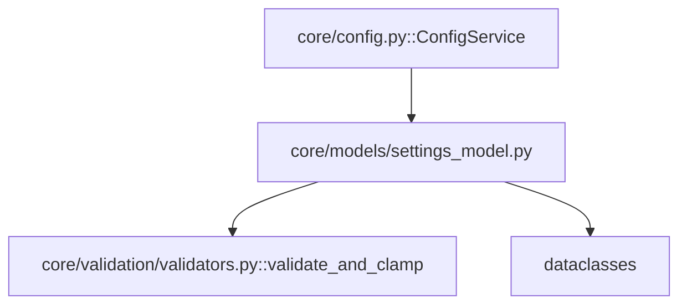

---
tags:
  - secinterp
  - code-walkthrough
  - core
  - models
aliases:
  - settings_model.py
  - PluginSettings
  - SectionSettings
  - DemSettings
  - ExportSettings
cssclass: secinterp-note
---

# `core/models/settings_model.py`

> [!abstract] One-line summary
> Defines the plugin's **validated configuration dataclasses**: 8 per-page sub-models (`Section`, `Dem`, `Geology`, `Structure`, `Drillhole`, `Interpretation`, `Preview`, `Export`) grouped under the root container `PluginSettings`, validated by `validate_and_clamp` in `__post_init__`.

**Path**: `core/models/settings_model.py` (179 lines)
**Main class/function**: `PluginSettings` (and 8 sub-models)
**Layer**: Core (QGIS-agnostic)
**Tags**: #secinterp #core #models

---

## 🎯 Why does this file exist?

Configuration arrives as a raw dict from `QgsSettings` (via `ConfigService`). Without a
typed model, any type error or out-of-range value would propagate to the GUI. The
dataclasses solve this with validation at construction time:

| Problem | Solution |
|---------|----------|
| Raw dicts without types or bounds | Typed per-domain dataclasses |
| Out-of-range values (negative buffer, scale < 1) | `validate_and_clamp` in `__post_init__` |
| Configuration scattered across flat keys | `PluginSettings` as nested root container |
| Convert from/to persistence | `from_dict()` / `to_dict()` |
| Shared mutable collections | `field(default_factory=...)` |

> [!important] Architectural note — validation by *clamping*, not by exception
> Unlike other project validators, `settings_model.py` uses `validate_and_clamp` (from
> `core/validation/validators.py`), which **clamps** the value to the range instead of
> raising `ValidationError`. This is deliberate: configuration must never break plugin
> startup; it is silently normalized.

---

## 🧬 Relationship diagram



> [!tip] How to read
> Solid = imports/depends on. `settings_model.py` depends only on `dataclasses` and
> `validate_and_clamp`. `ConfigService` imports it to build `PluginSettings` from
> `QgsSettings`. It is the **output model** of the configuration "Extract".

---

## 📦 Imports — architectural reading

```python
# core/models/settings_model.py
from __future__ import annotations

from dataclasses import dataclass, field
from typing import Any

from sec_interp.core.validation.validators import (
    validate_and_clamp,
)
```

| # | Observation |
|---|-------------|
| ① | `dataclass` + `field` — the 9 models are dataclasses (mutable, not `frozen`). |
| ② | `validate_and_clamp` — the only imported validator; clamps to range without raising. |
| ③ | **No QGIS**: imports stdlib + a core validator only. 100% agnostic. |

---

## 🏗️ Structure inventory

**Classes (9 dataclasses):**

| Class | Fields | `__post_init__` |
|-------|-------:|:---:|
| `SectionSettings` | 3 | ✅ |
| `DemSettings` | 6 | ✅ |
| `GeologySettings` | 3 | — |
| `StructureSettings` | 5 | ✅ |
| `DrillholeSettings` | 24 | — |
| `InterpretationSettings` | 3 | — |
| `PreviewSettings` | 9 | ✅ |
| `ExportSettings` | 3 | — |
| `PluginSettings` | 9 | — |

**`PluginSettings` methods:**
- `from_dict(data)` — `@classmethod`, validated construction from a nested dict.
- `to_dict()` — serialization via `dataclasses.asdict`.

---

## 📁 Files in the package

- `settings_model.py` — individual note for this file (the rest of `core/models/` is in [[core_models]]).

---

## 📖 Class-by-class walkthrough

### `SectionSettings` — section page

```python
@dataclass
class SectionSettings:
    layer_id: str = ""
    layer_name: str = ""
    buffer_dist: float = 100.0

    def __post_init__(self) -> None:
        self.buffer_dist = validate_and_clamp(0.0, float("inf"))(self.buffer_dist)
```

`buffer_dist` is clamped to `>= 0` (a negative buffer makes no sense). A value like
`-10.0` normalizes to `0.0`; a string `"123.4"` is coerced to `float` (inside
`validate_and_clamp`, which calls `float(value)`).

### `DemSettings` — DEM page

```python
@dataclass
class DemSettings:
    layer_id: str = ""
    layer_name: str = ""
    band: int = 1
    scale: float = 50000.0
    vert_exag: float = 1.0
    auto_vert_exag: bool = True

    def __post_init__(self) -> None:
        self.band = int(validate_and_clamp(1, float("inf"))(self.band))
        self.scale = validate_and_clamp(1.0, float("inf"))(self.scale)
        self.vert_exag = validate_and_clamp(0.1, float("inf"))(self.vert_exag)
```

Three rules: `band >= 1`, `scale >= 1.0`, `vert_exag >= 0.1` (vertical exaggeration cannot
be zero). `band` is coerced to `int`.

### `GeologySettings` — geology page

```python
@dataclass
class GeologySettings:
    layer_id: str = ""
    layer_name: str = ""
    field: str = ""
```

No validation: only strings (`layer_id`, `layer_name`, geological unit `field`).

### `StructureSettings` — structure page

```python
@dataclass
class StructureSettings:
    layer_id: str = ""
    layer_name: str = ""
    dip_field: str = ""
    strike_field: str = ""
    dip_scale_factor: float = 1.0

    def __post_init__(self) -> None:
        self.dip_scale_factor = validate_and_clamp(0.1, float("inf"))(self.dip_scale_factor)
```

Only `dip_scale_factor` is validated (minimum `0.1`, like `vert_exag`).

### `DrillholeSettings` — drillhole page (the largest)

```python
@dataclass
class DrillholeSettings:
    # Collar
    collar_layer_id: str = ""
    collar_layer_name: str = ""
    collar_id_field: str = ""
    use_geom: bool = True
    collar_x_field: str = ""
    collar_y_field: str = ""
    collar_z_field: str = ""
    collar_depth_field: str = ""

    # Survey
    survey_layer_id: str = ""
    survey_layer_name: str = ""
    survey_id_field: str = ""
    survey_depth_field: str = ""
    survey_azim_field: str = ""
    survey_incl_field: str = ""

    # Interval
    interval_layer_id: str = ""
    interval_layer_name: str = ""
    interval_id_field: str = ""
    interval_from_field: str = ""
    interval_to_field: str = ""
    interval_lith_field: str = ""

    # Export 3D options
    export_3d_traces: bool = True
    export_3d_intervals: bool = True
    export_3d_original: bool = True
    export_3d_projected: bool = False
```

24 fields in 4 blocks (collar, survey, interval, 3D export). **No validation**: all are
field-name strings or boolean flags. It is the widest sub-model and mirrors the complexity
of drillhole configuration.

### `InterpretationSettings` — interpretation page

```python
@dataclass
class InterpretationSettings:
    inherit_geol: bool = True
    inherit_drill: bool = True
    custom_fields: list[dict[str, Any]] = field(default_factory=list)
```

`custom_fields` uses `default_factory=list` to avoid sharing the same list between
instances (the classic mutable-default bug).

### `PreviewSettings` — preview widget

```python
@dataclass
class PreviewSettings:
    show_topo: bool = True
    show_geol: bool = True
    show_struct: bool = True
    show_drillholes: bool = True
    show_interpretations: bool = True
    show_legend: bool = True
    auto_lod: bool = False
    adaptive_sampling: bool = True
    max_points: int = 10000

    def __post_init__(self) -> None:
        self.max_points = int(validate_and_clamp(100, float("inf"))(self.max_points))
```

9 fields: 6 visibility flags + `auto_lod` + `adaptive_sampling` + `max_points`. Only
`max_points` is validated (minimum `100`).

> [!note] `show_legend` is not mapped in `config.py`
> `PreviewSettings` declares `show_legend`, but `ConfigService._load_from_qgs_settings()`
> does not fill it in the `preview` dict. It always stays at its `True` default. A small
> inconsistency between model and persistence.

### `ExportSettings` — export options

```python
@dataclass
class ExportSettings:
    default_format: str = "Shapefile"
    naming_pattern: str = "{filename}_{profile}"
    overwrite_existing: bool = True
```

No validation. `naming_pattern` is a filename template with placeholders
(`{filename}`, `{profile}`).

### `PluginSettings` — root container

```python
@dataclass
class PluginSettings:
    section: SectionSettings = field(default_factory=SectionSettings)
    dem: DemSettings = field(default_factory=DemSettings)
    geology: GeologySettings = field(default_factory=GeologySettings)
    structure: StructureSettings = field(default_factory=StructureSettings)
    drillhole: DrillholeSettings = field(default_factory=DrillholeSettings)
    interpretation: InterpretationSettings = field(default_factory=InterpretationSettings)
    preview: PreviewSettings = field(default_factory=PreviewSettings)
    export: ExportSettings = field(default_factory=ExportSettings)
    last_output_dir: str = ""
```

Groups the 8 sub-models. All use `default_factory` (a fresh instance per `PluginSettings`,
not shared) plus the simple `last_output_dir` field.

### `PluginSettings.from_dict(data)` — validated construction

```python
@classmethod
def from_dict(cls, data: dict[str, Any]) -> PluginSettings:
    return cls(
        section=SectionSettings(**data.get("section", {})),
        dem=DemSettings(**data.get("dem", {})),
        geology=GeologySettings(**data.get("geology", {})),
        structure=StructureSettings(**data.get("structure", {})),
        drillhole=DrillholeSettings(**data.get("drillhole", {})),
        interpretation=InterpretationSettings(**data.get("interpretation", {})),
        preview=PreviewSettings(**data.get("preview", {})),
        export=ExportSettings(**data.get("export", {})),
        last_output_dir=data.get("last_output_dir", ""),
    )
```

Entry point from `ConfigService`. Each `data.get("section", {})` guarantees an empty dict
when the category is missing, and `**` triggers each sub-model's `__post_init__`
(validation). This is the "Compute" of configuration's Extract-then-Compute.

### `PluginSettings.to_dict()` — serialization

```python
def to_dict(self) -> dict[str, Any]:
    import dataclasses
    return dataclasses.asdict(self)
```

Serializes the full tree to a nested dict (for persistence/inspection). Local
`import dataclasses`; uses recursive `asdict`.

---

## 🔄 Data flow

| Phase | Input | Transformation | Output |
|-------|-------|----------------|--------|
| Construction | nested dict (8 categories) | `from_dict()` → `**` + `__post_init__` | validated `PluginSettings` |
| Normalization | out-of-range value | `validate_and_clamp` | clamped value |
| Serialization | `PluginSettings` | `to_dict()` → `asdict` | nested dict |

---

## 🏛️ Design patterns present

| Pattern | Where | Purpose |
|---------|-------|---------|
| **DTO / Value Object** | 9 dataclasses | Transport typed configuration |
| **Composition (root container)** | `PluginSettings` | Group per-page sub-models |
| **Validating constructor** | `__post_init__` | Normalize on construction |
| **Clamp validator** | `validate_and_clamp` | Clamp without raising |
| **Factory method** | `from_dict` (`@classmethod`) | Construct from dict with validation |

---

## 🧾 API summary

| Symbol | Signature / Inherits | Typical use |
|--------|----------------------|-------------|
| `SectionSettings` | dataclass | Section configuration |
| `DemSettings` | dataclass | DEM configuration |
| `GeologySettings` | dataclass | Geology configuration |
| `StructureSettings` | dataclass | Structure configuration |
| `DrillholeSettings` | dataclass | Drillhole configuration |
| `InterpretationSettings` | dataclass | Interpretation configuration |
| `PreviewSettings` | dataclass | Preview configuration |
| `ExportSettings` | dataclass | Export configuration |
| `PluginSettings.from_dict` | `(dict) -> PluginSettings` | Build from validated dict |
| `PluginSettings.to_dict` | `() -> dict` | Serialize to dict |

---

## 🛡️ Error handling

| Situation | Behavior |
|-----------|----------|
| Out-of-range value | `validate_and_clamp` **clamps** it (does not raise) |
| Missing category in `from_dict` | `data.get("section", {})` → defaults |
| Convertible type (`"123.4"`) | `float(value)` inside the clamp |

> [!important] Clamp vs raise
> `validate_and_clamp` **never raises**: it returns `max(min, min(max, float(value)))`.
> This contrasts with `validate_range` (same module) which raises `ValidationError`. The
> choice here is intentional: configuration must never break startup.

---

## 🧪 Associated tests

Pure cases mapped to `tests/core/test_settings_model.py`:

- `test_section_validation` — negative buffer → `0.0`; string `"123.4"` → `123.4`.
- `test_dem_validation` — `scale=0.5` → `1.0`; `vert_exag=0.0` → `0.1`; `band=0` → `1`.
- `test_dem_auto_vert_exag` — default `True` and round-trip via `from_dict`.
- `test_structure_validation` — `dip_scale_factor=0.0` → `0.1`.
- `test_preview_validation` — `max_points=50` → `100`.
- `test_plugin_settings_from_dict` — nested dict with per-sub-model validation.
- `test_to_dict` — serialization contains `section`, `dem`, etc.

---

## 👀 Observations and notes

> [!success] Strengths
> - Typed, nested model: impossible to access a nonexistent key.
> - Validation at construction (`__post_init__`), not on every use.
> - `default_factory` avoids the shared-mutable bug.
> - 100% QGIS-agnostic (stdlib + own validator only).

> [!warning] Points of attention
> - `GeologySettings`, `DrillholeSettings`, `InterpretationSettings`, `ExportSettings`
>   have no `__post_init__` (partial validation).
> - `PreviewSettings.show_legend` is not mapped in `ConfigService` (always `True`).
> - `DrillholeSettings` with 24 fields is a candidate for nested sub-objects.

> [!question] Open questions
> - Validate `naming_pattern` too (that it contains the valid placeholders)?
> - Map `show_legend` in `_load_from_qgs_settings` or remove it from the model?
> - Split `DrillholeSettings` into `CollarSettings`/`SurveySettings`/`IntervalSettings`?

---

## 🔗 Related notes

- [[Index]] — vault index
- [[config]] — `ConfigService` (producer of `PluginSettings` via `from_dict`)
- [[core_models]] — the `core/models/` namespace
- [[validation]] / [[validators]] — `validate_and_clamp` (clamp without exception)
- [[exceptions]] — hierarchy (here normalization is preferred over raising)
- [[dtos]] — another domain model (`PreviewParams`/`PreviewResult`)

---

*Note of the SecInterp Code Walkthrough v2 vault — v3.8.0*
