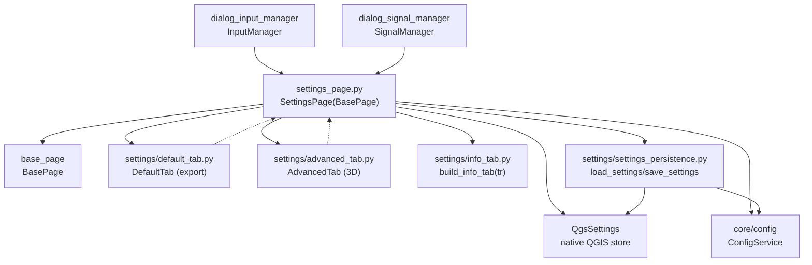

---
tags:
  - secinterp
  - code-walkthrough
  - gui
  - pages
aliases:
  - settings_page.py
  - SettingsPage
cssclass: secinterp-note
---

# `gui/ui/pages/settings_page.py`

> [!abstract] One-line summary
> Settings coordinator page: Default/Advanced/Info tab container delegating to `DefaultTab` and `AdvancedTab`, re-exposing their widgets for compatibility and persisting via `QgsSettings` + `ConfigService`.

**Path**: `gui/ui/pages/settings_page.py` (124 lines)
**Main class**: `SettingsPage(BasePage)`
**Layer**: GUI (settings-tab coordination · `QgsSettings` persistence)
**Tags**: #secinterp #gui #pages

---

## 🎯 Why does this file exist?

Plugin settings (what gets exported, in which format, 3D options) live in two
specialised forms plus an informational tab. Without a coordinator, the dialog would
have to know all three and merge their reading and persistence.

| Problem | Solution |
|---------|----------|
| Two forms (default export + advanced 3D) plus info in a single page | `SettingsPage` hosts them in a `QTabWidget` and merges `get_data` |
| Legacy code reaches `page.chk_exp_topo`, `page.combo_format`, etc. | `_expose_tab_widgets()` re-exposes widgets as own attributes |
| Settings must survive QGIS restarts | `load_settings` at build + `save_settings` on every `changed` |

> [!important] Architectural note
> Dual persistence: native QGIS `QgsSettings` (per-key) through
> `settings_persistence.load/save_settings`, plus the core `ConfigService` for
> domain configuration. The page bridges both worlds.

---

## 🧬 Relationship diagram



> [!tip] How to read
> Solid arrow = imports/delegates; dashed = the tab emits `changed` and the page persists.

---

## 📦 Imports — architectural reading

```python
# gui/ui/pages/settings_page.py
from __future__ import annotations

import contextlib
from typing import Any

from qgis.core import QgsSettings
from qgis.PyQt.QtCore import QCoreApplication
from qgis.PyQt.QtWidgets import QTabWidget, QVBoxLayout, QWidget

from sec_interp.core.config import ConfigService
from sec_interp.logger_config import get_logger

from .base_page import BasePage
from .settings import AdvancedTab, DefaultTab, build_info_tab
from .settings.settings_persistence import load_settings, save_settings
```

| # | Observation |
|---|-------------|
| ① | Per-page `QgsSettings` (`self.settings`): the page reads/writes the native store without going through the dialog. |
| ② | Core `ConfigService`: domain settings (not just export flags) travel to the configuration service. |
| ③ | Container-only Qt (`QTabWidget`, `QVBoxLayout`): checkboxes and combos live in the tabs. |
| ④ | Double sub-package import: classes (`DefaultTab`, `AdvancedTab`, `build_info_tab`) and persistence functions (`load/save_settings`). |
| ⑤ | Module-level `get_logger(__name__)`, as in [[drillhole_page]]: coordinator with logging scaffolding ready. |
| ⑥ | No `ProjectValidator`: `validate()` always returns `(True, "")`; settings never block anything. |

---

## 🏗️ Structure inventory

**`SettingsPage(BasePage)` class** — no `layer_keys`, no own signal:

Construction:

- `__init__(self, parent: QWidget | None = None) -> None` — builds `QgsSettings` + `ConfigService`
- `_setup_ui(self) -> None` — tabs + exposure + initial load
- `_expose_tab_widgets(self) -> None` — 14 compatibility aliases
- `_load_settings(self) -> None`
- `_reset_export_defaults(self) -> None`
- `_on_settings_changed(self) -> None`

`BasePage` protocol:

- `get_data`, `validate` (always ok), `connect_signals`, `disconnect_signals` (no `dump/load/reset/is_complete`)

**Child tabs:**

| Attribute | Source | Tab | Contents |
|-----------|--------|-----|----------|
| `default_tab` | `DefaultTab` | Default | `chk_exp_*` (5), `combo_format`, `txt_naming`, `btn_reset_export` |
| `advanced_tab` | `AdvancedTab` | Advanced | `chk_enable_3d`, `chk_3d_traces/intervals/original/projected` |
| `info_tab` | `build_info_tab(self.tr)` | Plugin Information | read-only (version, author, links) |

---

## 📖 Method-by-method walkthrough

### `__init__` — stores before widgets

```python
def __init__(self, parent: QWidget | None = None) -> None:
    """Initialize the settings page."""
    self.settings = QgsSettings()
    self.config_service = ConfigService()
    super().__init__(QCoreApplication.translate("SettingsPage", "Plugin Settings"), parent)
```

Builds `QgsSettings()` and `ConfigService()` **before** `super().__init__()` because
`_setup_ui()` (invoked by the base) already needs them in `_load_settings()`. The
ordering matters: inverting it would break the initial load with `AttributeError`.

### `_setup_ui` — tabs, aliases and load

```python
def _setup_ui(self) -> None:
    """Set up the tabbed settings interface."""
    super()._setup_ui()

    layout = self.group_box.layout()
    if layout is None:
        layout = QVBoxLayout(self.group_box)
        self.group_box.setLayout(layout)

    self.tab_widget = QTabWidget()
    layout.addWidget(self.tab_widget)

    self.default_tab = DefaultTab()
    self.tab_widget.addTab(self.default_tab, self.tr("Default"))

    self.advanced_tab = AdvancedTab()
    self.tab_widget.addTab(self.advanced_tab, self.tr("Advanced"))

    self.info_tab = build_info_tab(self.tr)
    self.tab_widget.addTab(self.info_tab, self.tr("Plugin Information"))

    self._expose_tab_widgets()
    self._load_settings()
```

Same container skeleton as [[drillhole_page]]. `build_info_tab(self.tr)` is a
factory taking the translate function (injecting `tr` instead of inheriting
`QWidget`). After exposing aliases, `_load_settings()` paints persisted values: the
page is born already synced with `QgsSettings`.

### `_expose_tab_widgets` — backward compatibility

```python
def _expose_tab_widgets(self) -> None:
    """Expose tab widgets as page attributes for backward compatibility."""
    self.chk_exp_topo = self.default_tab.chk_exp_topo
    self.chk_exp_geol = self.default_tab.chk_exp_geol
    self.chk_exp_struct = self.default_tab.chk_exp_struct
    self.chk_exp_drill = self.default_tab.chk_exp_drill
    self.chk_exp_interp = self.default_tab.chk_exp_interp
    self.combo_format = self.default_tab.combo_format
    self.txt_naming = self.default_tab.txt_naming
    self.btn_reset_export = self.default_tab.btn_reset_export

    self.chk_enable_3d = self.advanced_tab.chk_enable_3d
    self.chk_3d_traces = self.advanced_tab.chk_3d_traces
    # ... chk_3d_intervals, chk_3d_original, chk_3d_projected ...
```

Fourteen aliases preserving flat access (`page.chk_exp_topo`) from before the
monolithic dialog was split into tabs. They are references, not copies: they
operate on the real widgets. Known risk: if a tab rebuilds its UI, the aliases
dangle (see observations).

### `_load_settings` / `_on_settings_changed` — reactive persistence

```python
def _load_settings(self) -> None:
    """Load current state from QgsSettings."""
    load_settings(self.settings, self.default_tab, self.advanced_tab)

def _on_settings_changed(self) -> None:
    """Save settings when they are changed."""
    save_settings(self.config_service, self.default_tab, self.advanced_tab)
```

Read at build, write on every tab `changed`: reactive persistence with no Save
button. `load_settings` reads the native store; `save_settings` writes via
`ConfigService` (domain) and/or `QgsSettings` per key. Note the asymmetric
signatures (settings+tabs vs service+tabs): each function takes what it uses.

### `_reset_export_defaults` — delegated reset

```python
def _reset_export_defaults(self) -> None:
    """Reset all export and 3D checkboxes to their default values."""
    self.default_tab.reset_to_defaults()
    self.advanced_tab.reset_to_defaults()
```

Delegates to each tab's `reset_to_defaults()` (there is no page-level `reset()`:
the base protocol stays `pass`). Invoked by the `DefaultTab`'s `btn_reset_export`
through its own internal wiring.

### `get_data` — default + advanced merge

```python
def get_data(self) -> dict[str, Any]:
    data = self.default_tab.get_data()
    data.update(self.advanced_tab.get_data())
    return data
```

Merges export flags (`exp_topo/geol/struct/drill/interp`, format, naming) with 3D
flags (`enable_3d`, traces, intervals, original/projected).
`InputManager.get_all_values()` blends it via `**(… if settings is not None)`,
tolerating a dialog without a settings page.

### `validate` — always valid

```python
def validate(self) -> tuple[bool, str]:
    return True, ""
```

Explicitly inherits the base ok. Settings are preferences, not requirements: no
export flag can invalidate the project.

### `connect_signals` / `disconnect_signals` — `changed` bridge + delegation

```python
def connect_signals(self) -> None:
    self.default_tab.changed.connect(self._on_settings_changed)
    self.advanced_tab.changed.connect(self._on_settings_changed)
    self.default_tab.connect_signals()
    self.advanced_tab.connect_signals()
# disconnect_signals reverses the order: tabs first, then bridges
# with per-line suppress(TypeError, RuntimeError).
```

Each tab `changed` triggers reactive saving; the method also delegates each tab's
internal wiring (their checkboxes → their own `changed`). Disconnection reverses
the order (tabs first, bridges after), as [[drillhole_page]] does with `dataChanged`.

---

## 🗂️ Signals and persistence per tab

| Tab | Signal | Internal wiring (examples) | Persistence |
|-----|--------|----------------------------|-------------|
| `DefaultTab` | `changed` | `chk_exp_topo.stateChanged → changed.emit`, `combo_format.currentIndexChanged`, `txt_naming.textChanged` | `load/save_settings` |
| `AdvancedTab` | `changed` | `chk_enable_3d.stateChanged → changed.emit` (+ 4 3D flags) | `load/save_settings` |
| Info | — (read-only) | none | none (regenerated) |

---

## 🧩 Dialog lifecycle

| Moment | Who | What it does with the page |
|--------|-----|----------------------------|
| Construction | [[main_window]] / dialog | `SettingsPage()` in the `QStackedWidget`, "Settings" entry in [[sidebar]] |
| Load | `_setup_ui` | `_load_settings()` paints `QgsSettings` values |
| Editing | user | `changed` → `_on_settings_changed()` saves instantly |
| Export | managers | `get_data()` supplies export and 3D flags |
| Reset | `btn_reset_export` | `_reset_export_defaults()` delegates to tabs |
| Teardown | `SignalManager` | `disconnect_signals()` (tabs + bridges) |

---

## 🔄 Data flow

| Phase | Input | Transformation | Output |
|-------|-------|----------------|--------|
| Initial load | `QgsSettings` | `load_settings` | widgets with persisted values |
| Editing | checkbox/combo/text | tab emits `changed` | `_on_settings_changed → save_settings` |
| Reading | 2 tabs | chained `update` | export + 3D flags |
| Aggregation | settings dict | `**(settings)` in `get_all_values` | part of the global dict |
| Reset | button | per-tab `reset_to_defaults()` | export and 3D defaults |

---

## 🏛️ Design patterns present

| Pattern | Where | Purpose |
|---------|-------|---------|
| **Coordinator / Facade** | page over 2 tabs + info | Dialog sees a single settings page |
| **Reactive persistence** | `changed` → `save_settings` | No Save button; every change persists |
| **Backward-compat aliases** | `_expose_tab_widgets` | Gradual migration off the monolithic dialog |
| **Dependency injection** | `build_info_tab(self.tr)` | Info tab takes `tr` while inheriting nothing |

---

## 🧾 API summary

| Symbol | Signature / Inherits | Typical use |
|--------|----------------------|-------------|
| `SettingsPage` | `(BasePage)` | "Settings" tab of the `QStackedWidget` |
| `settings` / `config_service` | `QgsSettings` / `ConfigService` | native + domain dual store |
| `get_data` | default + advanced merge | flags for `InputManager` |
| `validate` | always `(True, "")` | settings never block |
| No `dump/load/reset/is_complete` | delegated to tabs/`QgsSettings` | page session does not cover it |
| 14 aliases (`chk_exp_*`, `chk_3d_*`…) | references to tab widgets | legacy-code compatibility |

---

## 🛡️ Error handling

- `get_all_values()` tolerates `pages.settings is None`: the settings page is optional in the assembly.
- Per-bridge `suppress` disconnects: dialog rewires + close never raise.
- `save_settings` on every `changed`: if the store fails, the error surfaces near the change, not at a deferred save.
- No `is_complete` or `dump`: the page joins no gates and no page sessions; its state lives in `QgsSettings`.

---

## 🧪 Associated tests

Real direct coverage in `tests/gui/test_settings_page.py` (`TestSettingsPage`,
with `QApplication`, `BaseTestCase` and `QgsSettings` mocks):

- Construction with `MockQgsSettings` and `mock_core`.
- Merged `get_data` (export + 3D keys).
- `load_settings/save_settings` persistence and defaults reset.
- `changed` signals → reactive saving.

Indirect coverage:

- `tests/gui/test_main_dialog_settings.py` — settings inside the dialog.
- `tests/gui/test_dialog_settings_persistence.py` — end-to-end settings persistence.
- `tests/gui/test_multi_session_persistence.py` — dialog with and without a settings page.
- `tests/gui/test_signal_restoration.py` — `test_settings_reset_button_restores_defaults`.

| Aspect to test | Status |
|----------------|--------|
| `_expose_tab_widgets` aliases | covered via construction + flat access |
| `build_info_tab(self.tr)` | covered via the dialog info tab |
| `settings/service`-before-`super()` order | implicit (breaking it fails every build test) |
| Always-ok `validate` | trivial; indirectly covered |

---

## 🌐 i18n and migration notes

- Tabs via `self.tr("Default"/"Advanced"/"Plugin Information")`; `"SettingsPage"`-context title.
- `build_info_tab(self.tr)` injects translation into a `QWidget`-less function: informational text enters the catalogue too.
- Only `QTabWidget/QVBoxLayout` + `QgsSettings` (stable): frictionless 4.x migration.

---

## 👀 Observations and notes

> [!success] Strengths
> - Reactive persistence with no Save button: leaving with half-saved settings is impossible.
> - Well-documented compatibility aliases (`"for backward compatibility"`): the debt is explicit, not accidental.
> - `build_info_tab(tr)` decouples the info tab: testable without widgets or QGIS.

> [!warning] Points of attention
> - The 14 aliases are live references: if a tab rebuilds its widgets, the page points at orphaned widgets with no warning.
> - No `dump/load/reset`: the page is invisible to page sessions; two persistence mechanisms coexist (`QgsSettings` + session).
> - `logger` imported but unused in the file, as in [[drillhole_page]].
> - `load_settings(settings, …)` / `save_settings(service, …)` asymmetry: both signatures must be read to grasp the dual store.

> [!question] Open questions
> - Implement `dump/load/reset` delegating to tabs + `QgsSettings` to unify page sessions?
> - Drop the aliases once the last consumers migrate (`grep chk_exp_topo` outside tabs)?
> - Use the `logger` (e.g. in `_on_settings_changed`) or remove it?

---

## 🔗 Related notes

- [[Index]] — vault index
- [[base_page]] — protocol (this page skips `dump/load/reset/is_complete`)
- [[default_tab]] / [[advanced_tab]] — the two delegated forms
- [[settings_persistence]] — `load_settings/save_settings` and the dual store
- [[gui_ui_pages_settings]] — `settings/` sub-package note
- [[main_window]] — "Settings" tab of the `QStackedWidget`
- [[sidebar]] — "Settings" entry (`mActionOptions.svg`)
- [[dialog_input_manager]] — merges `get_data()` via `**(settings)`
- [[dialog_settings_persistence]] — dialog-level settings persistence
- [[drillhole_page]] — the other coordinator page (same skeleton)
- [[main_dialog_config]] — centralised defaults consumed by tabs

---

*Note of the SecInterp Code Walkthrough v2 vault — v3.9.1*
