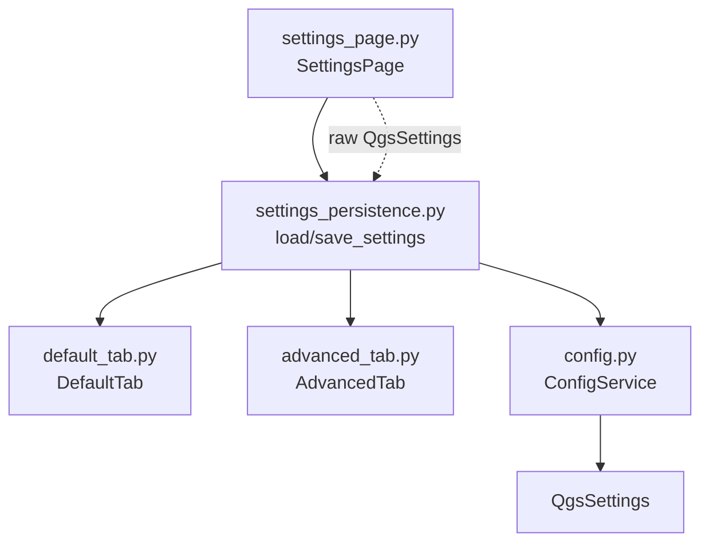

---
tags:
  - secinterp
  - code-walkthrough
  - gui
  - pages
aliases:
  - settings_persistence.py
  - load_settings
  - save_settings
cssclass: secinterp-note
---

# `gui/ui/pages/settings/settings_persistence.py`

> [!abstract] One-line summary
> Settings-page persistence facade: `load_settings` hydrates the tabs from `QgsSettings` and `save_settings` dumps them via `ConfigService`, with widgets knowing nothing about storage.

**Path**: `gui/ui/pages/settings/settings_persistence.py` (75 lines)
**Main functions**: `load_settings`, `save_settings`
**Layer**: GUI (page services · no widgets of its own)
**Tags**: #secinterp #gui #pages

---

## 🎯 Why does this file exist?

`SettingsPage` coordinates three tabs, but the knowledge of *which key goes to
which checkbox* deserves its own home: if a key changes, this module is
touched, not the widgets.

| Problem | Solution |
|---------|----------|
| Tabs must not import `QgsSettings`/`ConfigService` | Two pure functions take store + tabs as `Any` |
| Reading and writing use different APIs | `load` reads `QgsSettings.value()`; `save` writes `ConfigService.set()` |
| 13 keys spread over two tabs | A single place enumerating all of them |

> [!important] Architectural note
> **Persistence facade** (not an Extract adapter): it translates widgets ↔
> keys. Tabs expose public attributes (`chk_exp_topo`, `combo_format`, …) and
> this module reads/writes them directly.

---

## 🧬 Relationship diagram



> [!tip] How to read
> `load_settings` receives the parent's raw `QgsSettings`; `save_settings`
> receives the `ConfigService`. Intentional asymmetry (see below).

---

## 📦 Imports — architectural reading

```python
# gui/ui/pages/settings/settings_persistence.py
from __future__ import annotations
from typing import Any
from sec_interp.logger_config import get_logger

logger = get_logger(__name__)
```

| # | Observation |
|---|-------------|
| ① | Zero Qt/QGIS imports: a 100 % widget-agnostic module. |
| ② | Everything typed as `Any` (store and tabs): deliberate duck typing for mocks. |
| ③ | `logger` declared by convention though unused in the body. |

---

## 🏗️ Structure inventory

**Functions:** 2, no classes.

| Function | Signature | Purpose |
|----------|-----------|---------|
| `load_settings` | `(settings: Any, default_tab: Any, advanced_tab: Any) -> None` | Hydrates widgets from `QgsSettings` |
| `save_settings` | `(config_service: Any, default_tab: Any, advanced_tab: Any) -> None` | Dumps widgets via `ConfigService` |

---

## 📁 Files in the package

| File | Lines | Role |
|---|---|---|
| `settings/__init__.py` | 9 | Re-exports tabs (not this module) |
| `advanced_tab.py` | 106 | 5 3D flags (see [[advanced_tab]]) |
| `default_tab.py` | 178 | 8 export keys (see [[default_tab]]) |
| `settings_persistence.py` | 75 | This note: load/save facade |
| `../settings_page.py` | 124 | Orchestrator (see [[settings_page]]) |

---

## 📖 Function-by-function walkthrough

### `load_settings` — hydration

```python
def load_settings(settings: Any, default_tab: Any, advanced_tab: Any) -> None:
    enabled_3d = settings.value("SecInterp/enable_3d", True, type=bool)
    advanced_tab.chk_enable_3d.setChecked(enabled_3d)

    default_tab.chk_exp_topo.setChecked(settings.value("SecInterp/exp_topo", True, type=bool))
    default_tab.chk_exp_geol.setChecked(settings.value("SecInterp/exp_geol", True, type=bool))
    default_tab.chk_exp_struct.setChecked(settings.value("SecInterp/exp_struct", True, type=bool))
    default_tab.chk_exp_drill.setChecked(settings.value("SecInterp/exp_drill", True, type=bool))
    default_tab.chk_exp_interp.setChecked(settings.value("SecInterp/exp_interp", True, type=bool))

    default_fmt = settings.value("SecInterp/export_format", "Shapefile", type=str)
    index = default_tab.combo_format.findText(default_fmt)
    if index >= 0:
        default_tab.combo_format.setCurrentIndex(index)

    default_tab.txt_naming.setText(
        settings.value("SecInterp/export_naming", "{filename}_{profile}", type=str)
    )

    advanced_tab.chk_3d_traces.setChecked(
        settings.value("SecInterp/drill_3d_traces", True, type=bool)
    )
    ...
```

| Step | Keys | Default |
|------|------|---------|
| 3D master | `enable_3d` | `True` |
| 5 products | `exp_topo/geol/struct/drill/interp` | `True` |
| Format | `export_format` | `"Shapefile"`, with `findText >= 0` guard |
| Naming | `export_naming` | `"{filename}_{profile}"` |
| 4 3D flags | `drill_3d_traces/intervals/original` (`True`), `drill_3d_projected` (`False`) | See table |

The combo guard avoids selecting `-1` if the stored value no longer exists in
the model (e.g. a format dropped in a later version).

### `save_settings` — dump

```python
def save_settings(config_service: Any, default_tab: Any, advanced_tab: Any) -> None:
    config_service.set("enable_3d", advanced_tab.chk_enable_3d.isChecked())

    config_service.set("exp_topo", default_tab.chk_exp_topo.isChecked())
    ...  # exp_geol/struct/drill/interp
    config_service.set("export_format", default_tab.combo_format.currentText())
    config_service.set("export_naming", default_tab.txt_naming.text())

    config_service.set("drill_3d_traces", advanced_tab.chk_3d_traces.isChecked())
    ...  # intervals/original/projected
```

Thirteen `set()` calls with **unprefixed** keys: `ConfigService` prepends
`SecInterp/`, calls `sync()`, and invalidates its cache
(`_current_settings = None`).

> [!note] Load/save asymmetry
> `load` speaks native `QgsSettings` (explicit prefixed keys); `save` speaks
> `ConfigService` (implicit prefix + `sync()`). It works because both converge
> on `SecInterp/<key>`, but they are two different contracts the reader must
> know.

---

## 🔄 Data flow

| Phase | Input | Transformation | Output |
|-------|-------|----------------|--------|
| Startup | `SettingsPage._setup_ui` | `_load_settings()` → `load_settings(self.settings, ...)` | Hydrated tabs |
| Editing | Any tab's `changed` | `_on_settings_changed()` → `save_settings(self.config_service, ...)` | 13 × `set()` + `sync()` |
| Reset | `reset_to_defaults()` | `stateChanged` ⇒ `changed` ⇒ auto-save | Persisted defaults |
| Model | `QgsSettings` | `ConfigService._load_from_qgs_settings()` | Validated `PluginSettings` |
| Consumption | Exporters | Each tab's `get_data()` | Execution flags |

---

## 📐 Full key table

| # | Key (`SecInterp/…`) | Widget | Type | Default |
|---|---------------------|--------|------|---------|
| 1 | `enable_3d` | `chk_enable_3d` | bool | `True` |
| 2 | `exp_topo` | `chk_exp_topo` | bool | `True` |
| 3 | `exp_geol` | `chk_exp_geol` | bool | `True` |
| 4 | `exp_struct` | `chk_exp_struct` | bool | `True` |
| 5 | `exp_drill` | `chk_exp_drill` | bool | `True` |
| 6 | `exp_interp` | `chk_exp_interp` | bool | `True` |
| 7 | `export_format` | `combo_format` | str | `"Shapefile"` |
| 8 | `export_naming` | `txt_naming` | str | `"{filename}_{profile}"` |
| 9 | `drill_3d_traces` | `chk_3d_traces` | bool | `True` |
| 10 | `drill_3d_intervals` | `chk_3d_intervals` | bool | `True` |
| 11 | `drill_3d_original` | `chk_3d_original` | bool | `True` |
| 12 | `drill_3d_projected` | `chk_3d_projected` | bool | `False` |

---

## 🧩 Duck-typing contracts

With everything typed as `Any`, the real contract is the attribute list used:

| Parameter | Required attributes |
|-----------|---------------------|
| `settings` (`load`) | `.value(key, default, type=…)` à la `QgsSettings` |
| `config_service` (`save`) | `.set(key, value)` à la `ConfigService` |
| `default_tab` | `chk_exp_*` (×5), `combo_format`, `txt_naming` |
| `advanced_tab` | `chk_enable_3d`, `chk_3d_traces/intervals/original/projected` |

A mock implementing those surfaces suffices to test both functions without
QGIS, as `test_settings_page.py` does.

---

## 🏛️ Design patterns present

| Pattern | Where | Purpose |
|---------|-------|---------|
| **Facade** | Whole module | Single entry point to settings persistence |
| **Duck typing** | `Any` parameters | Accepts real widgets or mocks with no Qt import |
| **Load/save split** | Two functions | Direct read vs. serviced write |
| **Combo guard** | `findText >= 0` | Tolerance for stale values |

---

## 🧾 API summary

| Symbol | Signature | Typical use |
|--------|-----------|-------------|
| `load_settings` | `(settings, default_tab, advanced_tab) -> None` | `SettingsPage._load_settings()` |
| `save_settings` | `(config_service, default_tab, advanced_tab) -> None` | `SettingsPage._on_settings_changed()` |

---

## 🛡️ Error handling

- No `try/except`: relies on `settings.value(...)` defaults.
- `findText >= 0` shields the combo from unknown values.
- Attributes accessed directly (no `hasattr`): a partial double missing a
  checkbox would raise `AttributeError` — the contract demands complete tabs
  or `getattr`-compatible doubles.
- `ConfigService.set` calls `sync()` per call: 13 back-to-back writes are
  safe albeit verbose.

---

## 🧪 Associated tests

Direct and indirect coverage with mocks:

- `tests/gui/test_settings_page.py::TestSettingsPage::test_load_settings` — exercises `load_settings` with a mocked store.
- `test_save_settings` — exercises `save_settings` against a mocked `ConfigService`.
- `test_get_data` — merged read after hydration.
- `tests/gui/test_dialog_settings_persistence.py` — main-dialog persistence (upper layer).
- `tests/gui/test_main_dialog_settings.py` — parsing of booleans stored as text.

---

## 🌐 i18n and migration notes

- This module holds no visible strings: nothing to translate.
- Defaults (`"Shapefile"`, `"{filename}_{profile}"`) duplicate the tabs':
  changing a default means touching three files (tab, `get_data`, here).
- No QGIS dependencies: the module ports to any 4.x branch unchanged.

---

## 👀 Observations and notes

> [!success] Strengths
> - Centralises all 12 keys: the inventory is auditable at a glance.
> - No Qt imports: testable with trivial doubles.
> - Combo guard against stale values.

> [!warning] Points of attention
> - Store asymmetry (`QgsSettings` vs `ConfigService`): two contracts to maintain.
> - Triplicated defaults (tab, `get_data`, here): silent-divergence risk.
> - Direct attribute access without `hasattr`: less forgiving than `get_data`.

> [!question] Open questions
> - Unify `load` through `ConfigService.get()` for a single contract?
> - Extract defaults into a table shared with the tabs?

---

## 🔗 Related notes

- [[Index]] — vault index
- [[settings_page]] — orchestrator calling both functions
- [[gui_ui_pages_settings]] — settings tab package
- [[default_tab]] — destination tab of 8 keys
- [[advanced_tab]] — destination tab of 5 keys
- [[settings_model]] — validated `PluginSettings`/`ExportSettings`
- [[config]] — `ConfigService` used when saving
- [[dialog_settings_persistence]] — main-dialog persistence

---

*Note of the SecInterp Code Walkthrough v2 vault — v3.8.0*
