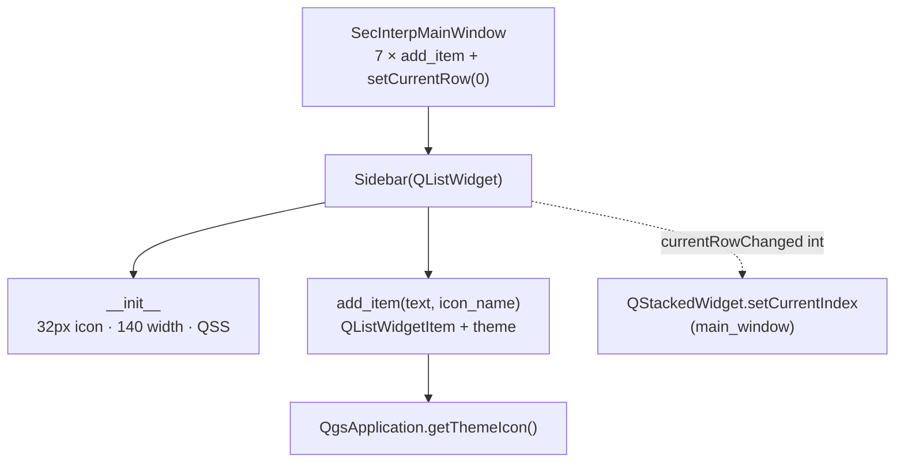

---
tags:
  - secinterp
  - code-walkthrough
  - gui
  - ui
aliases:
  - sidebar.py
  - Sidebar
cssclass: secinterp-note
---

# `gui/ui/sidebar.py`

> [!abstract] One-line summary
> `Sidebar`: a 140px `QListWidget` with QGIS-options-dialog looks that turns rows into page indexes for the main window's `QStackedWidget`.

**Path**: `gui/ui/sidebar.py` (63 lines)
**Main class**: `Sidebar(QListWidget)`
**Layer**: GUI (pure widget · no `core/`, no business state)
**Tags**: #secinterp #gui #ui

---

## 🎯 Why does this file exist?

Navigating seven pages needs a visible, compact, icon-bearing control. Subclassing `QListWidget` instead of composing buttons gives selection, keyboard support and `currentRowChanged` for free:

| Problem | Solution |
|---------|----------|
| Seven pages with no visible navigation | Side list with label + icon per page |
| Look alien to QGIS | QSS mimicking the options dialog (`#f0f0f0`, blue left border) |
| Icons with fragile absolute paths | `QgsApplication.getThemeIcon(name)` with theme names |
| Text clipped at 120px | Fixed 140px width and 32px icons |

> [!important] Architectural note
> A **dumb, reusable** widget: it knows no pages, indexes or `QStackedWidget`. It only emits `currentRowChanged(int)`; [[main_window]] decides what that means. That ignorance makes it testable with `pytest-qt` and no QGIS project.

---

## 🧬 Relationship diagram



> [!tip] How to read
> Solid arrow = defines/calls; dashed = signal consumed by the main window. The sidebar never imports the window.

---

## 📦 Imports — architectural reading

```python
# gui/ui/sidebar.py
from __future__ import annotations

from typing import Any

from qgis.core import QgsApplication
from qgis.PyQt.QtCore import QSize, Qt
from qgis.PyQt.QtWidgets import QListWidget, QListWidgetItem
```

| # | Observation |
|---|-------------|
| ① | Subclasses the widget (`QListWidget`) instead of wrapping it: gains Qt's model, selection and keyboard navigation with no code. |
| ② | `QgsApplication` only for `getThemeIcon`: the single QGIS coupling, and it is to theming, not project data. |
| ③ | `Any` on `parent`: accepts any `QWidget` or `None` without importing `qgis.gui` classes. |
| ④ | `QSize` and `Qt` (alignment) are presentation constants; no `core/` or page imports. |

---

## 🏗️ Structure inventory

**Classes:** `class Sidebar(QListWidget)` — 2 methods.

| Method | Signature | Role |
|---|---|---|
| `__init__` | `(parent: Any = None) -> None` | Icon size, fixed width and QSS |
| `add_item` | `(text: str, icon_name: str \| None = None) -> None` | Creates item with optional icon and alignment |

---

## 📁 Where it lives inside `gui/ui/`

| Neighbor | Relationship with this module |
|---|---|
| [[main_window]] | Instantiates it, fills 7 items, connects `currentRowChanged` |
| [[preview_page]] | Default-visible page only because row 0 selects it |
| [[main_dialog_utils]] | `get_theme_icon` resolves the same theme names from the facade |
| [[main_dialog_config]] | `UIConstants.ICON_*` defines equivalent names for other buttons |

---

## 📖 Method-by-method walkthrough

### `__init__` — size and skin

```python
def __init__(self, parent: Any = None) -> None:
    super().__init__(parent)
    self.setIconSize(QSize(32, 32))
    self.setFixedWidth(140)  # Slightly wider for better text fit

    # Style to look like QGIS options dialog sidebar
    self.setStyleSheet("""
        QListWidget {
            background-color: #f0f0f0;
            border-right: 1px solid #d0d0d0;
            outline: none;
        }
        QListWidget::item {
            padding: 10px;
            border-bottom: 1px solid #e0e0e0;
            color: #404040;
        }
        QListWidget::item:selected {
            background-color: #ffffff;
            color: #000000;
            border-left: 3px solid #0078d7;
        }
        QListWidget::item:hover {
            background-color: #e8e8e8;
        }
    """)
```

| Decision | Effect |
|---|---|
| `setFixedWidth(140)` | Stable column: the splitter never distorts it on resize |
| 32px icons | Legible on HiDPI without scaling text |
| `outline: none` | No dotted focus rectangle: clean panel look, not an editable list |
| `border-left: 3px solid #0078d7` on selected | QGIS-style blue marker; the plugin's only brand color |
| `padding: 10px` + `#e0e0e0` separators | Airy rows, options-menu feel |

> [!note] Inline QSS vs `.qss` file
> The style lives in the constructor so the widget is self-contained (copying the file suffices). The cost: two hand-kept style blocks (`sidebar` + the `main_window` splitter) that must stay coherent manually.

### `add_item` — one row with a theme icon

```python
def add_item(self, text: str, icon_name: str | None = None) -> None:
    """Add an item to the sidebar.

    Args:
        text (str): Item label.
        icon_name (str): QGIS theme icon name (e.g. 'mIconRaster.svg').

    """
    item = QListWidgetItem(text)
    if icon_name:
        icon = QgsApplication.getThemeIcon(icon_name)
        item.setIcon(icon)

    # Center text alignment
    item.setTextAlignment(Qt.AlignmentFlag.AlignLeft | Qt.AlignmentFlag.AlignVCenter)
    self.addItem(item)
```

The icon is optional (`None` = text-only row), so future dialogs can reuse the widget icon-free. The comment says "Center" but the code aligns **left** with vertical centering — the code wins over the comment. The seven real calls live in [[main_window]] with pre-translated labels (`self.tr("DEM / Raster")`, …) and icons `mIconRaster.svg`, `mIconLineLayer.svg`, `mIconPolygonLayer.svg`, `mIconPointLayer.svg`, `mActionDataSourceManager.svg`, `mActionEdit.svg`, `mActionOptions.svg`.

---

## 🎨 QSS anatomy, rule by rule

| Selector | Key properties | Intent |
|---|---|---|
| `QListWidget` | `background #f0f0f0`, `border-right`, `outline: none` | Side panel, not an editable list |
| `::item` | `padding 10px`, `border-bottom #e0e0e0`, `color #404040` | Airy rows with a subtle separator |
| `::item:selected` | `background #ffffff`, `border-left 3px #0078d7` | Active row in white with the QGIS blue mark |
| `::item:hover` | `background #e8e8e8` | Visual feedback without selecting |

## ⌨️ What `QListWidget` gives for free

| Capability | Cost in this file | Use in the plugin |
|---|---|---|
| Selection and `currentRow` | 0 lines | `setCurrentRow(0)` opens on DEM |
| Keyboard navigation (↑/↓) | 0 lines | Free accessibility |
| `currentRowChanged(int)` signal | 0 lines | Navigation in [[main_window]] |
| Automatic scroll | 0 lines | Headroom for future pages |

Well-chosen inheritance: 63 lines buy list, selection, keyboard and scroll that would cost hundreds with `QWidget` + buttons.

---

## 🔄 Data flow

| Phase | Input | Transformation | Output |
|---|---|---|---|
| Fill | 7 × `(translated_text, theme_icon)` | `QListWidgetItem` + `setIcon` + alignment | Rows in order 0–6 |
| Selection | Click / keyboard / `setCurrentRow(0)` | Internal `QListWidget` selection | `currentRowChanged(int)` |
| Navigation | Row `int` | `stacked.setCurrentIndex(int)` in the window | Visible page |
| Style | Constructor QSS | Normal/hover/selected states | QGIS-options skin |

> [!warning] Order contract with no net
> Row N **must** match page N of the `QStackedWidget`. Neither sidebar nor window verifies it: inserting a misordered item makes navigation lie silently. See observations.

---

## 🏛️ Design patterns present

| Pattern | Where | Purpose |
|---|---|---|
| **Subclassed widget** | `Sidebar(QListWidget)` | Reuse Qt's model/selection |
| **Theme indirection** | `icon_name` as `str` | Theme names, never paths |
| **Dumb view** | No reference to the stack | The widget emits; the window interprets |
| **Inline QSS skin** | `setStyleSheet` in `__init__` | Self-contained QGIS-style skin |

---

## 🧾 API summary

| Symbol | Signature / Inherits | Typical use |
|---|---|---|
| `Sidebar` | `QListWidget` | `self.sidebar = Sidebar()` |
| `__init__` | `(parent: Any = None)` | Construction with skin included |
| `add_item` | `(text, icon_name=None) -> None` | `sidebar.add_item(self.tr("Geology"), "mIconPolygonLayer.svg")` |

---

## 🛡️ Error handling

No explicit defenses, and rightly so: `addItem` never fails on valid text, and `getThemeIcon` with a missing name returns a null icon that Qt paints as an icon-less row (visual degradation, not a crash). The real risk — sidebar↔stack misordering — is not a throwable error but a construction invariant that today lives only in the programmer's head.

---

## 🧪 Associated tests

No dedicated `tests/gui/test_sidebar.py`; indirect, honest coverage:

- `tests/gui/test_main_dialog_core.py` — the full window (sidebar included) builds via `SecInterpDialog`.
- `tests/gui/test_main_dialog_signals_wiring.py` — the `currentRowChanged → setCurrentIndex` wiring is checked after assembly.
- `tests/gui/test_dem_page.py` — the row-0 page under page tests.

A ten-line `pytest-qt` test (`Sidebar()`, 7 `add_item`, `setCurrentRow(3)` → `currentRow == 3`) would freeze the order contract:

```python
# tests/gui/test_sidebar.py — proposed (does not exist yet)
def test_sidebar_row_order(qtbot):
    from sec_interp.gui.ui.sidebar import Sidebar
    sb = Sidebar()
    for label in ["DEM", "Section", "Geology", "Structural", "Drillholes", "Interp", "Settings"]:
        sb.add_item(label)
    sb.setCurrentRow(3)
    assert sb.currentRow() == 3
    assert sb.count() == 7
```

The test freezes three invariants in ten lines:
seven rows in order, programmatic selection, and exact count.
If someone inserts a page without its item — or vice versa —
`count() == 7` fails first, before navigation can lie.

---

## 👀 Observations and notes

> [!success] Strengths
> - 63 lines, zero business logic: the simplest widget in `gui/ui/`.
> - Subclassing `QListWidget` gives keyboard, selection and scroll with no extra line.
> - Theme-based icons: follows the QGIS theme maintenance-free.
> - Reusable: `icon_name=None` fits other dialogs.

> [!warning] Points of attention
> - Sidebar↔stack contract with no assert or test: the window's most fragile invariant.
> - Stale "Center text alignment" comment: the code aligns left.
> - Fixed 140px width: long translated labels (e.g. German) may truncate; no elide or tooltip.
> - Hand-duplicated QSS between sidebar and the `main_window` splitter.

> [!question] Open questions
> - Add a test freezing 7 items in order with their icons?
> - Per-item tooltips with the page description for truncated labels?

---

## 🔗 Related notes

- [[Index]] — vault index
- [[main_window]] — fills the sidebar and connects its signal
- [[preview_page]] — right panel shown next to each row
- [[dem_page]] — row-0 page (initial selection)
- [[settings_page]] — last-row page
- [[main_dialog_utils]] — `get_theme_icon`, same theme resolution from the facade
- [[main_dialog_config]] — `UIConstants.ICON_*` for other dialog buttons
- [[gui_ui_pages]] — index of navigable pages

---

*Note of the SecInterp Code Walkthrough v2 vault — v3.8.0*
